# 北海道｜夏季花海与温泉美食｜9 天婚假执行手册

> **旅行时间**：7～8 月（薰衣草花季/避暑黄金窗口）  
> **旅行人数**：2 人（婚假）  
> **总天数**：9 天 8 晚  
> **核心目的地**：札幌 → 小樽 → 富良野/美瑛 → 层云峡 → 知床半岛/阿寒湖 → 带广/十胜  
> **人均预算**：2.0～3.0 万元人民币（2 人总计约 4～6 万元）

---

## 为什么选北海道？

如果你们想要一场**"不出亚洲的顶级浪漫之旅"**，7～8 月的北海道是几乎完美的答案。

这个季节的北海道，平均气温只有 20～25℃， humidity 低、海风清爽，是东亚难得的天然避暑胜地。与北欧相比，北海道的风景或许没有峡湾与午夜阳光那般壮阔，但它提供的是一种**更贴近日常的幸福感**——在亚洲顶级的和牛料理店里，两人对着一盘入口即化的十胜和牛相视一笑；在富良野的薰衣草花田尽头，远处的十胜岳连峰还残留着积雪；在层云峡或阿寒湖的温泉旅馆里，换上浴衣、泡进露天风吕，抬头是满天繁星。

作为婚假，北海道是**"美食、花海与温泉"**的最佳平衡。这里的自驾体验也极其舒适：道路宽敞、车少，但日本是**右舵车、靠左行驶**，前半天需要适应；好在沿途便利店和加油站分布密集，几乎没有北欧那种"开进荒野"的紧张感。签证只需日本单次/多次签证，飞行时间 3～4 小时，语言有汉字相通，一切都让这趟旅程变得轻松而甜蜜。

---

## 行程总览

| 天数 | 星期 | 路线 | 住宿地 | 核心体验 | 开车距离 |
|:---:|:---:|:---|:---|:---|:---:|
| D1 | 六 | 国内 → 新千岁机场 → 札幌 | 札幌 | 抵达、大通公园、拉面横丁、啤酒园 | — |
| D2 | 日 | 札幌 → 小樽 → 札幌 | 札幌 | 小樽运河、天狗山、寿司街、北一硝子馆 | 约 70 km |
| D3 | 一 | 札幌 → 富良野 | 富良野 | 富田农场薰衣草花田、精灵露台、起司工坊 | 约 115 km |
| D4 | 二 | 富良野 → 美瑛 → 层云峡 | 层云峡 | 拼布之路、四季彩之丘、白金青池、温泉 | 约 115 km |
| D5 | 三 | 层云峡 → 阿寒湖 | 阿寒湖 | 黑岳缆车/峡谷徒步、摩周湖、硫磺山、温泉 | 约 170 km |
| D6 | 四 | 阿寒湖 → 知床半岛 | 知床（宇登吕） | 阿寒湖游船、知床五湖徒步、知床峠、棕熊观察 | 约 140 km |
| D7 | 五 | 知床 → 带广 | 带广 | 知床半岛晨光、带广和牛烤肉、十胜温泉 | 约 210 km |
| D8 | 六 | 带广 → 札幌 | 札幌 | 十胜牧场、白色恋人公园、狸小路最后采购 | 约 215 km |
| D9 | 日 | 札幌 → 新千岁机场 → 国内 | — | 返程 | 约 50 km |

> **设计逻辑**：前 2 天以札幌为据点轻松适应；D3-D6 开启道北大环线自驾，把最精华的花海、峡谷、湖泊、世界遗产串在一起；D7-D8 经带广品尝顶级和牛后返回札幌，D9 从容返程。全程不走回头路，节奏张弛有度。

---

# D1｜国内 → 札幌（Sapporo）
**主题：抵达北海道首府**

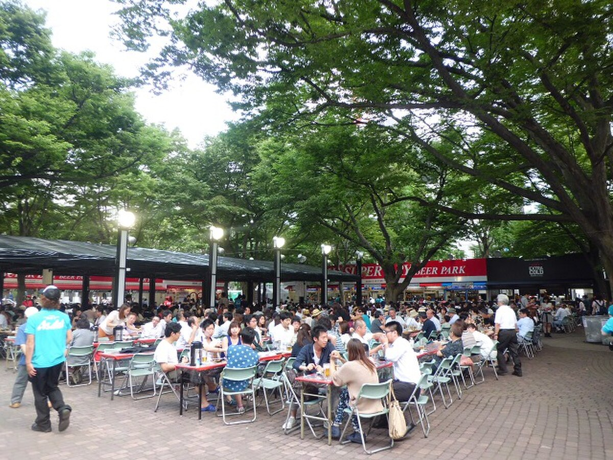
*札幌大通公园与夏日祭典的灯火*

## 交通
- **航班**：建议选择 **ANA、JAL 或春秋航空日本** 的直飞航班，**下午 14:00-17:00 抵达新千岁机场（CTS）** 最佳。国内主要城市（北京、上海、台北、香港）均有直飞，飞行时间约 3.5～4.5 小时。
- **机场 → 札幌市区**：乘坐 **JR 快速 AirPort 号**，约 37 分钟直达札幌站，票价 1,150 日元/人。班次密集（每 15 分钟一班），无需提前购票。
- **市内交通**：从札幌站打车到市中心酒店约 10 分钟/1,500 日元；或搭乘地铁南北线/东西线/东丰线。

## 住宿
**推荐：札幌世纪皇家酒店（Century Royal Hotel Sapporo）**
- 位置：JR 札幌站正上方，交通极其便利。
- 价格：约 1,200～1,800 元人民币/晚。
- 理由：早餐连续多年被评为"日本酒店早餐第一名"，可以吃到北海道产的新鲜牛奶、鲑鱼子和土豆沙拉；房间宽敞，景观房可俯瞰札幌市区夜景。
- 备选：Sapporo TV Tower 附近的 **Cross Hotel Sapporo**（设计酒店，步行 5 分钟到大通公园）。

## 活动
- **傍晚**：从酒店步行 10 分钟到 **大通公园（Odori Park）**。这座东西走向的狭长公园贯穿札幌市中心，7～8 月正值**札幌夏日祭（Sapporo Summer Festival）**，啤酒花园里挤满了穿着浴衣的当地人，空气中弥漫着烤玉米和啤酒花的香气。公园中央每隔几十米就有一个小型舞台，常有民谣或爵士演出。
- **晚餐**：步行 5 分钟到 **札幌拉面横丁（Ganso Sapporo Ramen Yokocho）**。这条只有数十米长的小巷里聚集了 17 家老字号拉面店，每一家都只坐 10 个人左右。推荐 **味噌拉面**——这是札幌的发明，浓稠的味噌汤底配上北海道产的玉米和黄油，是抵达第一晚最温暖的仪式。
- **夜间**：如果对啤酒感兴趣，可以去 **札幌啤酒园（Sapporo Beer Garden）** 喝一杯现榨的札幌 Classic。这里的前身是明治时代的北海道开拓使麦酒酿造所，红砖建筑本身就是历史遗迹。

---

# D2｜小樽（Otaru）
**主题：情书与寿司之町**

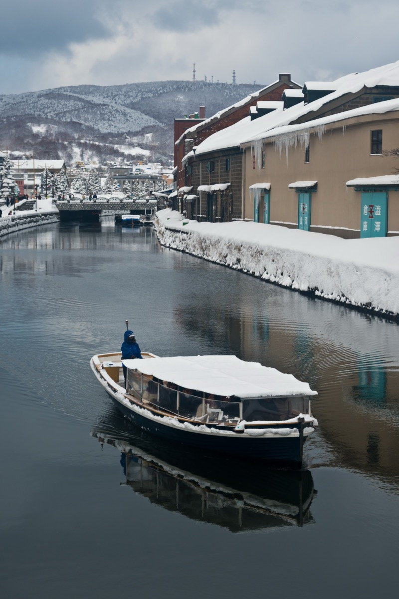
*小樽运河与古老的石造仓库群*

## 交通
- **札幌 → 小樽**：乘坐 **JR 函馆本线**（快速 AirPort 或普通列车均可），约 30～40 分钟，票价 750 日元/人。建议坐列车**右侧座位**，沿途可以欣赏石狩湾的海景。
- **小樽市内**：完全步行即可。从 JR 小樽站出发，沿着主路步行 10 分钟即可抵达运河；寿司街和北一硝子馆都在运河附近。

## 活动

### 上午：小樽运河与仓库群
小樽运河是这座城市最经典的画面——两岸排列着明治到大正时期建造的**石造仓库**，如今被改造成了咖啡馆、玻璃工坊和博物馆。清晨的运河游客较少，水面平静如镜，仓库的倒影清晰可见。

- **看点**：运河边的**浅草桥**是最佳拍照点；仓库群里有很多售卖小樽特产（八音盒、玻璃工艺品、LeTAO 芝士蛋糕）的店铺。
- **小贴士**：小樽的街道很多是坡道，建议穿舒适的 walking shoes。夏季阳光明媚，但海风凉爽，带一件薄外套。

### 中午：小樽寿司街（Otaru Sushi Street）
小樽是日本最著名的寿司圣地之一，得益于紧邻日本海，这里的海鲜新鲜度堪称顶级。

- **推荐餐厅**：**伊势寿司（Isezushi）** 或 **政寿司（Masazushi）**。政寿司是米其林一星，需要提前预约；伊势寿司则是当地人更偏爱的老字号，性价比更高。
- **必点**：**海胆饭（Uni Don）**、**鲑鱼子（Ikura）**、**甜虾（Amaebi）**、**金枪鱼大腹（Otoro）**。小樽的海胆来自附近的积丹半岛，口感绵密甘甜，带着淡淡的海水味。
- 人均：400～800 元人民币。

### 下午：北一硝子馆与天狗山

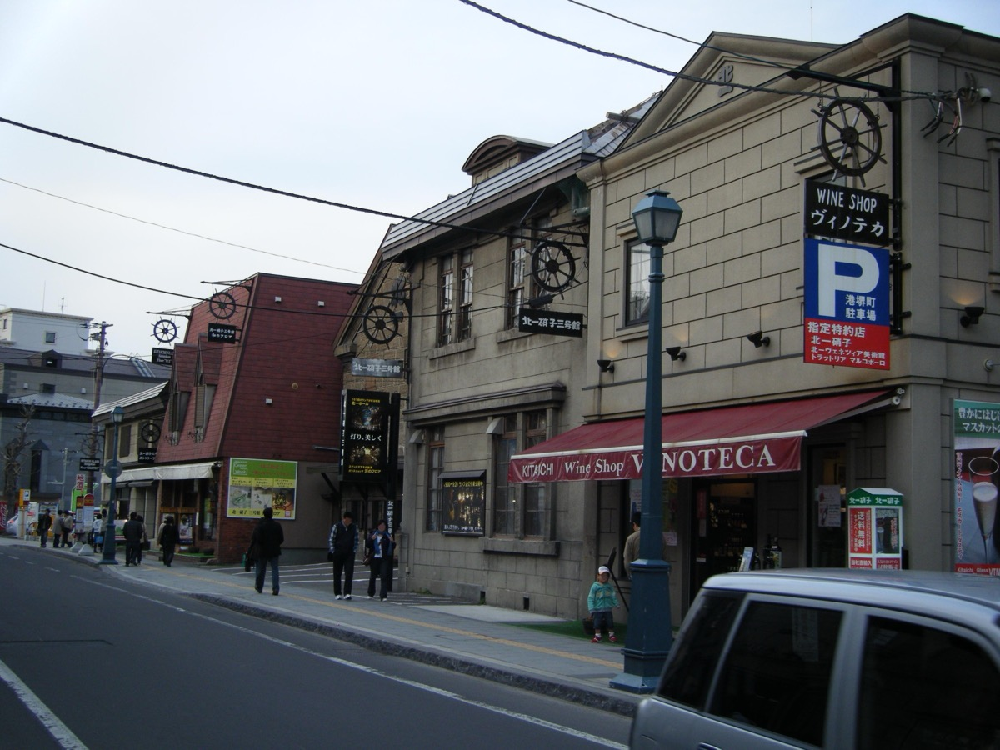
*北一硝子三号馆的煤油灯咖啡厅*

- **北一硝子馆（Kitaichi Glass）**：小樽是日本玻璃工艺的重要产地，北一硝子是其中最有代表性的品牌。三号馆内的**煤油灯咖啡厅**非常浪漫——店内没有电灯，全靠 167 盏煤油灯照明，昏黄的光线透过手工玻璃折射出来，像穿越到了大正年代。推荐点一杯招牌咖啡配玻璃器皿盛装的布丁。
- **天狗山（Mt. Tenguyama）**：乘坐缆车约 4 分钟登顶。这里是电影《情书》的取景地之一，山顶可以 360° 俯瞰小樽市区、石狩湾和日本海。如果天气晴好，还能看到远处的积丹半岛。

## 晚餐
返回札幌后，推荐去 **二条市场（Nijo Market）** 或 **札幌站拉面共和国** 吃晚餐。如果想吃得隆重一点，可以预订 **成吉思汗烤肉（Jingisukan）**——这是北海道的特色料理，在铁盘上烤羊肉，配一杯札幌啤酒。

---

# D3｜札幌 → 富良野（Furano）
**主题：驶入紫色花海的梦境**

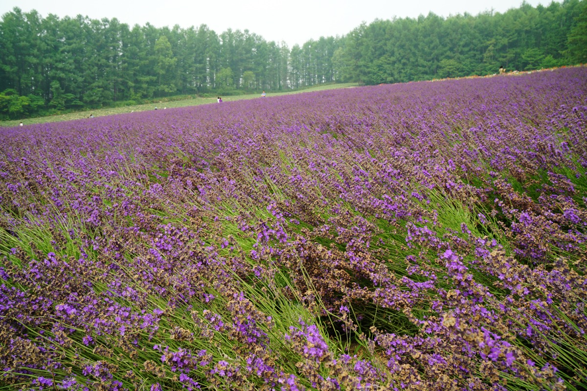
*富田农场的薰衣草花田与十胜岳连峰*

## 自驾路线
- **取车**：上午在 **JR 札幌站** 或 **新千岁机场** 的租车柜台取车（建议提前在 Toyota Rent-a-Car 或 Nippon Rent-a-Car 预订）。推荐车型：丰田 Prius 或 RAV4，省油且后备箱空间足够放两个大行李箱。
- **路线**：札幌 → 岩见泽 → 三笠 → 富良野，沿 **国道 12 号转国道 38 号** 行驶。
- **距离**：约 115 公里。
- **开车时间**：约 1.5～2 小时（路况极好，夏季沿途稻田翠绿）。

> **自驾提示**：日本是**右舵车、靠左行驶**，与中国相反。建议第一天避开夜驾、出停车场和转弯时多做一次确认。高速公路收费可用 ETC 卡（租车公司通常会提供，还车时结算），夏季路面干燥，整体仍然很好开。

## 住宿
**推荐：新富良野王子酒店（Shin Furano Prince Hotel）**
- 位置：富良野市区东侧的山麓地带。
- 价格：约 1,000～1,600 元人民币/晚。
- 特点：酒店旁边就是**精灵露台（Ningle Terrace）**和**森之时计咖啡厅**，步行 5 分钟可达。部分房间可直接看到十胜岳连峰。
- 备选：**富良野 Natulux Hotel**（设计酒店，位于 JR 富良野站旁，交通更便利）。

## 活动

### 下午：富田农场（Farm Tomita）
这是北海道最负盛名的薰衣草花田，也是无数明信片的取景地。

- **看点**：**传统薰衣草田（Traditional Lavender Field）** 位于农场中心，紫色的花毯一直铺到十胜岳山脚下；**彩色花田（Irodori Field）** 则由薰衣草、罂粟、鼠尾草等拼成条纹图案，像一块巨大的调色板。
- **最佳时间**：7 月中下旬是薰衣草的满开期，花朵颜色最深、香气最浓。8 月上旬开始收割，但彩色花田会一直持续到 8 月底。
- **美食**：农场的**薰衣草冰淇淋**和**薰衣草汽水**是必试的——淡淡的紫色，入口是花香与奶香的奇妙融合。
- **小贴士**：下午 3 点后游客逐渐减少，光线也更柔和。如果想拍到没有游客的照片，可以傍晚再去一次（农场免费开放区域至日落）。

### 傍晚：精灵露台（Ningle Terrace）

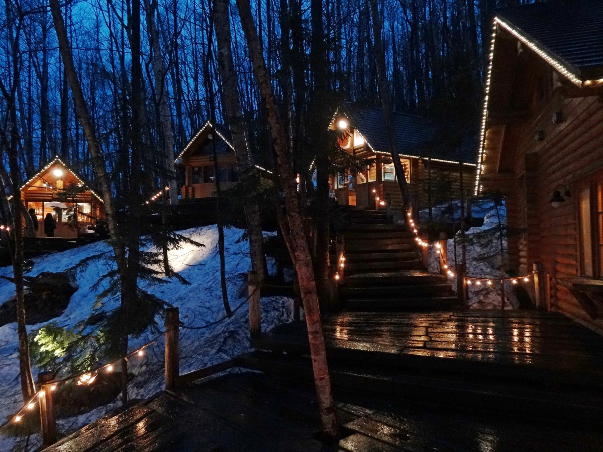
*森林中的精灵露台与手工木屋*

这是一片建在森林中的**手工工艺品村落**，由作家仓本聪设计。15 座小木屋分布在蜿蜒的木板路上，每间屋子里都有一位匠人在现场制作玻璃、木雕、皮革或蜡烛。傍晚时分，木屋的暖黄色灯光在森林中亮起，配上富良野凉爽的晚风，浪漫得像童话场景。

---

# D4｜富良野 → 美瑛 → 层云峡（Sounkyo）
**主题：拼布之路与青池幻境**

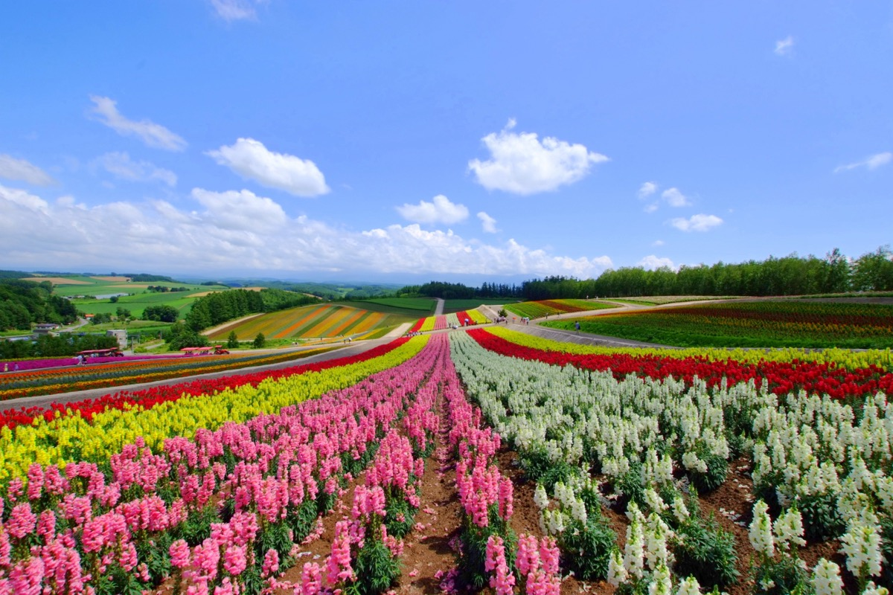
*美瑛四季彩之丘的展望花田*

## 自驾路线
- **路线**：富良野 → 美瑛（约 25 公里）→ 白金青池（约 30 公里）→ 层云峡温泉（约 60 公里）。
- **总里程**：约 115 公里。
- **开车时间**：约 2.5～3 小时（含多次停车拍照）。

## 活动

### 上午：美瑛拼布之路（Patchwork Road）与四季彩之丘
美瑛的丘陵地带被称为"拼布之路"，因为不同颜色的农田（小麦、马铃薯、玉米、薰衣草）像拼布一样一块块拼接在一起。

- **四季彩之丘（Shikisai-no-Oka）**：位于美瑛市区东侧，是一片占地 15 公顷的展望花田。这里的特色是**丘陵地形**——花田沿着缓坡向上延伸，站在高处可以俯瞰整片彩色花海和远处的十胜岳。7～8 月有薰衣草、向日葵、波斯菊等数十种花卉同时开放。
  - 体验：可以乘坐** tractor 游览车**或**四轮越野车（ATV）**在花田间穿梭。
  - 美食：**薰衣草冰淇淋**和**哈密瓜（夕张蜜瓜）**切片——北海道的蜜瓜甜度极高，是夏季限定美味。

### 下午：白金青池（Shirogane Blue Pond）

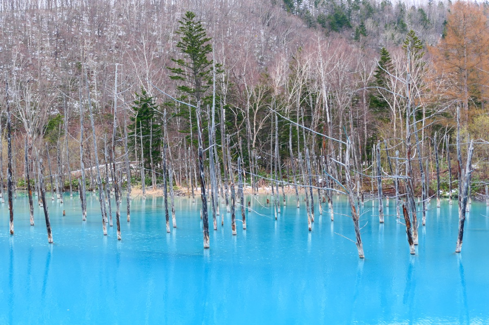
*美瑛白金青池的钴蓝色水面与白桦枯木*

这是北海道最著名的"幻境"之一。池水呈现出不真实的**钴蓝色**，原因是附近白金温泉的铝成分与美瑛川的水混合后，在阳光下发生了折射。池中矗立着几棵枯死的白桦树，蓝色的水面与白色的树干形成强烈的视觉对比。

- **最佳时间**：晴朗的上午 10 点至下午 2 点，阳光直射时蓝色最鲜艳。傍晚时分则会变成翡翠绿。
- **小贴士**：青池周边蚊虫较多，建议携带驱蚊液。停车场到池边只需步行 5 分钟。

### 傍晚：抵达层云峡温泉
从青池出发，沿 **国道 39 号** 向北行驶约 1 小时即可抵达层云峡。这是大雪山国立公园内最著名的温泉乡，峡谷两侧是柱状节理的悬崖，温泉旅馆沿峡谷排列。

## 住宿
**推荐：层云峡朝阳亭（Sounkyo Onsen Choyo-tei）**
- 类型：传统日式温泉旅馆。
- 价格：约 1,200～2,000 元人民币/晚（含一泊二食）。
- 特点：拥有**露天风吕（露天温泉）**，可以一边泡温泉一边仰望峡谷岩壁和星空。晚餐是日式会席料理，使用北海道产的帝王蟹、鲑鱼和山野菜。

---

# D5｜层云峡 → 阿寒湖（Lake Akan）
**主题：峡谷缆车与火山湖泊**

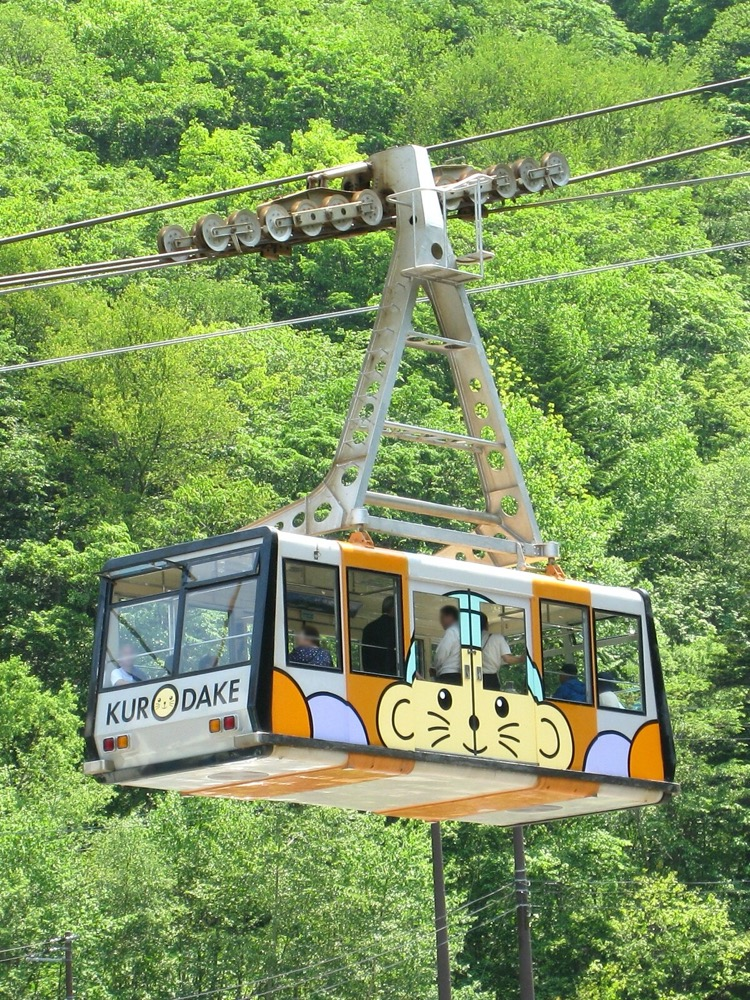
*从黑岳缆车上站俯瞰层云峡与大雪山连峰*

## 自驾路线
- **路线**：层云峡 → 上川 → 旭川 → 富良野/带广方向 → 阿寒湖，主要沿 **国道 39 号转国道 241 号/国道 273 号**。
- **距离**：约 170 公里。
- **开车时间**：约 3～3.5 小时（中途可在带广或足寄休息站用餐）。

## 活动

### 上午：黑岳缆车（Kurodake Ropeway）或峡谷徒步
- **黑岳缆车**：从层云峡温泉街乘坐缆车+吊椅直达海拔 1,520 米的**黑岳五合目**。夏季这里是高山植物园，可以看到大雪山特有的高山花卉（如驹草、高山龙胆）。天气晴好时，可以远眺北海道最高峰**旭岳（2,291 米）**。
  - 往返时间：约 2～2.5 小时。
  - 山顶气温：约 15℃，建议带一件防风外套。
- **层云峡徒步**：如果不想上山，可以选择沿峡谷底部的**流星瀑布・银河瀑布步道**散步。两条瀑布从 90 米高的悬崖倾泻而下，步道全程约 40 分钟，几乎没有爬升，非常适合婚假的轻松节奏。

### 下午：摩周湖与硫磺山（Mt. Iō）
从层云峡开往阿寒湖的途中，会经过两个道东最著名的火山景观：

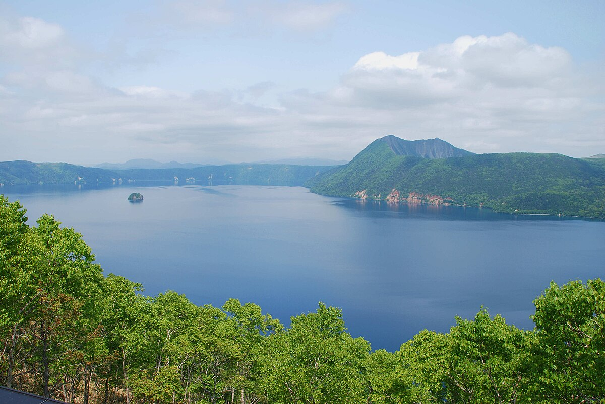
*摩周湖第三展望台的全景——日本透明度最高的湖泊*

- **摩周湖（Lake Mashū）**：这是一个火山口湖，湖水透明度常年位居日本第一，被称为"神秘之湖"。从 **第三展望台** 俯瞰，碧蓝的湖水被 200 米高的火山口壁环绕，湖心有一座小岛（神婆岛）。如果运气好遇到"摩周蓝"（无风时的镜面效果），整个湖面会像一块巨大的蓝宝石。
- **硫磺山（Mt. Iō / Atosanupuri）**：一座活火山，山体表面覆盖着黄色的硫磺结晶，空气中弥漫着浓烈的硫磺味。可以沿着木栈道近距离观察喷气孔和火山活动，有一种来到外星的 surreal 感。

### 傍晚：阿寒湖温泉
阿寒湖是北海道原住民阿伊努人的圣地，湖畔的温泉街已有百年历史。

## 住宿
**推荐：阿寒鹤雅别墅鄙之座（Akan Tsuruga Besso Hinanoza）**
- 类型：高端温泉旅馆。
- 价格：约 2,500～4,000 元人民币/晚（含一泊二食）。
- 特点：每间客房都带有**私人露天温泉**，是北海道最浪漫的温泉住宿之一。晚餐是怀石料理，使用阿寒湖的毬藻（Marimo）和北海道产的和牛。
- 备选：**阿寒湖鹤雅之翼（Akan Yuku no Sato Tsuruga）**，同属鹤雅集团，价格稍低，但同样可以享用大型公共温泉设施。

---

# D6｜阿寒湖 → 知床半岛（Shiretoko）
**主题：世界遗产与野生棕熊**

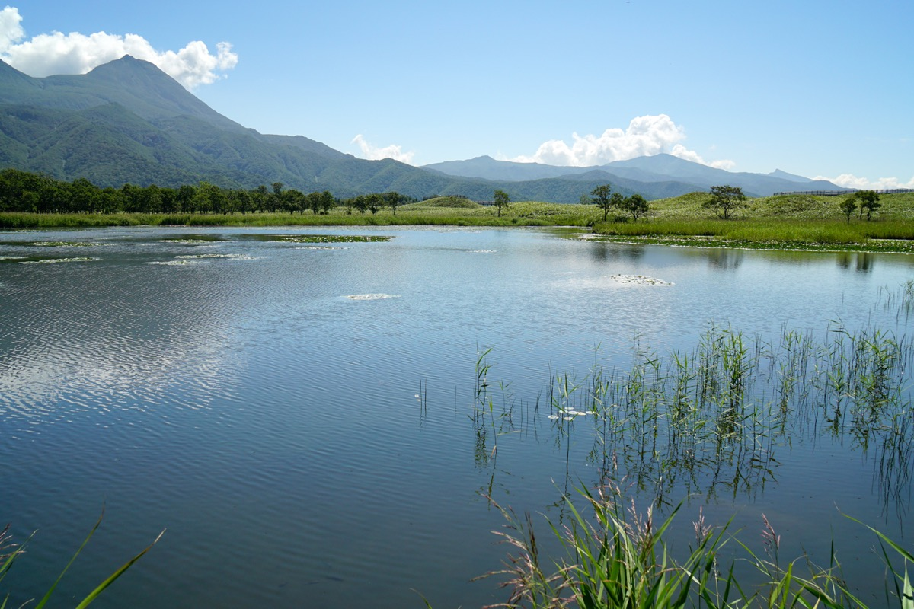
*知床五湖的木栈道穿越原始森林与湿地*

## 自驾路线
- **路线**：阿寒湖 → 川汤温泉 → 知床峠 → 知床五湖 → 宇登吕温泉。
- **距离**：约 140 公里。
- **开车时间**：约 2.5～3 小时（沿途风景极佳，会多次停车）。

## 活动

### 上午：阿寒湖游船与毬藻（Marimo）
- **阿寒湖游船**：上午可以乘坐观光游船游览阿寒湖，船程约 1 小时。游船会停靠 **Churui 岛**，岛上有**毬藻展示观察中心**。毬藻（Marimo）是一种稀有的绿藻球，只在高纬度地区的少数湖泊中形成，被阿伊努人视为幸运的象征。
- **小贴士**：夏季阿寒湖水温凉爽，清晨湖面常有薄雾，坐船穿行其中有一种仙境感。

### 下午：知床五湖（Shiretoko Goko）
知床半岛是北海道唯一的世界自然遗产，被称为"日本最后的秘境"。**知床五湖**是半岛最精华的徒步路线之一。

- **路线选择**：
  - **高架木栈道（免费）**：全程约 1.6 公里，约 40 分钟。沿着地面铺设的木栈道穿越原始森林和湿地，可以近距离观赏知床的原始森林和湖泊倒影。
  - **地上步道（需付费，有导游陪同）**：全程约 3 公里，约 2.5 小时。更深入地走进五湖区域，有机会看到野生棕熊、虾夷鹿和狐狸。
- **棕熊观察**：知床是日本棕熊密度最高的地区之一。夏季（7～8 月）是棕熊活动的高峰期。如果走地上步道，会有**专业护林员携带防熊喷雾陪同**，安全有保障。在高架木栈道上也有可能远眺到湖边觅食的棕熊。
- **最佳时间**：下午 3 点至 5 点，阳光斜射进森林，湖面的倒影最清晰，也是野生动物最活跃的时段。

### 傍晚：知床峠（Shiretoko Pass）与宇登吕温泉

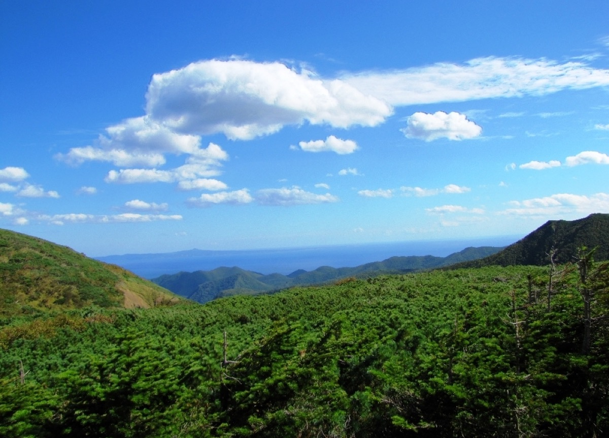
*从知床峠俯瞰鄂霍次克海与知床连峰*

- **知床峠**：海拔 738 米，是连接阿寒湖与宇登吕的公路最高点。从这里可以俯瞰鄂霍次克海和知床连峰——锯齿状的山峰直接从海面升起，气势磅礴。夏季山顶可能还有残雪，道路两侧常有虾夷鹿出没。
- **宇登吕温泉（Utoro Onsen）**：知床半岛最大的温泉乡，面临鄂霍次克海。这里的特色是**海边露天温泉**——泡在温泉里，耳边是海浪拍打礁石的声音，抬头是知床连峰的剪影。

## 住宿
**推荐：知床第一酒店（Shiretoko Daiichi Hotel）**
- 类型：日式温泉旅馆。
- 价格：约 1,500～2,500 元人民币/晚（含一泊二食）。
- 特点：拥有**临海露天温泉大浴场**，可以一边泡汤一边看日落和星空。晚餐是北海道海鲜会席，包括知床产的毛蟹、海胆和鲑鱼。
- 备选：**知床季之风（Shiretoko no Mori Ikkei）**，更小巧精致的温泉旅馆，客房较少但服务更私密。

---

# D7｜知床 → 带广（Obihiro）
**主题：半岛晨光与和牛朝圣**

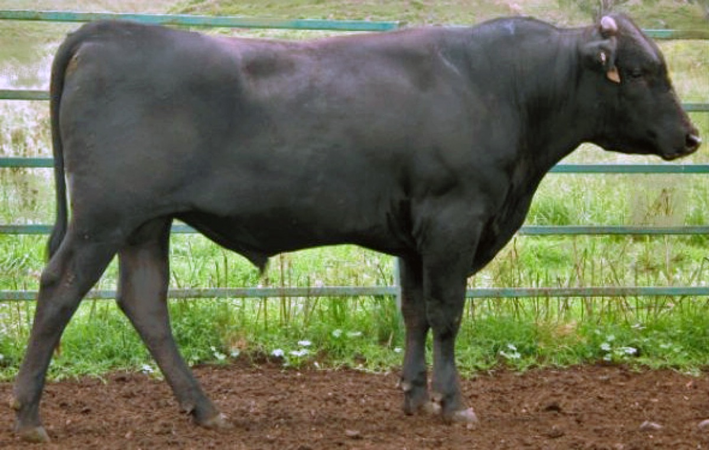
*带广十胜和牛炭火烤肉——入口即化的梦幻口感*

## 自驾路线
- **路线**：宇登吕 → 清里町 → 中標津 → 带广，主要沿 **国道 244 号转国道 236 号/国道 38 号**。
- **距离**：约 210 公里。
- **开车时间**：约 3.5 小时（路况良好，沿途是广阔的十胜平原牧场风光）。

## 活动

### 上午：知床半岛晨光与最后的秘境
- **清晨自由活动**：如果起得早，可以在宇登吕港边散步。夏季的鄂霍次克海平静而湛蓝，远处的知床连峰笼罩在晨雾中。运气好的话，可以看到海豹在海面上露头。
- **知床自然中心（Shiretoko Nature Center）**：这里是知床世界遗产的游客中心，有免费的展览和纪录片，可以更深入地了解知床的生态系统。中心后面有一条短途步道，约 20 分钟，可以走到瀑布观景台——**Furepe 瀑布**从悬崖上直接落入海中，被称为"少女之泪"。

### 下午：十胜平原自驾
从知床开往带广的途中，会穿越北海道最广阔的农业区——**十胜平原**。这里的道路笔直而空旷，两侧是一望无际的麦田、马铃薯田和放牧的牛群。夏季（7～8 月）正是农作物生长的旺季，绿色的田野延伸到地平线，与蓝天白云相接。

- **途中休息站**：推荐在 **鹿追町** 或 **然别湖畔** 短暂停留。然别湖是北海道海拔最高的湖泊，湖水清澈见底，湖畔有天然温泉足汤可以免费泡脚。

### 傍晚：带广和牛烤肉
带广是**十胜和牛**的故乡，这里的和牛以肉质细腻、油花均匀闻名，是日本顶级和牛产地之一。

- **推荐餐厅**：**猪肉饭 Panchō 本店**（虽然叫猪肉饭，但也有顶级和牛）或 **炭火烧肉 Furusato**。更高端的可以选择 **Kita no Ryoba** 或 **十胜精肉店直营烤肉店**。
- **必点**：**十胜和牛里脊（Sirloin）**、**霜降牛肉（Marbled Beef）**、**牛舌（Gyutan）**。十胜和牛的油脂熔点极低，放在炭火上轻轻一烤，入口即化，带着淡淡的奶香和甜味。
- 人均：500～1,000 元人民币。

## 住宿
**推荐：带广温泉 Casa Inn Hotel 或带广绿丘酒店**
- 价格：约 800～1,200 元人民币/晚。
- 特点：带广市区酒店以商务酒店为主，但大多附带**天然温泉大浴场**，可以消除一天长途驾驶的疲劳。
- 备选：**十胜川温泉第一酒店（Tokachigawa Onsen Daiichi Hotel）**，位于带广市郊的十胜川温泉乡，这里的温泉是罕见的**植物性沼泽温泉（Moor Spring）**，泉水呈琥珀色，富含天然有机物，泡完后皮肤特别滑嫩。

---

# D8｜带广 → 札幌（Sapporo）
**主题：牧场风光与甜蜜收尾**

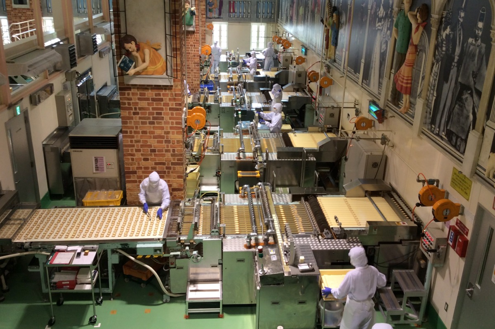
*白色恋人公园的玫瑰花园与欧式城堡*

## 自驾路线
- **路线**：带广 → 札幌，主要沿 **道东自动车道（E38/E39）转道央自动车道（E5）**。
- **距离**：约 215 公里。
- **开车时间**：约 3～3.5 小时（高速公路为主，非常顺畅）。

> **还车提示**：建议在札幌市区的租车点或新千岁机场还车。如果第二天一早的航班较早，可以在 D8 傍晚直接把车还到新千岁机场，然后乘 JR 回札幌市区住宿（约 37 分钟）。

## 活动

### 上午：十胜牧场或幸福车站
- **十胜牧场（Tokachi Ranch）**：位于带广市郊，是一片开阔的放牧牧场。夏季可以看到成群的乳牛在绿色的草原上悠闲吃草，远处是十胜岳连峰。牧场内有售卖新鲜牛奶和冰淇淋的商店，推荐尝试**十胜鲜奶冰淇淋**——奶香浓郁，口感绵密。
- **幸福车站（Kōfuku Station）**：这是 JR 广尾线上已废弃的一座小车站，因为站名"幸福"而成为了恋人们的朝圣地。车站内保留了旧式月台和车厢，可以买到"幸福车票"作为纪念。

### 下午：白色恋人公园（Shiroi Koibito Park）

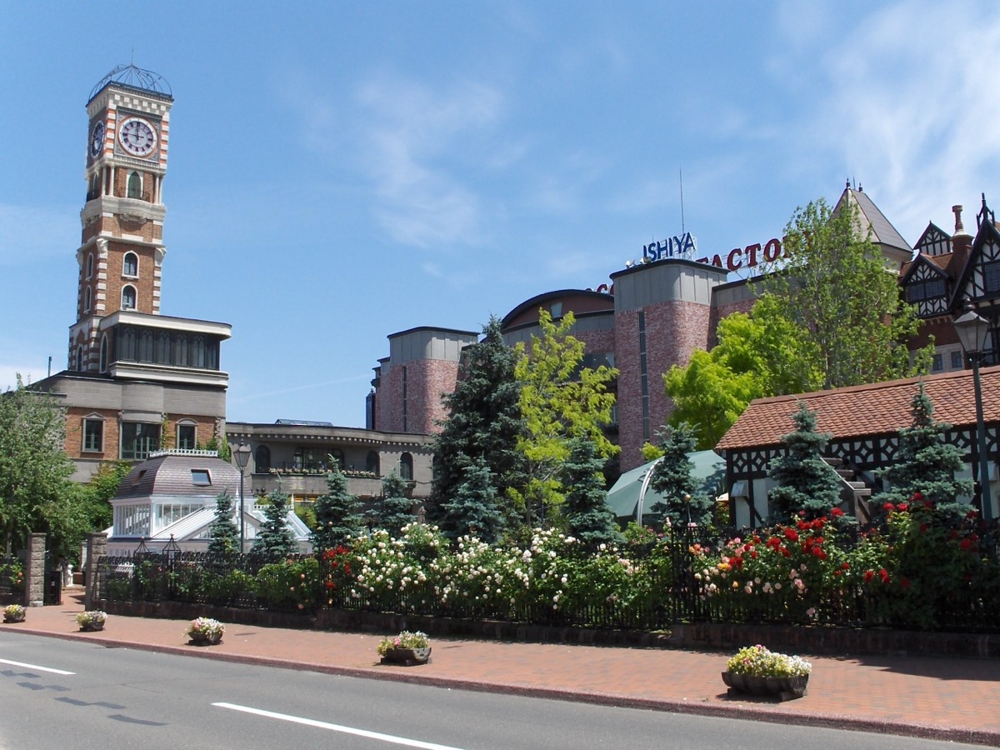
*白色恋人公园的白色城堡与夏日玫瑰*

抵达札幌后，推荐前往 **白色恋人公园**。这里是北海道最著名的甜点品牌"白色恋人"的主题公园，园内有一座白色的欧式城堡、玫瑰花园和巧克力工厂。

- **看点**：城堡内的巧克力博物馆可以看到白色恋人的制作流程；夏季花园里的玫瑰花盛开，非常适合拍照。
- **体验**：可以预约 **亲手制作白色恋人饼干** 的工坊课程（约 30 分钟），在饼干上画上属于你们的图案，作为婚假的甜蜜纪念。
- **购物**：公园内的商店有白色恋人各种限定口味的饼干和巧克力，是回国送礼的最佳选择。

### 傍晚：狸小路最后采购
- **狸小路商店街（Tanukikoji Shopping Arcade）**：札幌最古老的商店街，全长约 900 米，有 200 多家店铺。这里可以买到北海道的所有特产：白色恋人、LeTAO 芝士蛋糕、薯条三兄弟、ROYCE 生巧克力、北海道牛奶糖等。
- **晚餐**：推荐 **汤咖喱（Soup Curry）**——这是札幌发明的料理，将咖喱做成汤的形式，配上炸得酥脆的鸡腿和蔬菜。推荐餐厅 **GARAKU** 或 **Suage+**。

---

# D9｜札幌 → 新千岁机场 → 国内
**主题：回家**

- **交通**：从札幌站乘坐 **JR 快速 AirPort 号** 到新千岁机场，约 37 分钟，票价 1,150 日元/人。建议预留至少 2 小时在机场办理登机手续和免税购物。
- **机场购物**：新千岁机场是日本最好逛的机场之一，安检区内外都有大量的北海道特产店和餐厅。如果还没买够，可以在机场最后补货。
- **航班**：建议选择 **上午 10:00～12:00 起飞** 的航班，这样前一天晚上可以充分休息，也不会太赶。
- **归途**：带着薰衣草的香气、温泉的暖意、和牛的回味，以及 9 天的甜蜜记忆回家。

---

## 附录一：全程预算拆分（2 人总计）

| 项目 | 金额（人民币） | 说明 |
|:---|:---:|:---|
| **国际往返机票** | 8,000～16,000 | 暑假直飞经济舱，约 4,000～8,000 元/人（上海/北京出发常有特价） |
| **北海道境内交通** | 4,000～6,000 | 7 天租车约 3,000～4,500 元（含保险），油费+高速费约 1,000～1,500 元 |
| **JR/机场快线** | 600～800 | 新千岁↔札幌、札幌↔小樽 |
| **住宿（8 晚）** | 12,000～22,000 | 札幌商务酒店 800～1,500 元/晚，温泉旅馆 1,500～3,500 元/晚 |
| **餐饮** | 8,000～14,000 | 外食人均 150～400 元/顿，温泉旅馆晚餐人均 300～600 元 |
| **门票/体验** | 1,500～2,500 | 黑岳缆车、知床五湖导游、白色恋人公园、花田游览车等 |
| **签证/保险/杂费** | 1,500～2,500 | 日本签证约 300～600 元/人，保险 100～200 元/人 |
| **总计** | **约 35,600～64,800 元** | **人均 1.78～3.24 万** |

> **省钱小贴士**：北海道的便利店（Seicomart、Lawson、7-Eleven）美食非常丰富，早餐和简餐可以在便利店解决；温泉旅馆通常包含晚餐和早餐，是性价比很高的选择。租车建议提前 1～2 个月在官网预订，夏季是旺季，临时租车价格会翻倍。

---

## 附录二：行前准备清单

### 证件与签证
- [ ] **日本签证**：至少提前 **4～6 周** 申请。7～8 月是赴日旅游旺季，建议尽早办理。
- [ ] 护照（有效期 6 个月以上）。
- [ ] 中国驾照原件 + **日文翻译件**（JAF 或租车公司认可的翻译件，需提前办理）。
- [ ] 国际信用卡（Visa/Mastercard，用于租车押金和高速 ETC）。
- [ ] 旅行保险（建议购买含医疗救援和航班延误的保险）。

### 预订确认（按优先级）
1. [ ] **国际机票**
2. [ ] **租车**（札幌或新千岁机场取车，7 天，推荐 Toyota / Nippon / Times Car Rental）
3. [ ] **温泉旅馆**（阿寒湖鹤雅、层云峡朝阳亭、知床温泉旅馆等旺季房源紧张）
4. [ ] **富良野/札幌住宿**
5. [ ] **白色恋人公园饼干制作体验**（如感兴趣，官网可预约）
6. [ ] **米其林/人气餐厅**（如政寿司、GARAKU 汤咖喱等）

### 衣物与装备
- [ ] **薄外套/防晒衣**：北海道夏季早晚凉爽（15～20℃），山区和海边风大。
- [ ] **短袖 T 恤 + 长裤/长裙**：白天阳光强烈但气温舒适，约 22～28℃。
- [ ] **防晒霜 + 墨镜 + 遮阳帽**：夏季紫外线强，花田和海边几乎没有遮阴。
- [ ] **防水徒步鞋/舒适运动鞋**：知床五湖徒步和层云峡峡谷步道需要。
- [ ] **驱蚊液**：夏季花田和湖边蚊虫较多。
- [ ] **转换插头**：日本使用**两脚扁型插头（A 型）**，电压 100V。
- [ ] **便携烧水壶**：日本人习惯喝冰水/常温水，旅馆通常只有咖啡机没有热水壶。
- [ ] **少量现金**：日本乡村地区（尤其是知床、带广的乡村小店）仍有很多只收现金的店铺。

### APP 下载
- **Google Maps**：自驾导航必备，离线地图可提前下载。
- **Navitime / Japan Maps**：日本本土导航 APP，高速公路费和加油站信息更准确。
- **Google Translate**：拍照翻译菜单和路牌。
- **Tabelog**：日本版"大众点评"，找餐厅必备。
- **Jalan / Rakuten Travel**：预订温泉旅馆和日本酒店。
- **Hyperdia**：查询 JR 时刻表和票价。

---

## 附录三：关键决策说明（FAQ）

### Q1：为什么不直飞旭川或带广，而是从札幌开始自驾？
札幌是北海道最大的城市，航班选择最多、租车网点最全、价格最便宜。从札幌出发自驾可以形成一个**完美的逆时针环线**（札幌→富良野→美瑛→层云峡→阿寒湖→知床→带广→札幌），全程不走回头路，沿途风景类型丰富且变化自然。如果直飞旭川或带广，航班少、租车贵，反而会增加旅行成本。

### Q2：北海道自驾和中国有什么不同？
北海道自驾和中国**不完全一样**，最重要的区别是日本采用**右舵车、靠左行驶**。除了这一点，另外还有两项需要特别注意：
- **限速较低**：高速公路通常限速 100 km/h，国道 50～70 km/h，市区 40 km/h，且测速和巡逻较多，建议严格遵守；
- **行人优先**：日本路口通常没有红绿灯，车辆必须无条件礼让行人；遇到"止まれ（停车再开）"标志时，必须完全停稳 3 秒再前进。

### Q3：知床的棕熊会不会很危险？
知床是日本棕熊密度最高的地区，但只要**遵守规定、不单独行动、不携带食物进入步道**，风险是极低的。知床五湖的木栈道区域有护林员巡逻；如果选择地上步道，则**必须由专业导游带领**，且导游会携带防熊喷雾。棕熊通常对人类有回避行为，夏季游客较多时更是如此。看到棕熊反而是很难得的幸运体验。

### Q4：薰衣草最佳观赏期到底是什么时候？
富良野薰衣草的**满开期通常在 7 月中旬至 7 月底**，此时颜色最深、花穗最饱满。7 月上旬开始开花，8 月上旬开始收割。如果你们的行程在 8 月，也不必担心——**四季彩之丘、富田农场的彩色花田、向日葵田** 会一直盛开到 8 月底，只是薰衣草区域会变小。7 月中下旬是绝对的黄金窗口。

### Q5：如果预算充裕，有什么可以提升体验的？
- **阿寒湖鹤雅别墅鄙之座**：升级到有私人露天温泉的客房，享受完全私密的二人时光；
- **直升机观光**：在富良野或知床都有直升机游览项目，从空中俯瞰花海和半岛，震撼度完全不同（约 2,000～3,500 元/人/15 分钟）；
- **米其林/高级和牛**：在札幌预订 **Molière（米其林三星，法式料理）** 或 **花小路 さわ田（米其林三星，怀石料理）**，体验北海道食材的巅峰表达。

---

## 附录四：一句话总结

这 9 天，你们会从札幌的拉面横丁出发，开车穿过富良野紫色的薰衣草花田和十胜平原的牧场，在层云峡和阿寒湖的温泉里看星空，在世界遗产知床半岛的原始森林里寻找棕熊的足迹，最后在带广的炭火边分享一盘入口即化的十胜和牛。

**这是北海道在夏天最温柔的样子，也是你们婚假里最值得珍藏的味道。**

---

*文档生成时间：2026 年 4 月*  
*祝你们旅途愉快，新婚快乐！*
