# 土耳其｜热气球与地中海蓝｜9 天婚假执行手册

> **旅行时间**：5～6 月 或 9～10 月（春秋季黄金窗口，避开盛夏酷暑）  
> **旅行人数**：2 人（婚假）  
> **总天数**：9 天 8 晚  
> **核心目的地**：卡帕多奇亚 → 安塔利亚 → D400 沿海公路 → 卡什 → 费特希耶  
> **人均预算**：1.5～2.5 万元人民币（2 人总计约 3～5 万元）

---

## 为什么选土耳其？

如果你们想要一场**"冷热两极、色彩爆炸"**的婚假，土耳其是北欧冷色调之外最惊艳的答案。

与挪威的冰川峡湾、冰岛的熔岩黑沙滩不同，土耳其是一场关于**高度与深度、火焰与海水的极致对话**。清晨，你们在卡帕多奇亚的"月球表面"乘热气球升空，看数百只彩球同时点燃晨曦，把玫瑰色的山谷染成流动的油画；午后，你们在地中海的D400公路上自驾，左手是托罗斯山脉的苍翠峭壁，右手是爱琴海与地中海交汇的果冻蓝。傍晚，你们躺在Ölüdeniz死海的沙滩上，看滑翔伞像候鸟一样从 Babadağ 山顶缓缓飘落。从洞穴酒店到悬崖海滩，从拜占庭壁画到奥斯曼市集——这里的每一天都在上演**"异域风情"与"浪漫松弛"**的双重奏。

作为婚假，土耳其是**"视觉冲击"与"高性价比"**的罕见组合：它有世界级体验（热气球、滑翔伞、最美沿海公路），物价却只有西欧的一半。如果你们想要一场既有" wow 时刻"、又能慢下来享受彼此的旅行，这里就是正确答案。

---

## 行程总览

| 天数 | 星期 | 路线 | 住宿地 | 核心体验 | 开车距离 |
|:---:|:---:|:---|:---|:---|:---:|
| D1 | 六 | 国内 → 卡帕多奇亚 | 格雷梅 | 抵达、入住洞穴酒店、日落观景台 | 约 70 km |
| D2 | 日 | 卡帕多奇亚 | 格雷梅 | **热气球日出** + 格雷梅露天博物馆 + 玫瑰谷徒步 | 约 30 km |
| D3 | 一 | 卡帕多奇亚 | 格雷梅 | **德林库尤地下城** + **乌奇希萨尔城堡** + 陶艺小镇 | 约 40 km |
| D4 | 二 | 卡帕 → 安塔利亚 | 安塔利亚 | 从高原驶向地中海，漫步老城卡莱伊奇 | 约 540 km 或 — |
| D5 | 三 | 安塔利亚 → 卡什 | 卡什 | **D400 沿海公路**启程，抵达地中海风情小镇 | 约 180 km |
| D6 | 四 | 卡什 | 卡什 | **Kekova 沉没之城**船游 + **Kaputas Beach** 果冻海 | 约 30 km |
| D7 | 五 | 卡什 → 费特希耶 | 费特希耶/Ölüdeniz | D400 精华段收官，抵达死海蓝湖 | 约 110 km |
| D8 | 六 | 费特希耶 | 费特希耶 | **滑翔伞** + **Ölüdeniz 蓝湖** + **蝴蝶谷** | 约 30 km |
| D9 | 日 | 费特希耶 → 达拉曼 → 国内 | — | 返程 | 约 55 km |

> **设计逻辑**：前 3 天在卡帕多奇亚沉浸在"月球地貌"与热气球的高光中；D4 完成从内陆高原到地中海的转场；D5-D7 用 3 天慢驾 D400 全球最美沿海公路；最后 2 天在费特希耶以滑翔伞和蓝湖收尾，节奏张弛有度。

---

# D1｜国内 → 卡帕多奇亚（Cappadocia）
**主题：抵达月球表面**

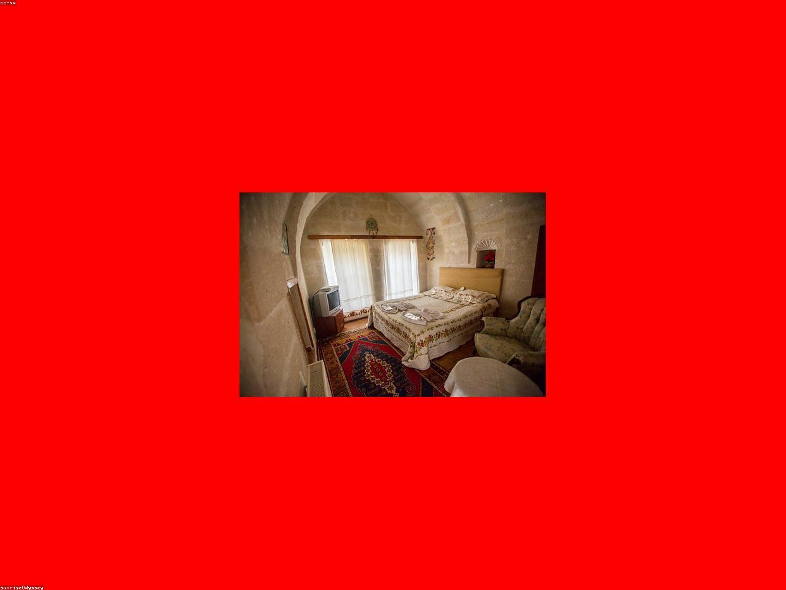
*格雷梅的洞穴酒店露台，背景是仙人烟囱与热气球*

## 交通
- **国际航班**：国内城市（北京/上海/广州/成都）飞 **伊斯坦布尔（IST 或 SAW）**，再转机飞往卡帕多奇亚。
- **境内航班**：伊斯坦布尔 → **开塞利机场（Kayseri, ASR）** 或 **内夫谢希尔机场（Nevşehir, NAV）**。推荐飞开塞利——航班更多、票价更便宜，距格雷梅约 1 小时车程。
- **机场 → 格雷梅**：提前预订酒店接送机（约 10～15 欧元/人），或在机场租车柜台取车后自驾前往。土耳其与中国同为**左舵右行**，自驾无缝适应。
- **取车建议**：如果 D4 计划自驾前往安塔利亚，可在开塞利机场取车；如果 D4 选择飞安塔利亚，则先不租车，抵达当天包车到酒店即可。

## 住宿
**强烈推荐：洞穴酒店（Cave Hotel）**

洞穴酒店是卡帕多奇亚的灵魂体验——它们凿穿火山凝灰岩而建，冬暖夏凉，墙壁保留着岩石的原始纹理。

- **Sultan Cave Suites**：网红露台拍热气球的首选举机位，服务成熟，约 800～1,500 元/晚。
- **Museum Hotel**：乌奇希萨尔附近的奢华洞穴酒店，联合国教科文组织世界遗产酒店成员，自带古董收藏和无边泳池，约 2,000～3,500 元/晚。
- **Koza Cave Hotel**：格雷梅中心位置，性价比高，露台景观同样出色，约 500～900 元/晚。

> **预订提示**：5～6 月和 9～10 月是卡帕旺季，洞穴酒店（尤其是网红露台房型）通常提前 2～3 个月售罄。如果还没订，这是第一件要做的事。

## 活动
- **下午**：抵达后先入住，感受洞穴房间的独特氛围——没有直角墙壁，床头就是千年岩层。
- **傍晚**：步行前往 **Sunset Point（格雷梅日落观景台）**，约 15 分钟上山。在这里俯瞰整个格雷梅小镇，看夕阳把仙人烟囱（Fairy Chimneys）染成金红色与粉紫色。
- **小贴士**：卡帕多奇亚海拔约 1,100 米，早晚温差大，即使 5～6 月也需要一件薄外套。日落观景台风大，建议带防风外套。

## 晚餐
- **推荐：Seten Anatolian Cuisine**（格雷梅镇中心）
  - 招牌：**Testi Kebab（瓦罐牛肉）**——把牛肉、蔬菜、香料密封在陶罐中慢烤，上桌时由服务员敲碎陶罐，香气四溢。
  - 人均：约 150～250 元人民币。
- **备选：Dibek Traditional Home Cuisine**，百年老宅改造的家庭餐厅，同样可以体验瓦罐菜，氛围更温馨。

---

# D2｜卡帕多奇亚（Cappadocia）
**主题：热气球与玫瑰谷**

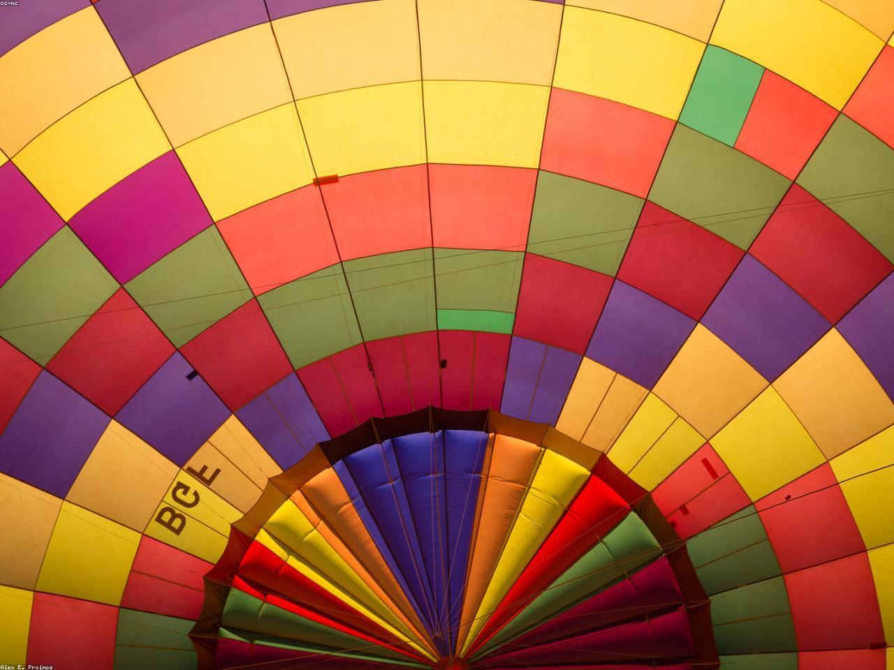
*格雷梅山谷的数百只热气球同时升空*

这一天是**整个 9 天行程情感价值最高的一天**。没有长途驾驶，只有两个世界级的体验：热气球日出，和玫瑰谷徒步。

## 清晨：热气球日出（必体验）

卡帕多奇亚的热气球被《国家地理》评为"一生必做"的旅程之一，也是全球最适合乘热气球的地方——稳定的气流、独特的地貌、壮观的日出。

- **预订**：必须提前在官网预订。推荐 **Butterfly Balloons**、**Royal Balloon** 或 **Kapadokya Balloons** 这三家老牌公司，安全记录好、飞行员经验丰富。
- **价格**：约 1,800～2,500 元/人（视季节和筐大小而定，16 人筐最便宜，8-12 人筐体验更好）。
- **流程**：
  - 04:30 酒店接人，前往起飞场地；
  - 05:00 左右看热气球充气点火，巨大的彩色球体在晨曦中缓缓立起；
 - 05:30 起飞，飞行约 1～1.5 小时，穿越玫瑰谷、爱情谷、仙人烟囱之间；
  - 07:00 降落在拖车平台上，开香槟庆祝，颁发飞行证书。

> **景观价值**：当太阳从地平线升起，数百只热气球同时漂浮在格雷梅山谷上空，岩石被染成玫瑰金。这种画面——**"地球上最像月球的地方，被人类赋予了最浪漫的色彩"**——是国内任何风景都无法复制的。你们会在这 1 小时里，不断听见彼此说"太美了"。

## 上午：格雷梅露天博物馆（Göreme Open Air Museum）

- **距离**：距格雷梅镇中心约 1.5 公里，可步行或驾车。
- **看点**：这里是拜占庭时期修道院社区的遗址，约有 30 多座岩石教堂和修道院。最著名的包括 **黑暗教堂（Karanlık Kilise）** 和 **苹果教堂（Elmalı Kilise）**，内部保存着 10～12 世纪的拜占庭壁画。
- **门票**：约 30 欧元/人；黑暗教堂需额外付费。
- **小贴士**：壁画禁止闪光灯拍照。建议请一位英文导游（约 200～300 元），能更好地理解每幅画背后的故事。

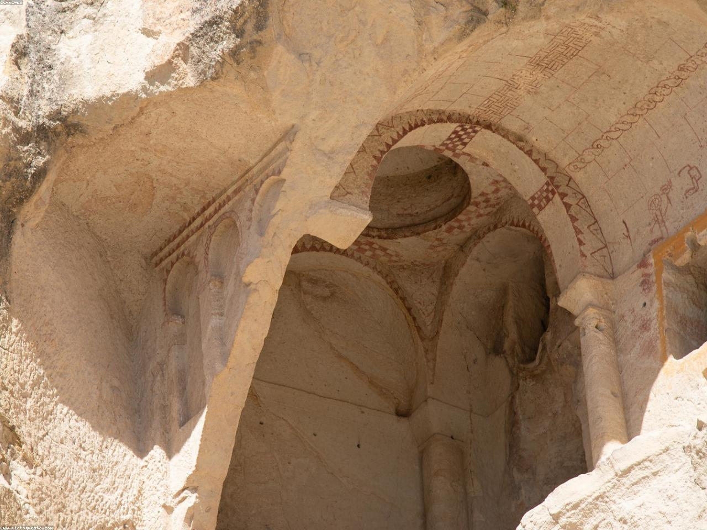
*黑暗教堂内保存完好的拜占庭壁画*

## 下午：玫瑰谷徒步（Rose Valley）

- **路线**：从 Göreme 出发，经 Çavuşin 到玫瑰谷，有多种环线可选。推荐 **Göreme → Kızılçukur（红谷）→ Çavuşin** 的环线，约 4 公里，耗时 2～3 小时。
- **景观**：下午 4 点后阳光斜射，山谷中的岩石会呈现出玫瑰红、橙黄、粉紫的渐变色，因此得名"玫瑰谷"。
- **难度**：中等偏下，部分路段有碎石，建议穿防滑徒步鞋。

## 晚餐
- 推荐 **Kale Terasse Restoran**，露台餐厅可以俯瞰格雷梅夜景。点一份 **Pottery Kebab** 和土耳其烤肉拼盘，人均约 150 元。
- 或去小镇上的 **Pumpkin Göreme**，主打南瓜料理和甜点，温馨的家庭式餐厅。

---

# D3｜卡帕多奇亚（Cappadocia）
**主题：地下迷宫与天空之城**

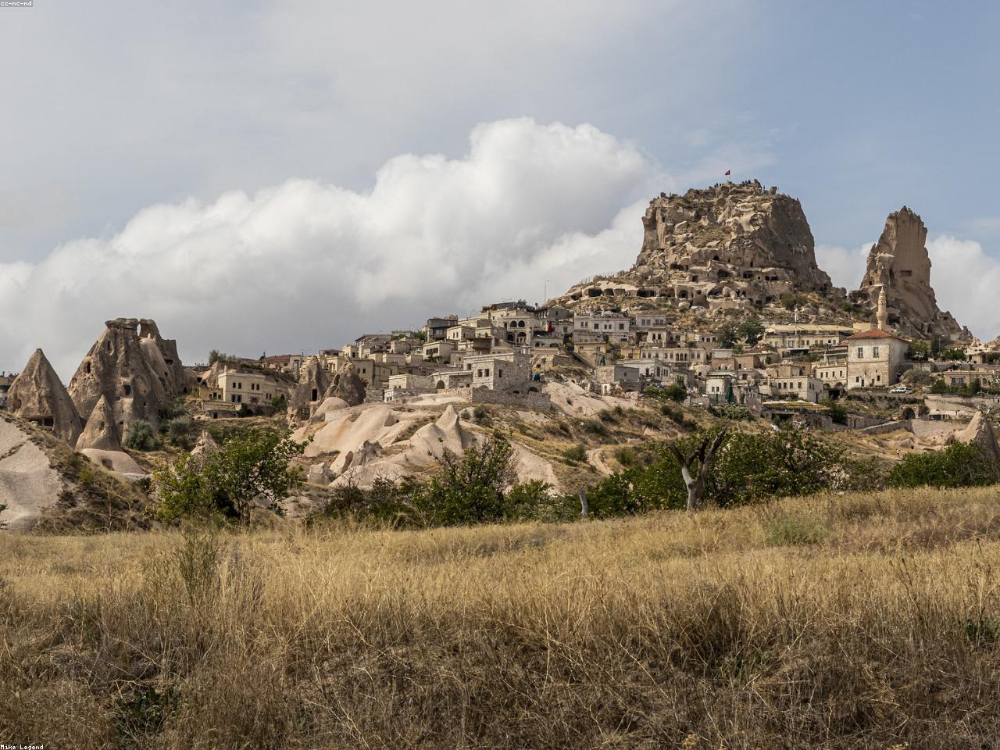
*从乌奇希萨尔城堡俯瞰卡帕多奇亚的仙人烟囱全景*

## 上午：德林库尤地下城（Derinkuyu Underground City）

卡帕多奇亚地下有数十座古代地下城，最深、最震撼的是 **德林库尤** 和 **凯马克利（Kaymaklı）**。我们选择德林库尤，因为它更深、更完整。

- **距离**：格雷梅 → 德林库尤约 35 公里，车程 40 分钟。
- **历史**：始建于公元前 8 世纪，由赫梯人开凿，后在拜占庭时期被基督徒扩建为躲避阿拉伯军队入侵的避难所。最深达 **85 米**，可容纳约 **2 万人**。
- **看点**：
  - 八层垂直向下的隧道、通风井、酒窖、马厩、教堂、学校和墓地；
  - 最底层的 **十字架教堂** 和 **洗礼堂**；
  - 滚石石门——古代人用来阻挡入侵者的圆形石门，至今仍可推动。
- **门票**：约 13 欧元/人。
- **小贴士**：地下城隧道狭窄低矮（部分仅 1.3 米高），幽闭恐惧症患者慎入。建议戴帽子保护头部，穿防滑鞋。

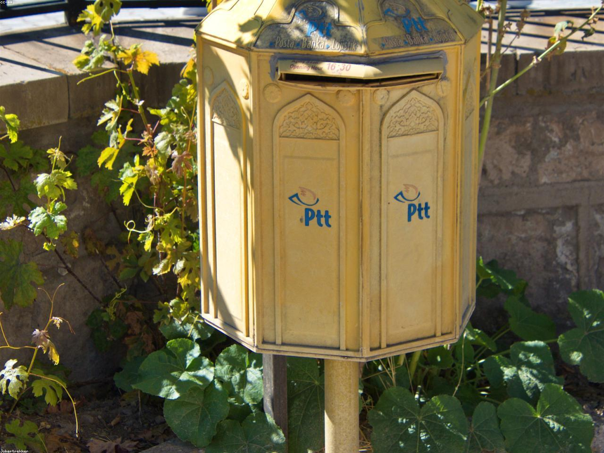
*德林库尤地下城的狭窄隧道与滚石石门*

## 下午：乌奇希萨尔城堡（Uçhisar Castle）与鸽子谷

- **乌奇希萨尔城堡**：卡帕多奇亚地区的最高点（高约 60 米），由整块火山岩雕琢而成。登顶后可以 360 度俯瞰整个卡帕多奇亚——格雷梅、玫瑰谷、爱情谷、阿瓦诺斯平原尽收眼底。
- **鸽子谷（Pigeon Valley）**：连接乌奇希萨尔和格雷梅的峡谷，因岩壁上密密麻麻的鸽子洞而得名。徒步约 1 小时，沿途有很多仙人烟囱和蓝眼睛树（Nazar Tree）。
- **阿瓦诺斯（Avanos）**：陶艺小镇，位于克孜勒河（Kızılırmak，红河）畔。可以参观陶艺工坊，亲手制作一件陶器作为婚假纪念。

## 晚餐
- 回到格雷梅，推荐 **Topdeck Cave Restaurant**，洞穴餐厅氛围极佳，主打安纳托利亚传统料理，人均约 150～200 元。
- 如果想换口味，格雷梅镇上有几家不错的披萨店和意大利餐厅。

---

# D4｜卡帕多奇亚 → 安塔利亚（Antalya）
**主题：从月球表面驶向地中海**

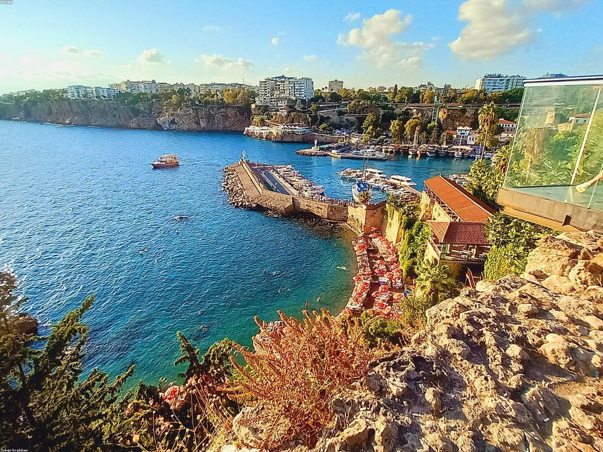
*安塔利亚老城卡莱伊奇的罗马港与地中海日落*

这一天是整个行程的**转场日**——从卡帕多奇亚的内陆高原，一路南下抵达地中海。有两种方案可选。

## 方案 A：自驾（推荐，景观更丰富）

- **路线**：格雷梅 → 科尼亚（Konya）→ 安塔利亚。
- **距离**：约 540 公里。
- **时间**：约 6.5～7.5 小时（含 2～3 次休息）。
- **途中亮点**：
  - 经过 **图兹湖（Tuz Gölü）** 东缘（ optional 绕路约 30 分钟），夏季湖面会呈现粉红色；
  - 穿越 **托罗斯山脉（Taurus Mountains）**，从高原逐渐下降到地中海，沿途风景从荒原变为森林；
  - 在科尼亚或阿克塞基（Akseki）休息吃午餐。

## 方案 B：飞安塔利亚（更轻松）

- **航班**：开塞利机场 ✈ 安塔利亚机场，约 1.5 小时（每周班次有限，需提前查好）。
- **租车**：抵达安塔利亚机场后取车，开启地中海自驾段。
- **适合人群**：不想开长途、或担心山路驾驶的新手司机。

## 住宿
**推荐：卡莱伊奇老城区（Kaleiçi）**

- **Tuvana Hotel**：奥斯曼老宅改造的精品酒店，庭院种满柠檬树和九重葛，约 800～1,500 元/晚。
- **Puding Marina Residence**：位于罗马港边，地中海景观房可直接看到游艇和夕阳，约 600～1,000 元/晚。
- **La Boutique Hotel**：设计酒店，屋顶露台有小型无边泳池，约 700～1,200 元/晚。

## 活动
- **傍晚**：漫步 **哈德良门（Hadrian's Gate）**，这座大理石拱门建于公元 130 年，是罗马皇帝哈德良访问帕加马王国时的纪念建筑。
- **罗马港（Roman Harbour）**：老城边缘的古老港口，现在停满了游艇和海盗船。坐在港口边的咖啡馆，看地中海的日落把天空染成橘红与粉紫。

## 晚餐
- **Arma Restaurant**：位于老城悬崖边，拥有安塔利亚最佳海景露台。主打地中海海鲜和土耳其料理，人均约 200～350 元，需提前预订。
- **鱼市场（Balık Pazarı）**：位于市中心，自选新鲜海鲜后交给周边餐厅现场烹饪，价格更实惠，人均约 150 元。

---

# D5｜安塔利亚 → 卡什（Kaş）
**主题：D400，全球最美沿海公路之一**

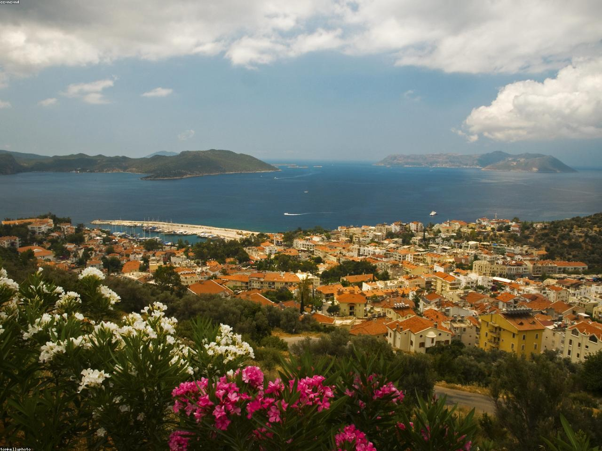
*卡什小镇的彩色房屋与地中海港口*

从今天起，你们正式开始**D400 沿海公路自驾**——这条被无数旅行媒体评为"全球最美沿海公路"的路线，是土耳其之行的自驾高光。

## 自驾路线
- **路线**：安塔利亚 → Kemer → Phaselis → Olympos → 卡什（Kaş）。
- **距离**：约 180 公里。
- **时间**：约 3.5～4.5 小时（含停靠）。
- **路况**：D400 公路路况极好，沿海段限速 70～90 km/h。注意弯道多，不要盲目超车。土耳其与中国一样**右舵左行**。

## 途中亮点

### Phaselis 古城
- 位于森林与海滩之间的古罗马港口城市遗址。
- 特色：三条古罗马大道、浴场遗址、以及直接伸向地中海的码头。可以在古码头的海水中游泳，背景是两千年的石柱。
- 门票：约 10 欧元/人。

### Olympos 海滩
- 一条河流入海口形成的沙滩，两岸是茂密的悬铃木森林。
- 这里也是火虫（Chimaera）和 Olympos 古城的所在地，如果时间充裕可以停留 1 小时。

## 卡什（Kaş）

卡什是地中海沿岸最迷人的小镇之一——彩色房屋沿着山坡层层叠叠，港口停满了木制的古帆船（Gulet），街头种满九重葛和柠檬树。

- **活动**：
  - 傍晚在小镇中心散步，逛独立设计师的小店和手工珠宝店；
  - 卡什是土耳其顶级的潜水胜地，可以报名体验潜水（约 300～400 元/人）；
  - 在港口边找一家悬崖酒吧，点一杯土耳其红茶或 Efes 啤酒，看夕阳沉入海平面。

## 住宿
- **Lukka Exclusive Hotel**：悬崖海景精品酒店，无边泳池直接面向地中海，约 1,000～1,800 元/晚。
- **Hideaway Hotel**：位于半岛顶端，安静私密，房间自带海景阳台，约 800～1,500 元/晚。
- **卡什老城区 Airbnb/精品民宿**：选择众多，约 400～800 元/晚。

## 晚餐
- **Smiley's Restaurant**：海边餐厅，主打新鲜海鲈鱼、章鱼沙拉和烤虾，人均约 150～250 元。
- **Cinarlar Pizza & Restaurant**：想换口味的话，这里的披萨和意大利面评价很高。

---

# D6｜卡什（Kaş）
**主题：沉没之城与果冻海**

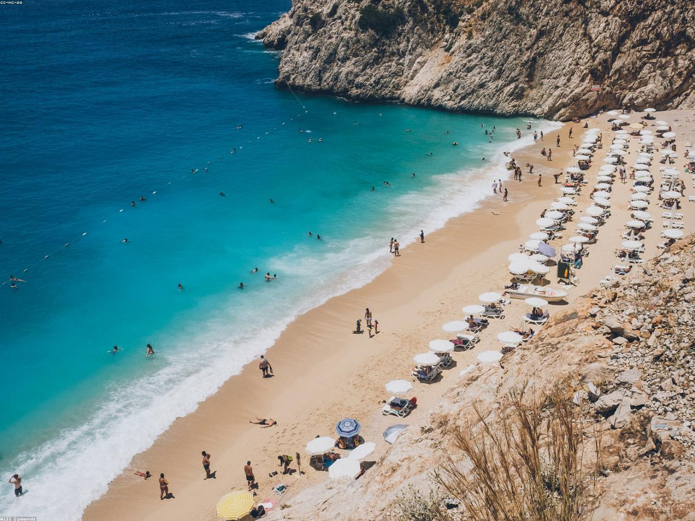
*D400 公路边的 Kaputas Beach，悬崖夹缝中的奶蓝色海湾*

这一天是**地中海最梦幻的一天**。你们会乘船探访一座沉没在水下的古罗马城市，然后在路边偶遇一片让全世界旅行者停车的"果冻海"。

## 上午：Kekova 沉没之城船游

- **预订**：卡什港口有很多旅行社提供 Kekova 一日游，推荐选择 **小型木船（Gulet）** 的 6 岛/沉没之城线路，约 200～350 元/人，含午餐。
- **航程**：从 Üçağız 村（距卡什约 25 分钟车程）上船，全程约 4～5 小时。
- **亮点**：
  - **Kekova 沉没之城**：由于公元 2 世纪的一场地震，这座古罗马港口城市的大半沉入水下。今天，透过清澈的浅水，你们可以看到 submerged 的台阶、墙壁和码头遗迹；
  - **Simena 城堡**：船会在 Kaleköy（Simena）停靠，你们可以爬上一座中世纪城堡，俯瞰 Kekova 海湾的全景；
  - **游泳停靠**：船会在多个无人海湾抛锚，让你们直接跳入地中海的碧蓝水中。

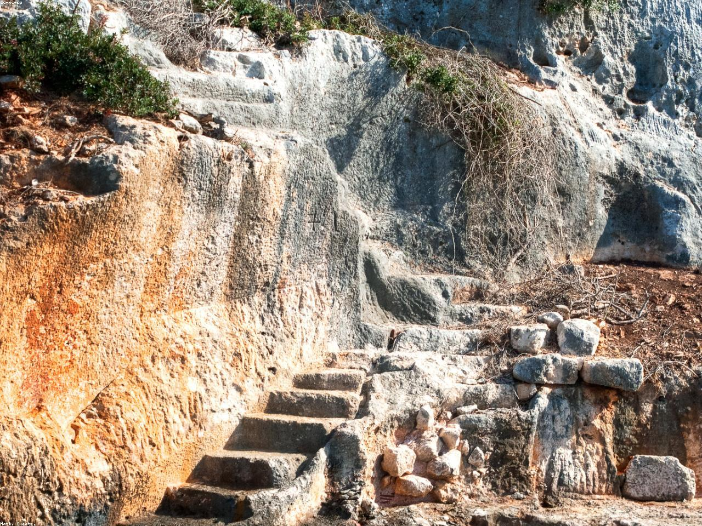
*Kekova 海湾中水下的古罗马建筑遗迹*

## 下午：Kaputas Beach

- **位置**：D400 公路从卡什往费特希耶方向约 20 公里处，公路直接从悬崖上方俯冲到海滩。
- **特色**：两片高耸的悬崖夹出一条狭窄的峡谷，谷底是一片奶蓝色与绿松石色渐变的沙滩。海水清澈见底，被称为"土耳其最美海滩"。
- **停车**：路边有免费停车场，旺季下午人较多，建议傍晚 4 点后到达。
- **小贴士**：海滩没有遮阳设施，建议自带遮阳伞、水和零食。海浪不大，非常适合游泳。

## 住宿
- 可以选择继续住在卡什（如果明天早上再出发去费特希耶），或傍晚驱车约 1.5 小时前往费特希耶/Ölüdeniz 住宿。
- **推荐继续住卡什**：这样可以有更多时间享受小镇的夜晚，明天上午再悠闲出发。

## 晚餐
- 如果回卡什，推荐 **Natur-el**：一家健康的素食/海鲜餐厅，庭院氛围很棒，人均约 150 元。
- 或去港口边的 **Meydan Restaurant**，土耳其烤肉和海鲜都很出色。

---

# D7｜卡什 → 费特希耶（Fethiye）
**主题：死海蓝与滑翔伞圣地**

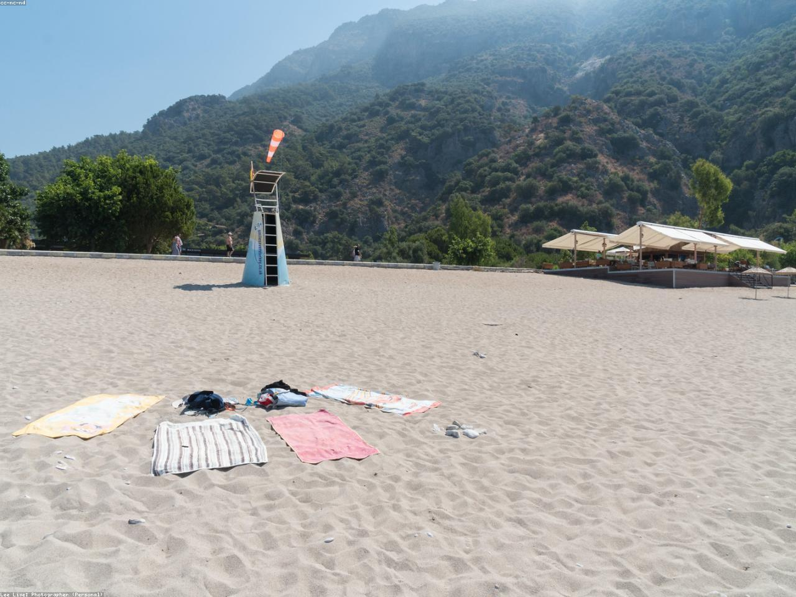
*Ölüdeniz（土耳其死海）的绿松石色海水与白色沙滩*

## 自驾路线
- **路线**：卡什 → Kaputas Beach → Kalkan → 费特希耶/Ölüdeniz。
- **距离**：约 110 公里。
- **时间**：约 2～2.5 小时（不含 Kaputas 停留）。
- **途中**：会经过 **Kalkan**——一个以白色房屋和屋顶餐厅闻名的英式度假小镇，可以在此午餐。

## 下午：Ölüdeniz 蓝湖（土耳其死海）

- **Ölüdeniz** 意为"死海"，因为海湾被一座沙洲与大海隔开，内部水域几乎无浪、无流，平静如镜。
- **海水颜色**：从岸边向深海过渡，呈现出白色 → 薄荷绿 → 绿松石蓝 → 深蓝的渐变，是土耳其最具标志性的海水颜色。
- **活动**：
  - 躺在 Belcekız Beach 的白色沙滩上晒太阳；
  - 租一艘皮划艇或 Stand-up Paddle，划向蓝湖深处；
  - 傍晚在海滨步道散步，看滑翔伞陆续从 Babadağ 山顶降落在沙滩上。

## 住宿
- **Yacht Classic Hotel**：费特希耶码头的精品酒店，设计现代，拥有游艇码头景观，约 800～1,500 元/晚。
- **Liberty Hotels Lykia**：位于 Ölüdeniz 海滩边的大型全包度假村，私人海滩和多个泳池，约 1,000～2,000 元/晚。
- **Sugar Beach Club**：Ölüdeniz 海滩边的精品民宿/酒店，出门就是沙滩，约 600～1,200 元/晚。

## 晚餐
- **费特希耶鱼市场（Fethiye Fish Market）**：位于市中心，几十家海鲜摊位 surrounded by 餐厅。你们可以自选龙虾、海鲈鱼、鱿鱼等海鲜，交给周边餐厅按 kilo 计价加工。新鲜、热闹、性价比高，人均约 150～250 元。

---

# D8｜费特希耶（Fethiye）
**主题：飞翔在地中海上空**

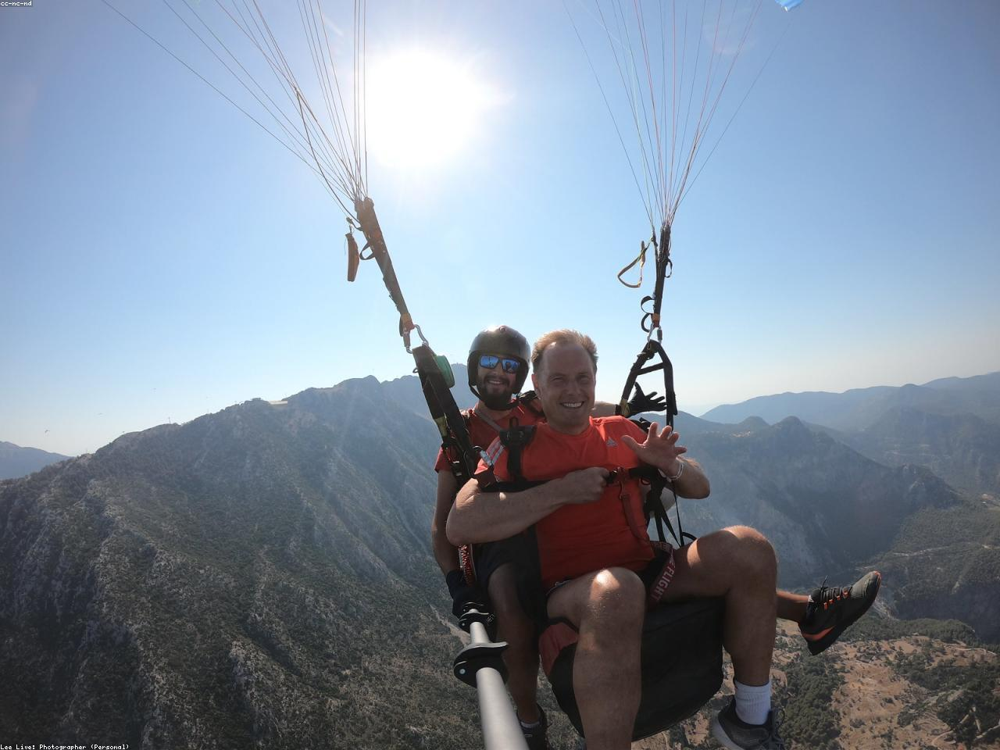
*从 Babadağ 山顶滑翔伞俯瞰 Ölüdeniz 蓝湖的全景*

这一天是**整个自驾段的高潮**——你们会从 1,900 米的山顶起飞，像鸟儿一样翱翔在地中海上空。

## 上午：滑翔伞（Paragliding）

费特希耶的 Ölüdeniz 被公认为**全球最佳滑翔伞体验地**之一——稳定的热气流、壮阔的海湾全景、以及完美的着陆沙滩。

- **预订**：推荐 **Gravity**、**Reaction** 或 **Infinity** 这三家老牌公司，安全记录好、教练专业。
- **价格**：约 700～1,200 元/人（含照片/视频套餐约额外 300～500 元）。**建议购买照片视频套餐**——这是你们婚假最值得保存的画面之一。
- **流程**：
  - 08:00 酒店接人，乘面包车上 Babadağ 山（约 40 分钟盘山公路）；
  - 09:00 抵达山顶起飞场，穿戴装备、听安全简报；
  - 09:30 迎风起跑，跃入空中。飞行时间约 25～40 分钟（视气流而定）；
  - 10:30 降落在 Ölüdeniz 沙滩上，立刻在海边咖啡馆复盘刚才的 video。

> **体验价值**：当你们双脚离地的那一刻，整个 Ölüdeniz 蓝湖就在脚下展开——奶蓝色的海湾、白色的沙滩、远处费特希耶的城镇和山脉。教练会带你们做 360 度盘旋，甚至尝试刺激的"螺旋下降"。这不仅是视觉冲击，更是一种"共同征服天空"的亲密感。

## 下午：蝴蝶谷（Butterfly Valley）

- **交通**：从 Ölüdeniz 海滩乘船约 30 分钟到达（旺季每天多班船，约 50～80 元/人往返）。
- **特色**：一个被 350 米高悬崖环绕的隐秘峡谷，因夏季栖息着 80 多种蝴蝶而得名。峡谷内有一条溪流和几处瀑布，可以涉水徒步深入。
- **活动**：
  - 在峡谷深处的瀑布下游泳；
  - 躺在沙滩上晒太阳，看蝴蝶在野花间飞舞；
  - 峡谷尽头有一处小型的天然跳水台（约 3 米高）。
- **注意**：最后一班回程船通常在 17:00-18:00，注意时间安排。

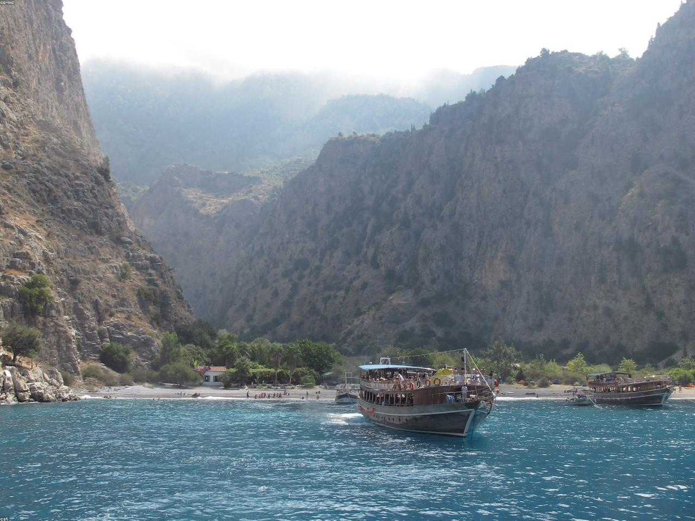
*蝴蝶谷深处的瀑布与悬崖环绕的隐秘海滩*

## 晚间
- 如果还有精力，可以参加 **海盗船日落巡游**（约 2～3 小时），在船上跳舞、跳水、看地中海日落。
- 或在酒店露台或海边餐厅，享用最后一顿地中海晚餐，回顾这 9 天的旅程。

---

# D9｜费特希耶 → 达拉曼机场 → 国内
**主题：返程，带回地中海的蓝**

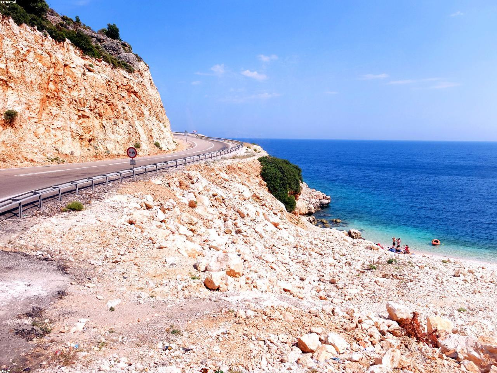
*D400 公路沿海段，左手青山右手碧海*

- **自驾**：费特希耶/Ölüdeniz → **达拉曼机场（Dalaman, DLM）**，约 55 公里，车程约 1 小时。
- **航班**：建议预订 **中午 12:00-15:00 起飞** 的航班，经伊斯坦布尔转机回国。这样上午不用太匆忙，还能在酒店享用最后一顿早餐。
- **机场还车**：达拉曼机场有各大租车公司柜台，还车手续简便。
- **购物**：机场免税店可以买到 **土耳其软糖（Lokum）**、**开心果**、**玫瑰水**、**土耳其咖啡** 和 **蓝眼睛饰品（Nazar）**。

---

## 附录一：全程预算拆分（2 人总计）

| 项目 | 金额（人民币） | 说明 |
|:---|:---:|:---|
| **国际往返机票** | 10,000～18,000 | 淡季/中转经济舱，约 5,000～9,000 元/人 |
| **土耳其境内机票** | 1,500～3,000 | 开塞利/安塔利亚段（如选择直飞替代自驾） |
| **租车 + 油费** | 2,500～4,500 | 约 5～6 天租车，油费约 1,000～1,500 元 |
| **住宿（8 晚）** | 6,000～12,000 | 洞穴酒店/地中海民宿约 400～1,000 元/晚 |
| **餐饮** | 5,000～8,000 | 外食人均 100～200 元/顿，土耳其物价亲民 |
| **门票/体验** | 4,000～6,000 | 热气球约 1,800～2,500/人，滑翔伞约 700～1,000/人，船游/门票等 |
| **签证/保险/杂费** | 1,000～2,000 | 电子签约 450 元/人，保险约 150 元/人 |
| **总计** | **约 30,000～53,500 元** | **人均 1.5～2.68 万元** |

> **省钱小贴士**：土耳其整体物价远低于西欧，超市（Migros、BIM、Şok）购买水果、面包、奶酪非常便宜。建议订带厨房的洞穴酒店或民宿，自己做早餐和简单晚餐，可以进一步压缩预算。

---

## 附录二：行前准备清单

### 证件与签证
- [ ] **土耳其电子签（e-Visa）**：官网 www.evisa.gov.tr 申请，约 **60 美元**（约 430 元人民币），有效期 180 天，单次停留 30 天。通常几分钟到几小时内出签。
- [ ] 护照（有效期 6 个月以上）。
- [ ] 驾照原件 + **国际驾照翻译认证件**（租租车 APP 可免费办理）。土耳其承认中国驾照+翻译件租车。
- [ ] 旅行保险（建议保额 ≥ 30 万元人民币，涵盖热气球和滑翔伞等高风险运动）。

### 预订确认（按优先级）
1. [ ] **国际机票**
2. [ ] **洞穴酒店（格雷梅）**：旺季最紧张，建议提前 2～3 个月预订
3. [ ] **热气球**：Butterfly / Royal / Kapadokya Balloons，提前 1～2 个月预订
4. [ ] **卡帕 → 安塔利亚机票**（如选择飞而非自驾）
5. [ ] **租车**：开塞利/安塔利亚机场取车 → 达拉曼机场还车
6. [ ] **卡什/费特希耶住宿**
7. [ ] **滑翔伞**：Gravity / Reaction / Infinity，提前 1 周预订即可
8. [ ] **Kekova 沉没之城船游**：可抵达卡什后在当地港口预订

### 衣物与装备
- [ ] **轻薄羽绒服/抓绒外套**：卡帕多奇亚早晚温差大，5～6 月和 9～10 月清晨热气球时可能只有 10℃
- [ ] **防晒衣 + 高倍防晒霜**：地中海阳光强烈，紫外线极高
- [ ] **墨镜 + 遮阳帽**：热气球和海上都必需
- [ ] **泳衣**：Kaputas Beach、Ölüdeniz、蝴蝶谷都需要
- [ ] **防滑徒步鞋**：玫瑰谷徒步、乌奇希萨尔城堡、地下城都需要
- [ ] **沙滩鞋/溯溪鞋**：蝴蝶谷瀑布涉水用
- [ ] **转换插头**：土耳其使用**欧标双圆孔插头（C/F 型）**
- [ ] **便携烧水壶**：土耳其人习惯喝红茶和冷水，但中国人早上需要热水
- [ ] **少量零食/泡面**：自驾途中或洞穴酒店深夜备用

### APP 下载
- **Google Maps**：离线地图必备，D400 部分山区信号弱
- **Uber / BiTaksi**：土耳其打车软件（伊斯坦布尔、安塔利亚、费特希耶可用）
- **Mobimilet / Enuygun**：查询土耳其境内航班和长途大巴
- **Tripadvisor / Google 翻译**：餐厅选择和菜单翻译
- **Booking.com / Airbnb**：住宿管理

---

## 附录三：关键决策说明（FAQ）

### Q1：为什么不从伊斯坦布尔开始或结束？
伊斯坦布尔是一座世界级的城市，有蓝色清真寺、圣索菲亚大教堂、大巴扎和博斯普鲁斯海峡。但 9 天时间有限，如果把伊斯坦布尔纳入行程，至少需要 2 整天，这会严重压缩卡帕多奇亚和 D400 沿海公路的时间。我们选择**把伊斯坦布尔留到下次**，用这 9 天专注于"热气球 + 地中海自驾"这对王炸组合。

### Q2：卡帕多奇亚热气球取消率高吗？如果取消了怎么办？
卡帕多奇亚的热气球对天气要求极高——风速、能见度、降水都会影响起飞。5～6 月和 9～10 月的取消率约为 10%～20%，冬季更高。如果 D2 清晨取消，大多数公司会提供免费改期到 D3 的服务。建议**在卡帕多奇亚预留 2 个清晨**（D2 和 D3），这样如果 D2 取消，D3 还有补飞机会。如果实在两早都取消，可申请全额退款。

### Q3：D400 自驾危险吗？土耳其开车和中国有什么区别？
土耳其与中国一样，都是**左舵右行**，交通标志和规则基本类似，自驾适应非常快。D400 沿海公路路况极好，但弯道多、部分路段临悬崖，建议：
- 不要超速，尤其在弯道和城镇路段；
- 土耳其司机开车比较激进，变道和超车频繁，保持冷静；
- 山路避免夜间驾驶；
- 建议租一辆自动挡 SUV（如斯柯达 Kodiaq、大众 Tiguan），动力足、视野好。

### Q4：土耳其安全吗？
土耳其整体对游客非常友好，卡帕多奇亚、安塔利亚、卡什、费特希耶等旅游目的地治安良好。但需要注意：
- 伊斯坦布尔等大城市有针对游客的扒手，建议不要背敞开式背包；
- 街头小贩和出租车司机有时会"热情过度"，坚定但礼貌地拒绝即可；
- 避免前往土耳其东南部边境地区（与叙利亚、伊拉克接壤），这些区域不在本次行程路线中。

### Q5：如果预算充裕，有什么可以提升体验的？
- **热气球小筐**：选择 8～12 人小筐（比 16～20 人大筐贵约 500～800 元/人），空间更宽敞、拍照更自由、体验更私密；
- **私人游艇出海**：在卡什或费特希耶包一艘私人 Gulet 游艇出海，约 3,000～6,000 元/天，含船长、船员和午餐；
- **洞穴酒店升级**：预订 Museum Hotel 或 Argos in Cappadocia 的套房，享受私人泳池或露台；
- **滑翔伞+直升机组合**：部分公司提供直升机观光 Babadağ 山和 Ölüdeniz 海湾（约 2,000 元/人/15 分钟）。

---

## 附录四：一句话总结

这 9 天，你们会在卡帕多奇亚的"月球表面"乘热气球看日出，在千年地下城中牵手穿越狭窄的隧道，然后自驾 D400 公路沿着地中海一路向西，在 Kaputas Beach 的果冻海里游泳，最后从 Babadağ 山顶滑翔而下，俯瞰 Ölüdeniz 那片不可思议的蓝。

**这是土耳其写给新婚夫妇最热烈的情书——一半是火焰，一半是海水。**

---

*文档生成时间：2026 年 4 月*  
*祝你们旅途愉快，新婚快乐！*
