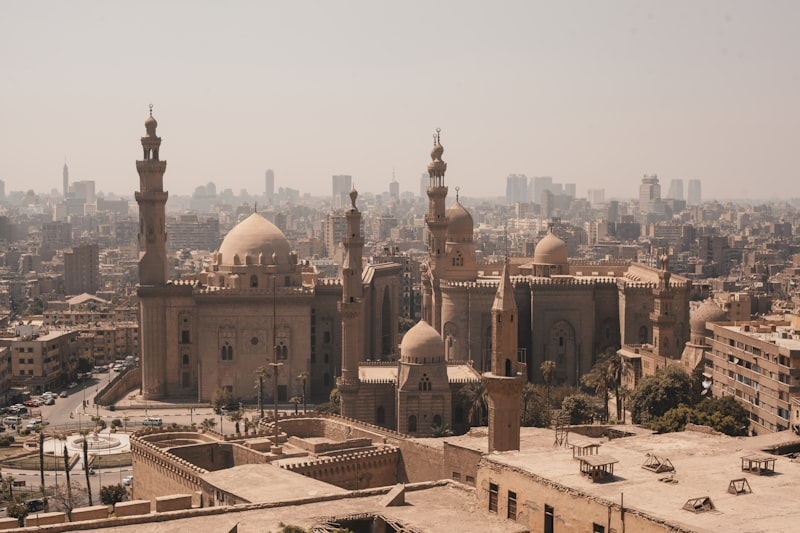
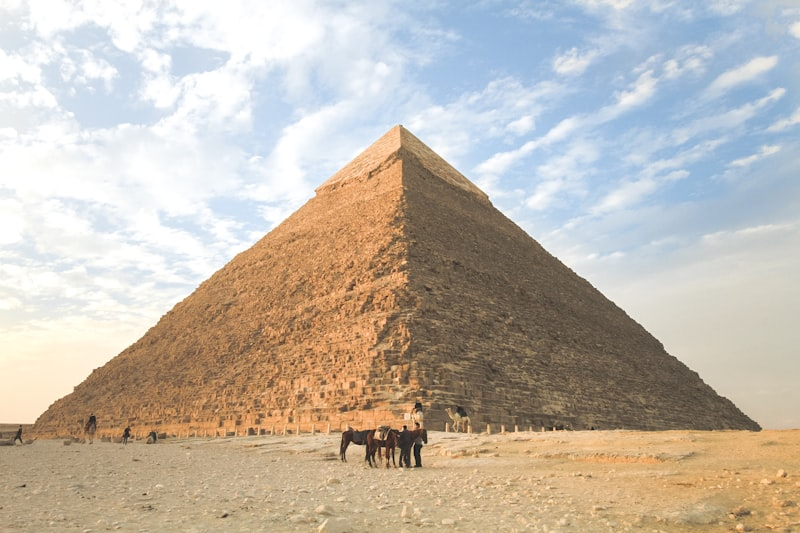
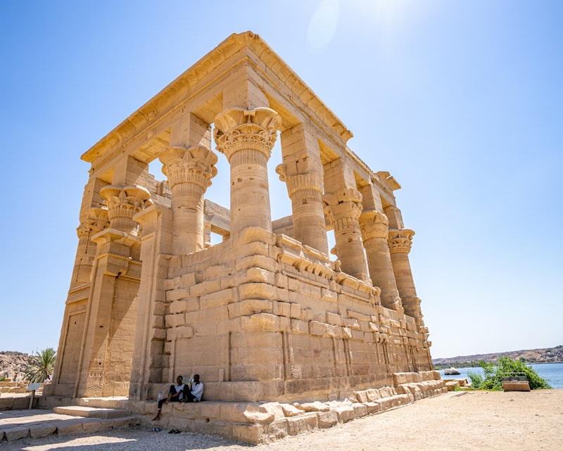
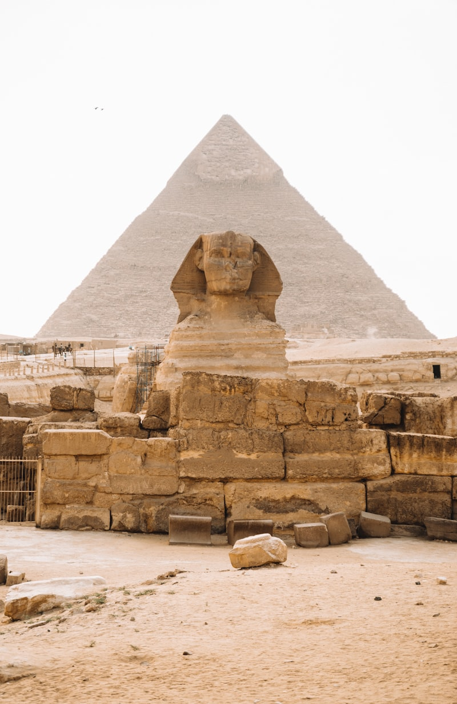
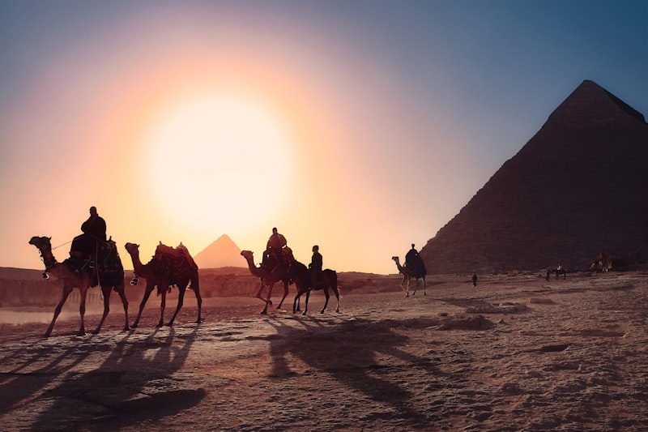
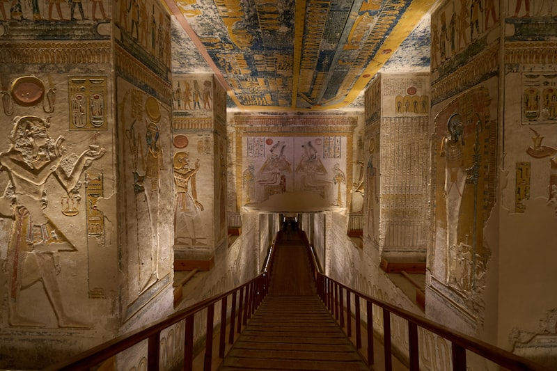
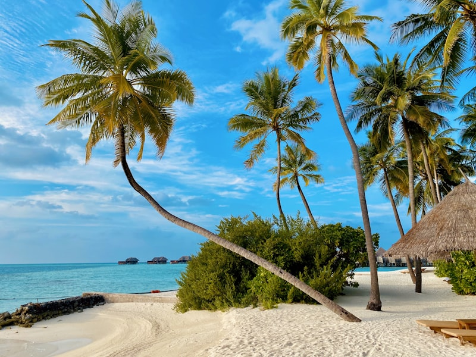
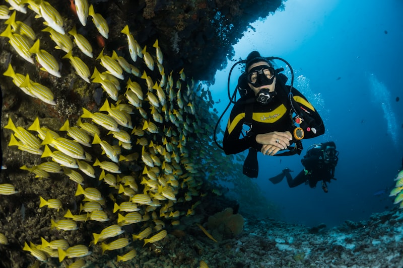

# 埃及｜尼罗河文明与红海蓝｜9 天国庆执行手册

> **旅行时间**：10 月 1～9 日（国庆节/秋季黄金窗口）  
> **旅行人数**：2 人  
> **总天数**：9 天 8 晚  
> **核心目的地**：开罗 → 阿斯旺 → 卢克索 → 赫尔格达  
> **人均预算**：1.5～2.5 万元人民币（2 人总计约 3～5 万元）

---

## 为什么选埃及？

如果你们想要一场**"跨越五千年的时空对话"**，埃及是地球上为数不多的正确答案之一。

10 月的埃及，暑气刚退，白昼依然温暖（25～32℃），夜晚凉爽宜人（18～22℃）——这是全年最舒适的旅行窗口之一。站在吉萨金字塔脚下，你会理解什么叫"人类对永恒的执念"；在卢克索的帝王谷里，图坦卡蒙的黄金面具沉默地凝视着闯入者；而当你们在赫尔格达的红海里与海龟同游时，又会突然意识到，这片土地的馈赠从来不只是沙漠与神庙。

与土耳其或格鲁吉亚相比：
- **土耳其**是热气球与地中海的视觉盛宴，但它的历史是层层叠加的（拜占庭、奥斯曼、现代），像一本装订精美的画册；
- **埃及**则是一部从未中断的史诗，从法老时代、希腊罗马时期到伊斯兰文明，全部摞在同一座尼罗河谷里。

**作为国庆长假的目的地，埃及是"厚重历史"与"海滨松弛"的罕见组合。**

---

## 行程总览

| 天数 | 星期 | 路线 | 住宿地 | 核心体验 | 开车距离 |
|:---:|:---:|:---|:---|:---|:---:|
| D1 | 三 | 国内 → 开罗 | 开罗 | 抵达、调整时差、尼罗河夜景 | — |
| D2 | 四 | 开罗 | 开罗 | **吉萨金字塔群**、**狮身人面像**、**大埃及博物馆** | 约 50 km |
| D3 | 五 | 开罗 → 阿斯旺 | 阿斯旺 | 飞抵阿斯旺、**菲莱神庙**、未完成方尖碑 | — |
| D4 | 六 | 阿斯旺 → 阿布辛贝 | 阿斯旺 | **阿布辛贝神庙**日出之旅、纳赛尔湖 | 约 560 km 往返 |
| D5 | 日 | 阿斯旺 → 卢克索 | 卢克索 | 火车沿尼罗河北上、**卡尔纳克神庙**、**卢克索神庙**夜景 | 约 220 km |
| D6 | 一 | 卢克索 | 卢克索 | **帝王谷**、**哈特谢普苏特神庙**、门农巨像、热气球（可选） | 约 40 km |
| D7 | 二 | 卢克索 → 赫尔格达 | 赫尔格达 | 穿越东部沙漠、抵达红海度假胜地 | 约 300 km |
| D8 | 三 | 赫尔格达 → 开罗 | 开罗 | 红海浮潜/出海、傍晚飞回开罗、**汗·哈利利市场** | — |
| D9 | 四 | 开罗 → 国内 | — | 返程 | — |

> **设计逻辑**：D1-D2 开罗建立宏观历史框架；D3-D4 南下阿斯旺与努比亚边境；D5-D6 卢克索沉浸古埃及宗教与艺术巅峰；D7-D8 用红海海滩与潜水中和前段的文化密度；D9 从容返程。全程不走回头路，金字塔与海滩兼得。

---

# D1｜国内 → 开罗（Cairo）
**主题：抵达，站在尼罗河的西岸**

*开罗尼罗河沿岸与远处的吉萨高原*

## 交通
- **航班**：建议选择 **埃及航空 MS**、**阿联酋航空 EK** 或 **卡塔尔航空 QR** 的联程航班，**下午 14:00-18:00 抵达开罗国际机场（CAI）** 最佳。国内通常经广州/北京/上海出发，飞行时间约 10～12 小时。
- **机场 → 市区**：提前预订酒店接机服务（约 200～300 埃及镑），或乘坐机场认可的白顶出租车（White Taxi）/网约车（Careem、Uber），车程约 45～60 分钟。

## 住宿
**推荐：Marriott Mena House（米娜宫万豪）**
- 位置：吉萨金字塔区山脚下，部分房间阳台可直接眺望金字塔。
- 价格：约 350～500 美元/晚。
- 理由：这是开罗最具传奇色彩的酒店之一，丘吉尔和尼克松都曾入住。作为婚假，在阳台上看着金字塔吃早餐的价值无法估量。
- **备选**：Steigenberger Hotel El Tahrir（解放广场附近，现代商务型，约 150～250 美元/晚）。

## 活动
- **傍晚**：如果住在吉萨区，可以在酒店露台看金字塔在夕阳下的剪影。
- **晚餐**：推荐酒店内的 **139 Pavilion**，一边用餐一边看着金字塔从金色变为暗红，直到灯光亮起。
- **小贴士**：
  - 埃及对中国公民实行**落地签**（25 美元现金），但国庆高峰期建议提前办好电子签（e-Visa），避免排队。
  - 10 月开罗日落约 18:00，昼夜温差开始显现，备一件薄外套。

---

# D2｜开罗｜吉萨与大埃及博物馆
**主题：站在人类文明的起点**

*胡夫金字塔与吉萨高原的沙漠天际线*

## 交通
- 今日景点集中在吉萨区与博物馆区，建议包车或网约车往返，车程约 30～45 分钟。

## 活动

### 上午：吉萨金字塔群（Giza Pyramids Complex）
- **胡夫金字塔**：现存最大的金字塔，原高 146 米，建于公元前 2580 年左右。站在它脚下，你会感到一种近乎压迫的庄严感。
- **卡夫拉金字塔与孟卡拉金字塔**：三座金字塔的排列本身就是天文学与几何学的奇迹，精确对准猎户座腰带。
- **狮身人面像（Great Sphinx）**：长 73 米，高 20 米，面容据信是法老卡夫拉。清晨人少，是拍摄的最佳时段。
- **小贴士**：景区内有骑骆驼项目，但价格混乱且常有纠缠。如果想体验，务必提前谈好价格并录像确认。

### 下午：大埃及博物馆（Grand Egyptian Museum, GEM）
- 2024 年起逐步开放，号称"世界最大的考古博物馆"。馆内收藏超过 10 万件文物，图坦卡蒙的完整陪葬品将在此永久展出。
- **必看**：图坦卡蒙黄金面具、拉美西斯二世巨型雕像、Royal Regalia 展厅。
- 博物馆建筑本身也值得驻足——由爱尔兰 Heneghan Peng 事务所设计，巨大的三角形立面与吉萨高原对话。

### 傍晚：汗·哈利利市场（Khan el-Khalili）
- 中东最古老的市场之一，迷宫般的巷道里堆满了香料、铜器、水烟和纸莎草画。
- **推荐咖啡馆**：Fishawi's Café，开业于 1773 年，是开罗最有历史感的咖啡馆。

---

# D3｜开罗 → 阿斯旺（Aswan）
**主题：从法老时代飞向努比亚边境**

*菲莱神庙坐落在尼罗河中的阿吉尔基亚岛上*

## 交通
- **航班**：建议搭乘 **埃及航空早班机**（约 08:00-09:30 起飞），航程约 1.5 小时。阿斯旺机场距市区约 25 公里。
- **机场 → 市区**：酒店接送机或出租车，车程约 30 分钟。

## 住宿
**推荐：Sofitel Legend Old Cataract（老卡塔拉特索菲特传奇酒店）**
- 位置：尼罗河东岸，与努比亚村隔河相望。
- 价格：约 400～600 美元/晚。
- 理由：阿加莎·克里斯蒂在此写下《尼罗河上的惨案》。新摩尔式建筑风格，露台正对尼罗河日落。这是阿斯旺无可争议的首选。
- **备选**：Mövenpick Resort Aswan（象岛上，需乘船往返，约 150～250 美元/晚）。

## 活动

### 下午：菲莱神庙（Temple of Philae）
- 供奉女神伊西斯，建于托勒密时期（公元前 380-362 年）。因阿斯旺大坝修建，整座神庙被联合国教科文组织切割搬迁至阿吉尔基亚岛上。
- **抵达方式**：从码头乘摩托艇约 10 分钟， Nile 的风本身就已经是一种体验。
- 傍晚的光线会让乳白色的石柱染上金粉色，建议安排 15:00-17:00 参观。

### 傍晚：未完成方尖碑（Unfinished Obelisk）
- 躺在采石场中的巨型花岗岩，高 42 米，重达 1200 吨。它从未被竖立，却因为"未完成"而成了理解古埃及工程技术的最佳教材。

---

# D4｜阿斯旺 → 阿布辛贝（Abu Simbel）
**主题：拉美西斯二世的太阳奇迹**

*阿布辛贝大神庙前的四尊拉美西斯二世坐像*

## 交通
- 阿布辛贝距阿斯旺约 280 公里，单程 3 小时。建议包车或参加小型拼车团，**凌晨 04:00 出发**，赶在日出前抵达。
- 另一种选择是小飞机（约 45 分钟），但班次少且价格高，通常需要提前预订。

## 活动

### 清晨：阿布辛贝神庙（Abu Simbel Temples）
- **大神庙**：山岩中凿出的巨型神庙，正面四座拉美西斯二世坐像各高 20 米。神庙内部纵深 60 米，尽头圣所供奉四座神像：阿蒙-拉、拉-霍拉赫提、普塔，以及神格化的拉美西斯二世本人。
- **太阳节奇迹**：每年 2 月 22 日和 10 月 22 日，阳光会穿透黑暗的长廊，照亮圣所中的神像——这是古埃及天文学与建筑学的巅峰之作。
- **小神庙**：旁边是拉美西斯二世为妻子奈菲尔塔利建造的神庙，正面六座雕像中，王后像与法老像等高——这在埃及艺术中极为罕见，是他对这位大皇后地位的公开宣告。

### 下午：返回阿斯旺休整
- 长途往返后，下午回到酒店休息或在尼罗河畔的露台喝薄荷茶。
- **可选体验**：傍晚租一艘 **Felucca（三角帆船）** 在尼罗河上漂流，看夕阳把河水染成铜红色。

---

# D5｜阿斯旺 → 卢克索（Luxor）
**主题：沿着世界上最长的诗北上**

*卡尔纳克神庙多柱厅的134根巨型石柱*

## 交通
- **火车**：推荐搭乘 **第一班空调列车**（约 08:00 发车），沿尼罗河北上，车程约 3.5 小时。这是经典的埃及旅行体验——窗外是棕榈树、甘蔗田和偶尔出现的白色帆船。
- 也可以包车前往（约 3 小时），更灵活但缺少火车特有的节奏感。

## 住宿
**推荐：Hilton Luxor Resort & Spa 或 Sofitel Winter Palace Luxor**
- **Sofitel Winter Palace**：殖民风格的老牌豪华酒店，阿加莎·克里斯蒂也曾下榻。花园巨大，面对尼罗河。约 200～350 美元/晚。
- **Hilton Luxor**：位于东岸，现代设施更好，泳池直面尼罗河。约 150～250 美元/晚。

## 活动

### 下午：卡尔纳克神庙（Karnak Temple Complex）
- 人类历史上最大的宗教建筑群，建造时间跨越 2000 多年（公元前 2000 年～公元 1 世纪）。
- **多柱厅（Great Hypostyle Hall）**：134 根石柱，最高的达 23 米，需要仰望才能看到柱顶的莲花与纸莎草浮雕。站在其中，你会感到个体在信仰面前的渺小。

### 傍晚：卢克索神庙（Luxor Temple）
- 建于公元前 1400 年左右，夜晚亮灯后别有一番神秘氛围。巨大的拉美西斯二世坐像和方尖碑（另一座现在巴黎协和广场）矗立在入口。
- 建议日落后来，避开白天的酷热，同时看到石柱从金色变为深蓝的全过程。

---

# D6｜卢克索（Luxor）
**主题：帝王谷的秘密与女王的神殿**

*帝王谷中的皇家陵墓与干旱山峦*

## 交通
- 今日活动集中在尼罗河西岸，建议包车或参加西岸一日游，车程约 15～30 分钟各点之间。

## 活动

### 清晨：热气球（可选）
- 卢克索是非洲最负盛名的热气球体验地之一。清晨 05:00 起飞，飞越西岸的田野、神庙和帝王谷，看太阳从尼罗河东岸升起。
- 价格约 80～120 美元/人，需提前一天预订。

### 上午：帝王谷（Valley of the Kings）
- 新王国时期（公元前 16～11 世纪）法老与贵族的墓葬群，已发现 63 座陵墓。
- **必看陵墓**：
  - **KV62 图坦卡蒙墓**：1922 年由霍华德·卡特发现，是唯一一座未被盗掘的法老墓。黄金面具出土于此。
  - **KV9 拉美西斯五世/六世墓**：壁画保存极为完好，色彩如同昨日绘制。
  - **KV17 塞提一世墓**：最深、最长、最精美，但需要额外购票。

### 下午：哈特谢普苏特神庙（Temple of Hatshepsut）
- 埃及历史上最著名的女法老的享庙，三层巨大的柱廊嵌入悬崖之中，建筑师森穆特的设计堪称完美。
- 这里也是理解古埃及性别政治的绝佳现场——哈特谢普苏特死后，她的继任者图特摩斯三世曾系统性抹除她的雕像与铭文。

### 傍晚：门农巨像（Colossi of Memnon）
- 两座 18 米高的阿蒙霍特普三世坐像，孤独地站在路边。公元前 27 年的一场地震让其中一座出现裂缝，风吹过时会发出呜咽般的声响，古希腊人以为这是特洛伊战争中阵亡的门农在呼唤母亲。

---

# D7｜卢克索 → 赫尔格达（Hurghada）
**主题：从神庙到红海的过渡日**

*赫尔格达绿松石色的海水与白色沙滩*

## 交通
- **自驾/包车**：从卢克索穿越东部沙漠到赫尔格达，约 300 公里，车程 4 小时。路况较好，但中途几乎没有服务设施，建议出发前加满油并备好饮用水。
- 也可以先飞回开罗再转机到赫尔格达，但费时费钱，不如直接陆路穿越沙漠。

## 住宿
**推荐：Serry Beach Resort 或 Steigenberger ALDAU Beach Hotel**
- **Serry Beach**：全包式度假村，沙滩品质极佳，适合纯粹放松。约 150～250 美元/晚。
- **Steigenberger ALDAU**：赫尔格达最顶级的度假酒店之一，拥有私人码头和潜水中心。约 250～400 美元/晚。

## 活动
- **下午**：抵达后入住酒店，在泳池或海滩上消磨时间，让前六天的历史信息在脑海中沉淀。
- **傍晚**：海边看日落。赫尔格达的海水呈现出从浅 turquoise 到深 sapphire 的渐变，与卢克索的土黄色形成剧烈反差。

---

# D8｜赫尔格达 → 开罗（Cairo）
**主题：红海最后的蓝色，与市场最后的喧嚣**

*赫尔格达海域的珊瑚礁与热带鱼群*

## 交通
- **航班**：建议预订傍晚 **埃及航空或廉价航空** 的航班（约 17:00-18:00 起飞），航程约 1 小时飞回开罗。这样可以在赫尔格达多待一个上午。

## 活动

### 上午：红海出海/浮潜
- 赫尔格达是红海潜水与浮潜的门户。参加半日出海团（约 4 小时），前往 Giftun Island 附近的珊瑚礁。
- 水下能见度通常超过 20 米，可以看到海龟、海豚、色彩斑斓的鹦嘴鱼和珊瑚花园。
- 如果持证，也可以尝试深潜（约 60～90 美元/两潜）。

### 傍晚：汗·哈利利市场购物与告别晚餐
- 飞回开罗后，如果航班顺利，可以再去汗·哈利利买些纸莎草画、雪花石膏瓶或椰枣作为伴手礼。
- **晚餐推荐**：Naguib Mahfouz Café，位于市场深处，环境比 Fishawi's 更安静，提供精致的埃及传统料理。

---

# D9｜开罗 → 国内
**主题：带走五千年的记忆**

- 根据航班时间，酒店早餐后前往机场。
- 如果航班是下午，可以抽空去 **萨拉丁城堡（Citadel of Saladin）** 或 **悬空教堂（Hanging Church）** 转一圈——前者是开罗天际线的制高点，后者是埃及最古老的基督教教堂之一。
- 开罗机场建议提前 3 小时到达，国庆期间的出境安检可能需要排队。

---

## 预算参考

| 项目 | 人均预算 | 备注 |
|:---|:---|:---|
| 国际往返机票 | 6,000～10,000 元 | 国庆价格较高，埃及航空或中东联程 |
| 住宿 | 4,000～6,000 元 | 米娜宫+老卡塔拉特+Winter Palace 组合 |
| 内陆交通 | 2,000～3,000 元 | 含开罗-阿斯旺机票、火车、包车、赫尔格达-开罗机票 |
| 门票 | 1,500～2,000 元 | 金字塔、博物馆、神庙、帝王谷 |
| 餐饮 | 1,500～2,500 元 | 酒店含早餐居多，午晚餐自理 |
| 活动（热气球/出海） | 1,000～1,500 元 | 可选项目 |
| **合计** | **1.5～2.5 万元** | 视住宿档次与机票价格波动 |

---

## 行前贴士

- **签证**：电子签（e-Visa）提前 7 天申请，单次入境 25 美元；或携带 25 美元现金办理落地签。
- **货币**：埃及镑（EGP），2025 年汇率波动剧烈，建议携带美元现金在当地换汇，汇率通常比官方渠道好 20%～40%。
- **着装**：10 月白天炎热，但神庙参观需穿着覆盖肩膀和膝盖的衣物；女士建议随身携带一条轻薄围巾。
- **小费**：埃及是小费文化国家，随身准备一些 20-50 镑的零钱，用于酒店搬运行李、卫生间和导游。
- **安全**：主要旅游区安保严格，但建议通过正规渠道预订包车、热气球和出海项目，避免街头随机搭讪的"一日游"推销。
