# 格鲁吉亚｜高加索雪山与红酒之乡｜9 天婚假执行手册

> **旅行时间**：6～9 月（夏季/初秋黄金窗口）  
> **旅行人数**：2 人（婚假）  
> **总天数**：9 天 8 晚  
> **核心目的地**：第比利斯 → 西格纳吉 → 卡兹别克山 → 库塔伊西 → 梅斯蒂亚/乌树故里  
> **人均预算**：1.2～1.8 万元人民币（2 人总计约 2.4～3.6 万元）

---

## 为什么选格鲁吉亚？

如果你们想要的是**"一半北欧风光、三分之一东南亚物价、再加一份独一份的异域神秘感"**，那么格鲁吉亚就是这个星球上最被低估的答案。

这个位于欧亚十字路口的高加索小国，拥有**约 8000 年酿酒历史**（考古证据可追溯到公元前 6000 年，联合国教科文组织认定其 Qvevri 陶罐酿酒法为非物质文化遗产）、**海拔 5000 米的雪山冰川**、以及酷似瑞士阿尔卑斯的草甸村庄。但更迷人的是这里独特的文化气质——欧洲风情的老城、拜占庭式的修道院、苏联遗留的粗粝建筑、和热情到会让你不好意思的东道主文化，全部糅杂在一起。

与北欧相比，格鲁吉亚的性价比堪称极致：
- **风景**：卡兹别克山的圣三一教堂与挪威罗弗敦的雪山教堂异曲同工，乌树故里的碉楼村落比峡湾更小众神秘；
- **物价**：一顿丰盛的传统晚餐人均 80～120 元，精品民宿 300～500 元/晚，租车价格约为挪威的 1/4；
- **体验**：这里是真正的"红酒自由"国度——花 50 元就能在 300 年历史的酒窖里喝到传统工艺（Qvevri）酿造的自然酒。

作为婚假，格鲁吉亚是**"惊艳、松弛、微醺"**的最佳组合。

---

## 行程总览

| 天数 | 星期 | 路线 | 住宿地 | 核心体验 | 开车距离 |
|:---:|:---:|:---|:---|:---|:---:|
| D1 | 六 | 国内 → 第比利斯 | 第比利斯 | 抵达、老城漫步、Narikala 要塞日落 | — |
| D2 | 日 | 第比利斯 | 第比利斯 | 硫磺浴、和平桥、干桥跳蚤市场 | — |
| D3 | 一 | 第比利斯 → 西格纳吉 | 西格纳吉 | 红酒小镇品酒、城墙漫步、Bodbe 修道院 | 约 110 km |
| D4 | 二 | 西格纳吉 → 卡兹别克山 | 斯特潘茨明达 | 军事大道自驾、Ananuri 要塞、俄格友谊纪念碑 | 约 160 km |
| D5 | 三 | 卡兹别克山 | 斯特潘茨明达 | 圣三一教堂、雪山徒步、高加索山景 | 约 40 km |
| D6 | 四 | 卡兹别克山 → 库塔伊西 | 库塔伊西 | 巴格拉特大教堂、格拉特修道院、科尔基斯喷泉 | 约 190 km |
| D7 | 五 | 库塔伊西 → 梅斯蒂亚 | 梅斯蒂亚 | 斯瓦涅季碉楼村落、雪山草甸、转场休整 | 约 240 km |
| D8 | 六 | 梅斯蒂亚 → 乌树故里 → 梅斯蒂亚 | 梅斯蒂亚 | 乌树故里徒步、欧洲最高村落、雪山牧场 | 约 80 km |
| D9 | 日 | 梅斯蒂亚 → 第比利斯 → 国内 | — | 返程，带走红酒与雪山记忆 | 约 400 km |

> **设计逻辑**：第比利斯作为入口深度停留两天；D3-D5 走东线红酒+雪山精华；D6 转场西线；D7-D8 深入斯瓦涅季的碉楼秘境；D9 视体力选择自驾回第比利斯或飞到纳塔赫塔里再接驳进城，为国际返程留出缓冲。

---

# D1｜国内 → 第比利斯（Tbilisi）
**主题：抵达高加索门户**

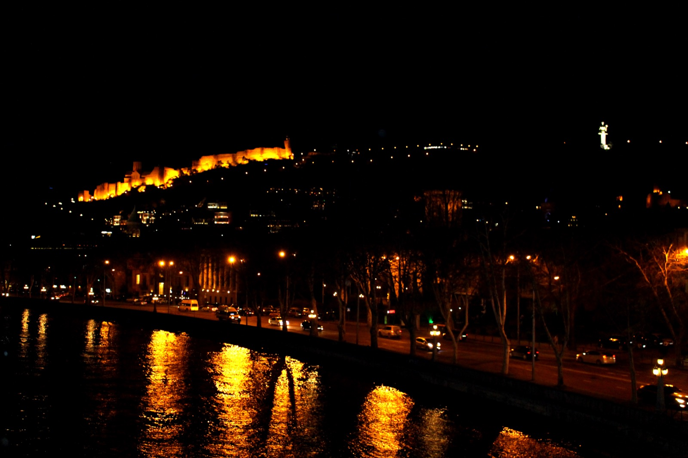
*第比利斯老城与 Narikala 要塞*

## 交通
- **航班**：建议选择 **中国南方航空**（乌鲁木齐转机）或 **卡塔尔航空/阿斯塔纳航空**（多哈/阿拉木图转机），通常在当地时间 **下午 14:00-18:00 抵达第比利斯国际机场（TBS）** 最佳。
- **机场 → 市区**：推荐乘坐 **Bolt 网约车** 或机场 taxi，车程约 25～35 分钟，费用约 40～60 GEL（约 110～160 元人民币）。地铁也可达但拖着行李不便。

## 住宿
**推荐：Stamba Hotel 或 Fabrika Hostel & Suites**
- **Stamba Hotel**：位于 Vera 区，由苏联时代印刷厂改造的设计酒店，中庭有 6 层楼高的热带植物园。价格约 800～1200 GEL/晚（约 2200～3300 元）。
- **Fabrika**：位于老城边缘，工业风设计青旅的升级版套房，露台酒吧是第比利斯文青聚集地。价格约 200～350 GEL/晚（约 550～950 元）。
- **备选**：老城内的精品民宿（Airbnb），带阳台可看老城屋顶，约 150～250 GEL/晚。

## 活动
- **傍晚**：步行前往 **Meidan 广场**，这里是老城的地理中心。沿着石板路走入迷宫般的巷道，两边是木质阳台凸出的传统高加索民居，阳台上爬满藤蔓，楼下是手工艺品店和葡萄酒吧。
- **日落前**：乘坐缆车（2.5 GEL/人，约 7 元）或徒步 20 分钟登上 **Narikala 要塞**。这座 4 世纪的要塞俯瞰着整个第比利斯老城、库拉河（Mtkvari）以及远处的现代建筑。
- **晚餐**：推荐 **Shavi Lomi（黑狐餐厅）**，藏在老城巷子里，是传统格鲁吉亚菜的现代演绎。必点 **Khinkali（灌汤大饺）**、**Khachapuri（奶酪面包船）**、**Badrijani（核桃酱茄子卷）**。人均约 80～120 元。
- **小贴士**：第一晚不要安排太满，吃完晚饭后在灯火通明的老城里散步，石板路、教堂钟声、街头小提琴手会让你们立刻爱上这座城市。

---

# D2｜第比利斯（Tbilisi）
**主题：硫磺浴、桥梁艺术与苏联遗风**

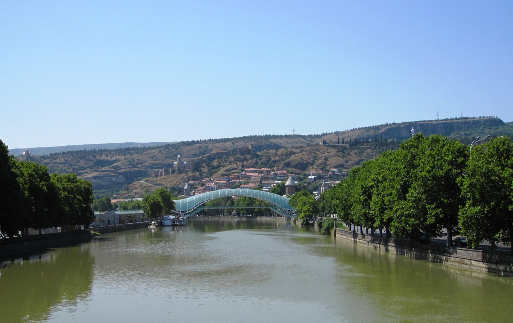
*和平桥（Bridge of Peace）连接老城与 Rike 公园*

## 活动

### 上午：硫磺浴（Abanotubani）
第比利斯的名字在格鲁吉亚语中就是"温暖的城市"，因为地下有丰富的硫磺温泉。

- **推荐浴池**：**Chreli Abano（No.5 浴池）**，建于 17 世纪，蓝绿色马赛克瓷砖穹顶是第比利斯的地标之一。内部有私人包间（带按摩池和桑拿）。
- **价格**：私人包间 1 小时约 80～150 GEL（约 220～410 元），加搓澡/按摩另付 50～80 GEL。
- **体验**：在镶嵌蓝绿色瓷砖的穹顶下泡进 38～42℃ 的硫磺泉中，空气中弥漫着淡淡的硫磺味——这是当地延续了数百年的社交和疗愈传统。作为新婚夫妇，预订一个双人包间，是婚假最放松的打开方式。

### 下午：和平桥 → 干桥跳蚤市场（Dry Bridge Market）

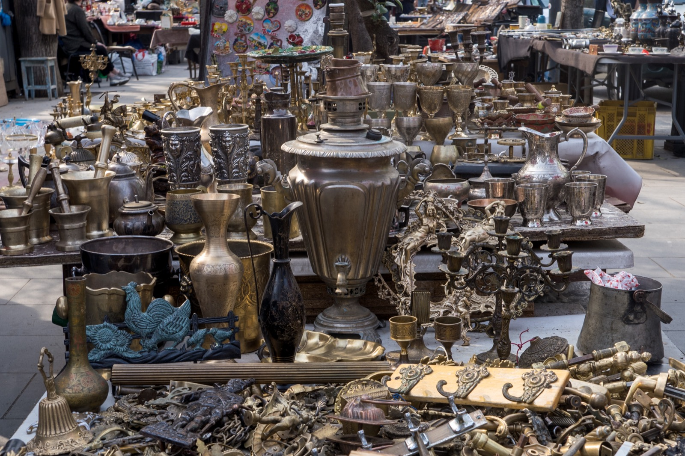
*干桥跳蚤市场上的苏联徽章和老相机*

- **和平桥**：这座 2010 年由意大利建筑师 Michele De Lucchi 设计的步行桥，用玻璃和钢铁构成了一条跨越库拉河的"DNA 双螺旋"。从桥上可以拍到 Narikala 要塞与现代建筑的对比。
- **干桥跳蚤市场**：步行约 15 分钟可达。这里是外高加索最大的露天旧货市场，出售苏联时期的勋章、老式望远镜、波斯地毯、高加索古董匕首、苏联复古相机等。
- **淘货建议**：东西真假参半，但氛围极好。买几枚苏联徽章（5～20 GEL）或一条手工羊毛围巾作为纪念即可。大胆砍价，通常报价的 60%～70% 是合理成交价。

### 晚餐
推荐 **Funicular Restaurant Complex**（缆车山顶餐厅）或老城内的 **Iasamani。
- **山顶餐厅**：乘坐第比利斯 oldest funicular（始建于 1905 年）上 Mtatsminda 山，在山顶俯瞰全城夜景。餐厅本身中规中矩，但景色值回票价。
- **Iasamani**：当地人推荐的传统餐厅，烤肉（Mtsvadi）和烤鸡非常出色，人均约 60～90 元。

### 晚间
如果精力尚存，可以去 **Vino Underground** 或 **8000 Vintages** 喝一杯。这两个都是葡萄酒吧，可以按杯点酒，侍酒师会耐心讲解 Qvevri 陶罐酿酒法的历史。

---

# D3｜第比利斯 → 西格纳吉（Sighnaghi）
**主题：红酒小镇与城墙日落**

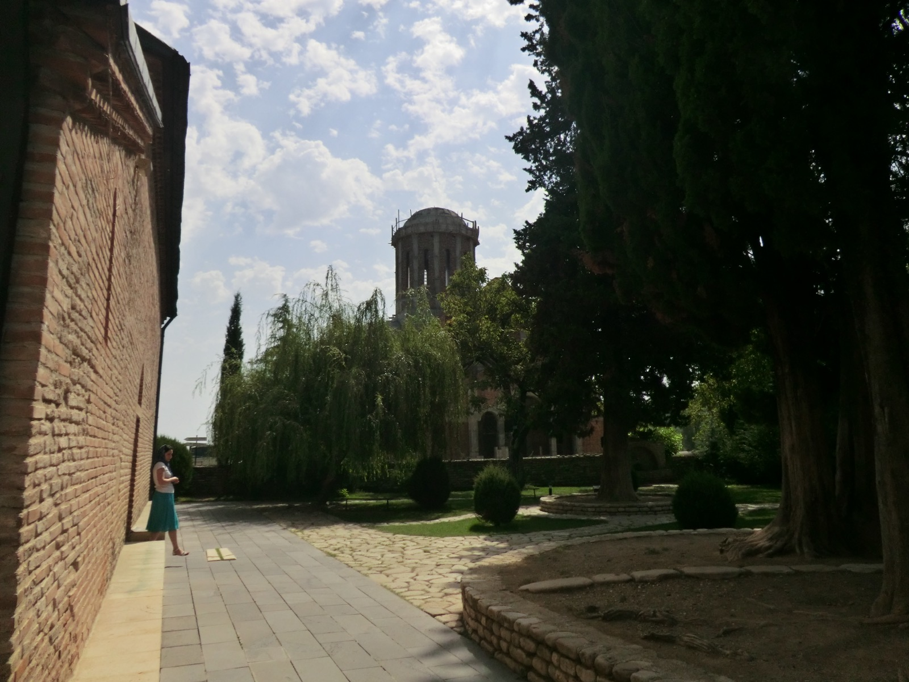
*西格纳吉蜿蜒的城墙与阿拉扎尼山谷*

## 交通
- **方式**：**自驾取车**。
- **取车点**：第比利斯市区或机场（推荐提前在 Localrent 或国际平台预订）。车型建议 **SUV/跨界车**（如丰田 RAV4、日产 X-Trail），因为后续山路和碎石路较多。
- **路线**：沿 E60/SH42 公路向东，车程约 1.5～2 小时。
- **距离**：约 110 公里。
- **驾驶提示**：格鲁吉亚是**靠右行驶**，租车通常为左舵车，与中国不同。建议取车后的前 30 分钟先在市区低速适应；当地司机开车较猛、超车频繁，保持 defensive driving。

## 住宿
**推荐：Hotel BelleVue 或老城内的精品民宿**
- **BelleVue**：位于城墙边，露台正对阿拉扎尼山谷（Alazani Valley）和高加索山脉，是西格纳吉景观最好的酒店之一。约 250～450 GEL/晚。
- **民宿**：很多当地人家把老宅改成了带露台的 guesthouse，老板通常会免费拿出一瓶自家酿的 Saperavi 红酒招待客人。约 100～200 GEL/晚。

## 活动

### 下午：城墙漫步
西格纳吉被称为"高加索的托斯卡纳"，也是格鲁吉亚最浪漫的城镇之一。

- **城墙**：18 世纪修建的防御城墙至今保存完好，总长约 4 公里，有 20 多座塔楼。可以沿着城墙顶部行走，俯瞰红色屋顶的小镇、绿色的葡萄园山谷和远处云雾缭绕的高加索山。
- **小镇街巷**：石板路、木质阳台、爬满紫藤的拱门，非常适合牵手漫步和拍照。

### Bodbe 圣妮诺女修道院
- **位置**：小镇东南约 2 公里，开车 5 分钟或步行 25 分钟。
- **看点**：这是格鲁吉亚最重要的基督教圣地之一，传说 4 世纪时将基督教传入格鲁吉亚的圣妮诺修女安葬于此。修道院被精心修剪的柏树和玫瑰花丛环绕，露台可以俯瞰整个阿拉扎尼山谷。
- **拍照**：修道院外的观景台是拍摄山谷全景的经典机位。

### 傍晚：品酒体验
西格纳吉所在的卡赫季（Kakheti）地区是格鲁吉亚最核心的葡萄酒产区。

- **推荐酒庄**：**Pheasant's Tears（雉鸡之泪）** 或 **Okro's Wines**，两者都以自然酒和 Qvevri 陶罐酿造闻名。
- **体验**：通常 20～40 GEL/人（约 55～110 元）可以品鉴 3～5 款酒，包括用陶罐埋在地底发酵半年的琥珀酒（Amber Wine）和浓郁饱满的红葡萄品种 Saperavi。
- **小贴士**：品酒时不要空腹，酒庄通常会配奶酪、面包和核桃酱。

### 晚餐
推荐 **Okro's Restaurant** 或城墙边的 **Cafe Medea**。菜品以当地农家菜为主，烤猪肉、炖豆子（Lobio）、奶酪饼都是招牌。人均约 60～100 元。

---

# D4｜西格纳吉 → 卡兹别克山（Kazbegi）
**主题：军事大道——世界上最美的公路之一**

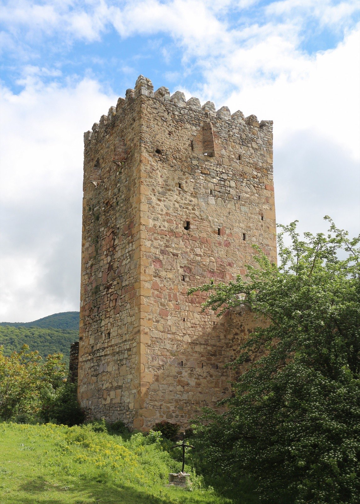
*Ananuri 要塞俯瞰 Jinvali 水库*

## 自驾路线
这一天是**全程自驾景观最震撼的一天**。你们将沿着著名的 **乔治亚军事大道（Georgian Military Highway）** 从东向西穿越大高加索山脉。

- **路线**：西格纳吉 → 第比利斯（经绕城高速绕过）→ **Ananuri 要塞** → **俄格友谊纪念碑（Russia-Georgia Friendship Monument）** → **古道里（Gudauri）** → **斯特潘茨明达（Stepantsminda，即卡兹别克山镇）**。
- **距离**：约 160 公里（西格纳吉到第比利斯 110 km，第比利斯到卡兹别克山约 150 km，合计约 260 km，但扣除绕城重复段，实际驾驶净里程约 160 km）。
- **开车时间**：约 4.5～5.5 小时（含多次停车拍照休息）。

> **路况提示**：军事大道是格鲁吉亚最重要的国道（E117），全程铺装路面，但弯道极多，尤其是 Zhinvali 到 Gudauri 段。夏季偶有落石，注意路标提示。大货车和游客大巴较多，超车需谨慎。

## 途中亮点

### Ananuri 要塞
- **位置**：距第比利斯约 70 公里，Jinvali 水库北岸。
- **看点**：这是格鲁吉亚上镜率最高的中世纪要塞之一，两座教堂和一座钟楼矗立在水库半岛上。教堂外墙上刻有精美的十字架浮雕和格鲁吉亚文字。
- **拍照**：水库大坝是拍摄要塞倒影的经典机位。建议停留 30～45 分钟。

### 俄格友谊纪念碑
- **位置**：位于军事大道海拔最高点附近（约 2384 米），古道里以北。
- **看点**：这座巨大的环形瓷砖壁画建于 1983 年，纪念俄格两国 200 年的"友谊"。虽然两国关系如今复杂，但纪念碑本身的苏联时期艺术风格和俯瞰山谷的位置使其成为必停景点。
- **体验**：站在纪念碑内侧的观景台上，可以俯瞰 **Devil's Valley（魔鬼峡谷）**，巨大的 V 型山谷两侧是连绵的雪山。

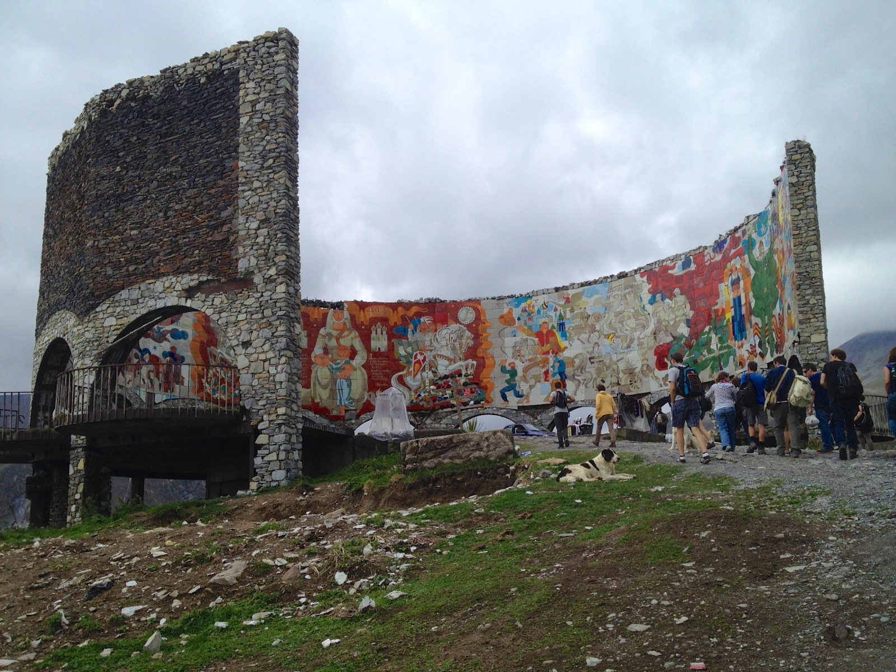
*俄格友谊纪念碑俯瞰高加索山谷*

## 住宿
**推荐：Rooms Hotel Kazbegi**
- 这是卡兹别克山乃至格鲁吉亚最著名的设计酒店，由苏联时代的游客中心改造而成。几乎每一间房都正对卡兹别克山（Mt. Kazbek，海拔 5047 米）。
- **价格**：约 400～700 GEL/晚（约 1100～1900 元）。旺季（6～9 月）需提前 2～3 个月预订。
- **备选**：**Stancia Kazbegi** 或镇上的民宿，约 150～300 GEL/晚，部分房间也有山景。

## 晚餐
- **Rooms Hotel 餐厅**：菜品质量在线，景观一流，但价格相对较高（人均约 120～180 元）。
- **当地选择**：镇上有不少家庭餐厅，推荐尝试 **Khinkali 和 Shashlik（高加索烤肉串）**，人均约 50～80 元。

## 晚间
如果天气晴朗，晚上走出酒店抬头就能看到漫天繁星——这里海拔约 1700 米，光污染极低。卡兹别克山的金字塔形山峰会一直在视野里，在月光下泛着冷冷的蓝光。

---

# D5｜卡兹别克山（Kazbegi）
**主题：离天堂最近的教堂**

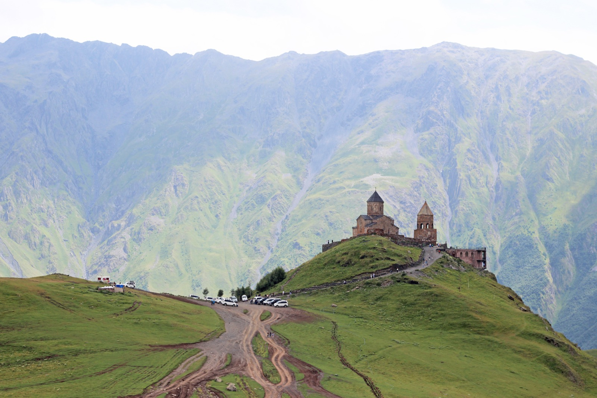
*Gergeti Trinity Church 与背后的卡兹别克主峰*

这一天是整个行程的**情感高潮**。没有长途驾驶，只有一座被雪山环抱的教堂和一段令人难忘的徒步。

## 上午：Gergeti Trinity Church（圣三一教堂）

这座 14 世纪的教堂孤独地坐落在海拔 2170 米的山脊上，背后就是海拔 5047 米的卡兹别克山。它被当地人称为"离天堂最近的教堂"，也是格鲁吉亚最具标志性的画面。

### 交通
- **越野车**：从镇上包一辆四驱越野车（当地称为"吉普"），约 80～120 GEL/车（往返，可乘 4 人），车程 30～40 分钟。山路崎岖陡峭，普通轿车无法通行。
- **徒步**：如果你们体力充沛，可以从镇上徒步上山，单程约 8～9 公里，爬升约 500 米，耗时 2.5～3.5 小时。下山可以徒步或包车。

### 体验
- 当越野车在最后一个弯道转过，教堂的灰色石墙突然出现在眼前，而背后的卡兹别克山如同一座巨大的金字塔直指天空——这个瞬间，你们会理解为什么这里被称为"高加索的神圣之心"。
- 教堂内部小而朴素，但外部的位置和景观无与伦比。 circumambulate（绕行）教堂一周，每一个角度都是不同的雪山构图。
- **拍照**：清晨 8:00-10:00 光线最佳，云雾较少。夏季上午游客较多，建议尽量早出发。

## 下午：雪山徒步或休闲

### 选项 A：Gergeti Glacier 徒步（高难度）
- 从教堂继续向山上走，可以抵达 Gergeti 冰川脚下。单程约 6～7 公里，爬升约 800 米，往返需 5～6 小时。路况为碎石坡和高山草甸，需要一定体力。
- 景观：沿途可以近距离观赏卡兹别克山的冰川舌、高山湖泊和成群的野花。

### 选项 B：Arsha 瀑布轻徒步（轻松）
- 从镇上向东北方向驾车约 10 分钟，有通往 Arsha 瀑布的步道。往返约 4 公里，路况平缓，沿途是小溪和森林。
- 适合不想太累的婚假节奏。

### 选项 C：在酒店发呆
- 如果你们订到了 Rooms Hotel，下午最浪漫的选择就是坐在露台上，点一杯咖啡或红酒，看着云在卡兹别克山顶流动。这种"住进风景里"的松弛感，本身就是婚假的意义。

## 晚餐
推荐在酒店或镇上的一家家庭餐厅吃一顿 **格鲁吉亚传统大餐**。作为行程的高潮日，可以开一瓶好一点的 Saperavi 红酒，慢慢吃 Khachapuri、烤茄子和烤肉。

---

# D6｜卡兹别克山 → 库塔伊西（Kutaisi）
**主题：从雪山到世界遗产教堂**

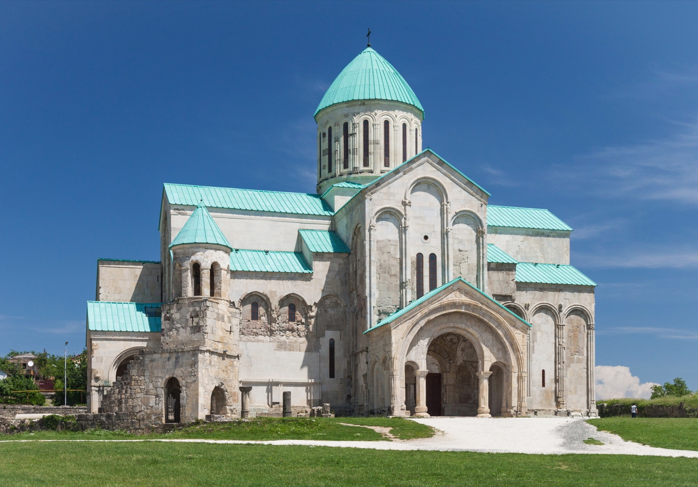
*库塔伊西的巴格拉特大教堂俯瞰里奥尼河*

## 自驾路线
- **路线**：斯特潘茨明达 → 古道里 → **俄格友谊纪念碑**（如昨天没停够可补停）→ 沿军事大道返回第比利斯方向 → 在 **Mtskheta（姆茨赫塔）** 附近转入 **S1 高速公路** 向西 → **库塔伊西（Kutaisi）**。
- **距离**：约 190 公里。
- **开车时间**：约 4～4.5 小时。
- **建议**：早上 09:00 前出发，中午前后可以抵达库塔伊西。

## 活动

### 下午：巴格拉特大教堂（Bagrati Cathedral）
- **位置**：库塔伊西市中心的 Ukimerioni 山上。
- **看点**：建于 11 世纪，是格鲁吉亚中世纪建筑的巅峰之作，也是联合国教科文组织世界遗产。巨大的中央穹顶和十字形布局代表了格鲁吉亚"黄金时代"的宗教艺术。
- **拍照**：站在教堂平台上可以俯瞰整个库塔伊西城和里奥尼河（Rioni River）。傍晚的暖光会让教堂的石墙呈现出金黄色。

### 格拉特修道院（Gelati Monastery）
- **位置**：市区东北约 10 公里，开车 15 分钟。
- **看点**：由 12 世纪的大卫四世"建国者"创立，不仅是修道院，还是当时格鲁吉亚最高学府。教堂内部保存着大量精美的拜占庭风格壁画和马赛克，包括大卫四世本人的肖像。
- **体验**：修道院坐落在一个绿意盎然的山谷中，氛围极其宁静。如果时间允许，在这里静坐 15 分钟，感受千年历史的沉淀。

### 科尔基斯喷泉（Colchis Fountain）
- **位置**：库塔伊西市中心的中央广场。
- **看点**：这组现代喷泉雕塑以古希腊神话中科尔基斯王国的金羊毛传说为主题，高大的金色马匹和抽象人物形象非常有视觉冲击力。周围是咖啡馆和步行街，适合傍晚散步。

## 住宿
**推荐：Best Western Kutaisi 或老城精品民宿**
- **Best Western**：国际连锁，干净舒适，约 150～250 GEL/晚。
- **民宿**：库塔伊西老城有很多带院子的家庭旅馆，主人通常热情好客，约 80～150 GEL/晚。

## 晚餐
推荐 **Palaty** 或 **Hot Coffee。库塔伊西的餐饮比第比利斯更便宜，人均 40～70 元就能吃得很丰盛。尝试一下 **Imeretian Khachapuri（圆形奶酪面包）**，这是库塔伊西所在地区的特色做法。

---

# D7｜库塔伊西 → 梅斯蒂亚（Mestia）
**主题：进入斯瓦涅季的碉楼王国**

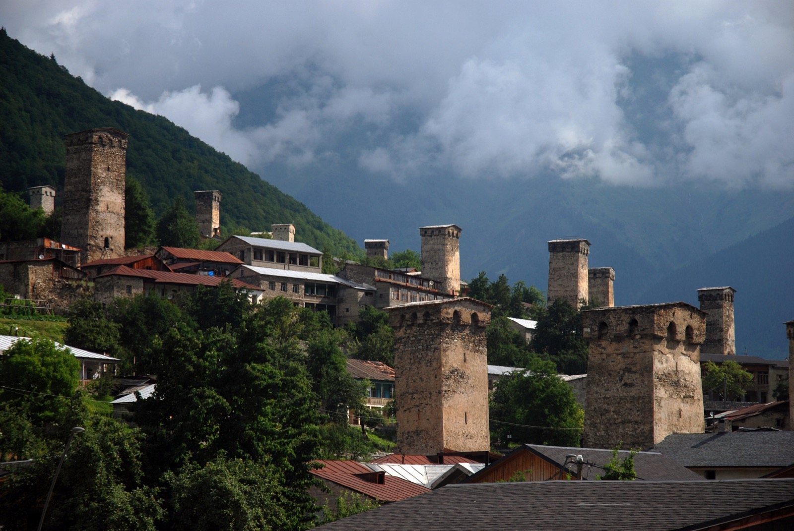
*梅斯蒂亚的斯瓦涅季传统碉楼与雪山背景*

## 自驾路线
这一天是**全程驾驶时间较长的一天**，但风景的转变会让你们觉得每一公里都值得。

- **路线**：库塔伊西 → **祖格迪迪（Zugdidi）** → 沿 **Enguri 河谷** 进入山区 → **梅斯蒂亚（Mestia）**。
- **距离**：约 240 公里。
- **开车时间**：约 5.5～6.5 小时。
- **路况提示**：从祖格迪迪到梅斯蒂亚约 140 公里，前半段是铺装山路，后半段沿 Enguri 河峡谷穿行，弯道多、隧道多，但整体路况良好。夏季偶有山体滑坡，注意路标。

> **驾驶建议**：出发前在祖格迪迪的超市补充食物和水。梅斯蒂亚是山区小镇，物资相对有限且价格略高。

## 活动

### 下午/傍晚：抵达梅斯蒂亚
梅斯蒂亚是**斯瓦涅季（Svaneti）**地区的门户小镇，也是联合国教科文组织世界遗产"上斯瓦涅季"的入口。这里的每一座村落都矗立着中世纪遗留下来的防御碉楼（Svan Towers）。

- **小镇漫步**：梅斯蒂亚主街不长，两旁是木屋、碉楼和民宿。傍晚在镇中心散步，可以看到村民们坐在碉楼下聊天，牛羊悠闲地走过石板路。
- ** ethnographic museum（民族博物馆）**：如果下午抵达较早，可以参观镇上的斯瓦涅季博物馆，了解这个与世隔绝地区的历史、宗教艺术和生活方式。

## 住宿
**推荐：Hotel Svaneti 或当地 guesthouse**
- **Hotel Svaneti**：镇上最老牌的山景酒店之一，部分房间正对碉楼和雪山。约 200～350 GEL/晚。
- **Guesthouse**：梅斯蒂亚很多家庭把自家改造成民宿，老板通常还会提供家常晚餐。约 100～200 GEL/晚。

## 晚餐
推荐在民宿或 **Laila 餐厅** 用餐。斯瓦涅季的特色菜包括 **Kubdari（斯瓦涅季肉馅饼）** 和 **Tashmijabi（奶酪土豆泥）**。这里的奶酪口味偏咸，但 Kubdari 里面的香料调味非常独特，值得一试。

---

# D8｜梅斯蒂亚 → 乌树故里（Ushguli）→ 梅斯蒂亚
**主题：欧洲最高的村落与雪山徒步**

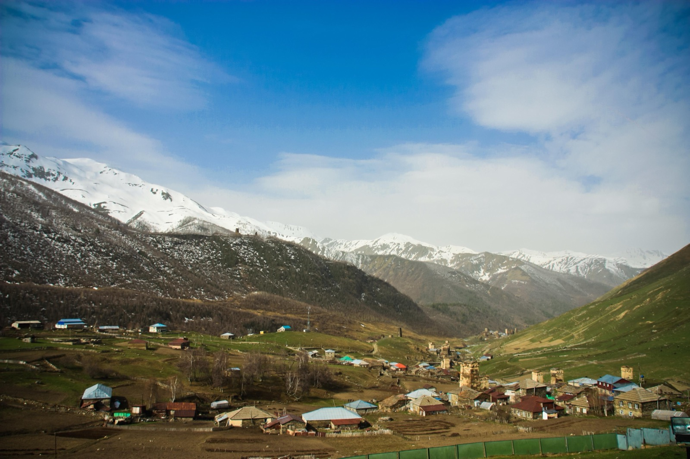
*乌树故里的碉楼村落与什哈拉雪山*

## 自驾路线
- **路线**：梅斯蒂亚 → 沿 **Enguri 河谷上游** 向东北 → **乌树故里（Ushguli）**。
- **距离**：单程约 40 公里，往返约 80 公里。
- **开车时间**：单程约 1.5～2 小时。
- **路况提示**：这段路是整个自驾行程中路况最差的一段，部分路段为碎石路和泥路，雨季可能有涉水路段。**强烈建议租 SUV**。如自驾信心不足，也可以在梅斯蒂亚包车往返（约 150～250 GEL/车）。

## 上午：抵达乌树故里
乌树故里是**欧洲海拔最高之一（约 2100 米）的永久居住村落**，由四个小村庄组成，保存着 200 多座中世纪碉楼。2000 多年来，这里的居民一直过着半游牧生活，直到近几十年才通了公路。

- **村落漫步**：把车停在村庄入口，步行穿过 Lamaria 教堂所在的中心区域。灰色的石碉楼、石板屋顶的农舍、远处海拔 5193 米的 **什哈拉山（Mt. Shkhara）** 构成了一幅仿佛来自中世纪的画面。
- **Lamaria 教堂**：位于村庄最高处的一座 12 世纪教堂，从这里可以俯瞰整个乌树故里河谷和远处的雪山冰川。

## 下午：轻徒步

### 选项 A：通往什哈拉冰川的徒步（中等难度）
- 从乌树故里出发，沿着河谷向什哈拉山方向徒步。单程约 8 公里，往返约 3.5～4.5 小时。
- 沿途经过高山草甸、冰川融水溪流和成群的牛马。终点可以近距离看到什哈拉山的冰川舌。

### 选项 B：村庄周边短徒步（轻松）
- 如果时间和体力有限，可以在村庄周边走 1～2 小时。每一处高坡都是拍摄碉楼与雪山全景的绝佳机位。

> **小贴士**：乌树故里海拔较高，夏季气温约 15～20℃，但风大，建议带防风外套。紫外线强烈，注意防晒。

## 晚餐
返回梅斯蒂亚后，在民宿或餐厅享用一顿丰盛的晚餐。作为倒数第二个夜晚，可以开一瓶从西格纳吉带过来的红酒，在雪山和碉楼的环绕下好好回味这趟旅程。

---

# D9｜梅斯蒂亚 → 第比利斯 → 国内
**主题：告别高加索**

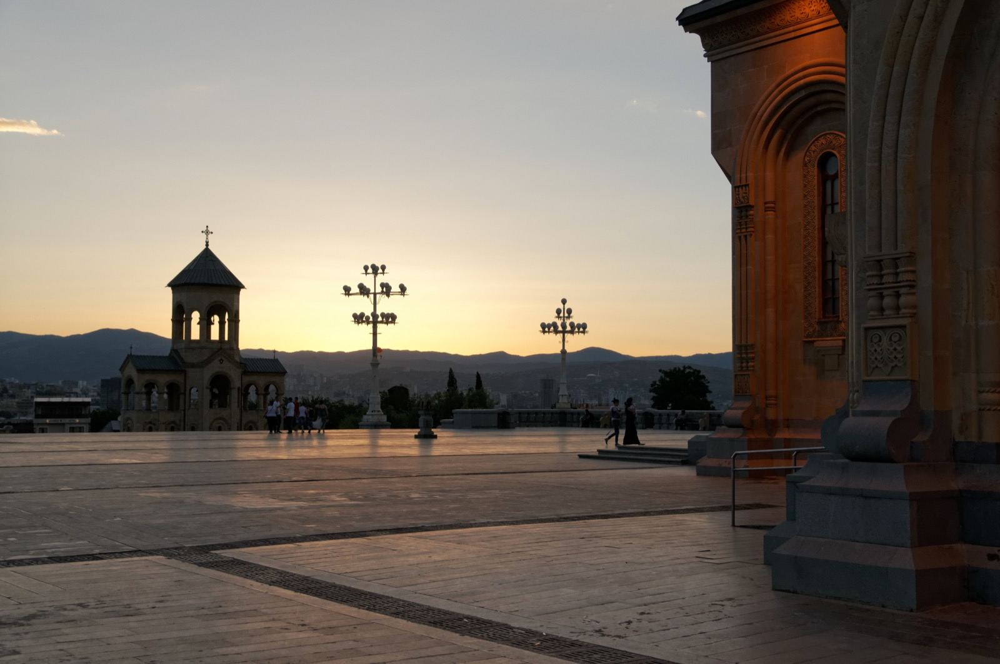
*第比利斯圣三一主教座堂（Sameba）——高加索最大的东正教堂*

## 交通
### 方案 A：自驾返回第比利斯（推荐时间充裕者）
- **路线**：梅斯蒂亚 → 祖格迪迪 → 库塔伊西 → 第比利斯。
- **距离**：约 400 公里。
- **开车时间**：约 7～8.5 小时。
- **建议**：早上 06:30-07:00 出发，下午 15:00-16:00 抵达第比利斯。还车前可以去 **圣三一主教座堂（Sameba Cathedral）** 参观 1 小时，这是高加索地区最大的东正教教堂之一，金色穹顶非常震撼。

### 方案 B：梅斯蒂亚飞第比利斯（推荐节省体力者）
- **航班**：**Vanilla Sky** 常规运营的是梅斯蒂亚（Mestia, USS）↔ **纳塔赫塔里机场（Natakhtari）** 的小型螺旋桨飞机，**不是飞第比利斯国际机场 TBS**。
- **航程**：飞行约 50 分钟；落地纳塔赫塔里后还需约 40～60 分钟接驳进第比利斯市区。
- **注意**：航班班次少、受天气影响大，需提前预订。票价约 80～150 GEL/人。由于你们的车会留在梅斯蒂亚，这个方案**只有在租车公司支持梅斯蒂亚异地还车，或改为包车/公共交通时才成立**；否则按方案 A 自驾返程更稳妥。

### 返程航班
- 建议选择晚上 19:00-22:00 起飞的航班，这样白天还有时间在第比利斯做最后的停留和采购纪念品。
- **机场还车**：提前与租车公司确认还车地点（通常是机场停车场）。

## 离别采购
- **红酒**：在机场免税店或第比利斯的 **Vinoteca** 买 1～2 瓶 Saperavi 或 Qvevri 琥珀酒带回家（注意托运行李限重和海关规定）。
- **纪念品**：Churchkhela（核桃糖肠）、手工羊毛袜、苏联复古徽章。

---

## 附录一：全程预算拆分（2 人总计）

| 项目 | 金额（人民币） | 说明 |
|:---|:---:|:---|
| **国际往返机票** | 8,000～16,000 | 经乌鲁木齐/多哈/阿拉木图转机经济舱，约 4,000～8,000 元/人 |
| **租车+油费+停车** | 3,500～6,000 | 约 7 天租车，SUV 车型约 300～500 元/天，油费约 800～1200 元 |
| **住宿（8 晚）** | 4,000～10,000 | 精品民宿/设计酒店 300～800 元/晚，普通 guesthouse 150～400 元/晚 |
| **餐饮** | 3,000～5,500 | 外食人均 60～120 元/顿，自己做/民宿含餐人均 30～60 元/顿 |
| **门票/体验** | 1,000～2,000 | 硫磺浴、酒庄品酒、Gergeti 越野车上山、修道院 donation |
| **签证/保险/杂费** | 400～800 | 中国护照旅游免签 30 天，主要为保险和少量杂费 |
| **总计** | **约 19,900～40,300 元** | **人均 1.0～2.02 万** |

> **省钱小贴士**：格鲁吉亚民宿性价比极高，很多 guesthouse 含早餐且老板热情好客。红酒在酒庄直接购买比国内便宜 3～5 倍，不妨带两瓶好年份的 Saperavi 回国。

---

## 附录二：行前准备清单

### 证件与签证
- [ ] **中国护照旅游免签**：自 2023 年 9 月 11 日起，中国公民可免签进入格鲁吉亚旅游，单次停留 30 天；如停留目的或时长不同，再单独核对签证要求。
- [ ] 护照（有效期 6 个月以上）。
- [ ] 驾照原件 + **国际驾照翻译认证件**（租租车 APP 可免费办理）。
- [ ] 旅行保险（建议保额 ≥ 30 万人民币）。

### 预订确认（按优先级）
1. [ ] **国际机票**
2. [ ] **租车**（SUV 车型，覆盖 D3-D9）
3. [ ] **Rooms Hotel Kazbegi**（旺季最难订，建议提前 2～3 个月）
4. [ ] **西格纳吉/梅斯蒂亚住宿**
5. [ ] **第比利斯住宿**
6. [ ] **梅斯蒂亚 ↔ 纳塔赫塔里 国内航班**（如选择飞机转场，需提前预订 Vanilla Sky，并先确认梅斯蒂亚异地还车方案）

### 衣物与装备
- [ ] **防风防水冲锋衣**：山区天气多变，卡兹别克和斯瓦涅季夏季也可能降雨。
- [ ] **薄羽绒服/抓绒内胆**：高海拔地区早晚温差大，夜间可能降至 5～10℃。
- [ ] **防滑徒步鞋/登山鞋**：Gergeti 教堂山路和乌树故里徒步都需要。
- [ ] **防晒用品**：高加索地区紫外线极强，海拔越高越明显。
- [ ] **转换插头**：格鲁吉亚使用**欧标双圆孔插头**（C/F 型），电压 220V。
- [ ] **常用药品**：肠胃药（适应新饮食）、创可贴、驱蚊液。
- [ ] **现金**：格鲁吉亚当地货币为拉里（GEL），建议携带少量美元现金备用，大部分地方可用信用卡，但偏远村庄和小店可能只收现金。

### APP 下载
- **Bolt**：当地最主流的网约车 APP，比 taxi 便宜且透明。
- **Maps.me / Google Maps**：离线地图必备，山区信号不稳定。
- **Google Translate**：格鲁吉亚语很难，翻译 APP 是刚需。
- **Booking.com / Airbnb**：住宿管理。
- **TripAdvisor**：餐厅推荐和评分相对靠谱。

---

## 附录三：关键决策说明（FAQ）

### Q1：为什么不走西格纳吉 ↔ 卡兹别克的直达山路？
西格纳吉与卡兹别克山之间有一条更近的越野山路（约 80 公里），但路况极差，多为未铺装的碎石路和泥路，普通 SUV 也难以通行，且沿途无补给和信号。为了安全和舒适，我们选择返回第比利斯方向再沿军事大道北上，虽然多绕了约 100 公里，但全程铺装路面，景观也更丰富（可经过姆茨赫塔古城）。

### Q2：为什么不把梅斯蒂亚/乌树故里合并成一天？
从梅斯蒂亚到乌树故里的单程约 40 公里，但路况差，单程需 1.5～2 小时；乌树故里本身值得至少 3～4 小时的村落漫步和徒步。如果当天往返第比利斯，整个行程将超过 12 小时，极度疲惫。我们用 D7 转场到梅斯蒂亚、D8 深度游玩乌树故里，是**节奏最合理**的方案。

### Q3：卡兹别克山的 Gergeti 教堂一定要包越野车上山吗？
**不一定**，但强烈推荐。上山路段为未铺装碎石路，坡度大、弯道急，普通轿车无法通行。徒步上山单程约 8～9 公里，爬升 500 米，对体力有一定要求。婚假期间建议以舒适为主，包一辆四驱越野车（约 80～120 GEL/车往返）是最省力的方式。如果想体验徒步，可以选择徒步上山、包车下山。

### Q4：军事大道自驾安全吗？
**整体安全**，但需要谨慎驾驶。军事大道是格鲁吉亚的国道主干线，全程铺装，但弯道多、大货车多、部分路段临崖。只要保持 defensive driving、不盲目超车、避开夜间和暴雨天气，普通驾驶者完全可以应付。建议租 SUV，底盘高、视野好。

### Q5：格鲁吉亚的 Qvevri 陶罐酒是什么？值得买吗？
Qvevri 是人类最古老的酿酒方式之一：将葡萄连皮带籽放入大型陶罐中，埋入地下发酵和陈酿。这种方法酿造出的"琥珀酒"（Amber Wine）呈深金色或琥珀色，带有单宁感和独特的干果、蜂蜜香气。这是联合国教科文组织认定的非物质文化遗产，在格鲁吉亚购买价格约为国内的 1/3～1/4，**非常值得购买**。

---

## 附录四：一句话总结

这 9 天，你们会在第比利斯的老城巷道中迷失方向，在西格纳吉的城墙上看阿拉扎尼山谷的日落，在卡兹别克山的圣三一教堂前仰望 5000 米雪山的金字塔尖，在欧洲最高的碉楼村落里听到冰川融水的溪流声，最后在红酒的微醺中回到彼此身边。

**这是高加索送给新婚夫妇的礼物——一半北欧的雪山，三分之一的东南亚物价，和一整份独属于你们的异域浪漫。**

---

*文档生成时间：2026 年 4 月*  
*祝你们旅途愉快，新婚快乐！*
