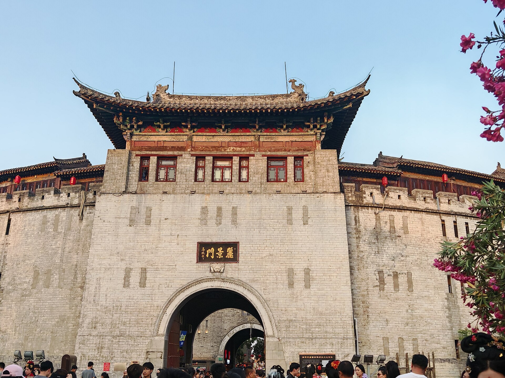
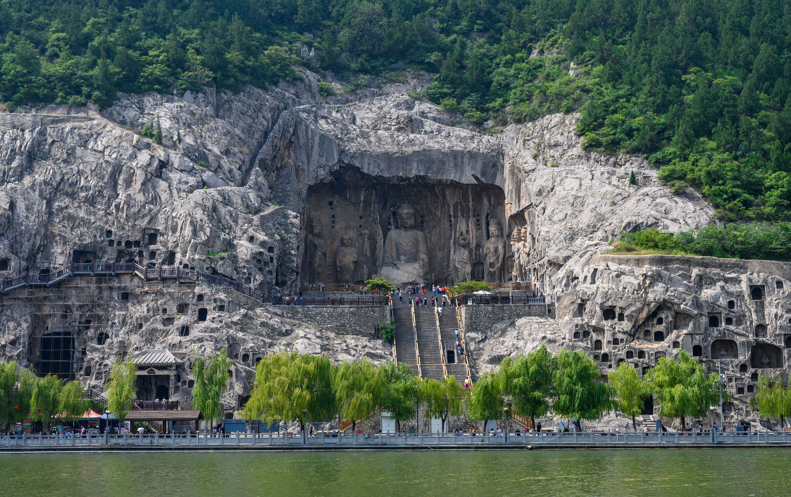
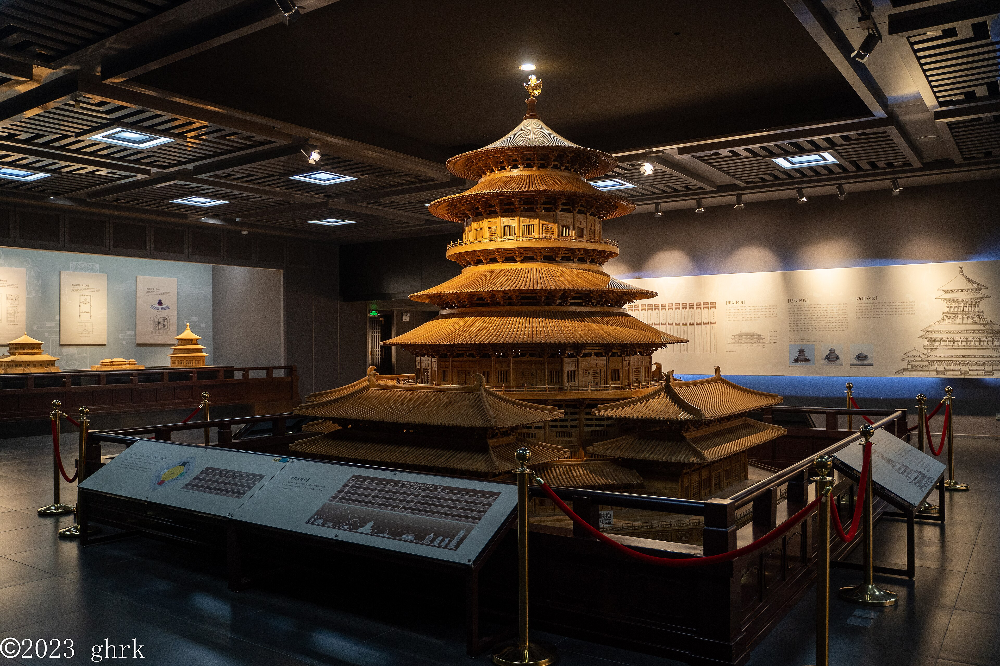
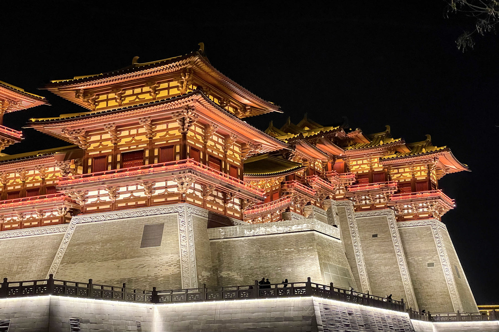
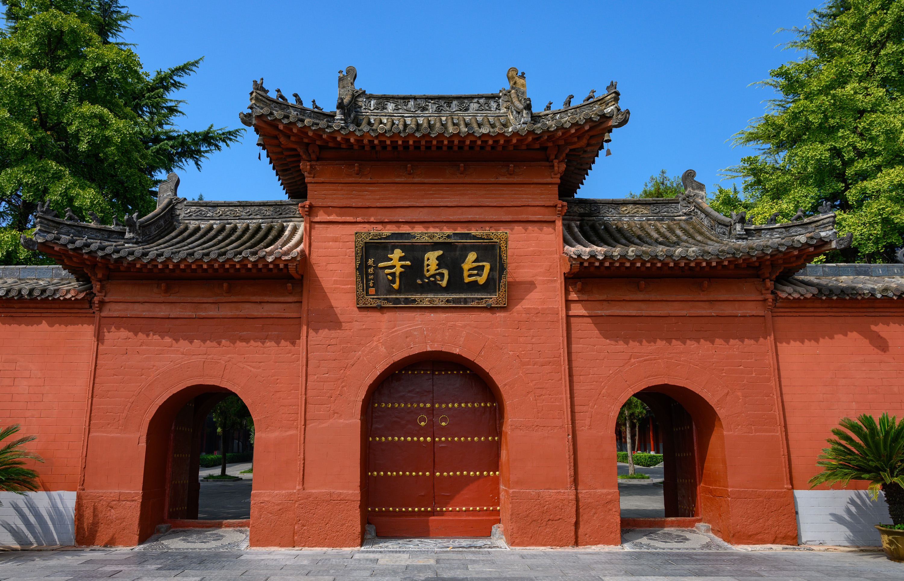
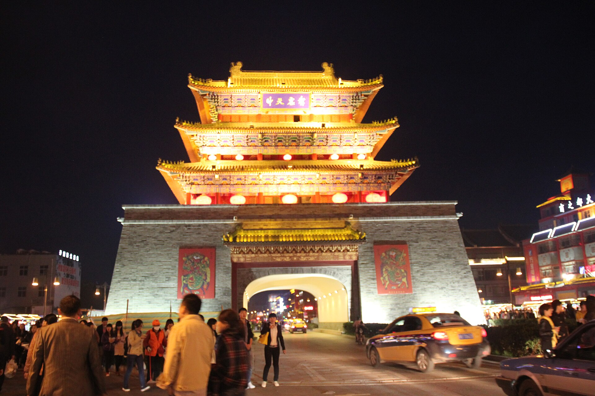
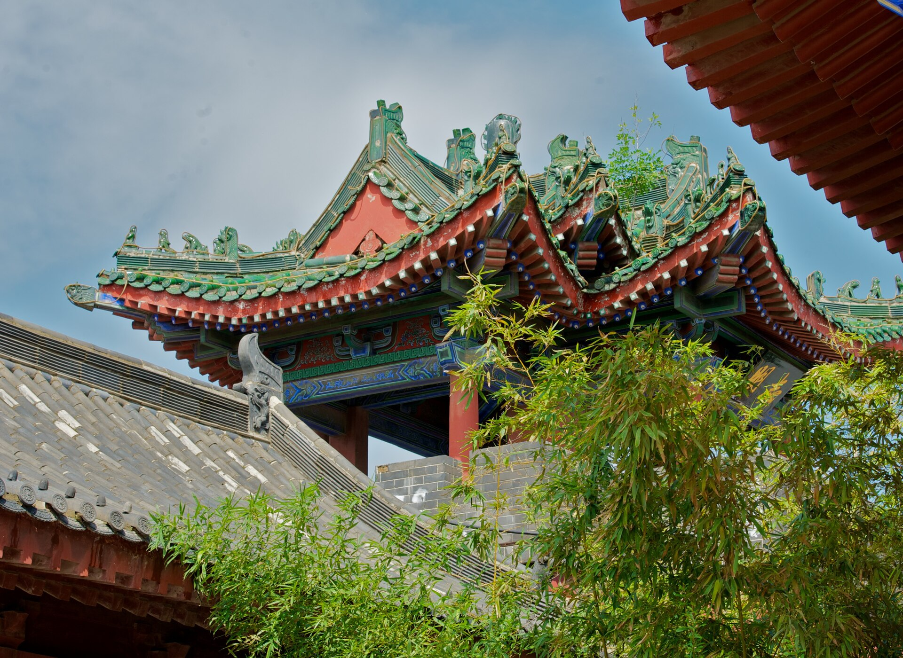
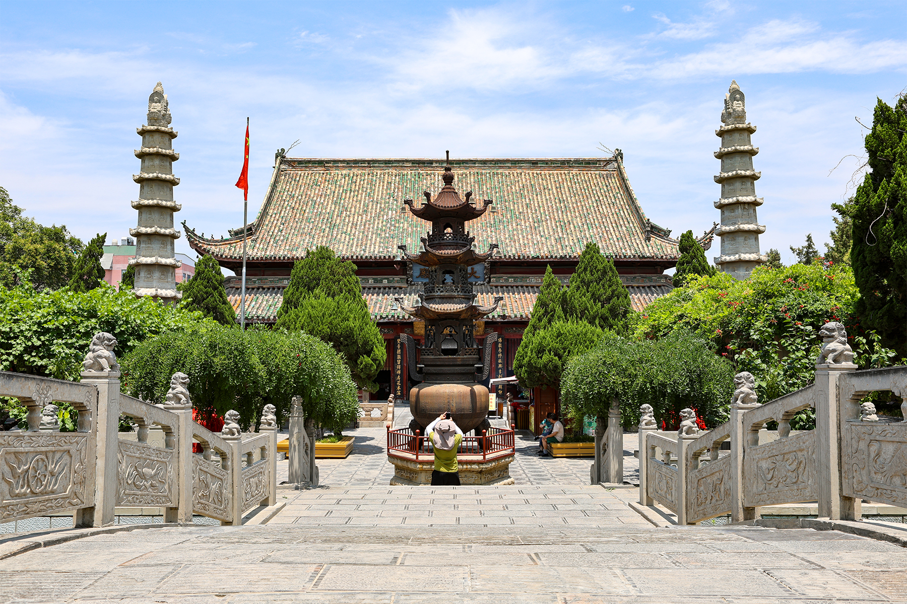
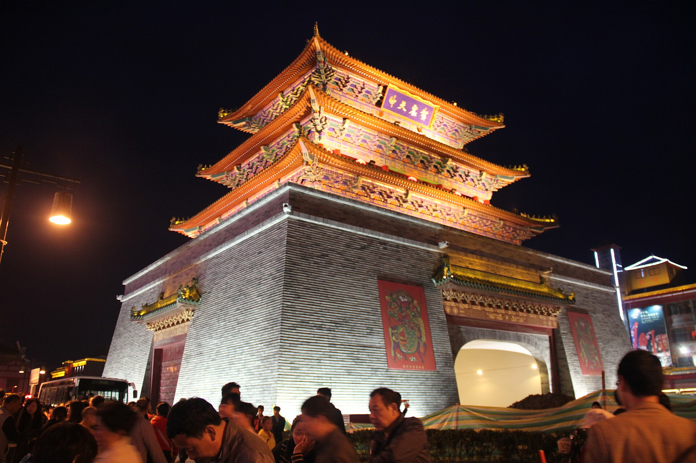

# 河南｜洛阳·开封慢游古迹｜4 天 2 城执行手册

> **旅行时间**：5 月中下旬（牡丹季后窗口，气温 18～28℃，客流锐减）
> **旅行人数**：2 人
> **总天数**：4 天 3 晚
> **核心目的地**：洛阳老城 → 龙门石窟 → 隋唐洛阳城 → 白马寺 → 开封鼓楼 → 开封府 → 大相国寺
> **人均预算**：2500～4000 元人民币（2 人总计约 5000～8000 元，含高铁）

---

## 为什么选洛阳+开封？

如果你们想要一段**"不出河南、就把中国古代史读半本"**的旅行，5 月中下旬的洛阳和开封几乎是无可替代的搭配。

很多人提到中国古都会先想到西安——西安确实更壮观、知名度更高，但 5 月的西安景区人流密度堪比节假日，兵马俑排队 2 小时是常态。**洛阳是另一种气质**：十三朝古都的厚度不输西安，但游客密度只有西安的三分之一，老城十字街傍晚依然能找到一张安静的水席小桌；龙门石窟伊水两岸的卢舍那大佛、宾阳三洞、奉先寺，把北魏到盛唐的造像艺术一口气铺开，比敦煌更易抵达、比云冈更接近"古都"本身。**开封则补上宋朝的那一段**——一个把"清明上河图里的市井"做成日常的城市，鼓楼夜市的羊肉炕馍、大相国寺的木雕千手观音、开封府的清心楼，构成了中国仅存的、还能"逛"的北宋遗韵。

与**北京/西安**相比，洛阳+开封的优势在于**慢**：城市不大、景点集中、地铁通到主要遗址门口；与**苏州/杭州**相比，这里的古迹是真"古"——不是江南园林那种明清重建，而是北魏石窟、唐代宫城、北宋寺塔的层层叠加。气候上，5 月中下旬牡丹文化节刚结束（4/1-5/5），酒店价格回落到平日的 40%，景区从摩肩接踵变成可以慢慢品味，甚至能在龙门石窟的奉先寺台阶上坐 20 分钟而不被人流推着走——这是去过西安的人最羡慕的奢侈。

**这是一场"读着历史课本逛景区"的慢节奏古迹之旅。** 不追求一天 5 个景点，每天只深入 1 个核心 + 1 个补充，让石头、木头、瓦当本身慢慢说话。

---

## 行程总览

| 天数 | 星期 | 路线 | 住宿地 | 核心体验 | 交通距离 |
|:---:|:---:|:---|:---|:---|:---:|
| D1 | 四 | 出发地 → 洛阳龙门站 → 老城 | 洛阳老城（应天门片区） | 洛邑古城、丽景门、十字街夜市、真不同水席 | — |
| D2 | 五 | 老城 → 龙门石窟 → 老城 → 隋唐城 | 洛阳老城（应天门片区） | 龙门石窟全程慢游、应天门+明堂天堂夜景 | 约 25 km |
| D3 | 六 | 老城 → 白马寺 → 洛阳龙门站 → 开封 | 开封鼓楼片区 | 中国第一古刹、高铁转场、鼓楼夜市 | 约 50 km + 高铁 1 段 |
| D4 | 日 | 开封府 → 大相国寺 → 书店街 → 返程 | — | 北宋官署、千手观音、明清老街、返程 | — |

> **设计逻辑**：D1 半天起步、不安排大景点，给两位倒时差/喘口气的余地；D2 把强度最高的龙门石窟放在精力最足的第二天上午，下午回酒店午休再去看应天门夜景，避免暴晒+疲劳；D3 用半天清完白马寺，下午高铁转场开封；D4 收束日只逛集中的鼓楼三角区(开封府-大相国寺-书店街步行 10 分钟可达)，傍晚从容回程。全程零自驾，主要靠地铁+共享电动车+步行，符合慢节奏诉求。

---

# D1｜出发地 → 洛阳老城
**主题：在十三朝古都的烟火气里落地**

*洛邑古城傍晚的灯笼与汉服游客*

## 交通
- **高铁**：建议选择**抵达洛阳龙门站**的车次，**下午 14:00-17:00 抵达**最佳。北京/上海/广州出发车程 4-6 小时，沿途穿越华北平原。
  - 北京西 → 洛阳龙门：高铁约 4 小时，二等座约 380 元
  - 上海虹桥 → 洛阳龙门：高铁约 6 小时，二等座约 660 元
- **龙门站 → 老城酒店**：地铁 2 号线（牡丹广场方向）2 站到关林市场换 1 号线（瀍河方向），4 站到**应天门**站 C2/A 口，全程约 35 分钟。或直接打车，约 25 分钟、35 元。
- **关键省钱**：凭已使用的高铁票，可享隋唐洛阳城景区（应天门+明堂天堂+九洲池）**门票半价优惠**，记得保留行程码或纸质票。

## 住宿
**推荐：洛阳一见客栈（应天门洛邑古城店）**
- 位置：洛阳老城区中州中路 72 号，应天门隔壁，明堂天堂景区步行 5 分钟。
- 价格：约 350～550 元/晚（5 月中下旬平日价）。
- 理由：三楼室外露台正对应天门，傍晚不用出门就能看夜景；店内提供汉服租赁（150-300 元/套），方便去丽景门和洛邑古城拍照；地铁应天门站步行 3 分钟，去龙门石窟和白马寺都顺。
- 备选：**雲鼎设计师酒店（洛邑古城应天门遗址店）**，价格略高（500～800 元/晚），设计感更强；预算紧时可选 **7 天连锁应天门店**（200 元上下），位置同样核心。

> **为什么不住龙门站附近？** 龙门站离市区 8 公里，傍晚没有夜生活，老城才是这趟旅行的"住宿应许之地"——出门就是应天门灯光、十字街夜市、洛邑古城，慢游属性的精髓就在"步行可达感"。

## 活动

### 傍晚：洛邑古城慢启动
从酒店步行 8 分钟到**洛邑古城**（免费入园，部分演艺和体验项目另收费）。这是一座 2017 年起在隋唐金市旧址上重建的"古风夜游场"——文楼、新潭、九龙鼎、文峰塔分散在水系之间，傍晚 18:30 后灯笼齐亮，倒影、汉服、洞箫，构成洛阳最"出片"的夜景。

- **看点**：沿主轴从入口走到**文峰塔**约 25 分钟，沿途汉服小姐姐密度堪比西塘；池塘边的非遗手工作坊（皮影、唐三彩、刺绣）可以慢慢看；夜场表演（《洛神赋》水秀）需在公众号提前预约，5 月平日基本随到随看。
- **小贴士**：景区免费但停车要钱（25 元/次），建议地铁/步行进入。傍晚是最佳时段，正午进去既晒又出不了片。

### 晚餐：真不同饭店（老城店）洛阳水席
步行 6 分钟到**真不同饭店（中州东路店）**——洛阳水席的头牌，1895 年创立的中华老字号，"水席制作技艺"是国家级非物质文化遗产。

- **必点**：
  - **牡丹燕菜**（武则天时期的宫廷创意菜，白萝卜丝做成燕窝口感，上面摆一朵蛋黄牡丹）
  - **焦炸丸子**（小肉丸炸到金黄，浇热汤瞬间"滋啦"作响）
  - **连汤肉片**（薄如纸的肉片在酸辣汤里翻滚）
  - **小酥肉**+**酸汤焦炸丸子**+**洛阳熬货**
- **价位**：一楼"风味部"散座是性价比之选，**2 人点 3-4 个水席单菜约 180-260 元**。二楼以上水席套餐起步 600 元/桌，2 人吃不完不必上去。
- **必知**：水席是 24 道菜全部带汤、按顺序上桌的成套体系，"水"指汤水，不是冷淡之意。慢游 2 人推荐点单菜组成"迷你水席"，不必硬撑全套。

### 夜间：老城十字街夜市
吃完水席步行 3 分钟即到**老城十字街**（西大街+东大街+兴华大街交汇）。这条夜市从晚 18:30 开摊到凌晨，200 多种小吃汇集，是补一杯**杏仁茶**或**不翻汤**的最佳收尾。

- **看什么**：街道两侧明清风格的灰瓦木楼，是真老房子翻新的，不是新建仿古；街角的**鼓楼**（钟鼓楼）是明洪武年间的真迹。
- **吃什么**：**刘记不翻汤**（义勇东街，120 年老字号）、**高记油茶**（花生果子油茶，醇厚甜香）、**匡家驴肉汤**——挑 1-2 家轻量补充即可，水席已经吃饱。
- **回酒店**：步行 8 分钟即到，11 点前回房间，明早不赶但充足睡眠是慢游的本钱。

## 今日预算（2 人）
- 高铁（北京出发参考）：760 元
- 酒店：400 元
- 洛邑古城：0（免费）
- 真不同水席：220 元
- 夜市补充：60 元
- **小计：约 1440 元**

---

# D2｜龙门石窟 + 隋唐洛阳城
**主题：从北魏佛影到武皇宫城，一日穿越 1400 年**

*奉先寺卢舍那大佛——盛唐造像艺术巅峰*

## 交通
- **上午往龙门石窟**：酒店步行 3 分钟到地铁应天门站，乘 1 号线（瀍河→关林市场）换 2 号线（关林市场→龙门大道），到龙门大道站打车 10 元/8 分钟即到龙门石窟北门售票处。**总耗时约 50 分钟、人均 15 元**。或直接打车（35 元、25 分钟），舒适但堵车时反而慢。
- **下午返回老城**：原路返回。
- **傍晚步行往隋唐城**：从酒店步行 5-8 分钟即可到应天门/明堂天堂景区入口，无需打车。

## 住宿
继续入住**洛阳一见客栈（应天门洛邑古城店）**——不换酒店。这是慢游的核心红利：行李不动、熟悉的房间、夜里酒店楼下就有早餐铺。

## 活动

### 上午：龙门石窟（深度慢游 4 小时）
**门票**：成人票 90 元/人（含西山石窟、东山石窟、香山寺、白园四区）。**凭昨天的高铁票本可享景区门票半价**——这是洛阳的隐藏福利，确认你们的高铁票当日已使用即可。

**慢游动线**（按"经典路线"逆时针走，避开旅行团从北门进的逆向客流）：

**大石门入口 → 龙门桥 → 禹王池 → 潜溪寺 → 宾阳三洞**（北魏精品，宾阳中洞的飞天和供养人浮雕是教科书级别）→ **万佛洞**（南北壁的 15000 尊小佛，是全窟群最震撼的视觉密度）→ **奉先寺**（**必爬必坐**，台阶在伊水西岸最高处，仰望 17.14 米高的卢舍那大佛是这趟旅行的精神高潮）→ **古阳洞** → **药方洞** → 跨**伊阙桥** → **东山石窟**（看经寺一带，规模小但人少安静）→ **香山寺**（白居易晚年所居，能俯瞰对岸的西山石窟全景）→ **白园**（白居易墓园，松柏寂静，是石窟游览的从容收尾）。

- **核心建议**：**在奉先寺至少坐 20 分钟**。这是 672 年武则天捐脂粉钱建的，传说卢舍那的面容是参照武则天本人雕的——丹凤眼、慈悲笑、垂目俯视众生，是中国造像艺术从"威严神性"转向"人性温度"的分水岭。早上 9-10 点光线从东南方斜射过来，是看奉先寺的黄金时段。
- **路线效率**：全程步行 5-6 公里，慢慢走加休息约 4 小时。园内有电瓶车（5 元/段），从东山下来到香山寺这段坡度大，建议买票坐回去。
- **必带**：防晒帽、矿泉水、舒适鞋（栈道有台阶）。5 月伊水两岸柳绿如染，是石窟最有诗意的季节之一。

### 中午：景区南门附近简餐
龙门石窟南门外有几家**洛阳浆面条**、**糊涂面**的小馆子，人均 30 元就能吃个落实。或者打车 10 分钟到**关林市场地铁站**附近的本地小吃店。

> **为什么不去关林？** 关林在龙门到老城之间的路上（地铁关林市场站），是关羽首级埋葬地，"庙、林、冢"合一的儒家祭祀建筑。但慢游 2 人 4 天里，关林作为补充景点性价比不高——它的精华浓缩在 30 分钟，远不及多坐 20 分钟卢舍那的回报。如果是关羽/三国迷或后续不会再来洛阳，可以在 D2 下午加进来（地铁顺路，门票 40 元）。

### 下午：回酒店午休（必须）
**这是慢游最容易被忽视的环节**。龙门石窟早起+暴走+暴晒 4 小时后，2 人都需要回房间补 1.5-2 小时睡眠，否则傍晚去隋唐城会脚软、心烦。下午 14:00-16:30 是酒店时间，不要安排任何景点。

### 傍晚 17:00：隋唐洛阳城——明堂、天堂、应天门

*武则天的万象神宫——明堂天堂建筑群*

从酒店步行 5 分钟到**明堂天堂景区**入口。这是 2010 年起在原址上仿建的武则天宫城核心区，**门票 120 元/人**（明堂+天堂联票），凭高铁票半价 60 元。

- **明堂**：武则天的"万象神宫"，五层殿宇正中央是巨大的圆形拜殿，地面下保留着真正的唐代基础遗址（玻璃罩保护），可以看到柱础和排水沟。慢游 40 分钟。
- **天堂**：皇家礼佛塔，外观 5 层内部 9 层，电梯直达顶层观景台，**能 360° 俯瞰整个老城**——西边是丽景门和洛邑古城，东边是明堂屋顶，远处是龙门方向的伊河走廊。傍晚 18:30 后落日金光打在屋顶琉璃上，是洛阳最美的"时刻"。

*应天门夜景——隋唐洛阳城宫城正南门*

- **应天门**：从天堂出来步行 10 分钟到**应天门遗址博物馆**（门票 60 元/人，半价 30 元）。这是隋唐洛阳城宫城正南门，"两重观、三出阙"的形制比北京天安门更早 1000 年，比午门更宏伟。夜里 20:00 后整座门楼亮起暖黄灯，城墙上的瓦当和斗拱清晰可见，**是国内最震撼的古建灯光之一**。

> **关于应天门 3D 灯光秀**：每周五、六、日晚 20:30 在北广场播放，时长约 15 分钟，**5 月平日通常不演**，你们这趟去如果不卡周五-周日的话基本看不到正式秀，但日常灯光照明已经非常出片，不必为了灯光秀刻意安排日期。

### 晚餐：老城小馆
从应天门步行回酒店途中，**新街+西大街**沿线有几家本地人去的小馆子：**马杰山牛肉汤**（早餐也开，但全天供应）、**李家八碗八碟**（适合 2-4 人小聚的豫菜馆），人均 50-80 元吃得很饱。

## 今日预算（2 人）
- 龙门石窟门票（凭高铁票半价）：90 元
- 明堂天堂+应天门（半价）：180 元
- 地铁打车：60 元
- 午餐+晚餐：180 元
- **小计：约 510 元**

---

# D3｜白马寺 → 高铁转场开封
**主题：从汉传佛教的源头到北宋的市井**

*白马寺山门——中国第一座官办佛教寺院*

## 交通
- **上午往白马寺**：从酒店打车（约 30 分钟、45 元）或地铁 1 号线到瀍河站换乘 56 路公交（约 50 分钟、人均 5 元）。**推荐直接打车**，2 人省时省力。
- **下午高铁洛阳→开封**：
  - **最优班次：G3116 次**（07:31 洛阳龙门 → 08:50 开封北，二等座 89.5 元）——但这班车太早，不适合从白马寺过来。
  - **更现实方案**：白马寺逛完后回酒店取行李，打车到**洛阳龙门站**，搭下午 14:00-16:00 任意一班高铁到**郑州东站换乘**到**开封北站**（全程 1h10m-1h30m，二等座约 100 元）。
  - 12306 上搜"洛阳龙门→开封北"，会自动给出中转方案。
- **开封北站 → 鼓楼酒店**：开封北站离市区 12 公里，**打车 25 元/20 分钟**到鼓楼附近最快。开封市区不大，全程几乎走平路。

## 住宿
**推荐：开封鼓楼附近的精品酒店或民宿**
- **首选：开封百宋汀州酒店（鼓楼夜市店）** 或 **开封府里民宿（书店街店）**
- 价格：约 280～450 元/晚（平日价）
- 理由：步行 5 分钟到鼓楼夜市、10 分钟到大相国寺、15 分钟到开封府，**整个开封的核心景区就是这个三角形里**，慢游不需要任何交通。
- 备选：**亚朵 X 居酒店（开封鼓楼店）**（约 400 元），连锁品牌品质稳定。

> **为什么不住开封北站附近？** 开封北站新区是高铁配套区，没有任何"开封味道"。所有古迹、夜市、特色餐饮都在老城（鼓楼-龙亭一线），住老城才符合慢游的本意。

## 活动

### 上午 9:00-12:00：白马寺
**门票 35 元/人**，开放时间 4-10 月 07:40-18:00。

白马寺始建于东汉永平 11 年（公元 68 年），是**中国第一座官办佛教寺院**——汉明帝派使者去西域求佛法，用**白马**驮经书和印度高僧回洛阳，故得名。这不是仿建，是真正的"祖庭"。

- **看点动线**：
  - **山门 → 天王殿 → 大佛殿 → 大雄宝殿 → 接引殿 → 清凉台（毗卢阁）** 是中轴线，明清建筑居多，部分梁架和柱础可追溯到元代
  - **东西配殿**藏着北魏到唐代的古碑刻
  - **清凉台**是当年两位印度高僧译经的地方，台基是汉代原物
  - 寺东侧的**世界佛殿博览区**是 2010 年后陆续建成的**印度、缅甸、泰国风格佛殿**——印度风格佛殿严格按桑奇大塔比例 1:1 复制，缅甸殿的金色穹顶在阳光下耀眼，是白马寺独有的"国际佛教博览"特色
  - **齐云塔**（金代密檐式砖塔，13 层 35 米）在寺东南侧 1 公里，骑共享单车 5 分钟到，可登
- **慢游建议**：主寺区 1.5 小时，世界佛殿博览区 1 小时，齐云塔 30 分钟，总计约 3 小时。比龙门石窟节奏放松很多，可以坐在大雄宝殿前的台阶上发呆。
- **必知**：寺内殿堂大多不允许拍照（佛像），尊重规矩；建议在山门租一个讲解器（10 元）或听寺内法师的免费讲经（不定时）。

### 中午：白马寺周边简餐
寺门外有几家**洛阳特色面馆**和素食馆，人均 30-50 元。也可以直接回酒店取行李，到龙门站附近的购物中心吃午餐。

### 下午 13:30-15:30：取行李 + 高铁转场
- 从白马寺打车回应天门酒店取行李（约 35 分钟、50 元）
- 打车到洛阳龙门站（约 25 分钟、35 元）
- 推荐选 **14:30-15:30 之间的高铁**，避开开封北站晚高峰
- 到达开封北站后打车到酒店，约 16:30-17:00 入住

### 傍晚：鼓楼夜市开吃

*开封鼓楼夜市——千年汴梁的市井烟火*

入住安顿好后，步行 5 分钟到**鼓楼夜市**。开封最古老的夜市，**18:30 战鼓声一响**摊主推车就位，是一种仪式感很强的开场。

- **必吃清单**：
  - **羊肉炕馍**（夜市顶流，烙饼夹炕到酥脆的五香羊肉+大葱，10 元/个，2 人吃 1 个尝鲜即可，分量很大）
  - **黄焖鱼**（铁锅小鲫鱼焖到酥烂，连骨头都能嚼，配馍 12 元）
  - **杏仁茶**（藕粉+杏仁粉，加芝麻葡萄干瓜子，冰镇 8 元——5 月晚上喝一碗解暑）
  - **炒凉粉**（开封独有，红薯粉炒到焦边，加豆瓣酱，15 元）
  - **桶子鸡**（开封马豫兴老字号的卤鸡，皮黄肉嫩，半只 35 元打包）
- **吃法策略**：**两人每样只买 1 份**，4-5 样下来人均 50 元就能尝遍精华。开封夜市分量大，多点必浪费。
- **慢游延伸**：吃完往南走 200 米是**书店街**——明清风格的青砖小街，旧书店、文房四宝铺、独立咖啡馆，深夜灯笼下慢逛半小时是开封最舒服的收尾。

## 今日预算（2 人）
- 白马寺：70 元
- 高铁洛阳→开封（含中转）：200 元
- 各种打车：130 元
- 开封酒店：350 元
- 鼓楼夜市：100 元
- **小计：约 850 元**

---

# D4｜开封府 + 大相国寺 → 返程
**主题：在北宋的官署与寺庙之间，结束这趟古都之旅**

*开封府清心楼——俯瞰宋代官署院落的最高点*

## 交通
- **开封府/大相国寺**：从酒店步行 10-15 分钟可达，无需任何交通工具。
- **返程**：傍晚从酒店打车到**开封北站**（25 元、20 分钟），搭高铁回出发地。建议选 **17:00-19:00 之间的车次**，留出足够的午后时间。

## 住宿
今日退房（11:00 前），行李可寄存在酒店前台，下午返回取。

## 活动

### 上午 9:00-11:00：开封府 + 开衙仪式
**门票 60 元/人**，开放时间 5-10 月 07:00-19:00。

开封府是 1984 年起按照宋代《营造法式》在包公湖东岸重建的，**不是真古迹**——但它是国内还原度最高的宋代官署建筑群，**有真东西可看**：

- **核心动线**：
  - **大门 → 正厅（包公正堂）→ 议事厅 → 梅花堂 → 清心楼**（最高处，登顶俯瞰整个开封府院落和包公湖）
  - 两侧 **天庆观、明礼院、潜龙宫、牢狱、英武楼、寅宾馆**——每个殿堂都还原了一种宋代官府职能（祭祀、断案、礼宾、监狱）
- **必看：上午 9:00 的《开衙仪式》**——开封府门前广场的实景表演，30 分钟，演衙役升堂的全套仪式。门票背面有当日演出表，每天还有"包拯断案——怒斩陈世美"的小型剧目，**这是开封府最值回票价的部分**。
- **慢游建议**：建议提前 8:50 到门口看开衙，然后慢游 2 小时。**清心楼一定要爬**（7 层、电梯），是俯瞰开封"水城"的最佳点。

### 中午：小宋城或开封府附近豫菜
- **首选：小宋城（汴梁小宋城）**——开封府步行 8 分钟。室内仿宋市集，有 50+ 摊位的"汴京饮食街"，是体验"清明上河图饮食"的好地方。**注意：场内不收现金，必须先在入口办充值卡**，办卡有 30 元起充门槛，建议 2 人合用一张卡。
- **备选：第一楼包子馆**（鼓楼广场西侧），开封灌汤包的代表品牌，**蟹黄灌汤包 65 元/笼**（小笼 8 个），皮薄如纸、汤汁清亮，是来开封必吃的一笼。
- 人均：60-100 元。

### 下午 13:30-15:30：大相国寺

*大相国寺——北宋皇家寺院的木雕千手观音之所*

**门票 45 元/人**，从小宋城步行 5 分钟即到。

大相国寺始建于北齐天保六年（公元 555 年），距今 1460 多年。唐睿宗为纪念自己由"相王"登上皇位而赐名，宋代是皇家寺院，**《水浒传》里"鲁智深倒拔垂杨柳"就发生在这**。

- **核心看点**：
  - **山门入口的鲁智深倒拔垂杨柳铜像**——文学梗的实体化
  - **天王殿 → 大雄宝殿 → 八角琉璃殿 → 藏经楼** 是中轴线
  - **八角琉璃殿的千手千眼观音**——**这是大相国寺的镇寺之宝**：清乾隆年间用一棵完整银杏树雕成，4 米高，1048 只手错落张开，每只手心一只眼，雕工精密到指甲纹路都清晰。**观音像不允许拍照**，但可以静观 10 分钟，感受古代木雕工艺的极致。
- **慢游建议**：寺内不大，慢逛 1.5-2 小时足够。藏经楼后侧的院子安静、有古槐，是冥想片刻的好去处。

### 傍晚 16:00-17:00：书店街最后散步

*书店街——明清木质商铺组成的开封最慢老街*

从大相国寺步行 5 分钟即到**书店街**。这条 400 米长的明清老街，**两侧是真正的明清木质商铺**（不是仿建），中医药铺、文房四宝店、旧书店、独立咖啡馆混杂经营，**是开封最有"慢"气质的一条街**。

- **推荐**：买几本开封本地出版的宋史小书作纪念；在**席殊书屋**或**小卡咖啡**坐 20 分钟喝杯咖啡，结束这趟旅行；街上还有几家手作工坊（汴绣、木版年画），适合带一件小手作回去。

### 17:30：返程
- 从书店街步行回酒店取行李（10 分钟）
- 打车到开封北站（25 分钟）
- 搭高铁返程
  - 开封北 → 郑州东（约 25 分钟）→ 各地高铁中转
  - 北京方向直达车次较多，**G556 等晚班车 19:00-20:00 发车，22:30-23:30 抵京**

## 今日预算（2 人）
- 开封府：120 元
- 大相国寺：90 元
- 午餐+下午茶：200 元
- 打车+高铁返程（北京方向参考）：900 元
- **小计：约 1310 元**

---

## 预算参考（2 人合计）

| 项目 | 2 人总价 | 备注 |
|:---|:---|:---|
| 高铁往返（北京/上海参考） | 1500～2600 元 | 上海更贵 |
| 洛阳+开封市内交通 | 200 元 | 地铁+打车+共享电动车 |
| 住宿（3 晚） | 1050～1500 元 | 平日价、4 星级 |
| 景区门票 | 350～500 元 | 凭高铁票享多个半价 |
| 餐饮 | 700～1000 元 | 含 1 顿水席 + 2 顿夜市 |
| **合计** | **3800～5800 元** | 人均 1900～2900 元 |

---

## 慢游小贴士

1. **预约必做**：龙门石窟、白马寺、应天门均需提前 1-3 天在各自微信公众号实名预约购票。5 月平日预约通常宽松，但周五-周日热门时段可能售罄。
2. **高铁半价福利**：洛阳市内**所有大型景区**都对当日抵达的高铁票持有人开放半价门票（应天门、明堂天堂、九洲池均确认），凭票根或行程码现场出示即可。这是单人省 90+ 元的隐藏福利。
3. **5 月气候**：洛阳和开封 5 月中下旬白天 25-28℃、夜间 15-18℃，**正午暴晒**（紫外线指数 8-10），早晚舒适。一定要带宽边帽+防晒霜；夜间薄外套足够。
4. **行李策略**：4 天 3 晚每人 1 个 20 寸登机箱即可，水席和夜市都是"扔进嘴里"的小份，不需要带胃药（但可以带健胃消食片预防 D1 晚上的水席+夜市连击）。
5. **不要带的东西**：自驾不需要、登山杖不需要、雨伞 5 月中下旬基本用不上（看天气预报，雨水主要在 6 月中以后）。
6. **想加深度可以加**：洛阳博物馆（免费，半天）、二里头夏都遗址博物馆（免费，需到偃师，半天往返），4 天比较紧，建议在 D3 上午用白马寺替换不动。

---

## 为什么不去这些"网红"景点？

- **清明上河园**（开封）：1998 年新建的宋风主题乐园，门票 120 元，**和"古迹"无关**，是给亲子游和团客准备的。**慢游古迹党可以跳过。**
- **老君山**（栾川）：洛阳南部山区，必须留 1-2 晚住山顶看金顶，**和"古迹"主题完全不同**（属道教山岳风光），单独一趟去更合理。
- **万岁山·大宋武侠城**（开封）：仿宋武侠主题乐园，定位与清明上河园类似，不推荐古迹游加入。
- **二里头夏都遗址博物馆**（偃师）：**这个其实非常值**——夏代都城遗址、绿松石龙、青铜爵，是中国最早王朝的实物证据。但博物馆在偃师，从洛阳市区往返约 2 小时，**4 天行程无法塞进去**。如果你们对夏商考古特别感兴趣，可以在 D3 用半天去偃师，把白马寺移到 D4 早上、压缩开封时间——但这是另一种节奏，需要重新设计行程。

**这趟旅行的设计逻辑很简单：让你们在 4 天里把北魏石窟、唐代宫城、汉传佛教祖庭、北宋官署+寺庙串成一条线，慢慢读、慢慢吃、慢慢看，然后从容回家。**
