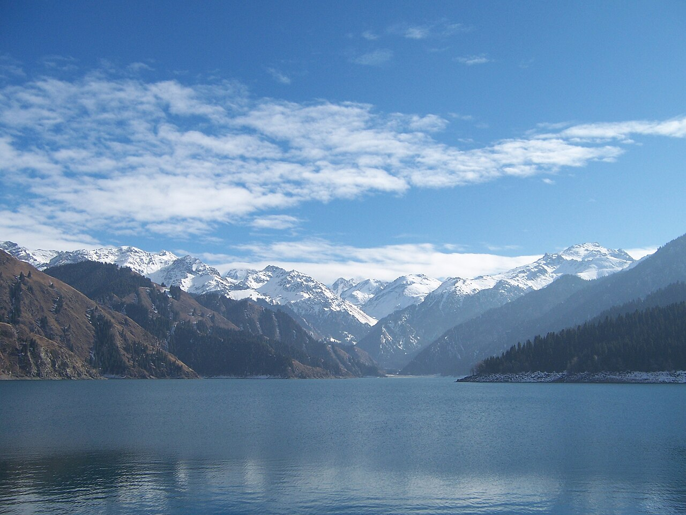
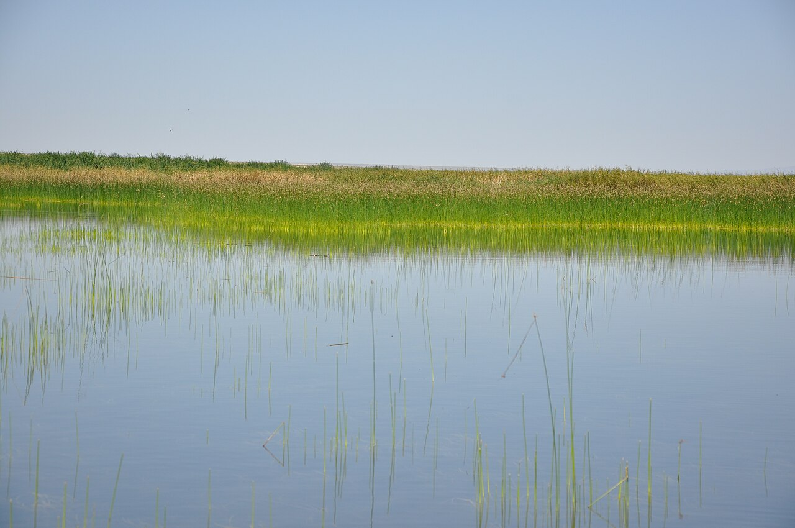
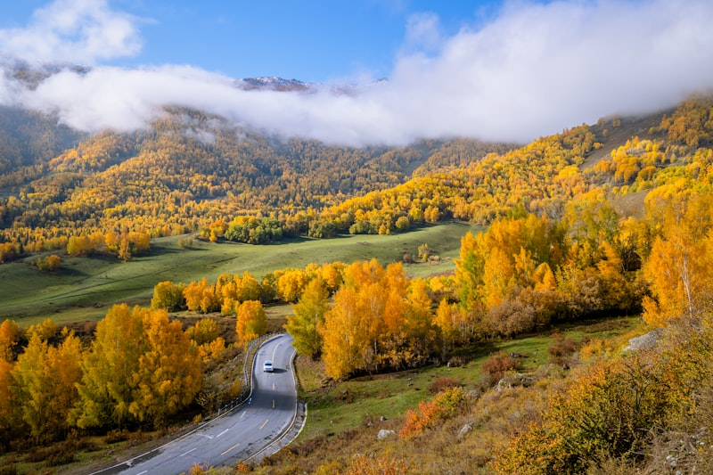
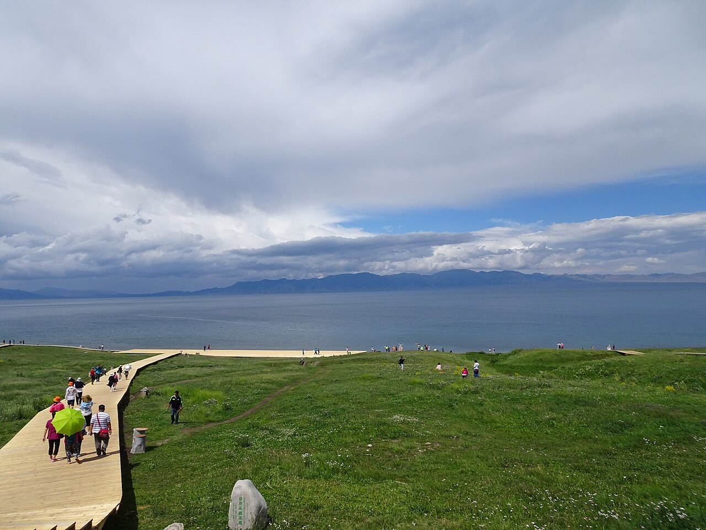
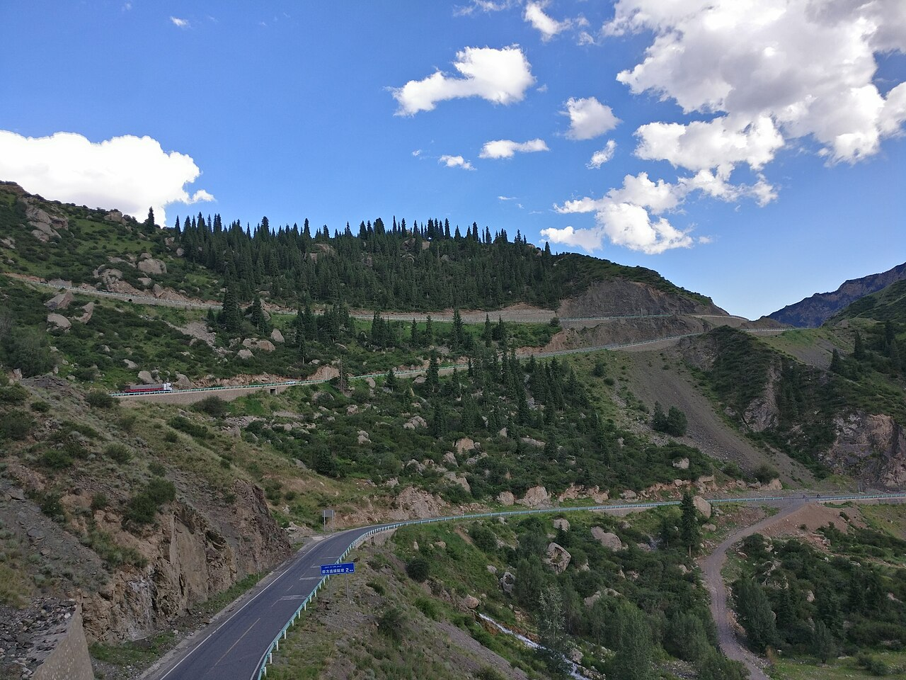

# 北疆+伊犁 · 9 天大环线｜朋友实测记录版（7.31–8.8）

> **旅行时间**：2026/7/31（五）— 8/8（六），已完成并验证的实测行程
> **旅行人数**：朋友小队（西安往返）
> **总天数**：9 天 8 晚，全程自驾约 3,000 km
> **核心目的地**：乌鲁木齐 → 天山天池 → 昌吉 → 海上魔鬼城/乌伦古湖 → 福海 → 阿禾公路 → 喀纳斯 →（G219）→ 赛里木湖 → 孟克特古道 → 独库北段 → 奎屯 → 乌鲁木齐
> **住宿实测总价**：4,219 元/间（7 晚付费 + 1 晚住昌吉朋友家）

> 本版是**朋友 2026 年 7/31–8/8 实际走完的行程记录**，航班、酒店、价格、表定车程均来自其原始行程表，未做删改；另附当时使用的预约购票信息，供与另外两版方案（白哈巴版/赛湖版）对照参考。

---

## 这条线的特点：广度优先的"北疆+伊犁"大满贯

与另外两版"阿勒泰深度"路线不同，这条 9 天线把**东天山（天池）、北疆（喀纳斯）、西疆（赛湖）、伊犁（孟克特古道）、独库北段**全部串进一个回环——是典型的大满贯打法。它的两个独有亮点：**G219 边境公路**（贾登峪→赛湖段，沿中哈边境的草原与戈壁）和**孟克特古道**（唐布拉深处的砂石路秘境，只接待自驾游客），这两处是另外两版都没有的。

---

## 行程总览

| 天数 | 星期 | 路线 | 住宿地 | 核心体验 | 开车距离 |
|:---:|:---:|:---|:---|:---|:---:|
| D1 | 五 | 西安 MU2299（15:20–18:45）→ 乌鲁木齐 | 乌市机场旁 | 落地、取车 | 约 10 km |
| D2 | 六 | 酒店 → 天山天池（1h）→ 昌吉 | 昌吉 | 天池半日、昌吉晚餐 | 约 160 km |
| D3 | 日 | 昌吉 → 海上魔鬼城 → 乌伦古湖 → 福海 | 福海县 | 雅丹+大湖（3h） | 约 500 km |
| D4 | 一 | 福海 → 阿勒泰 → 阿禾公路 → 禾木（车览）→ 贾登峪 | 贾登峪 | 阿禾公路 209 km（8–9h 车览日） | 约 410 km |
| D5 | 二 | 喀纳斯景区一整天 | 贾登峪 | 三湾、湖区、观鱼台 | 区间车日 |
| D6 | 三 | 喀纳斯 → G219 边境公路 → 赛里木湖（10h） | 赛湖景区内 | G219 草原戈壁、傍晚抵湖 | 约 780 km |
| D7 | 四 | 赛湖环湖（8:30–14:00）→ 孟克特古道（6h） | 尼勒克 | 90 km 环湖、东门进南门出 | 约 440 km |
| D8 | 五 | 孟克特古道（4–5h）→ 独库北段 → 奎屯（7h） | 奎屯 | 砂石路秘境、独库翻山 | 约 220 km |
| D9 | 六 | 奎屯 → 乌鲁木齐机场，MU2300（19:55） | — | 返程日，弹性充足 | 约 250 km |

> **设计逻辑**：先东天山热身，再一路北上喀纳斯（压在周一周二），然后 G219 纵贯国境线南下赛湖，最后经伊犁孟克特古道、独库北段折返奎屯回乌市——全程一个大回环，不走回头路。

---

# D1｜西安飞乌鲁木齐 · 落地日
**主题：晚班落地，睡机场边**

*乌鲁木齐：西域第一站，养精蓄锐比逛更重要*

## 交通
- **航班**：MU2299 西安 15:20 → 乌鲁木齐 18:45。
- **落地后**：机场取车，入住酒店即休息，为明天开始的连续长途蓄力。

## 住宿
**如家精选酒店（乌鲁木齐新天润天山国际机场店）**｜实测 381 元
- 地址：新市区北京北路与城北大道交叉口西北约 180 米。
- 理由：距机场 10 分钟，晚班机落地零折腾；次日上 S111/高速去天池顺路。

---

# D2｜天山天池 · 夜宿昌吉
**主题：东天山热身日**

*天山天池：博格达峰雪线下的一泓高山湖*

## 交通
- 08:30 出发，酒店 → 天山天池游客中心约 1 小时。私家车停游客中心，统一换区间车入园。
- 傍晚天池 → 昌吉约 1.5 小时，昌吉晚餐。

## 住宿
**昌吉（希尔顿欢朋 / 朋友家）**
- 理由：昌吉在乌市西侧，次日北上福海上高速顺路；顺便会友聚餐。

## 活动

### 上午—下午：天山天池
旺季套票 155 元/人（门票 95 + 往返区间车 60）。预约渠道为官方公众号/小程序，分时段入园，门票 2 日有效。环湖栈道、定海神针古榆、远眺博格达峰（5,445 m）是标准动线，半天足够。

### 晚餐：昌吉
朋友安排的昌吉本地晚餐——新疆之行的第一顿正经席面。

---

# D3｜海上魔鬼城 · 乌伦古湖
**主题：雅丹立在湖面上**

*乌伦古湖：新疆第二大湖，芦苇荡与开阔水面*

## 交通
- 11:25 出发，昌吉 → 海上魔鬼城约 4.5 小时（约 450 km），16:00 抵达。
- 海上魔鬼城 + 乌伦古湖游览约 3 小时；19:00–19:30 乌伦古湖 → 福海县城酒店（约 30 分钟）。

## 住宿
**福海艺陇酒店**｜实测 376 元
- 地址：福海县人民西路 6 号。
- 理由：乌伦古湖边最近的县城住宿，次日北上阿勒泰顺路。

## 活动

### 下午：海上魔鬼城 + 乌伦古湖
**海上魔鬼城**是吉力湖（乌伦古湖子湖）畔的水上雅丹——风蚀岩丘直接立在水面上，与乌尔禾的戈壁雅丹气质完全不同。随后到**乌伦古湖**（布伦托海）湖岸：新疆第二大湖，当地人叫它"福海"，县城的名字也由此而来。乌伦古湖现场购票、无需预约。

---

# D4｜阿禾公路纵穿 · 抵达贾登峪
**主题：8–9 小时车览日，公路即风景**

*阿禾公路沿线：阿尔泰山的草坡、林海与河谷*

## 交通
- 08:30 出发：福海 → 阿勒泰市（约 1.5h）→ **阿禾公路**（209 km，约 4h，9:30–15:00 放行，需提前预约）→ 禾木门票站（车览途经）→ 贾登峪（约 1.5h），全程含观赏 8–9 小时，傍晚抵达。

## 住宿
**喀纳斯生态度假酒店（贾登峪接待基地一区）**｜实测 1,428 元/两晚
- 理由：贾登峪是喀纳斯换乘基地，连住两晚不挪窝，明天整天交给喀纳斯。

## 活动

### 全天：阿禾公路车览
这一天的景点就是公路本身：达坂、原始森林、托勒海特草原、湿地一路展开，沿途 31 处停车区随停随拍。经禾木门票站方向掠过（不进村），直抵贾登峪。

---

# D5｜喀纳斯景区 · 一整天
**主题：把一天完整交给这面湖**

*喀纳斯湖：三面雪山围出的一块 24 km 长的翡翠*

## 交通
- 贾登峪停车场换区间车进山（出入园 08:00–20:00），买**一进票 230 元/人**（门票 160 + 区间车 70），只进一次就买一进，提前在"原行网"小程序购票，刷身份证直接进。

## 住宿
**继续住贾登峪（第二晚）**

## 活动

### 全天动线（实测推荐顺序）
08:00 首班区间车进山 → 先上**观鱼台**（专线 20 元/人，1,068 级台阶，10 点前登顶避开排队）→ 中午换乘中心简餐 → 下午**三湾栈道**（卧龙湾下车，沿河徒步 6 km 串起卧龙湾、月亮湾、神仙湾）→ 傍晚**喀纳斯湖**一号码头看湖 → 19:00 前往车站，20:00 末班车出山。

*进山之路：云杉夹道、云雾压顶*

---

# D6｜G219 边境公路 · 千里转场赛里木湖
**主题：全程最硬核的一天，10 小时纵贯国境线**

*G219 阿勒泰—塔城段：草原、戈壁与边境线交替展开*

## 交通
- 08:00 出发：贾登峪 → 哈巴河 → 吉木乃 → 和布克赛尔 → 托里 → 博乐 → 赛里木湖，**约 780 km / 10 小时**。G219 沿中哈边境蜿蜒，草原石城、戈壁、风蚀地貌一路切换，是这条线独有的景观公路。
- 旺季赛湖景区开放至 23:00，傍晚抵达凭 24 小时自驾票入园，次日还能接着用。

## 住宿
**如家酒店（博乐赛里木湖景区店）**｜实测 835 元
- 地址：赛里木湖景区丝路风情街 11 幢。
- 理由：住景区内，明早直接开始环湖，省去进出园时间。

## 小贴士
- 全天以开车为主，两人轮换；边境公路段检查站配合出示身份证即可。
- 赛湖自驾票（门票 70 + 自驾服务费 75 = 145 元/人/24h）需提前在"一部手机游赛湖"小程序预约，每日 10:00 放票、限量 3,000 辆；住景区内也必须买自驾票，预约时同步录入车牌。

---

# D7｜赛湖环湖 · 转场孟克特古道
**主题：半天收赛湖，傍晚进天山**

*赛里木湖：海拔 2,073 米的高山冷水湖，"大西洋最后一滴眼泪"*

## 交通
- 08:30–14:00 环湖游览（90 km，单向逆时针，**东门进、南门出**）。
- 14:00–20:00 赛湖 →（南门出接果子沟—伊宁方向）→ 尼勒克孟克特古道，约 6 小时。

## 住宿
**尼勒克云山墅民宿**｜实测 785 元
- 地址：尼勒克县科克提列克村 077-1 号。
- 理由：住古道入口旁，明早开门即进，把最好的晨光留给古道。

## 活动

### 上午：赛里木湖环湖
逆时针环湖，右侧车窗始终贴湖：亲水滩、点将台、克勒涌珠（常有天鹅）。半天时间走精华段正好，南门出来直接上果子沟方向，与下午的转场零回头路衔接。

### 傍晚：抵达唐布拉
进入尼勒克境内，天山草原的绿扑面而来——和上午赛湖的开阔蓝是同一天里的第二种世界。

---

# D8｜孟克特古道 · 独库北段
**主题：上午秘境古道，下午英雄公路**

*独库公路北段：一日四季的天山脊梁*

## 交通
- 08:00–13:00 孟克特古道游览（4–5h，砂石非铺装路，原路进原路出）。
- 13:00–20:00 古道 →（乔尔玛 → **独库公路北段** → 独山子）→ 奎屯，表定 7 小时（含冗余，晴好走独库约 5 小时）。

## 住宿
**麗枫酒店（奎屯）**｜实测 414 元
- 地址：奎屯北京路街道沙湾街 290-21 号。
- 理由：奎屯是独库北段的出口城市，酒店新、补给方便，为最后一天返程缓冲。

## 活动

### 上午：孟克特古道
唐布拉草原深处的秘境古道：200 元/车（限 5 人，超员 40 元/人），单次入园 24 小时有效。全程砂石路，轿车可通行但需减速；无区间车、只接待自驾，因此保留了难得的原始感——雪山、云杉、溪流、草甸一路相伴。

### 下午：独库公路北段
乔尔玛上 G217 独库段，翻玉希莫勒盖达坂，一天之内从草原穿越到荒漠。独库公路每年仅夏秋开放、限 7 座以下客车，是"中国最美公路"的常客。

---

# D9｜奎屯 · 返程乌鲁木齐
**主题：弹性收尾，从容赶飞机**

*G30 回程：笔直与空旷，是大环线最后的底色*

## 交通
- 08:30–15:30 奎屯 → 乌鲁木齐机场（表定车程 7 小时，含充裕弹性；导航直达约 3 小时，余量可用于顺路停靠或从容午餐）。
- 吃饭 + 还车约 2 小时，**19:55 MU2300 返西安**。

## 收尾
还车清单：加满油、拍油表公里数、留存验车单、一周后查违章。9 天 3,000 km，东天山的雪、喀纳斯的湖、G219 的边境线、赛湖的蓝、孟克特的野、独库的险——一页翻完半个新疆。

---

## 预约购票信息（实测使用版）

| 项目 | 行程日期 | 渠道 | 规则与费用 | 提醒 |
|:---|:---|:---|:---|:---|
| 天山天池 | 8/1 | 官方公众号/小程序 | 套票 155 元/人（门票 95 + 区间车 60），分时段入园，门票 2 日有效 | 私家车停游客中心换区间车；旺季提前 2–3 天约 |
| 乌伦古湖 | 8/2 | 现场购票 | 无需预约 | — |
| 阿禾公路 | 8/3 | 原行网小程序【阿禾方向】/「阿勒泰交投」公众号 | 7 座及以下客车 9:30–15:00 放行 | 需提前预约，出发前看当日通告 |
| 喀纳斯 | 8/4 | 「原行网」小程序 | 一进票 230 元/人（门票 160 + 区间车 70），20:00 停止入园 | 只进一次买一进即可；观鱼台专线另购 20 元 |
| 赛里木湖自驾 | 8/5–8/6 | 「一部手机游赛湖」小程序 | 145 元/人/24h（门票 70 + 自驾服务费 75），每日限 3,000 辆、10:00 放票 | 住景区内也必须买；24h 票跨傍晚+次日上午正好 |
| 孟克特古道 | 8/7 | 「唐布拉·孟克特古道」公众号 | 200 元/车（限 5 人，超员 40 元/人），24 小时有效 | 提前 3 天预约；砂石路，SUV 更佳 |

---

## 实测花费（住宿部分）

| 晚 | 酒店 | 实测价 |
|:---|:---|:---|
| D1 乌市机场 | 如家精选（新天润机场店） | 381 元 |
| D2 昌吉 | 欢朋 / 朋友家 | — |
| D3 福海 | 福海艺陇酒店 | 376 元 |
| D4–D5 贾登峪 | 喀纳斯生态度假酒店（两晚） | 1,428 元 |
| D6 赛湖 | 如家（博乐赛湖景区店） | 835 元 |
| D7 尼勒克 | 云山墅民宿 | 785 元 |
| D8 奎屯 | 麗枫酒店 | 414 元 |
| **合计** | | **4,219 元/间** |

---

## 与另外两版的对照速览

| | 白哈巴版（8 天） | 赛湖版（8 天） | 本版·朋友实测（9 天） |
|:---|:---|:---|:---|
| 覆盖 | 阿勒泰深度（可可托海+白哈巴） | 赛湖+阿勒泰 | 东天山+北疆+赛湖+伊犁+独库 |
| 独有点 | 三号矿坑、白哈巴、五彩滩、独山子 | 赛湖环湖、阿禾公路、五彩滩 | 天池、乌伦古湖、**G219**、**孟克特古道**、**独库北段** |
| 最长单日 | 470 km | 550 km | 780 km（G219） |
| 喀纳斯停留 | 1.5 天（二进票） | 1.5 天（二进票） | 1 整天（一进票） |
| 禾木 | 住一晚（日落+晨雾） | 住一晚（日落+晨雾） | 车览途经（未进村） |
| 节奏 | 深度优先 | 每天一个核心体验 | 广度优先、多日长途 |
