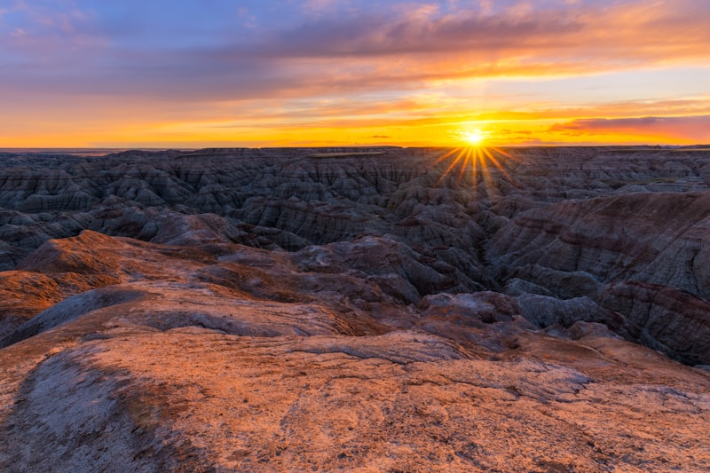
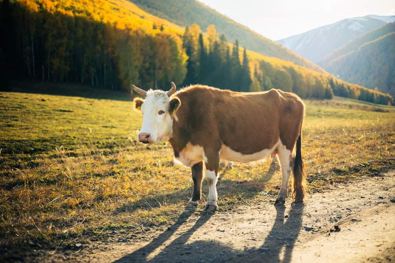
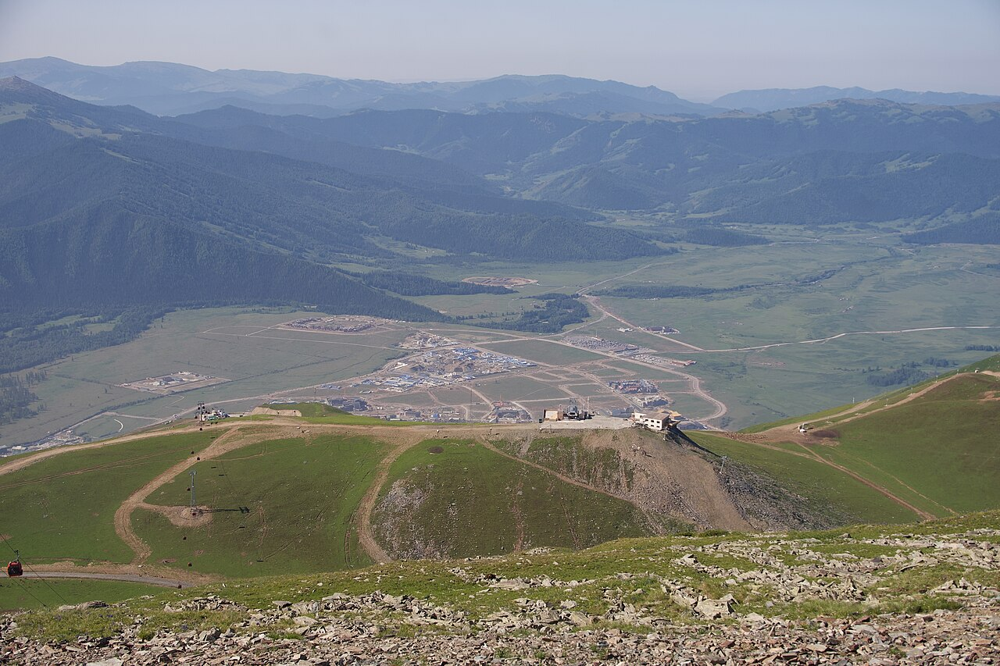

# 北疆 · 赛湖到喀纳斯的逆时针大环线｜8 天自驾执行手册

> **旅行时间**：2026/8/23（日）— 8/30（日）
> **旅行人数**：2 人
> **总天数**：8 天 7 晚，全程自驾约 2,300 km
> **核心目的地**：乌鲁木齐 → 赛里木湖 → 世界魔鬼城 → 布尔津/五彩滩 → 喀纳斯 → 禾木 → 阿禾公路 → 阿勒泰 → 乌鲁木齐
> **人均预算**：0.95～1.25 万元人民币（2 人总计约 1.9～2.5 万元，含机票）

> ⚠️ **出发前 72 小时必办清单**（今天看到就立刻做）：
> 1. **约赛里木湖自驾套票**：旺季自驾每日**限 3,000 辆车**，"一部手机游赛湖"小程序或"赛里木湖旅游"公众号**每日 10:00 放票**，建议提前 3～7 天约，现场买不到（约不上只能改区间车，环湖体验打折）。
> 2. **买喀纳斯+禾木门票**：实名制线上购票（"喀纳斯景区"公众号/"原行网"小程序），**窗口不卖当日票**。
> 3. **约阿禾公路自驾**：原行网小程序【阿禾方向】或"阿勒泰交投"公众号【阿禾自驾】预约，7 座以下客车每日 **9:30～15:00 放行**。
> 4. **订两晚关键住宿**：赛湖东门（D2）和禾木村内木屋（D6，旺季 800～1,500 元/晚，今晚就订，选带独立卫浴+电热毯的）。
> 5. **订机票和租车**：8/23 周日 15:00 前落地，8/30 周日 20:30 后起飞。

---

## 为什么这版环线砍掉了可可托海和白哈巴？

上一版的思路是"顺时针东线"：G216 戈壁、可可托海、三号矿坑，再北上喀纳斯。它的问题也很诚实——**可可托海绕出去 800 多公里，换来的只是"清秀"**（去过的朋友多半会说"景色不行"，这个评价不冤）；三号矿坑的人文分量是真的，但为一座矿坑搭进去一天半的车程，性价比说不过去。白哈巴则是另一种重复：它和禾木同为图瓦村落，气质高度重叠，还要多办一道边防证。**这两个点砍掉，腾出来的时间全部给了赛里木湖和阿禾公路**——前者是北疆在这个季节唯一"满血"的顶级湖景，后者是 2025 年才通车的景观大道，风景密度被拿来和独库公路比。

于是环线从顺时针翻转为**逆时针**：先沿 G30 一路向西，把第二天整个傍晚交给赛里木湖的蓝；再折向北，魔鬼城、五彩滩、喀纳斯、禾木一路收紧；最后从禾木走阿禾公路横穿阿尔泰山到阿勒泰市，S21 沙漠高速直线插回乌鲁木齐——**全程不走回头路，每天只保留一个核心体验**。

要坦白的一点：8 月 23～30 日仍是暑假旺季的尾巴，喀纳斯日均客流 3 万上下。对策只有三条，但够用：**①所有票提前线上约好；②喀纳斯、禾木压在周四、周五（8/27～8/28），周末留给不排队的公路和魔鬼城；③赶 8:00 首班区间车，10 点前攻下观鱼台。**

**这是"北疆三绝"（赛湖的蓝、喀纳斯的水、禾木的村）在 8 天里不走回头路的最优串法。**

---

## 行程总览

| 天数 | 星期 | 路线 | 住宿地 | 核心体验 | 开车距离 |
|:---:|:---:|:---|:---|:---|:---:|
| D1 | 日 | 飞抵乌鲁木齐 → 机场取车 → 市区 | 乌鲁木齐 | 国际大巴扎、新疆第一顿烤肉 | 约 20 km |
| D2 | 一 | 乌鲁木齐 → G30 → 赛里木湖 | 赛湖东门 | 90 km 环湖自驾、湖边日落 | 约 550 km |
| D3 | 二 | 赛里木湖 → 乌尔禾魔鬼城 | 乌尔禾镇 | 赛湖晨光（可选）、雅丹落日 | 约 470 km |
| D4 | 三 | 乌尔禾 → 布尔津 | 布尔津 | 休整日、五彩滩日落、河堤夜市 | 约 230 km |
| D5 | 四 | 布尔津 → 贾登峪 → 区间车进喀纳斯 | 贾登峪 | 三湾栈道、喀纳斯湖 | 约 150 km |
| D6 | 五 | 观鱼台晨景 → 禾木 | 禾木村 | 俯瞰变色湖、日落炊烟、银河 | 约 90 km |
| D7 | 六 | 禾木晨雾 → 阿禾公路 → 阿勒泰市 | 阿勒泰市 | 晨雾日出、209 km 景观大道 | 约 210 km |
| D8 | 日 | 阿勒泰 → S21 沙漠高速 → 乌鲁木齐还车 | — | 穿越古尔班通古特、晚班机回家 | 约 500 km |

> **设计逻辑**：逆时针环线——D2 用全程最长的一段高速直插赛里木湖（趁体力好消化长途），之后每天的车程逐级递减，到 D5～D6 喀纳斯/禾木两个精华日时几乎不用开车；D7 的阿禾公路把"转场"本身变成景点，D8 纯高速收尾。喀纳斯、禾木压在周四周五避开周末峰值，D4 是有意留白的休整日。所有时间均为**北京时间**（新疆作息比内地晚约 2 小时，8 月底日落约 20:50～21:10，每天都比你们想象的"长"）。

---

# D1｜落地乌鲁木齐 · 取车与大巴扎
**主题：抵达西域，先吃为敬**

*新疆国际大巴扎：宣礼塔、馕坑与手风琴声里的第一晚*

## 交通
- **航班**：全国主要城市均有直飞乌鲁木齐地窝堡机场（URC），华东出发约 5 小时。建议选 **15:00 前落地**的班次，给取车和倒时差留足余量。
- **机场取车**：地窝堡机场周边是租车公司聚集地（神州、一嗨、悟空及携程/飞猪平台商家均有门店，多数提供航站楼免费接送取车）。8 月底仍是暑期价，**紧凑型 SUV 约 400～550 元/天**——还没订的话今晚就订。
- **取车清单**：①绕车拍视频记录划痕；②确认备胎与工具齐全；③保险建议直接买"全险/尊享服务"，重点覆盖**玻璃与轮胎**——山路飞石是北疆最常见的出险项；④确认取还车都在机场店，环线闭环无需异地还车费。

## 住宿
**推荐：大巴扎/二道桥商圈的连锁酒店（亚朵、美居级别）**
- 价格：约 300～400 元/晚。
- 理由：步行可达大巴扎，第一晚的"新疆开场"不用再开车；明早上市区西侧的 G30 也顺路。

## 活动

### 傍晚：新疆国际大巴扎
落地安顿后直奔**国际大巴扎**。别把它当购物点——把它当氛围预习：宣礼塔下的鼓声、烤包子出炉时的羊油香、干果摊主递过来的一把巴旦木。工艺品别在这买（景区价），干果可以少量试吃采购。航班早的话，可以先去**自治区博物馆**（免费、需预约、周一闭馆，今天周日正常开放）补一节"西域三千年"的浓缩课。

### 晚餐：大巴扎周边烤肉 + 手抓饭
第一顿建议按"标准动作"来：**红柳烤肉、烤包子、手抓饭、卡瓦斯（蜂蜜发酵饮料）**。新疆的羊肉没有膻味这件事，需要亲口验证一次。

## 小贴士
- **今晚的最后检查**：赛湖自驾套票、喀纳斯/禾木门票、阿禾公路预约、两晚关键住宿——全部截图存离线（山区信号断续）。
- **作息切换**：今晚别早睡。新疆餐馆 22:00 依然热闹，按当地节奏 23:30 前睡即可，明天 9:00 出发完全来得及。
- 落地后便利店补充：2 箱矿泉水、湿巾、防晒霜（新疆紫外线是华东的 1.5 倍）。

---

# D2｜一路向西 · 把日落交给赛里木湖
**主题：长途转场日，终点是"大西洋最后一滴眼泪"**

*赛里木湖：海拔 2,073 米的高山冷水湖，8 月底草色渐黄，湖水却蓝得最浓*

## 交通
- **路线**：乌鲁木齐 → G30 连霍高速 → 赛里木湖东门，**约 550 km，含休息 6.5～7 小时**。全程高速，是仅次于 D8 的长途日，但一路戈壁与天山北坡的景色不无聊。
- **要点**：09:00 前出发，中途在精河或五台服务区午餐；**出发前把油加满**，G30 服务区间隔长。约 16:00 抵达东门。
- **环湖规则**：环湖公路约 90 km，**单向逆时针行驶**（东门进、南门只出不进），限速 30～40。自驾套票 24 小时有效，明早还能再进一次。

## 住宿
**推荐：赛湖东门附近酒店/营地**
- 价格：约 600～1,000 元/晚（旺季湖边价，提前订）；预算优先可住 40 km 外的清水河镇（约 300～500 元），代价是明早的湖边晨光要多开一段回头路。
- 理由：住东门是为了把环湖的节奏放松——今天玩到日落再出园，明早凭 24 小时票二次进园看晨光，不用赶。

## 活动

### 下午—傍晚：90 km 逆时针环湖（今日唯一主角）
16:00 东门进园，逆时针环湖。右侧车窗始终贴着湖：东岸的**亲水滩**、**点将台**（成吉思汗西征点兵处，湖湾全景机位）、北岸的**克勒涌珠**（泉眼涌水，常有天鹅）。8 月底的湖岸草色是绿中带黄的过渡色，而湖水在这个季节蓝得最不讲道理——深水区是钴蓝，近岸是奶蓝，阴天里也发着光。
- 纯开车 2～3 小时，边停边玩 4.5～5 小时，正好卡到 **21:00 前后的日落**——西岸看太阳沉进湖面，是本日的压轴。
- 环湖一圈回到东门出园（南门只出不进，别走反）。湖边风大，**防风外套**现在就放进车里。

### 晚餐：东门附近简餐
景区周边选择有限，拌面、丸子汤对付一顿。今天的热量缺口留给明天的烤肉。

## 为什么是赛里木湖，而不是"顺路看看"？
赛湖是伊犁线上唯一在 8 月底仍然满血的景点：草原花期过了，但湖的蓝不看季节。它与喀纳斯是两种完全不同的水——喀纳斯是雪山围出来的翡翠，看的是颜色变化；赛湖是 458 km² 的一整块高原蓝，看的是**尺度**。两个都要，才称得上"北疆的水看全了"。环湖 90 km 恰好是一下午加一场日落的体量，不多不少。

---

# D3｜赛湖晨光 · 魔鬼城落日
**主题：一天之内，从眼泪到火星**

*雅丹之夜：风声与银河，是这座"城"仅有的居民*

## 交通
- **清晨（可选）**：凭 24 小时票二次进园，湖边看 30 分钟晨光（8 月底赛湖日出约 07:30，起不来就放弃，不亏）。
- **路线**：赛里木湖 → G30 → 奎屯 → G3014 → 乌尔禾镇，**约 470 km，含休息 5.5～6 小时**。09:30 出发，16:00 前后抵达。

## 住宿
**推荐：乌尔禾镇上的酒店**
- 价格：约 250～400 元/晚。
- 理由：看完魔鬼城日落已经 21:00，住镇上 10 分钟即达，不用再开 90 km 夜路进克拉玛依市区——**把赶路从晚上挪到明天上午**，体验好得多。

## 活动

### 傍晚：世界魔鬼城（乌尔禾雅丹）
休整后 18:30 前到**世界魔鬼城**（门票约 42 元 + 观光小火车 20 元，**售票至 19:00 止**，务必卡好时间）。小火车沿 10 km 环线穿过风蚀雅丹群——"城堡""舰队""石猴"在斜阳下从土黄烧成橙红，风穿过岩缝发出呜咽声，这就是"魔鬼城"名字的由来。傍晚的低角度光线是这里唯一正确的打开方式，正午来只有一片惨白。

### 晚餐：乌尔禾镇烤肉
镇上的烤肉馆子便宜实在，配一扎卡瓦斯，给今天的"从湖到火星"收尾。

## 小贴士
- 今天是第二个长途日，副驾备零食和歌单；G30 奎屯段大车多，超车果断、不并行。
- 魔鬼城日落约 20:50，小火车环线约 1.5 小时，19:00 前进场时间刚好。

---

# D4｜休整日 · 五彩滩日落
**主题：半天赶路半天闲，把节奏还给自己**

*五彩滩：低角度的落日把风蚀泥岩从赭黄烧到绛红*

## 交通
- **路线**：乌尔禾 → G3014/G217 → 布尔津，**约 230 km，3 小时**。全程最轻松的一天，自然醒后 10:00 出发都来得及。

## 住宿
**推荐：布尔津县城酒店（河堤夜市步行圈）**
- 价格：约 350～500 元/晚（旺季略有上浮）。
- 理由：布尔津号称"童话边城"，是喀纳斯的门户镇，酒店密度高、性价比全线最好；住河堤附近，晚上夜市步行即达。

## 活动

### 下午：布尔津小城闲逛
13:30 前后抵达，入住后不做任何"景点安排"：额尔齐斯河边的俄式建筑、河堤上晒太阳、补一觉。连续两个长途日之后，这半天留白是故意的——**休整不是浪费，是为了让后三天的喀纳斯和禾木满血**。

### 傍晚：五彩滩日落（今日高潮）
19:30 从县城出发，24 km 到**五彩滩**（门票约 50 元）。这是额尔齐斯河北岸的一片雅丹河滩：**一河隔两岸**——南岸是墨绿色的杨树林带，北岸是被风蚀成波浪状的彩色泥岩。日落前 40 分钟（约 20:50 日落），泥岩从赭黄一路烧到绛红，是全疆最著名的日落机位之一。
- 一定要**日落前 1 小时**到，光线角度低了颜色才出来；白天来只是一片土坡。
- 带件外套，河风傍晚转凉。

### 晚餐：布尔津河堤夜市
回城后直奔**河堤夜市**：炭火**烤狗鱼**（额河特产，肉细刺少）配一杯冰**格瓦斯**（俄式蜂蜜发酵饮料）——这是布尔津作为"中俄口岸小镇"的味觉遗产。

## 小贴士
- 布尔津是边境县，进出县城有检查站，**身份证放在随手可取的地方**。
- 明天进山，今晚在县城超市补零食和水（山里物价翻倍）。

---

# D5｜喀纳斯 · 三湾与湖区
**主题：换乘进山，湖水的颜色说了算**

*进山之路：云杉夹道、云雾压顶，去喀纳斯的公路本身就是风景*

## 交通
- **自驾段**：布尔津 → 冲乎尔 → 贾登峪门票站，约 150 km 山路，2～2.5 小时（多处区间测速，跟着导航限速走）。
- **换乘段**：5 月—10 月 15 日夏季运营期，**私家车一律不能进入喀纳斯核心区**，停贾登峪停车场，换景区区间车约 1 小时进山（出入园时间 08:00～20:00）。
- **购票**：买**喀纳斯"二进票"（270 元/人：门票 160 + 区间车 110，48 小时内进两次，第二次免门票）**——明早二次进山上观鱼台，比两张一进票省 190 元。出发前已在线上买好，现场刷身份证入园。

## 住宿
**推荐：贾登峪度假村酒店**
- 价格：约 500～700 元/晚（旺季价，提前订）。
- 理由：这是关键取舍——**住贾登峪而不是湖区里面**。湖区内木屋旺季涨到 1,000～4,000 元/晚且条件简陋；贾登峪酒店有热水暖气、车就停在楼下，明早赶 8:00 首班区间车反而更快。

## 活动

### 下午：三湾栈道徒步（顺光时段）
09:00 前从布尔津出发，11:30 前后进山（避开 9:00～10:00 旅行团入园高峰）。区间车沿喀纳斯河上行，依次经过**卧龙湾、月亮湾、神仙湾**三个站。正确玩法是：坐到卧龙湾下车，**沿河边栈道向上游步行串起三湾**（全程约 6 km，2.5～3 小时，平缓木栈道）。这 6 km 是全喀纳斯景色密度最高的一段，**无论多想省力都不要全程坐车**——车窗里的三湾和栈道上的三湾，是两个景区。下午阳光正好打在河面上，8 月底水量最足，湖水呈现那种被反复拍进纪录片的**奶蓝色**（冰川岩粉悬浮散射所致），云杉林一路遮阴。

### 傍晚：喀纳斯湖边

*喀纳斯湖：三面雪山围出的一块 24 km 长的翡翠*

栈道走完换乘区间车到**换乘中心/湖区**，在喀纳斯湖一号码头看湖：三面雪山围着 24 km 长的冰碛堰塞湖，傍晚风停时湖面是一块完整的翡翠。**20:00 末班区间车**出山回贾登峪，19:00 前开始往车站走，旺季排队 30 分钟起，别卡点。

### 晚餐：贾登峪度假村
度假村餐厅解决（大盘鸡、汤饭）。别期待惊喜，今晚吃的是方便。

## 小贴士
- **旺季排队心法**：进山、出山的高峰是 9:00～11:00 和 17:00～19:00。你们 11:30 进山、19:00 前出山，恰好都在低谷。
- 湖区海拔约 1,370 米，无高反，但傍晚只有 10℃ 上下——**抓绒+防风外套**带进山。
- 游船（约 120 元）和"湖怪"观测可跳过：性价比低，湖的美在岸上和明早的观鱼台。

---

# D6｜观鱼台晨光 · 转场禾木
**主题：先俯瞰整面湖，再睡进童话村**

*禾木的路权属于牛群：草坡渐黄，原住民优先通行*

## 交通
- **上午**：二次进山（用昨天的二进票），换乘中心现场扫码购**观鱼台专线票（20 元/人往返，每小时限量）**上山。
- **下午**：贾登峪取车 → 原路下撤至冲乎尔 → 东转禾木公路 → **禾木门票站**，约 90 km，1.5～2 小时。私家车**不能进禾木村**（夏秋季），停门票站停车场，换区间车约 1 小时进村。禾木门票 50 元 + 区间车往返 25 元/人。

## 住宿
**推荐：禾木村内木屋民宿（务必已提前订好）**
- 价格：约 800～1,500 元/晚（旺季真实行情，越临近越贵）。
- 理由：**全程最值得花钱的一晚**。禾木的灵魂在清晨——只有睡在村里，明早才赶得上观景台的晨雾日出。选带独立卫浴和电热毯的木屋（8 月底夜温 5～8℃）。

## 活动

### 清晨—上午：观鱼台俯瞰喀纳斯湖（务必赶早）
**08:00 首班区间车进山**，到换乘中心立刻买观鱼台专线票上山，再爬 1,068 级台阶（约 40 分钟）登顶（海拔 2,030 米，比湖面高 600 米）。从这里俯瞰，喀纳斯湖是一条嵌在雪山之间的绿宝石长廊；清晨常有云海和晨雾贴着湖面流动，湖水随光线在**青、蓝、绿**之间变色。**10 点前登顶和 11 点后登顶是两个景区**——前者独享机位，后者排队两小时。11:00 下山出景区，贾登峪午餐后取车。

### 下午：转场禾木
13:00 前后出发。禾木公路本身就是风景：额尔齐斯河支流一路相伴，草坡上牛羊成群。15:00 前抵达门票站换车进村，16:00 入住木屋。

### 傍晚：禾木观景台日落
19:30 沿村内步道上**禾木观景台**（步行 30～40 分钟缓坡，也有村内接驳车）。日落时分（约 20:50）整个河谷铺开在脚下：原木屋顶升起一条条笔直的**炊烟**，禾木河闪着金光，白桦林边缘已经有第一抹黄。待到 21:30 天黑下台，村里几乎没有光污染——**抬头就是银河**。

### 晚餐：木屋民宿家常菜
在民宿吃：奶茶、列巴（俄式面包）、奶疙瘩配炖羊肉。图瓦人的餐桌简单，但在 8℃ 的夜里热奶茶就是一切。

## 小贴士
- 明早要看日出，今晚 23:00 前睡。把手机电充满，明早摸黑上路要照明。
- 旺季观景台日落人不少，想架三脚架就 19:00 前上去占位置；纯肉眼欣赏 19:30 上去足够。

---

# D7｜禾木晨雾 · 阿禾公路
**主题：看完最后一个日出，把转场路开成景点**

*阿禾公路沿线：阿尔泰山的草坡、林海与河谷，209 km 没有一公里是浪费的*

## 交通
- **上午**：禾木区间车出村取车（首班车约 8:00 后，看完晨雾下山正好衔接）。
- **下午**：禾木门票站 → **阿禾公路** → 阿勒泰市，**约 210 km，含停靠 4～4.5 小时**。
- **阿禾公路规则（重要）**：7 座及以下客车**每日 9:30～15:00 放行**，需提前在原行网小程序【阿禾方向】或"阿勒泰交投"公众号预约。你们约 11:30 取车、12:00 前后上路，正好在放行窗口正中；出发前再扫一眼"布尔津交通发布"的当日通告。

## 住宿
**推荐：阿勒泰市区连锁酒店**
- 价格：约 300～450 元/晚。
- 理由：地区首府，酒店选择多、性价比高，为明天 500 km 的 S21 返程蓄力；市区补给、加油都方便。

## 活动

### 清晨：观景台晨雾日出（全程最高光时刻）
06:40 起床，07:00 摸黑上观景台（带照明）。8 月底日出约 07:15：先是雪山尖被点亮，然后阳光下切到河谷，**晨雾正好在这时从禾木河上漫起来**——村庄、桦林、炊烟全部泡在半透明的金雾里，每年无数摄影师为这 20 分钟守在这里。清晨约 5～8℃，把所有能穿的都穿上。回民宿吃热早餐、退房，10:30 前后区间车出村。

### 下午：阿禾公路 · 横穿阿尔泰山
这条 2025 年 6 月才通车的 209 km 景观大道，是被拿来和独库公路相提并论的存在：从禾木一侧出发，翻越**海拔 2,740 米的达坂**（山脚繁花、山顶残雪的"一山跨四季"），一路穿过**通巴原始森林、托勒海特草原、伊列克石林、乌希里克湿地**——河谷、湿地、草原、林海、雪山五种地貌在四个小时里轮番上场，沿途已建成 31 处停车区，看到心动的就停。这不是转场，这是今天的景点本身。

### 晚餐：阿勒泰市区
克兰河边的餐馆解决：哈萨克手抓肉或额河冷水鱼。连吃了几天烤肉，今晚可以换换口味。

## 为什么把最后一天的山路给阿禾公路？
旧版环线的最后一天是从禾木原路返回布尔津再南下——**回头路 + 纯赶路**，是全程最平庸的一天。阿禾公路把这一天彻底改写：里程差不多，但一公里回头路都没有，风景密度还碾压高速。它 2025 年才通车，大部分走老攻略的人还不知道它——**新路配新攻略，这是这次重做最值的一处升级**。

---

# D8｜S21 沙漠高速 · 回程乌鲁木齐
**主题：直线收尾，零风险赶飞机**

*S21 阿乌高速：笔直穿过古尔班通古特沙漠，是环线留给你们的最后一种风景*

## 交通
- **路线**：阿勒泰市 → S21 阿乌高速 → 乌鲁木齐地窝堡机场还车，**约 500 km，纯高速 5～5.5 小时**。这条 2021 年通车的高速把阿勒泰到乌市从 8 小时压到 5 小时，一路笔直穿过古尔班通古特沙漠，中途可在**乌伦古湖**观景台停 15 分钟伸个腿。
- **节奏**：09:30 出发，16:00 前抵达机场。订 **20:30 以后**起飞的航班最稳（含验车、摆渡和安检，周日晚是返程高峰，多留 30 分钟）。
- **还车清单**：加满油（机场附近加油站）、拍油表和公里数、留存验车单照片、7 天后查一次违章代扣。

## 活动

### 午餐：福海/沿线服务区
返程日不做美食安排，准点还车是唯一 KPI。

## 收尾
16:00 机场还车，安检后在候机楼把没吃够的烤包子补上。落地后翻相册：赛湖的蓝、魔鬼城的红、喀纳斯的水、禾木的雾、阿禾公路的绿——五天五种颜色，这条环线算是把北疆的色卡集齐了。

---

## 三个"为什么不"

### 为什么砍掉可可托海（含三号矿坑、神钟山）？
可可托海在环线上是个 800 km 的大拐弯，而风景只是"清秀"——与喀纳斯同属"峡谷+河+白桦"审美，级别却低一档。三号矿坑的人文故事确实动人，但为两小时参观搭进去一天半车程，说不通。**绕路最多、兑现最低的景点，第一个砍。**

### 为什么白哈巴这次不去了？
它与禾木同为图瓦村落，气质高度重叠，还要多一道边防证流程。上一版加它是因为 7 天变 8 天需要内容填充；这版有了赛里木湖和阿禾公路，白哈巴就成了第四个"村子"。**同类景点留最好的那个——禾木。**

### 为什么不进伊犁腹地（那拉提/独库公路）？
伊犁的主场是 6～7 月草原花期，8 月底草已黄透，那拉提的兑现率大不如前；独库全程走完要占 3 天且弯道强度大。赛里木湖是伊犁线上唯一不看花期的满血景点——**环湖就走，不恋战，伊犁腹地留给下一次的 6 月。**

---

## 北疆自驾要点（必读）

- **时间**：全疆用北京时间，但作息晚 2 小时——8 月底日出约 07:15～07:30，日落约 20:50～21:10。本手册所有时间均为北京时间。
- **门票**：喀纳斯、禾木**实名制线上购票**（"喀纳斯景区"公众号/"原行网"小程序），窗口不卖当日票，旺季建议提前 3～7 天购买。
- **赛里木湖自驾**：自驾套票约 145 元/人（含门票，24 小时有效），**每日限 3,000 辆车**，"一部手机游赛湖"小程序每日 10:00 放票，务必提前约；环湖单向逆时针，南门只出不进。
- **阿禾公路**：每日 9:30～15:00 放行 7 座以下客车，需提前预约；山区天气多变，遇雨雪可能临时管制，出发前一天看"阿勒泰交投"通告。
- **加油**：进加油站需司机出示身份证，乘客通常需下车步行进站；高速和戈壁段**油表过半就加**。
- **测速**：国道/山路大量**区间测速**（限速 40～80 不等），严格跟导航提示走。
- **检查站**：边境县（布尔津、哈巴河一带）进出有治安检查站，身份证人手一张随时可取，通常 2 分钟过站。
- **牲畜**：山区公路随时可能有牛羊马横穿，**撞了要照价赔偿**，见到畜群提前减速停车让行。
- **网络**：喀纳斯、禾木、阿禾公路山区信号断续，出发前下载**离线地图**，门票二维码、预约单、民宿信息全部提前截图。
- **穿衣**：三层法则——短袖打底 + 抓绒 + 防风外套，禾木清晨和赛湖湖边再加一件；防晒霜、墨镜、润唇膏是三件套。
- **无人机**：喀纳斯、禾木需提前报备，赛湖和边境地区限制多，别抱执念。

---

## 预算参考

| 项目 | 人均预算 | 备注 |
|:---|:---|:---|
| 往返机票 | 3,000～4,500 元 | 华东/华北 → 乌鲁木齐，8 月底暑期尾声，价格高于 9 月 |
| 租车+油费+路桥 | 约 2,900 元 | SUV 约 450 元/天 × 8 天 + 油费约 1,800 元 + 路桥，2 人分摊 |
| 住宿（7 晚） | 约 1,600～2,100 元 | 赛湖东门与禾木木屋为两个高点，其余 250～500 元/间 |
| 门票+区间车 | 约 620 元 | 赛湖自驾套票 145 + 五彩滩 50 + 喀纳斯二进 270 + 观鱼台 20 + 禾木 75 + 魔鬼城 62 |
| 餐饮 | 约 900 元 | 人均 110 元/天，含两顿"值得吃"的鱼 |
| **合计** | **约 9,500～12,500 元** | 2 人总计约 1.9～2.5 万元 |

> 比上一版略贵的部分，几乎全部来自赛湖湖边住宿——用一晚湖景房换掉可可托海的 800 km 绕路，这笔账怎么算都值。
