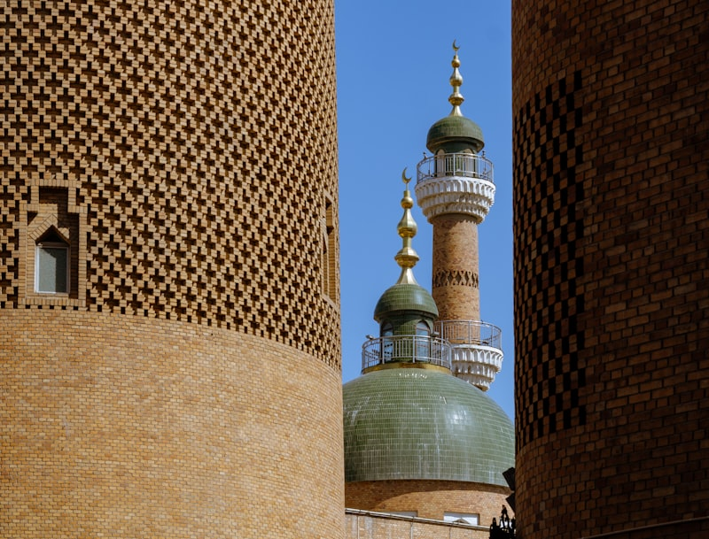
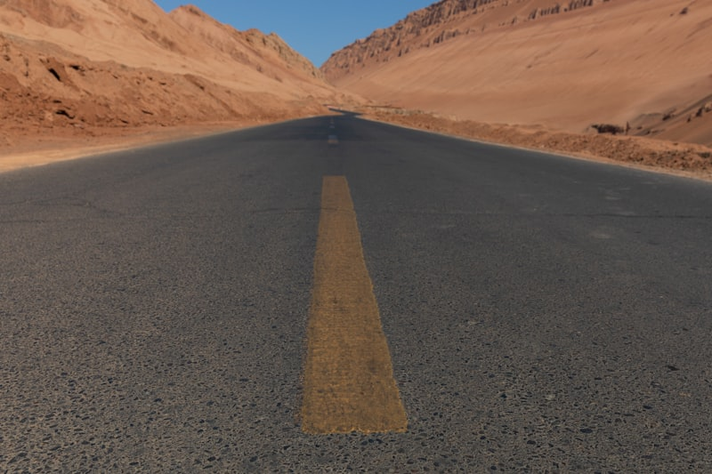
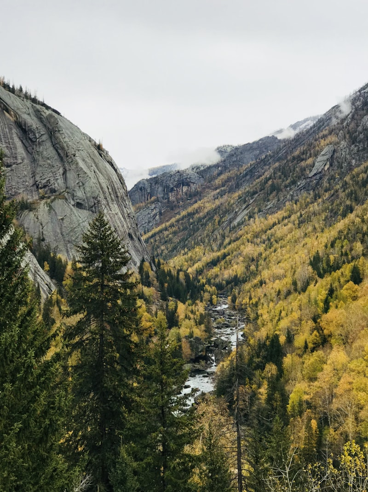
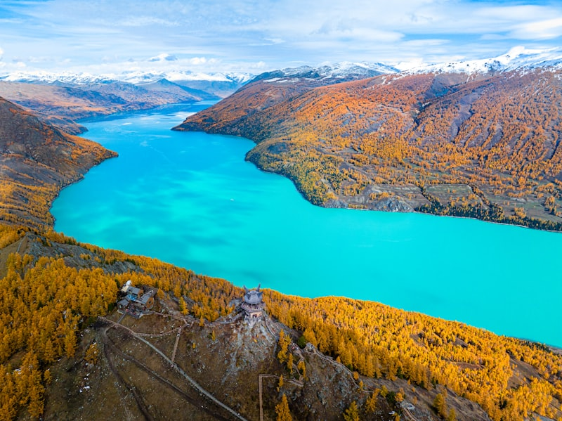
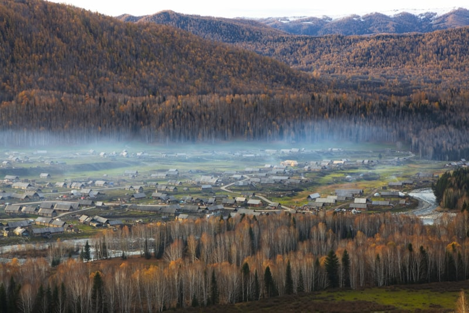
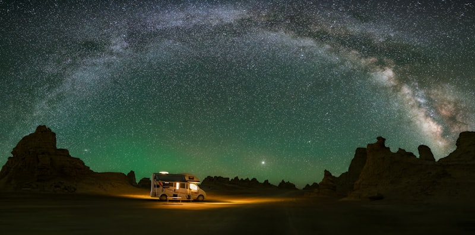
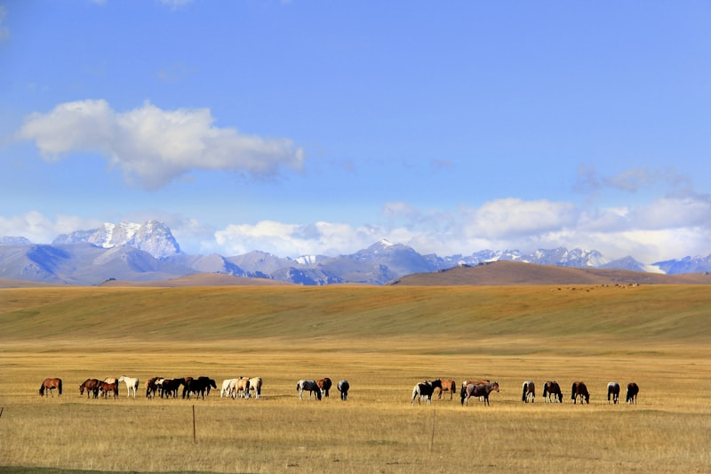
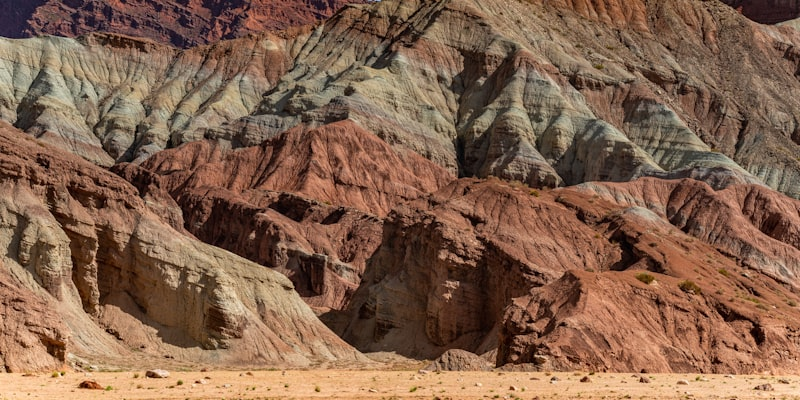

# 北疆 · 喀纳斯与戈壁的初秋大环线｜7 天自驾执行手册

> **旅行时间**：8 月底—9 月初（推荐 2026/8/29 六 — 9/4 五）
> **旅行人数**：2 人
> **总天数**：7 天 6 晚，全程自驾约 1,900 km
> **核心目的地**：乌鲁木齐 → 卡拉麦里 → 可可托海 → 布尔津/五彩滩 → 喀纳斯 → 禾木 → 世界魔鬼城 → 乌鲁木齐
> **人均预算**：0.75～0.95 万元人民币（2 人总计约 1.5～1.9 万元，含机票）

---

## 为什么选北疆？为什么是这个时间？

如果你们想要的是**一天之内从戈壁开进瑞士**的震撼，北疆是国内唯一的答案。阿勒泰环线在 7 天里给你四种完全不同的地貌：卡拉麦里的荒野戈壁、可可托海的花岗岩峡谷、喀纳斯－禾木的雪山湖泊白桦林、乌尔禾的风蚀雅丹——每一段车程都不是"赶路"，而是地貌切换的现场直播。

与 **伊犁线**（赛里木湖、那拉提、独库公路）相比，阿勒泰线的胜负手在**季节**：伊犁的主场是 6～7 月的草原花期，8 月底草已泛黄发干；而喀纳斯和禾木恰好相反——8 月 31 日暑期人潮一夜退去，9 月上旬白桦开始一层层染金，你们赶上的正是**人少、价跌、初秋渐变色**的空档期。与 **川西**相比，北疆全程海拔不超过 1,500 米，没有高反，山路铺装完好，是国内自驾舒适度最高的"大风光"线路。

要诚实地说：9 月初还不是喀纳斯最浓的金秋（那在 9 月 20 日前后，但那时房价翻三倍、观景台排队一小时）。你们看到的是绿金交织的过渡色、清晨 5℃ 的冷空气里禾木河谷漫起的晨雾、以及几乎包场的栈道。

**这是"史诗感风光"与"松弛感旅行"在国内的最佳平衡点。**

---

## 行程总览

| 天数 | 星期 | 路线 | 住宿地 | 核心体验 | 开车距离 |
|:---:|:---:|:---|:---|:---|:---:|
| D1 | 六 | 飞抵乌鲁木齐 → 机场取车 → 市区 | 乌鲁木齐 | 国际大巴扎、新疆第一顿烤肉 | 约 20 km |
| D2 | 日 | 乌鲁木齐 → 卡拉麦里 → 可可托海镇 | 可可托海镇 | 戈壁公路、野生动物、三号矿坑 | 约 470 km |
| D3 | 一 | 可可托海景区 → 阿勒泰 → 布尔津 → 五彩滩 | 布尔津 | 额尔齐斯大峡谷、五彩滩日落、河堤夜市 | 约 370 km |
| D4 | 二 | 布尔津 → 贾登峪 → 区间车进喀纳斯 | 贾登峪 | 三湾栈道、喀纳斯湖 | 约 150 km |
| D5 | 三 | 观鱼台晨景 → 出山 → 禾木 | 禾木村 | 观鱼台俯瞰变色湖、禾木日落炊烟 | 约 90 km |
| D6 | 四 | 禾木晨雾 → 布尔津 → 乌尔禾魔鬼城 → 克拉玛依 | 克拉玛依 | 观景台晨雾日出、雅丹落日 | 约 420 km |
| D7 | 五 | 克拉玛依 →（可选独山子大峡谷）→ 乌鲁木齐还车 | — | 高速返程、晚班机回家 | 约 400 km |

> **设计逻辑**：顺时针环线——先走东侧 G216 戈壁线北上（趁体力好消化最长车程），把喀纳斯、禾木两个精华放在 9 月 1 日之后（人潮退去），最后沿西侧高速快速南下收尾。全程只换 5 次酒店，禾木木屋放在倒数第二晚，用最好的一晚睡在风景里；最后一天纯高速，赶晚班机零风险。所有时间均为**北京时间**（新疆作息比内地晚约 2 小时，日落在 20:30～21:00，每天都比你们想象的"长"）。

---

# D1｜落地乌鲁木齐 · 取车与大巴扎
**主题：抵达西域，先吃为敬**

*新疆国际大巴扎：宣礼塔、馕坑与手风琴声里的第一晚*

## 交通
- **航班**：全国主要城市均有直飞乌鲁木齐地窝堡机场（URC），华东出发约 5 小时。建议选 **15:00 前落地**的班次，给取车和倒时差留足余量。
- **机场取车**：地窝堡机场周边是租车公司聚集地（神州、一嗨、悟空及携程/飞猪平台商家均有门店，多数提供航站楼免费接送取车）。9 月初已过暑期峰值，**紧凑型 SUV 约 300～450 元/天**。
- **取车清单**：①绕车拍视频记录划痕；②确认备胎与工具齐全（北疆部分路段碎石多）；③保险建议直接买"全险/尊享服务"，重点覆盖**玻璃与轮胎**——山路飞石是北疆最常见的出险项；④确认取还车都在机场店，环线无需异地还车费。

## 住宿
**推荐：大巴扎/二道桥商圈的连锁酒店（亚朵、美居级别）**
- 价格：约 300～400 元/晚。
- 理由：明早要走 G216 北上，市区南部出城顺路；步行可达大巴扎，第一晚的"新疆开场"不用再开车。

## 活动

### 下午（可选）：新疆维吾尔自治区博物馆
如果航班 14:00 前落地，强烈建议把安顿后的第一站给**自治区博物馆**（免费，微信公众号实名预约，**周一闭馆**）。"楼兰美女"干尸、《伏羲女娲图》绢画和整厅的丝路文书织锦，是这片土地最浓缩的"前情提要"——先看懂西域三千年，再出发去看它的山河，整条环线都会厚一层。1.5～2 小时足够；落地晚就果断放弃，别为它压缩睡眠。

### 傍晚：新疆国际大巴扎
落地安顿后直奔**国际大巴扎**。别把它当购物点——把它当氛围预习：宣礼塔下的鼓声、烤包子出炉时的羊油香、干果摊主递过来的一把巴旦木。工艺品别在这买（景区价），干果可以少量试吃采购。

### 晚餐：大巴扎周边烤肉 + 手抓饭
第一顿建议按"标准动作"来：**红柳烤肉、烤包子、手抓饭、卡瓦斯（蜂蜜发酵饮料）**。新疆的羊肉没有膻味这件事，需要亲口验证一次。

## 小贴士
- **作息切换**：今晚别早睡。新疆餐馆 22:00 依然热闹，按当地节奏 23:30 前睡够即可，明天 9:00 出发完全来得及。
- 落地后在便利店补充：2 箱矿泉水、湿巾、防晒霜（新疆紫外线是华东的 1.5 倍）。

---

# D2｜穿越卡拉麦里 · 抵达可可托海
**主题：长途转场日，戈壁是主角**

*G216 卡拉麦里段：笔直的公路两侧，是蒙古野驴和鹅喉羚的领地*

## 交通
- **路线**：乌鲁木齐 → G216 → 恰库尔图（午餐）→ 富蕴县 → 可可托海镇，**约 470 km，含休息 6～6.5 小时**。这是全程最长的一天，但路况极好（高速+一级公路），且风景就在路上。
- **要点**：出发前加满油；富蕴县之前加油站间隔可达 100 km+，**油表过半就加**。

## 住宿
**推荐：可可托海镇上的宾馆/民宿**
- 价格：约 300～400 元/晚。
- 理由：住镇上而非富蕴县城，第二天早上 5 分钟即达景区门口，比住富蕴的人早进山 1 小时——可可托海的清晨光线和空栈道，值这一晚。

## 活动

### 上午—下午：G216 卡拉麦里有蹄类保护区（车览）
出城约两小时后进入**卡拉麦里自然保护区**路段：荒漠草原一望无际,运气好能看到**普氏野马、鹅喉羚、蒙古野驴**在公路两侧觅食（清晨和傍晚概率最高）。
- 只在观景带停车拍照，别追逐动物，别下路基。
- 中午在 **恰库尔图镇** 吃碗过油肉拌面——G216 上的标准卡车司机午餐，量大味正。

### 傍晚：三号矿坑
16:30 前后抵达可可托海镇，先去镇郊的**三号矿坑**（约 1.5 小时）：一个螺旋向下、深 200 米的巨型露天矿坑。它贡献了中国"两弹一星"所需的绝大部分铍、锂、钽铌——地质陈列馆里那段"用矿石还苏联外债"的历史，比风景更让人沉默。

### 晚餐：额河冷水鱼
镇上的额尔齐斯河冷水鱼（高白鲑、金鲫）清炖或红烧都好，配野蘑菇汤饭。

## 为什么值得为可可托海绕这一程？
先把预期放对：可可托海的风景是"清秀"，不是"震撼"——去过的朋友多半会告诉你们"景色不行"，这个评价不冤。我们仍然保留它，理由有二：一是**三号矿坑的人文分量**在整个北疆独一份——一个小镇用一座矿坑撑起过共和国的家底，这段历史值得专程；二是它把 940 km 的"乌鲁木齐→布尔津"拆成两天，每天都在 6 小时以内——**不砍景点，砍疲劳**。明早的神钟山当作顺带的晨间散步就好，期待值放低，反而会被额河的水色小小惊喜到。

---

# D3｜额尔齐斯大峡谷 · 傍晚五彩滩
**主题：花岗岩巨钟与烧红的河岸**

*神钟山：365 米高的花岗岩独石，像一口倒扣在额尔齐斯河边的巨钟*

## 交通
- **上午**：可可托海景区（门票约 90 元 + 区间车 50 元/人）。
- **下午**：可可托海 → 富蕴 → 阿勒泰市 → 布尔津，**约 320 km，4.5 小时**；傍晚布尔津 → 五彩滩往返约 50 km。
- 全天合计约 370 km。

## 住宿
**推荐：布尔津县城酒店（河堤夜市步行圈）**
- 价格：约 300～450 元/晚。
- 理由：布尔津号称"童话边城"，是喀纳斯的门户镇，酒店密度高、性价比全线最好；住河堤附近，晚上夜市步行即达。

## 活动

### 上午：可可托海景区 · 神钟山
09:00 开园即进，区间车沿额尔齐斯河上行至**神钟山**：一整块 365 米高的花岗岩独石拔河而起，岩壁上有冰川磨出的竖直凹槽。沿河栈道走 1～1.5 小时，河水是浅碧色，白桦已经开始泛出第一层黄。12:30 前出景区，镇上午餐后出发。

### 傍晚：五彩滩日落（今日高潮）

*五彩滩：低角度的落日把风蚀泥岩从赭黄烧到绛红*

19:30 从布尔津出发，24 km 到**五彩滩**（门票约 50 元）。这是额尔齐斯河北岸的一片雅丹河滩：**一河隔两岸**——南岸是墨绿色的杨树林带，北岸是被风蚀成波浪状的彩色泥岩。日落前 40 分钟（9 月初约 20:40 日落），泥岩从赭黄一路烧到绛红，是全疆最著名的日落机位之一。
- 一定要**日落前 1 小时**到，光线角度低了颜色才出来；白天来只是一片土坡。
- 带件外套，河风傍晚转凉。

### 晚餐：布尔津河堤夜市
回城后直奔**河堤夜市**：炭火**烤狗鱼**（额河特产，肉细刺少）配一杯冰**格瓦斯**（俄式蜂蜜发酵饮料）——这是布尔津作为"中俄口岸小镇"的味觉遗产。

## 小贴士
- 布尔津是边境县，进出县城有检查站，**身份证放在随手可取的地方**。
- 明天开始进山，今晚在县城超市补零食和水（山里物价翻倍）。

---

# D4｜喀纳斯 · 三湾与湖区
**主题：换乘进山，湖水的颜色说了算**

*进山之路：白桦染金、云雾压顶，去喀纳斯的公路本身就是风景*

## 交通
- **自驾段**：布尔津 → 冲乎尔 → 贾登峪门票站，约 150 km 山路，2～2.5 小时（多处区间测速，跟着导航限速走）。
- **换乘段**：私家车 5 月—10 月中旬**不能进入喀纳斯核心区**，停贾登峪停车场，换景区区间车约 1 小时进山。
- **购票**：买**喀纳斯"二进票"（约 270 元/人，含区间车两个往返，有效期 3 天）**——明早还要二次进山上观鱼台，二进票比两张一进票省 190 元。

## 住宿
**推荐：贾登峪度假村酒店（如鸿福生态酒店一类）**
- 价格：约 400～550 元/晚。
- 理由：这是关键取舍——**住贾登峪而不是湖区里面**。湖区内木屋条件简陋且贵一倍；贾登峪酒店有热水暖气、车就停在楼下，明早赶首班区间车反而更快。

## 活动

### 下午：三湾栈道徒步（顺光时段）
区间车沿喀纳斯河上行，依次经过**卧龙湾、月亮湾、神仙湾**三个站。正确玩法是：坐到卧龙湾下车，**沿河边栈道向上游步行串起三湾**（全程约 6 km，2.5～3 小时，平缓木栈道）。这 6 km 是全喀纳斯景色密度最高的一段，**无论多想省力都不要全程坐车**——车窗里的三湾和栈道上的三湾，是两个景区。下午阳光正好打在河面上，湖水呈现那种被反复拍进纪录片的**奶蓝色**（冰川岩粉悬浮散射所致），云杉林一路遮阴。

### 傍晚：喀纳斯湖边

*喀纳斯湖：三面雪山围出的一块 24 km 长的翡翠*

栈道走完换乘区间车到**换乘中心/湖区**，在喀纳斯湖一号码头看湖：三面雪山围着 24 km 长的冰碛堰塞湖，傍晚风停时湖面是一块完整的翡翠。20:00 前坐区间车出山回贾登峪（末班车时间进山时务必再确认）。

### 晚餐：贾登峪度假村
度假村餐厅解决（大盘鸡、汤饭）。别期待惊喜，今晚吃的是方便。

## 小贴士
- 湖区海拔约 1,370 米，无高反，但傍晚只有 10℃ 上下——**抓绒+防风外套**带进山。
- 游船（约 120 元）和"湖怪"观测可跳过：性价比低，湖的美在岸上和明早的观鱼台。
- 徒步爱好者请记下：喀纳斯与禾木之间有一条经典的**两日徒步穿越线**（经黑湖），风景比公路线野得多。这次的取车动线装不下它，把它记在"下一次"的清单上。

---

# D5｜观鱼台晨光 · 转场禾木
**主题：先俯瞰整面湖，再睡进童话村**

*禾木的路权属于牛群：金色白桦坡下，原住民优先通行*

## 交通
- **上午**：二次进山（用昨天的二进票），换乘中心购**观鱼台支线区间车（约 120 元/人往返）**上山。
- **下午**：贾登峪取车 → 原路下撤至冲乎尔 → 东转禾木公路 → **禾木门票站**，约 90 km，1.5～2 小时。私家车同样**不能进禾木村**（夏秋季），停门票站免费停车场，换区间车约 1 小时进村。
- **购票**：禾木门票 60 元 + 古村维护费 20 元 + 区间车往返 100 元/人。

## 住宿
**推荐：禾木村内木屋民宿（禾木山庄或村内中档木屋院落）**
- 价格：约 500～700 元/晚（9 月初已从暑期高位回落）。
- 理由：**全程最值得花钱的一晚**。禾木的灵魂在清晨——只有睡在村里，明早才赶得上观景台的晨雾日出。选带独立卫浴和电热毯的木屋（9 月初夜温可到 3～5℃）。

## 活动

### 清晨—上午：观鱼台俯瞰喀纳斯湖
08:00 首班区间车进山，换观鱼台支线车盘山而上，再爬约 30～40 分钟台阶步道登顶（海拔 2,030 米，比湖面高 600 米）。从这里俯瞰，喀纳斯湖是一条嵌在雪山之间的绿宝石长廊；清晨常有云海和晨雾贴着湖面流动，湖水会随光线在**青、蓝、绿**之间变色。这是喀纳斯唯一的全景机位，也是为什么值得为它二次进山。11:00 下山出景区。

### 下午：转场禾木
13:00 前后从贾登峪出发。禾木公路本身就是风景：额尔齐斯河支流一路相伴，桦树林开始成片出现。16:30 前抵达门票站换车进村，17:30 入住木屋。

### 傍晚：禾木观景台日落
19:30 沿村内步道上**禾木观景台**（步行 30～40 分钟缓坡，也有村内接驳车）。日落时分整个河谷铺开在脚下：原木屋顶升起一条条笔直的**炊烟**，禾木河闪着金光，白桦林边缘已经有第一抹黄。待到 21:00 天黑下台，村里几乎没有光污染——**抬头就是银河**。

### 晚餐：木屋民宿家常菜
在民宿吃：奶茶、列巴（俄式面包）、奶疙瘩配炖羊肉。图瓦人的餐桌简单，但在 5℃ 的夜里热奶茶就是一切。

## 为什么不去白哈巴？
白哈巴与禾木同为图瓦人村落，气质高度重叠，但需要**边防证**（户籍地或布尔津政务服务中心办理）+ 单程 62 元区间车 + 至少半天时间。7 天的盘子里，**把禾木做深**（住一晚、看一次日落一次日出）远好过两个村都只打卡两小时。如果你们下次走 10 天大环线，再把白哈巴和中哈边境线补上。

---

# D6｜禾木晨雾 · 魔鬼城落日
**主题：一天之内，从仙境到火星**

*清晨的禾木：晨雾从河谷漫上来，把整个村子泡在金色的光里*

## 交通
- **上午**：禾木区间车出村取车。
- **下午**：禾木门票站 → 布尔津（午餐）→ G217 南下 → **乌尔禾世界魔鬼城** → 克拉玛依市区，全天约 420 km，纯开车约 5 小时。今天是第二个长途日，但两头都是重头戏，中段高速轻松。

## 住宿
**推荐：克拉玛依市区连锁酒店（万达广场/世纪公园一带）**
- 价格：约 250～350 元/晚。
- 理由：克拉玛依是油城，酒店新、便宜、停车方便，纯粹的功能性一晚，为明天还车赶飞机做缓冲。

## 活动

### 清晨：观景台晨雾日出（全程最高光时刻）
06:50 起床，07:10 摸黑上观景台（带头灯或手机照明）。9 月初日出约 07:40：先是雪山尖被点亮，然后阳光下切到河谷，**晨雾正好在这时从禾木河上漫起来**——村庄、桦林、炊烟全部泡在半透明的金雾里，每年无数摄影师为这 20 分钟守在这里。9 月初的清晨约 3～5℃，把所有能穿的都穿上。
- 回民宿吃热早餐，10:30 区间车出村，行程从"仙境模式"切换回"公路模式"。

### 傍晚：世界魔鬼城（乌尔禾雅丹）
17:00 前抵达**世界魔鬼城**（门票约 42 元 + 观光小火车 20 元，售票至 19:00 止，务必卡好时间）。小火车沿 10 km 环线穿过风蚀雅丹群——"城堡""舰队""石猴"在斜阳下从土黄烧成橙红，风穿过岩缝发出呜咽声，这就是"魔鬼城"名字的由来。傍晚的低角度光线是这里唯一正确的打开方式，正午来只有一片惨白。

*雅丹之夜：风声与银河，是这座"城"仅有的居民*

### 晚餐：克拉玛依夜市烤肉
油城的烤肉便宜实在，配一扎卡瓦斯，给北疆的最后一个完整夜晚收尾。

---

# D7｜回程乌鲁木齐 ·（可选）独山子大峡谷
**主题：高速收尾，零风险赶飞机**

*回程模式：笔直与空旷，是环线留给你们的最后一种风景*

## 交通
- **路线**：克拉玛依 → G3014/G30 高速 → 乌鲁木齐地窝堡机场还车，约 400 km，纯高速 4～4.5 小时。
- **航班**：订 **19:30 以后**起飞的返程航班最稳（16:30 前还车，含验车和机场摆渡）。
- **还车清单**：加满油（机场附近加油站）、拍油表和公里数、留存验车单照片、7 天后查一次违章代扣。

## 活动

### 可选：独山子大峡谷（仅当航班在 21:00 之后）
如果订到晚班机，可以在独山子出口下高速加一站**独山子大峡谷**（车程仅偏离主线 20 km）：奎屯河把戈壁切出 200 米深的沟壑群，沟壁像被巨梳梳过的千层岩。玻璃观景台 + 峡谷步道 1 小时足够。**如果航班在 21:00 前，直接放弃它**——赶飞机的从容比任何景点都值钱。

*独山子大峡谷：奎屯河亿万年的切割现场*

### 午餐：独山子/奎屯服务区或市区快餐
返程日不做美食安排，准点还车是唯一 KPI。

## 收尾
16:30 机场还车，安检后在候机楼把没吃够的烤包子补上。落地后，你们手机相册的前 200 张，大概率全是喀纳斯的水和禾木的雾。

---

## 三个"为什么不"

### 为什么不走伊犁线（赛里木湖/那拉提/独库公路）？
伊犁的主场是 6～7 月：草原花期、天山红花、牧场翻绿。8 月底草色已开始发黄，独库公路全程走完要占掉 3 天且弯道强度大。同样 7 天，阿勒泰线在这个季节的风景兑现率高得多。**伊犁和独库留给下一次的 6 月。**

### 为什么不加天山天池？
天池离乌鲁木齐 100 km，但方向与环线相反（东侧），且它与喀纳斯同属"雪山+湖"审美，级别却低一档。D1 落地日塞它太赶，D7 还车日加它有误机风险。**审美重复的景点，砍。**

### 为什么不在喀纳斯湖区里住？
湖区内住宿贵一倍、条件差一档、且晚上无事可做（商业街很小）。住贾登峪用"二进票"二次进山，钱和体验都更优。**住宿的钱，集中花在禾木的木屋上。**

---

## 北疆自驾要点（必读）

- **时间**：全疆用北京时间，但作息晚 2 小时——日出约 07:40，日落约 20:40。本手册所有时间均为北京时间。
- **加油**：进加油站需司机出示身份证，乘客通常需下车步行进站；戈壁段**油表过半就加**，别赌下一个加油站。
- **测速**：国道/山路大量**区间测速**（限速 40～80 不等），严格跟导航提示走，超速拍到就是实打实的罚单。
- **检查站**：边境县（布尔津、哈巴河一带）进出有治安检查站，身份证人手一张随时可取，全程配合即可，通常 2 分钟过站。
- **牲畜**：山区公路随时可能有牛羊马横穿，**撞了要照价赔偿**，见到畜群提前减速停车让行。
- **网络**：喀纳斯、禾木山区信号断续，出发前下载**离线地图**（高德/百度均可），民宿名字提前截图。
- **穿衣**：三层法则——短袖打底 + 抓绒 + 防风外套，禾木清晨再加轻羽绒；防晒霜、墨镜、润唇膏是戈壁三件套。
- **无人机**：边境地区与喀纳斯/禾木景区大范围禁飞，别抱执念。
- **门票渠道**：喀纳斯/禾木可在"喀纳斯景区"微信公众号或 OTA 提前购票，免排队；各景区票价以当日现场公示为准。

---

## 预算参考

| 项目 | 人均预算 | 备注 |
|:---|:---|:---|
| 往返机票 | 2,500～3,500 元 | 华东/华北 → 乌鲁木齐，9 月初为非节假日低位 |
| 租车+油费+路桥 | 约 2,200 元 | SUV 约 350 元/天 × 7 天 + 油费约 1,500 元，2 人分摊 |
| 住宿（6 晚） | 约 1,200 元 | 合计约 2,400 元/2 人，禾木木屋为单晚最高 |
| 门票+区间车 | 约 850 元 | 可可托海 140 + 五彩滩 50 + 喀纳斯二进 270 + 观鱼台 120 + 禾木 180 + 魔鬼城 62 |
| 餐饮 | 约 800 元 | 人均 110 元/天，含两顿"值得吃"的鱼 |
| **合计** | **约 7,500～9,500 元** | 2 人总计约 1.5～1.9 万元 |

> 9 月 1 日后机票、住宿、租车三项同时回落，是这条线路全年**性价比最高的窗口**之一。
