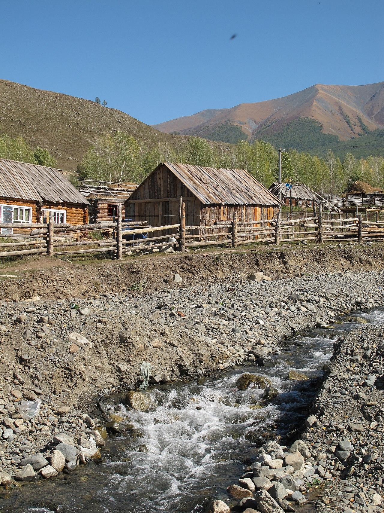

# 北疆 · 喀纳斯与戈壁的旺季错峰大环线｜8 天自驾执行手册

> **旅行时间**：2026/8/23（日）— 8/30（日）
> **旅行人数**：2 人
> **总天数**：8 天 7 晚，全程自驾约 2,000 km
> **核心目的地**：乌鲁木齐 → 卡拉麦里 → 可可托海 → 布尔津/五彩滩 → 喀纳斯 → 白哈巴 → 禾木 → 世界魔鬼城 → 乌鲁木齐
> **人均预算**：0.9～1.2 万元人民币（2 人总计约 1.8～2.4 万元，含机票）

> ⚠️ **出发前 72 小时必办清单**（今天看到就立刻做）：
> 1. **买门票**：喀纳斯、禾木、白哈巴全部实行**实名制线上购票，窗口不卖当日票**。微信搜"喀纳斯景区"公众号或"原行网"小程序，把 D4 喀纳斯、D5 白哈巴、D6 禾木的票一次买好（推荐直接买**全域通票**，见 D4）。
> 2. **订禾木木屋**：8 月底仍是旺季，禾木村内木屋 800～1,500 元/晚且越临近越贵，今晚就订（选带独立卫浴+电热毯的）。
> 3. **办白哈巴电子边境通行证**：2026 年起喀纳斯游客中心**不再现场办理**，须在"原行网"购票页按指引线上提前办理，或在 D3 路过布尔津时到县政务大厅办理（工作时间）。
> 4. **订机票和租车**：8 月 23 日周日落地、30 日周日晚班机返程，机票选 15:00 前落地、21:00 后起飞。

---

## 为什么这个时候去北疆？怎么对付旺季？

先说实话：8 月 23～30 日不是北疆的"空档期"——它是**暑假旺季的尾巴**，喀纳斯日均客流还在 3 万人上下，区间车排队 30～60 分钟是常态。但它也有自己的红利：额尔齐斯河和喀纳斯湖处在**全年水量最足、颜色最浓**的时候，草原还是绿的，白桦林刚刚开始泛黄尖，气温 10～25℃ 不冷不热，而且越靠近 8 月 30 日，人流越是逐日退潮——你们等于站在退潮的起点上。

与 **6～7 月的伊犁线**相比，这个季节阿勒泰线赢得毫无悬念：伊犁的草原 8 月底已经黄透发干，而喀纳斯—禾木正朝着初秋渐变色的方向走。与 **9 月中下旬的金秋**相比，你们看不到最浓的金色，但也避开了翻三倍的房价和观景台的长队——用一点颜色换一大截从容。与 **国庆**相比就更不用提了。

对付旺季，这份手册只有三招，但招招致命：**①票全部提前线上买好；②喀纳斯、禾木、白哈巴全部压在周三～周五（8/26～8/28），周末留给不排队的魔鬼城和高速公路；③每天赶 8:00 首班区间车进山，10 点前攻下观鱼台。**做到这三条，你们看到的北疆和"人少价低"的 9 月差别不大。

**这是"旺季尾巴"里用策略换体验的最优解。**

---

## 行程总览

| 天数 | 星期 | 路线 | 住宿地 | 核心体验 | 开车距离 |
|:---:|:---:|:---|:---|:---|:---:|
| D1 | 日 | 飞抵乌鲁木齐 → 机场取车 → 市区 | 乌鲁木齐 | 自治区博物馆、国际大巴扎 | 约 20 km |
| D2 | 一 | 乌鲁木齐 → 卡拉麦里 → 可可托海镇 | 可可托海镇 | 戈壁公路、野生动物、三号矿坑 | 约 470 km |
| D3 | 二 | 可可托海景区 → 阿勒泰 → 布尔津 → 五彩滩 | 布尔津 | 额尔齐斯大峡谷、五彩滩日落、河堤夜市 | 约 370 km |
| D4 | 三 | 布尔津 → 贾登峪 → 区间车进喀纳斯 | 贾登峪 | 三湾栈道、喀纳斯湖 | 约 150 km |
| D5 | 四 | 观鱼台晨景 → 白哈巴 → 回贾登峪 | 贾登峪 | 俯瞰变色湖、中哈边境大峡谷、西北第一村 | 区间车日 |
| D6 | 五 | 贾登峪 → 禾木 | 禾木村 | 禾木公路、观景台日落炊烟、银河 | 约 90 km |
| D7 | 六 | 禾木晨雾 → 布尔津 → 乌尔禾魔鬼城 → 克拉玛依 | 克拉玛依 | 晨雾日出、雅丹落日 | 约 420 km |
| D8 | 日 | 克拉玛依 →（可选独山子大峡谷）→ 乌鲁木齐还车 | — | 高速返程、晚班机回家 | 约 400 km |

> **设计逻辑**：顺时针环线——先走东侧 G216 戈壁线北上（趁体力好消化最长车程），把最金贵的喀纳斯、白哈巴、禾木压在**周三至周五**三个工作日（人流的相对低谷），周六周日留给魔鬼城和纯高速返程（这两个地方人再多也不影响体验）。全程换 6 次酒店但贾登峪连住两晚不挪窝；D5 是全程唯一不开车的一天，正好夹在两个长途日之间回血。所有时间均为**北京时间**（新疆作息比内地晚约 2 小时，8 月底日落约 20:50～21:00，每天都比你们想象的"长"）。

---

# D1｜落地乌鲁木齐 · 取车与大巴扎
**主题：抵达西域，先吃为敬**

*新疆国际大巴扎：宣礼塔、馕坑与手风琴声里的第一晚*

## 交通
- **航班**：全国主要城市均有直飞乌鲁木齐地窝堡机场（URC），华东出发约 5 小时。建议选 **15:00 前落地**的班次，给取车和倒时差留足余量。
- **机场取车**：地窝堡机场周边是租车公司聚集地（神州、一嗨、悟空及携程/飞猪平台商家均有门店，多数提供航站楼免费接送取车）。8 月底仍是暑期价，**紧凑型 SUV 约 400～550 元/天**——如果还没订，今晚就订，旺季尾巴的车源比你们想的紧。
- **取车清单**：①绕车拍视频记录划痕；②确认备胎与工具齐全（北疆部分路段碎石多）；③保险建议直接买"全险/尊享服务"，重点覆盖**玻璃与轮胎**——山路飞石是北疆最常见的出险项；④确认取还车都在机场店，环线无需异地还车费。

## 住宿
**推荐：大巴扎/二道桥商圈的连锁酒店（亚朵、美居级别）**
- 价格：约 300～400 元/晚。
- 理由：明早要走 G216 北上，市区南部出城顺路；步行可达大巴扎，第一晚的"新疆开场"不用再开车。

## 活动

### 下午（可选）：新疆维吾尔自治区博物馆
如果航班 14:00 前落地，强烈建议把安顿后的第一站给**自治区博物馆**（免费，微信公众号实名预约，**周一闭馆——今天是周日，正常开放**）。"楼兰美女"干尸、《伏羲女娲图》绢画和整厅的丝路文书织锦，是这片土地最浓缩的"前情提要"——先看懂西域三千年，再出发去看它的山河，整条环线都会厚一层。1.5～2 小时足够；落地晚就果断放弃，别为它压缩睡眠。

### 傍晚：新疆国际大巴扎
落地安顿后直奔**国际大巴扎**。别把它当购物点——把它当氛围预习：宣礼塔下的鼓声、烤包子出炉时的羊油香、干果摊主递过来的一把巴旦木。工艺品别在这买（景区价），干果可以少量试吃采购。

### 晚餐：大巴扎周边烤肉 + 手抓饭
第一顿建议按"标准动作"来：**红柳烤肉、烤包子、手抓饭、卡瓦斯（蜂蜜发酵饮料）**。新疆的羊肉没有膻味这件事，需要亲口验证一次。

## 小贴士
- **今晚的最后检查**：喀纳斯/禾木/白哈巴门票、禾木木屋、白哈巴电子边防证、未来几天的酒店——全部截图存离线（山区信号断续）。
- **作息切换**：今晚别早睡。新疆餐馆 22:00 依然热闹，按当地节奏 23:30 前睡够即可，明天 9:00 出发完全来得及。
- 落地后在便利店补充：2 箱矿泉水、湿巾、防晒霜（新疆紫外线是华东的 1.5 倍）。

---

# D2｜穿越卡拉麦里 · 抵达可可托海
**主题：长途转场日，戈壁是主角**

*G216 卡拉麦里段：笔直的公路两侧，是蒙古野驴和鹅喉羚的领地*

## 交通
- **路线**：乌鲁木齐 → G216 → 恰库尔图（午餐）→ 富蕴县 → 可可托海镇，**约 470 km，含休息 6～6.5 小时**。这是全程最长的一天，但路况极好（高速+一级公路），且风景就在路上。
- **要点**：出发前加满油；富蕴县之前加油站间隔可达 100 km+，**油表过半就加**。

## 住宿
**推荐：可可托海镇上的宾馆/民宿**
- 价格：约 300～400 元/晚。
- 理由：住镇上而非富蕴县城，第二天早上 5 分钟即达景区门口，比住富蕴的人早进山 1 小时——可可托海的清晨光线和空栈道，值这一晚。

## 活动

### 上午—下午：G216 卡拉麦里有蹄类保护区（车览）
出城约两小时后进入**卡拉麦里自然保护区**路段：荒漠草原一望无际，运气好能看到**普氏野马、鹅喉羚、蒙古野驴**在公路两侧觅食（清晨和傍晚概率最高）。
- 只在观景带停车拍照，别追逐动物，别下路基。
- 中午在 **恰库尔图镇** 吃碗过油肉拌面——G216 上的标准卡车司机午餐，量大味正。

### 傍晚：三号矿坑
16:30 前后抵达可可托海镇，先去镇郊的**三号矿坑**（可可托海稀有金属国家矿山公园，约 1.5 小时）：一个螺旋向下、深 200 米的巨型露天矿坑。它贡献了中国"两弹一星"所需的绝大部分铍、锂、钽铌——地质陈列馆里那段"用矿石还苏联外债"的历史，比风景更让人沉默。

### 晚餐：额河冷水鱼
镇上的额尔齐斯河冷水鱼（高白鲑、金鲫）清炖或红烧都好，配野蘑菇汤饭。

## 为什么值得为可可托海绕这一程？
先把预期放对：可可托海的风景是"清秀"，不是"震撼"——去过的朋友多半会告诉你们"景色不行"，这个评价不冤。我们仍然保留它，理由有二：一是**三号矿坑的人文分量**在整个北疆独一份——一个小镇用一座矿坑撑起过共和国的家底，这段历史值得专程；二是它把 940 km 的"乌鲁木齐→布尔津"拆成两天，每天都在 6.5 小时以内——**不砍景点，砍疲劳**。明早的神钟山当作顺带的晨间散步就好，期待值放低，反而会被额河的水色小小惊喜到。

---

# D3｜额尔齐斯大峡谷 · 傍晚五彩滩
**主题：花岗岩巨钟与烧红的河岸**

*神钟山：365 米高的花岗岩独石，像一口倒扣在额尔齐斯河边的巨钟*

## 交通
- **上午**：可可托海景区（门票约 116 元 + 区间车；若计划连矿山公园一起深度逛，有含区间车的三大景区联票约 223 元/人）。
- **下午**：可可托海 → 富蕴 → 阿勒泰市 → 布尔津，**约 320 km，4.5 小时**；傍晚布尔津 → 五彩滩往返约 50 km。
- 全天合计约 370 km。

## 住宿
**推荐：布尔津县城酒店（河堤夜市步行圈）**
- 价格：约 350～500 元/晚（旺季略有上浮）。
- 理由：布尔津号称"童话边城"，是喀纳斯的门户镇，酒店密度高、性价比全线最好；住河堤附近，晚上夜市步行即达。

## 活动

### 上午：可可托海景区 · 神钟山
09:00 开园即进，区间车沿额尔齐斯河上行至**神钟山**：一整块 365 米高的花岗岩独石拔河而起，岩壁上有冰川磨出的竖直凹槽。沿河栈道走 1～1.5 小时，8 月底水量正足，河水是浅碧色，白桦树尖刚泛出第一层黄。12:30 前出景区，镇上午餐后出发。

### 傍晚：五彩滩日落（今日高潮）

*五彩滩：低角度的落日把风蚀泥岩从赭黄烧到绛红*

19:30 从布尔津出发，24 km 到**五彩滩**（门票约 50 元）。这是额尔齐斯河北岸的一片雅丹河滩：**一河隔两岸**——南岸是墨绿色的杨树林带，北岸是被风蚀成波浪状的彩色泥岩。日落前 40 分钟（8 月底约 20:50 日落），泥岩从赭黄一路烧到绛红，是全疆最著名的日落机位之一。
- 一定要**日落前 1 小时**到，光线角度低了颜色才出来；白天来只是一片土坡。
- 带件外套，河风傍晚转凉。

### 晚餐：布尔津河堤夜市
回城后直奔**河堤夜市**：炭火**烤狗鱼**（额河特产，肉细刺少）配一杯冰**格瓦斯**（俄式蜂蜜发酵饮料）——这是布尔津作为"中俄口岸小镇"的味觉遗产。

## 小贴士
- **白哈巴边防证最后办理窗口**：如果电子边境通行证还没在线办好，今天务必在布尔津县政务大厅工作时间内补办（明天一早就进山了）。已办好的，今晚把通行证和门票二维码截图离线保存。
- 布尔津是边境县，进出县城有检查站，**身份证放在随手可取的地方**。
- 明天开始进山，今晚在县城超市补零食和水（山里物价翻倍）。

---

# D4｜喀纳斯 · 三湾与湖区
**主题：换乘进山，湖水的颜色说了算**

*进山之路：云杉夹道、云雾压顶，去喀纳斯的公路本身就是风景*

## 交通
- **自驾段**：布尔津 → 冲乎尔 → 贾登峪门票站，约 150 km 山路，2～2.5 小时（多处区间测速，跟着导航限速走）。
- **换乘段**：5 月—10 月 15 日夏季运营期，**私家车一律不能进入喀纳斯核心区**，停贾登峪停车场，换景区区间车约 1 小时进山（出入园时间 08:00～20:00）。
- **购票（重点）**：你们要把喀纳斯（今明两天）、白哈巴（明天）、禾木（后天）连起来玩，直接买**喀纳斯+禾木+白哈巴全域通票（约 375 元/人：门票 195 + 三地区间车 180，3 天有效）**，比单买"喀纳斯二进 270 + 白哈巴 75 + 禾木 75"省约 45 元/人，且一次买齐不用每天抢票。若只想玩喀纳斯一处，则选**二进票 270 元/人**（门票 160 + 区间车 110，48 小时内进两次，第二次免门票）。票已在出发前线上买好，现场刷身份证入园。

## 住宿
**推荐：贾登峪度假村酒店（连住两晚）**
- 价格：约 500～700 元/晚（旺季价，提前订）。
- 理由：这是关键取舍——**住贾登峪而不是湖区里面**。湖区内木屋旺季涨到 1,000～4,000 元/晚且条件简陋；贾登峪酒店有热水暖气、车就停在楼下，明早赶 8:00 首班区间车反而更快。连住两晚意味着明晚不用收拾行李，D5 可以轻装玩一整天。

## 活动

### 下午：三湾栈道徒步（顺光时段）
中午前后抵达、进山。区间车沿喀纳斯河上行，依次经过**卧龙湾、月亮湾、神仙湾**三个站。正确玩法是：坐到卧龙湾下车，**沿河边栈道向上游步行串起三湾**（全程约 6 km，2.5～3 小时，平缓木栈道）。这 6 km 是全喀纳斯景色密度最高的一段，**无论多想省力都不要全程坐车**——车窗里的三湾和栈道上的三湾，是两个景区。下午阳光正好打在河面上，8 月底水量最足，湖水呈现那种被反复拍进纪录片的**奶蓝色**（冰川岩粉悬浮散射所致），云杉林一路遮阴。

### 傍晚：喀纳斯湖边

*喀纳斯湖：三面雪山围出的一块 24 km 长的翡翠*

栈道走完换乘区间车到**换乘中心/湖区**，在喀纳斯湖一号码头看湖：三面雪山围着 24 km 长的冰碛堰塞湖，傍晚风停时湖面是一块完整的翡翠。**20:00 末班区间车**出山回贾登峪，19:00 前开始往车站走，旺季排队 30 分钟起，别卡点。

### 晚餐：贾登峪度假村
度假村餐厅解决（大盘鸡、汤饭）。别期待惊喜，今晚吃的是方便。

## 小贴士
- **旺季排队心法**：进山、出山的区间车高峰是 9:00～11:00 和 17:00～19:00。你们今天下午 13:00 前后进山、19:00 前出山，恰好都在低谷。
- 湖区海拔约 1,370 米，无高反，但傍晚只有 10℃ 上下——**抓绒+防风外套**带进山。
- 游船（约 120 元）和"湖怪"观测可跳过：性价比低，湖的美在岸上和明早的观鱼台。
- 徒步爱好者请记下：喀纳斯与禾木之间有一条经典的**两日徒步穿越线**（经黑湖），风景比公路线野得多。这次的取车动线装不下它，把它记在"下一次"的清单上。

---

# D5｜观鱼台晨光 · 白哈巴边境村
**主题：先俯瞰整面湖，再走到国境线边上**

*白哈巴：中哈边境的"西北第一村"，木屋、白桦与界河组成一幅油画*

## 交通
- **今天是纯区间车日，车整天不动**。清晨二次进山（全域通票/二进票含），换乘中心现场扫码购**观鱼台专线票（20 元/人往返，每小时限量，去晚了要排大队）**。
- **下午**：换乘中心 → 白哈巴区间车约 1 小时（沿途停中华林、中哈界碑），班次固定，**上车前先问清末班回车时间**（通常 17:00～18:00 前后），玩多久由末班车倒推。
- 白哈巴门票+区间车 75 元/人（已含在全域通票内），**电子边境通行证**与身份证随身带，进村子路口查验。

## 住宿
**继续住贾登峪（第二晚）**
- 理由：不挪窝是今天最大的奢侈。清晨空手进山，傍晚回来直接吃饭睡觉，行李一次都不用收拾。

## 活动

### 清晨—上午：观鱼台俯瞰喀纳斯湖（务必赶早）
**08:00 首班区间车进山**，到换乘中心立刻买观鱼台专线票上山，再爬 1,068 级台阶（约 40 分钟）登顶（海拔 2,030 米，比湖面高 600 米）。从这里俯瞰，喀纳斯湖是一条嵌在雪山之间的绿宝石长廊；清晨常有云海和晨雾贴着湖面流动，湖水随光线在**青、蓝、绿**之间变色。**10 点前登顶和 11 点后登顶是两个景区**——前者独享机位，后者排队两小时。11:00 下山，换乘中心午餐（有肯德基，旺季里它是出餐最快的选择）。

### 下午：白哈巴 · 西北第一村
12:30 前后坐上白哈巴区间车。这一个小时的公路本身就是节目：翻过一道山梁，**中哈边境大峡谷**突然铺开——铁丝网沿着国境线延伸，对岸哈萨克斯坦的山林河流清晰可见。白哈巴村比禾木小、比禾木安静，日承载量只有 3,500 人（禾木的零头）：原木屋子散落在草坡上，牧民家的包尔萨克（油炸面点）配咸奶茶是这里的标准下午茶。在村口的观景台看村子全景和界河，按末班车时间返程，20:00 前出景区回贾登峪。

### 晚餐：贾登峪
今晚可以稍微讲究一点，找度假村里有烤肉的餐厅，算是给"区间车日"的腿一点补偿。

## 为什么是白哈巴，而不是在喀纳斯多耗一天？
喀纳斯湖区的核心机位（三湾+湖边+观鱼台）一天半足够榨干，第三天开始就是审美重复。白哈巴带来的是**完全新的东西**：国境线的地理震撼、一个还没被旅行团踩烂的图瓦—哈萨克村落、以及全景区最便宜的门票（30 元）。它在 7 天的行程里塞不下，8 天正好——这就是这份新攻略比旧版多出来的那一天，花在了刀刃上。

---

# D6｜转场禾木 · 日落炊烟
**主题：从换乘枢纽，睡进童话村**

*禾木的路权属于牛群：草坡渐黄，原住民优先通行*

## 交通
- **上午**：贾登峪睡到自然醒（连续两个早起日之后的刻意留白），10:00 前后取车出发。
- **自驾段**：贾登峪 → 原路下撤至冲乎尔 → 东转禾木公路 → **禾木门票站**，约 90 km，1.5～2 小时。禾木公路本身就是风景：额尔齐斯河支流一路相伴，草坡上是成群的牛羊。
- **换乘段**：私家车**不能进禾木村**（夏秋季），停门票站停车场，换区间车约 1 小时进村。禾木门票 50 元 + 区间车往返 25 元/人（已含在全域通票内——注意通票 3 天有效期从 D4 首次入园起算，今天正好是第三天；购票时务必再确认有效期覆盖到今天）。

## 住宿
**推荐：禾木村内木屋民宿（务必已提前订好）**
- 价格：约 800～1,500 元/晚（旺季真实行情，越临近越贵；这就是为什么出发前 72 小时清单里把它列在第二位）。
- 理由：**全程最值得花钱的一晚**。禾木的灵魂在清晨——只有睡在村里，明早才赶得上观景台的晨雾日出。选带独立卫浴和电热毯的木屋（8 月底夜温 5～8℃）。

## 活动

### 下午：村里闲逛 + 禾木河边
13:00 前后进村，安顿后不做任何"景点安排"：沿着禾木河走，看老鹰在木屋上空盘旋，看图瓦人把马拴在栈道上。8 月底的草坡是绿中带黄的过渡色，游客比 7 月少了小一半，村里的狗都比上个月松弛。

### 傍晚：禾木观景台日落
19:30 沿村内步道上**禾木观景台**（步行 30～40 分钟缓坡，也有村内接驳车）。日落时分（约 20:50）整个河谷铺开在脚下：原木屋顶升起一条条笔直的**炊烟**，禾木河闪着金光，白桦林边缘已经有第一抹黄。待到 21:30 天黑下台，村里几乎没有光污染——**抬头就是银河**。

### 晚餐：木屋民宿家常菜
在民宿吃：奶茶、列巴（俄式面包）、奶疙瘩配炖羊肉。图瓦人的餐桌简单，但在 8℃ 的夜里热奶茶就是一切。

## 小贴士
- 明早要看日出，今晚 23:00 前睡。把头灯/手机电充满，明早摸黑上路要用。
- 旺季的禾木观景台日落人不少，想架三脚架就 19:00 前上去占位置；纯肉眼欣赏的话 19:30 上去足够。

---

# D7｜禾木晨雾 · 魔鬼城落日
**主题：一天之内，从仙境到火星**

*清晨的禾木：晨雾从河谷漫上来，把整个村子泡在金色的光里*

## 交通
- **上午**：禾木区间车出村取车（首班车约 8:00 后，看完晨雾下山正好衔接）。
- **下午**：禾木门票站 → 布尔津（午餐）→ G217 南下 → **乌尔禾世界魔鬼城** → 克拉玛依市区，全天约 420 km，纯开车约 5 小时。今天是第二个长途日，但两头都是重头戏，中段高速轻松。

## 住宿
**推荐：克拉玛依市区连锁酒店（万达广场/世纪公园一带）**
- 价格：约 250～350 元/晚。
- 理由：克拉玛依是油城，酒店新、便宜、停车方便，纯粹的功能性一晚，为明天还车赶飞机做缓冲。

## 活动

### 清晨：观景台晨雾日出（全程最高光时刻）
06:40 起床，07:00 摸黑上观景台（带头灯或手机照明）。8 月底日出约 07:15：先是雪山尖被点亮，然后阳光下切到河谷，**晨雾正好在这时从禾木河上漫起来**——村庄、桦林、炊烟全部泡在半透明的金雾里，每年无数摄影师为这 20 分钟守在这里。清晨约 5～8℃，把所有能穿的都穿上。
- 回民宿吃热早餐，退房，10:30 前后坐区间车出村，行程从"仙境模式"切换回"公路模式"。

### 傍晚：世界魔鬼城（乌尔禾雅丹）
18:30 前抵达**世界魔鬼城**（门票约 42 元 + 观光小火车 20 元，售票至 19:00 止，务必卡好时间）。小火车沿 10 km 环线穿过风蚀雅丹群——"城堡""舰队""石猴"在斜阳下从土黄烧成橙红，风穿过岩缝发出呜咽声，这就是"魔鬼城"名字的由来。傍晚的低角度光线是这里唯一正确的打开方式，正午来只有一片惨白。周六的魔鬼城人会比工作日多，但雅丹的尺度消化得了人群，这是把周末留给它的原因。

*雅丹之夜：风声与银河，是这座"城"仅有的居民*

### 晚餐：克拉玛依夜市烤肉
油城的烤肉便宜实在，配一扎卡瓦斯，给北疆的最后一个完整夜晚收尾。

---

# D8｜回程乌鲁木齐 ·（可选）独山子大峡谷
**主题：高速收尾，零风险赶飞机**

*回程模式：笔直与空旷，是环线留给你们的最后一种风景*

## 交通
- **路线**：克拉玛依 → G3014/G30 高速 → 乌鲁木齐地窝堡机场还车，约 400 km，纯高速 4～4.5 小时。
- **航班**：订 **20:30 以后**起飞的返程航班最稳（17:00 前还车，含验车和机场摆渡；周日晚是返程高峰，机场安检多留 30 分钟）。
- **还车清单**：加满油（机场附近加油站）、拍油表和公里数、留存验车单照片、7 天后查一次违章代扣。

## 活动

### 可选：独山子大峡谷
如果订到晚班机，在独山子出口下高速加一站**独山子大峡谷**（车程仅偏离主线 20 km，门票约 30 元）：奎屯河把戈壁切出 200 米深的沟壑群，沟壁像被巨梳梳过的千层岩。玻璃观景台 + 峡谷步道 1～1.5 小时足够。**如果航班在 21:00 前，直接放弃它**——赶飞机的从容比任何景点都值钱。

*独山子大峡谷：奎屯河亿万年的切割现场*

### 午餐：独山子/奎屯服务区或市区快餐
返程日不做美食安排，准点还车是唯一 KPI。

## 收尾
17:00 机场还车，安检后在候机楼把没吃够的烤包子补上。落地后，你们手机相册的前 200 张，大概率全是喀纳斯的水、白哈巴的国境线和禾木的雾。

---

## 三个"为什么不"

### 为什么不走伊犁线（赛里木湖/那拉提/独库公路）？
伊犁的主场是 6～7 月：草原花期、天山红花、牧场翻绿。8 月底草色已黄透发干，独库公路全程走完要占掉 3 天且弯道强度大。同样 8 天，阿勒泰线在这个季节的风景兑现率高得多。**伊犁和独库留给下一次的 6 月。**

### 为什么不加天山天池？
天池离乌鲁木齐 100 km，但方向与环线相反（东侧），且它与喀纳斯同属"雪山+湖"审美，级别却低一档。D1 落地日塞它太赶，D8 还车日加它有误机风险。**审美重复的景点，砍。**

### 为什么不住喀纳斯湖区内？
旺季湖区内木屋 1,000～4,000 元/晚、条件差一档、且晚上无事可做（商业街很小）。住贾登峪用二进票/全域通票两次进山，钱和体验都更优。**住宿的预算，集中花在禾木的木屋上。**

---

## 北疆自驾要点（必读）

- **时间**：全疆用北京时间，但作息晚 2 小时——8 月底日出约 07:15，日落约 20:50。本手册所有时间均为北京时间。
- **门票**：喀纳斯、禾木、白哈巴全部**实名制线上购票**（"喀纳斯景区"公众号/"原行网"小程序），窗口不卖当日票；旺季建议提前 3～7 天购买。全域通票 375 元/人 3 天有效，买单前确认有效期覆盖你们的 D4～D6。
- **边防证**：去白哈巴需**电子边境通行证**，2026 年起喀纳斯游客中心不再现场办理——线上提前办，或在布尔津县政务大厅工作时间办理。身份证原件全程随身。
- **加油**：进加油站需司机出示身份证，乘客通常需下车步行进站；戈壁段**油表过半就加**，别赌下一个加油站。
- **测速**：国道/山路大量**区间测速**（限速 40～80 不等），严格跟导航提示走，超速拍到就是实打实的罚单。
- **检查站**：边境县（布尔津、哈巴河一带）进出有治安检查站，身份证人手一张随时可取，全程配合即可，通常 2 分钟过站。
- **牲畜**：山区公路随时可能有牛羊马横穿，**撞了要照价赔偿**，见到畜群提前减速停车让行。
- **网络**：喀纳斯、禾木山区信号断续，出发前下载**离线地图**（高德/百度均可），门票二维码、边防证、民宿信息全部提前截图。
- **穿衣**：三层法则——短袖打底 + 抓绒 + 防风外套，禾木清晨再加轻羽绒；防晒霜、墨镜、润唇膏是戈壁三件套。
- **无人机**：白哈巴全域禁飞，喀纳斯、禾木需提前报备，边境地区别抱执念。

---

## 预算参考

| 项目 | 人均预算 | 备注 |
|:---|:---|:---|
| 往返机票 | 3,000～4,500 元 | 华东/华北 → 乌鲁木齐，8 月底暑期尾声，价格高于 9 月 |
| 租车+油费+路桥 | 约 2,500 元 | SUV 约 450 元/天 × 8 天 + 油费约 1,700 元，2 人分摊 |
| 住宿（7 晚） | 约 1,500～2,200 元 | 禾木木屋为单晚最高（800～1,500 元/间），贾登峪连住两晚 |
| 门票+区间车 | 约 760 元 | 可可托海约 140～223 + 五彩滩 50 + 全域通票 375 + 观鱼台 20 + 魔鬼城 62 + 独山子 30 |
| 餐饮 | 约 900 元 | 人均 110 元/天，含两顿"值得吃"的鱼 |
| **合计** | **约 9,000～12,000 元** | 2 人总计约 1.8～2.4 万元 |

> 旺季尾巴的北疆，比 9 月每人贵出约 1,500～2,000 元——这是为"草还绿、水最足"付的溢价。值不值，看你们站在观鱼台上那一刻的相册。
