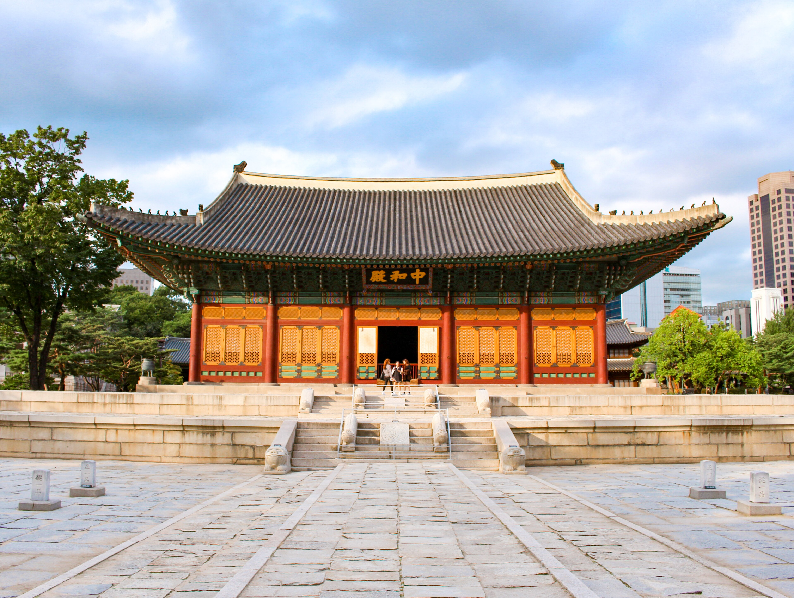
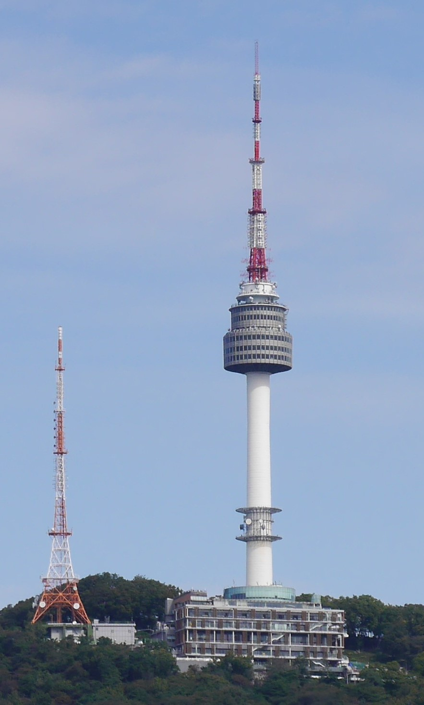
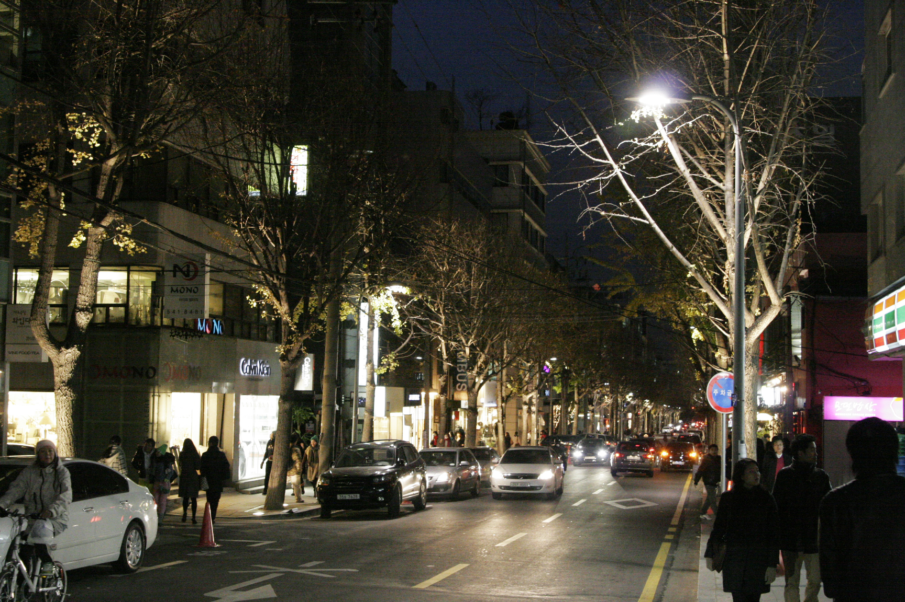

# 首尔·夏·三日执行手册

> **旅行时间**：7～8 月（首尔盛夏 + 雨季）
> **旅行人数**：2 人
> **总天数**：3 天 2 晚
> **核心目的地**：首尔市中心（钟路/明洞/南山/江南）
> **人均预算**：0.8～1.2 万元人民币（2 人总计约 1.6～2.4 万元）

---

## 为什么选首尔？

如果你们想要一场**"周末逃离 + 高密度体验"**的夏日短途，首尔是最被低估的答案。

与东京相比，首尔提供的是同等级的时尚、美食、K-文化，但**机票便宜 30%、签证更快、时差仅 1 小时**——一线城市周末三天的玩法几乎是为都市情侣量身定做。与曼谷或新加坡相比，首尔没有赤道的闷热暴晒（夏季虽热但不如热带，地铁商场空调极冷，反而是"室外热+室内凉"的舒适组合），却拥有同等级的夜生活和国际化氛围。

夏天的首尔，气温 28～33℃、湿度 70% 以上，正值雨季（장마），午后常有一两场阵雨。雨后的南山绿意葱茏，汉江的水面泛起微光；夜里的明洞霓虹灯穿过湿漉漉的空气，烧烤店的排烟弥漫在小巷。**这是亚洲最性感的夏天——炎热、清爽、潮流、人间烟火，三天可以全部塞进。**

---

## 行程总览

| 天数 | 星期 | 路线 | 住宿地 | 核心体验 | 开车距离 |
|:---:|:---:|:---|:---|:---|:---:|
| D1 | 六 | 仁川机场 → 明洞酒店 → 钟路 | 明洞 | 景福宫守门将交接、北村韩屋村、仁寺洞、清溪川夜步 | — |
| D2 | 日 | 明洞 → 昌德宫 → N首尔塔 → 明洞 → 汉江 | 明洞 | 昌德宫后苑、南山展望台、明洞购物、汉江炸鸡啤酒 | — |
| D3 | 一 | 明洞 → 益善洞 → 江南 → 仁川机场 | — | 益善洞韩屋咖啡、林荫道购物、COEX星空图书馆、江南韩牛 | — |

> **设计逻辑**：全程以**明洞**为单一据点（2 晚同酒店），地铁四通八达，没有换酒店压力；D1 走历史（钟路/北村），D2 走浪漫+现代（南山/明洞/汉江），D3 走潮流（益善洞/江南）然后直奔机场。全程地铁 + 步行，几乎不堵车。

---

# D1｜抵达首尔 + 朝鲜王朝的呼吸
**主题：抵达、穿越与烟火气**

*南山塔与汉江勾勒的首尔夏夜*

## 交通
- **航班**：建议选择**大韩航空、韩亚航空、济州航空**或国内航司（东航、南航、厦航）的直飞航班，**下午 14:00-17:00 抵达仁川国际机场（ICN）** 最佳。北京/上海/广州/深圳/青岛/沈阳/大连均有直飞，飞行时间约 2～3.5 小时。
- **机场 → 市区**：乘坐 **AREX 机场快线直达列车** 到首尔站，约 43 分钟，票价 9,500 韩元（约 50 元人民币）。再从首尔站换乘地铁 4 号线 2 站到明洞站。或选择 **AREX 普通列车**（约 58 分钟，4,150 韩元）。
- **市内交通**：在便利店（GS25、CU、7-Eleven）购买 **T-money 交通卡**（2,500 韩元工本费 + 充值），可用于地铁、公交、出租车。地铁起步 1,250 韩元（约 6 元），比单程票便宜且换乘便利。

## 住宿
**推荐：明洞乐天城市酒店（Lotte City Hotel Myeongdong）或 Hotel28 明洞**
- 位置：明洞地铁站步行 3～5 分钟。
- 价格：约 800～1,500 元人民币/晚。
- 理由：明洞是首尔的绝对中心，地铁 2/4 号线交汇，去景福宫、北村、南山、江南都直达；周围 24 小时便利店、明洞夜市、各国餐厅密集，到机场也有地铁直达。
- 备选：**首尔新罗酒店（The Shilla Seoul）**——高端选项，1,800～3,000 元/晚，有泳池和免税店礼宾。

## 活动

### 上午：光化门广场 → 景福宫
从酒店步行 15 分钟到 **光化门广场（Gwanghwamun Square）**。广场中央是世宗大王和李舜臣将军的铜像，背后是光化门（景福宫正门）。夏天广场上常有文化市集或喷泉展。

穿过光化门进入 **景福宫（경복궁，Gyeongbokgung）**：
- **守门将交接仪式（수문장 교대식）**：每天 11:00 和 14:00 在光化门举行，约 30 分钟。仪仗队穿着鲜艳的朝鲜王朝传统服饰，吹号鸣鼓、色彩斑斓——这是首尔最具仪式感的"穿越"体验。
- **必看**：勤政殿（国王办公的宫殿）、庆会楼（石造水上楼阁）、国立民俗博物馆（免费）。
- **门票**：成人 3,000 韩元（约 15 元人民币），**穿韩服可免费入场**（景福宫附近有很多韩服租赁店，约 15,000-30,000 韩元/2 小时）。
- **小贴士**：7-8 月首尔极热，景福宫几乎没有遮阴，建议**早 9 点开门即入**，或午后来；带防晒霜、帽子和充足水分。

### 中午：北村韩屋村
从景福宫步行 10 分钟到达 **北村韩屋村（북촌한옥마을，Bukchon Hanok Village）**。这是首尔保存最完整的传统韩屋聚落，600 多栋瓦顶木屋沿着山坡错落排列。

- **看点**：北村八景（最经典的是**第 5 景和第 8 景**，可以俯瞰成片的韩屋青瓦屋顶与现代高楼同框，是首尔最经典的明信片视角）。
- **小贴士**：北村是**居民区**，请保持安静、不要进入私人住宅；周末人极多，建议工作日或清晨前往。
- **体验**：可以预约**韩屋茶馆（찻집）**，坐在木地板上喝一杯**大麦茶或五味子茶**，配韩果（韩国传统点心）。

### 下午：仁寺洞
从北村步行 15 分钟下山到 **仁寺洞（인사동，Insadong）**。这条 500 米长的街道是首尔的"文化心脏"：
- **Ssamziegil**：圆形螺旋建筑，每层都是独立艺术家工作室和手工艺品店。
- **古代美术品街**：传统韩纸、陶瓷、扇子、印章等。
- **美食**：**仁寺洞饺子（인사동만두）**——手工现包的韩式饺子配醋辣酱；或**경주식당（庆州食堂）**的韩定食。

### 傍晚：清溪川夜步
从仁寺洞步行 10 分钟到 **清溪川（청계천，Cheonggyecheon）**。这条 11 公里长的城市溪流被复原在城市中心，沿岸有 22 座小桥、喷泉和雕塑。**夏夜**，溪水潺潺、两岸 LED 灯光亮起，是首尔最浪漫的散步道。
- **小贴士**：从广桥（광교）到五间水桥（오간수교）这段最美；清溪川沿岸偶有街头艺人表演。

## 晚餐：钟路烤肉街
- **推荐**：**진주식당（Jinju Sikdang 晋州食堂）**——首尔最有名的烤五花肉老店之一。炭火烤架上肥瘦相间的 삼겹살 滋滋作响，配上芝麻叶、蒜片和韩国大酱，是抵达第一晚最满足的仪式。
- **人均**：30,000～50,000 韩元（约 150～250 元人民币）。
- **小贴士**：钟路三街到钟路五街之间集中了大量烤肉店，可以现场排队或使用 **CatchTable** APP 预约。

---

# D2｜浪漫南山 + 摩登明洞
**主题：高塔、购物与汉江之夜**

*N首尔塔在南山之上的玫瑰金色灯光*

## 交通
- 酒店 → 昌德宫：地铁 4 号线明洞 → 3 号线安国，步行 5 分钟。
- 昌德宫 → N首尔塔：地铁回明洞站，步行 15 分钟到南山缆车站。
- 明洞 → 汝矣岛汉江公园：地铁 2 号线 → 5 号线，约 25 分钟。

## 活动

### 上午：昌德宫与后苑（UNESCO 世界遗产）
**昌德宫（창덕궁，Changdeokgung）** 是朝鲜五大宫殿中**保存最完好**的一座，1997 年被列入 UNESCO 世界文化遗产。

- **后苑（비원 / 秘苑）**：昌德宫的精髓——这片"秘密花园"曾是国王的私人园林，需要**提前在官网预约**（限流，11,000 韩元含中文导游，约 90 分钟）。
- **看点**：芙蓉池、宙合楼、尊德亭、爱莲亭；山势与水面、亭台与花木的搭配极具东方园林美学。
- **门票**：宫殿 1,000 韩元，后苑 8,000 韩元，联票 16,000 韩元（含仁显王后墓）。
- **小贴士**：夏季后苑绿意最盛，**强烈建议预约最早一场（10:00）**，既避暑又避人。

### 中午：南山缆车 + N首尔塔
从昌德宫地铁回明洞站，步行 10 分钟到 **南山缆车站（Namsan Cable Car）**。乘缆车 3 分钟登上 243 米的南山。

- **N 首尔塔（N Seoul Tower / 남산타워）**：首尔地标，海拔 243 米的观景塔。**塔顶观景台** 可 360° 俯瞰首尔全城，天气晴好时可远眺汉江和北汉山。
- **爱情锁墙**：塔下平台挂满五颜六色的爱情锁——是情侣必拍的浪漫点。
- **门票**：观景台成人 16,000 韩元；缆车往返 14,000 韩元（步行上山免费但较累，夏季不推荐）。
- **小贴士**：**建议下午 16:00-18:00 上山**，可以同时看日景和华灯初上的夜景，比纯夜景更出片。

### 下午：明洞购物
从南山缆车下来，步行 5 分钟回到 **明洞（명동，Myeongdong）**——首尔最大的购物街区之一。

- **必逛**：
  - **明洞圣堂**：哥特式天主教堂，明洞街区的视觉地标。
  - **明洞夜市**：从下午 5 点开始，各种韩国小吃摊位陆续摆出。
  - **Olive Young**：韩国版屈臣氏，彩妆面膜的购物圣地。
  - **乐天免税店（Lotte Duty Free）**：明洞本店楼高 12 层，是亚洲最大的市内免税店之一。
- **必吃**：**韩式糖醋肉（탕수육）**、**辣炒年糕（떡볶이）**、**旋风土豆（회오리감자）**、**鱼形烧（붕어빵）**——明洞街头的美食摊是首尔最浓缩的"街头烟火"。

### 傍晚：汝矣岛汉江公园 + 炸鸡啤酒
乘地铁 25 分钟到 **汝矣岛汉江公园（여의도 한강공원）**。汉江是首尔的母亲河，江边有 12 个公园，**汝矣岛公园是其中最经典**的一段。

- **体验**：
  - **汉江游船（한강유람선）**：1 小时夜游，约 25,000 韩元/人。汉江两岸的首尔夜景——63 大厦、汝矣岛纯福音教堂、N 首尔塔——在灯光下流光溢彩。
  - **炸鸡啤酒（치맥）**：在汉江边点一份**교촌치킨（桥村炸鸡）**或 **BBQ 炸鸡** + 一扎 Cass / Terra 啤酒，是韩国夏天最具代表性的体验。**夏天晚上坐在汉江边吃炸鸡是首尔人的国民休闲**。
  - **小贴士**：7-8 月的汉江边有临时小卖部售卖炸鸡啤酒，也可以自己带垫子坐在江堤草地上。

## 晚餐推荐
- 如果不去汉江，**明洞的"王妃家（왕비집）"烤肉**也是经典选择。
- 想要更精致：明洞的**고봉삼계탕（高峰参鸡汤）**——夏季参鸡汤是首尔最受欢迎的食补。

---

# D3｜潮流江南 + 告别
**主题：现代首尔、咖啡与机场告别**

*林荫道（Garosu-gil）的法式梧桐与咖啡街*

## 交通
- 明洞 → 益善洞：地铁 4 号线 → 6 号线，约 20 分钟。
- 益善洞 → 林荫道：地铁 6 号线 → 3 号线新沙站，约 20 分钟。
- 林荫道 → COEX：地铁 3 号线 → 2 号线奉恩寺站，约 15 分钟。
- 江南 → 仁川机场：地铁 2 号线到首尔站（37 分钟），换乘 **AREX 直达列车**（43 分钟），总计约 80 分钟。

## 活动

### 上午：益善洞韩屋咖啡街
**益善洞（익선동，Iksundong）** 是首尔最近两年最火的"文艺复兴"街区——100 多栋 1930 年代韩屋被改造成咖啡馆、独立设计师店、餐厅。

- **必去**：
  - **국물떡볶이（汤汁辣炒年糕）**：益善洞 70 多年老店，仅此一家，辣炒年糕+饺子+炸物的"全套套餐"。
  - **한옥카페**：在木地板韩屋里点一杯**美式咖啡或韩方茶**，木窗与青瓦屋顶与现代咖啡文化形成奇妙融合。
  - **独立设计师店**：很多韩国本土设计师品牌的小店（Gentle Monster、Find Kapoor 等）。
- **小贴士**：益善洞小巷密布，适合**慢慢逛 2 小时**，拍照非常出片；每家店的装修都别具一格。

### 中午：江南林荫道
乘地铁到 **新沙站（신사역）**，步行 5 分钟进入首尔最优雅的购物街——**林荫道（가로수길，Garosu-gil）**。

- **特色**：400 米长的法式梧桐林荫道，两侧是设计精品店、买手店、咖啡馆和餐厅。
- **必逛**：
  - **10 Corso Como Seoul**：意大利时尚买手店首尔旗舰店。
  - **Aland**：韩国本土设计师集合店。
  - **Kakao Friends 旗舰店**：LINE 韩国对手 Kakao 的周边店，Ryan 狮子是首尔的网红卡通形象。
- **午餐**：**江南式 brunch**——推荐 **Plate（플레이트）** 或 **Masion de soil** 的法式吐司；或 **교자살롱（饺子馆）** 的韩式饺子。

### 下午：COEX Mall + 星空图书馆
乘地铁 5 分钟到 **三星站（삼성역）**，进入亚洲最大的地下购物中心之一 **COEX Mall**。

- **星空图书馆（별마당 도서관，Starfield Library）**：COEX 中庭的免费公共图书馆，**三层楼高的巨型书架**，灯光柔和、纸质书香气弥漫——是首尔最"上镜"的网红地标，没有之一。
- **购物**：COEX 内有 250 多家店铺，从平价品牌到高端设计师品牌应有尽有。
- **K-pop Square**：经常有 K-pop 主题展览。
- **小贴士**：夏季 COEX 空调极冷（常 18-20℃），可以顺便避暑。

### 晚餐：江南韩牛
在 COEX 或林荫道附近吃一顿**真正的高级韩牛（한우）**。

- **推荐餐厅**：
  - **마이 무드（Mood）** 江南店——韩牛烤肉 + 韩定食。
  - **뱃살삼겹살（乙侍）**——更平价的五花肉。
  - **우사미 프리미엄 韩牛 정육식당**——韩牛专门店，肉质天花板。
- **必点**：**雪花韩牛（꽃등심）**——大理石纹路的眼肉，烤至 5 分熟，入口即化，带淡淡奶香。
- **人均**：60,000～120,000 韩元（约 300～600 元人民币）。

## 机场交通与告别
- **江南 → 仁川机场**：地铁 2 号线到首尔站（37 分钟），换乘 **AREX 直达列车**（43 分钟），总计约 80 分钟，票价合计 9,500 韩元。或**直接打车**约 60,000-80,000 韩元（约 350-450 元人民币，60-80 分钟）。
- **建议返程航班时间**：晚 19:00-22:00 的航班最佳，晚饭后从容出发；如果时间紧，可预订 21:00 后航班。
- **机场购物**：仁川机场是全球最佳机场之一，**免税店 + 便利店 + 文化体验** 一应俱全。预留 2 小时逛免税店、买**韩国伴手礼**（正官庄红参、雪花秀、Laneige、Too Cool For School、济州火山泥面膜等）。

---

## 预算参考（2 人总计）

| 项目 | 人均预算（人民币） | 备注 |
|:---|:---:|:---|
| **国际往返机票** | 2,000～4,000 | 暑期旺季经济舱约 2,000-4,000 元/人（北京/上海/广州直飞 2-3.5 小时） |
| **住宿（2 晚）** | 1,600～3,000 | 明洞中档酒店 800-1,500 元/晚 |
| **市内交通** | 200～400 | AREX 往返 + T-money 卡充值 |
| **餐饮** | 1,500～2,500 | 烤肉/参鸡汤/炸鸡/咖啡/街头小吃，每天约 750-1,250 元/人 |
| **门票/体验** | 300～500 | 景福宫+昌德宫+首尔塔缆车+后苑+韩服租赁 |
| **购物** | 1,500～3,000 | 免税店化妆品+伴手礼（丰俭由人） |
| **签证/保险/杂费** | 500～800 | 韩国签证约 250-400 元/人 |
| **合计** | **约 7,600～14,200** | **人均 0.76～1.42 万元** |

---

## 行前准备清单

### 证件与签证
- [ ] **韩国签证**：至少提前 2-3 周申请。北京、上海、广州等领区可办 5 年多次签证，单次签证约 250-400 元。
- [ ] 护照（有效期 6 个月以上）。
- [ ] 国际信用卡（Visa/Mastercard，用于免税店消费）。
- [ ] 旅行保险（建议含医疗救援）。

### APP 下载
- **Naver Map / KakaoMap**：韩国本土导航，比 Google Maps 准确。
- **Papago**：韩国 Naver 出品的翻译 APP，中韩翻译非常准确。
- **Subway Korea**：首尔地铁官方 APP，实时查询线路和换乘。
- **CatchTable**：韩国版"大众点评"，可预约人气餐厅。
- **Klook / KKday**：预订景点门票、N 首尔塔缆车、炸鸡体验等。
- **Wise**：跨国汇款 APP，换韩元汇率更好。

### 衣物与装备
- [ ] **夏季轻薄衣物**：首尔 7-8 月 28-33℃，湿度高，穿短袖+短裤/裙。
- [ ] **薄外套/防晒衣**：地铁商场空调极冷（常 18-20℃）。
- [ ] **雨伞/雨衣**：7-8 月是雨季，午后阵雨频繁。
- [ ] **防晒霜+墨镜+遮阳帽**：户外活动必备。
- [ ] **舒适步行鞋**：每日步行 1.5-3 万步。
- [ ] **便携充电宝**：出门一整天必备。
- [ ] **转换插头**：韩国使用**两脚圆型插头（C/F 型）**，电压 220V。
- [ ] **少量现金**：传统市场、小餐厅、夜市摊位仍以现金为主。

---

## 关键决策说明

### Q1：为什么全程住在明洞，不分南北？
明洞位于首尔正中心，地铁 2/4 号线交汇，**到景福宫、北村、N 首尔塔、江南、机场都直达**。如果选择江南或弘大，虽然酒店更便宜/更年轻，但每天往返历史区要 30-40 分钟。三天时间宝贵，住在明洞是最均衡的选择。

### Q2：首尔夏天是不是太热了？
首尔夏天确实炎热（28-33℃）+ 高湿（70%+），但**没有东南亚那种闷到窒息的湿热**。关键是利用好"地下城市"——首尔的地铁、商场、餐厅空调都极冷（18-20℃），室外活动 + 室内避暑的节奏比想象中舒服。**7 月底-8 月初的雨季**反而比 8 月中下旬凉快。

### Q3：景福宫 vs 昌德宫 vs 德寿宫？
- **景福宫**：最大、最雄伟、有守门将交接仪式，是首尔的"故宫"。
- **昌德宫**：保存最完好，**后苑（秘苑）是必看**，UNESCO 世界遗产。
- **德寿宫**：免费，有**石造殿（韩国最早的西式建筑）**和换岗仪式。
- 三天时间，**景福宫 + 昌德宫**的组合是最经典的。

### Q4：汉江游船值得吗？
**强烈推荐**。1 小时的夜游船可以看到 N 首尔塔、63 大厦、汝矣岛纯福音教堂、盘浦大桥月光彩虹喷泉（夏季每晚 19:30、20:30、21:30 三场）。这是首尔最具"浪漫都市感"的体验，**夏天去是对的**。

### Q5：南怡岛或 DMZ 一日游要加吗？
三天时间很紧张，**南怡岛**（因《冬季恋歌》闻名，但夏天去其实不如春秋）建议放弃；**DMZ**（板门店）需要提前一周通过旅行社预约、对服装和行为有严格要求，且**夏天政治氛围紧张不建议**。如果你们有 4-5 天，可以考虑加上。

---

## 一句话总结

这 3 天，你们会从明洞的霓虹灯下出发，走进景福宫的守门将交接仪式、爬上北村韩屋村俯瞰青瓦屋顶，登上 N 首尔塔看华灯初上的首尔之夜，在汉江边啃一份淋满酱汁的炸鸡配冰啤酒，最后在江南的高级韩牛店结束这场夏日盛宴。

**首尔的夏天是湿热的，但也是温柔的——它把所有的汗与泪都藏进了冷气和冰啤酒里，只给你留下灯光、绿意和韩屋的青瓦屋顶。**

---

*文档生成时间：2026 年 6 月*
*祝你们旅途愉快！*