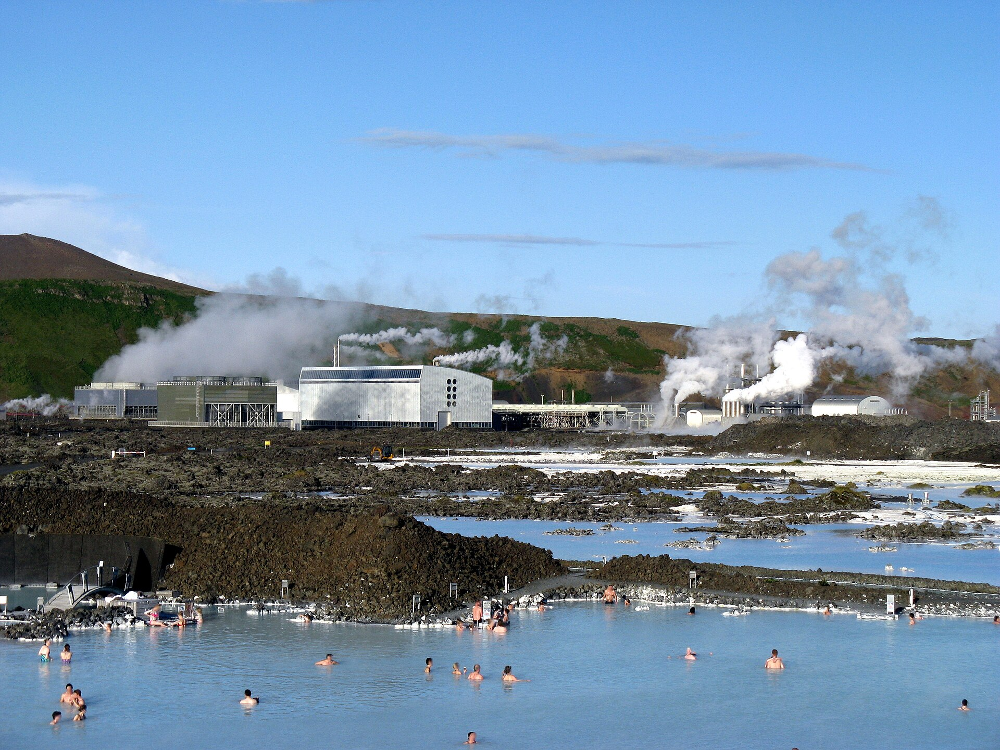
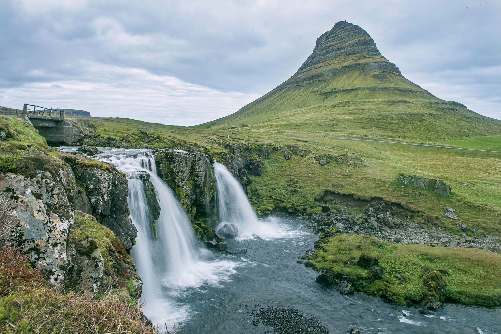
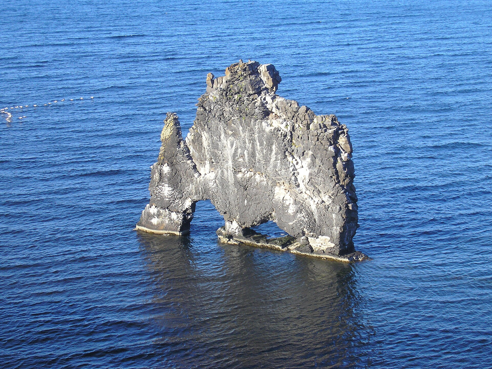
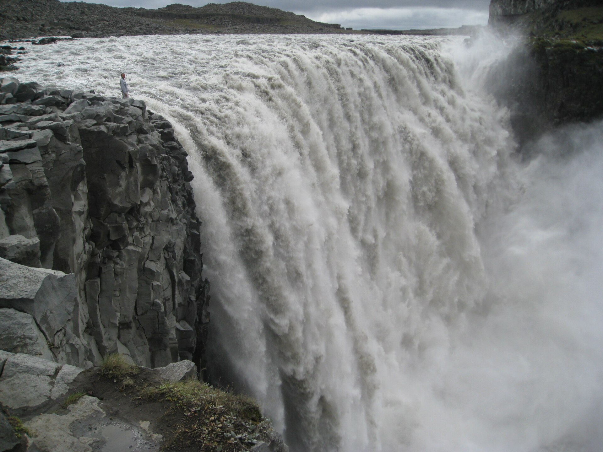
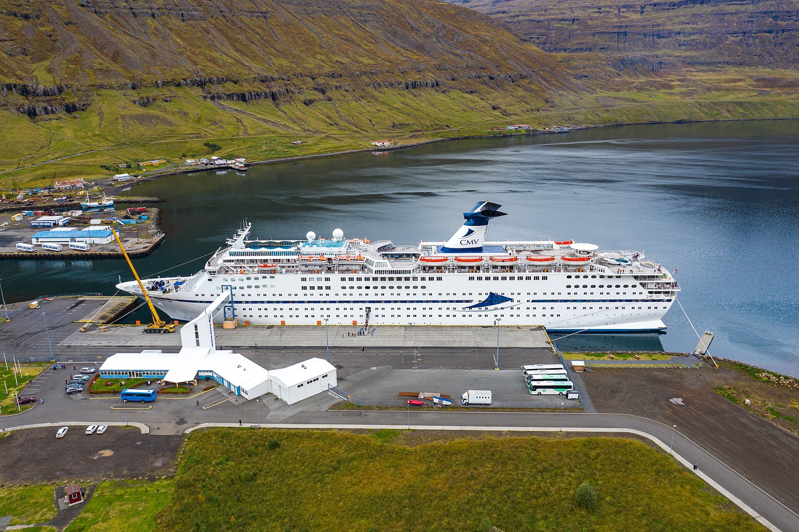
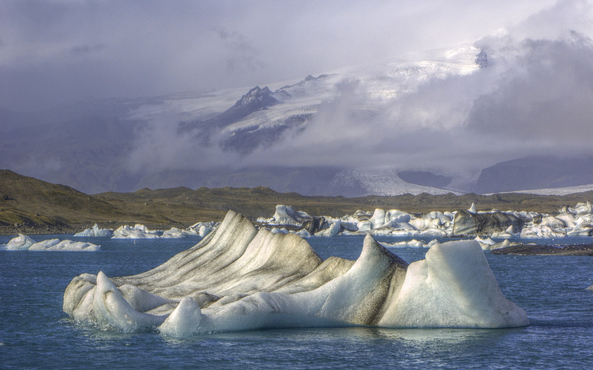
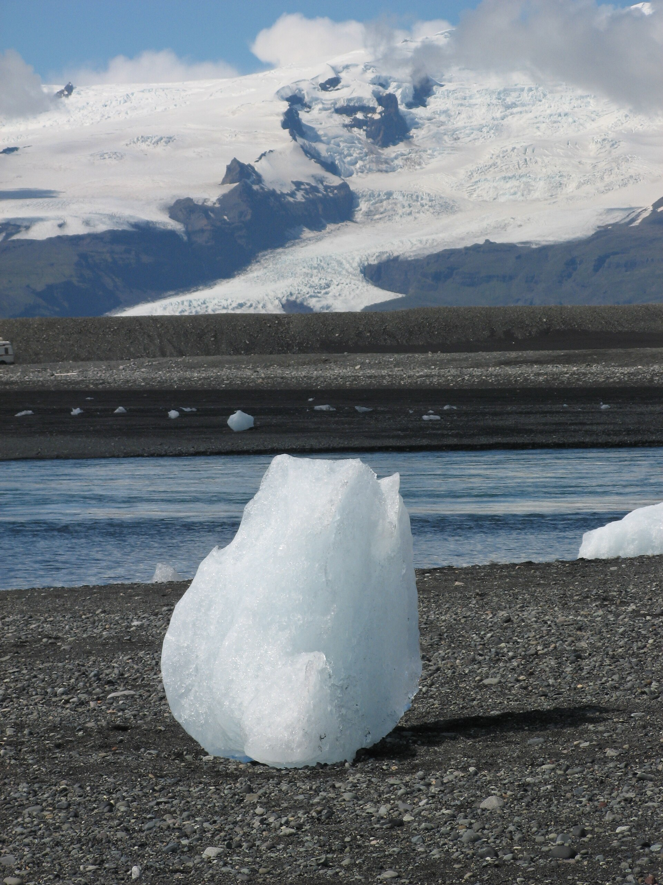
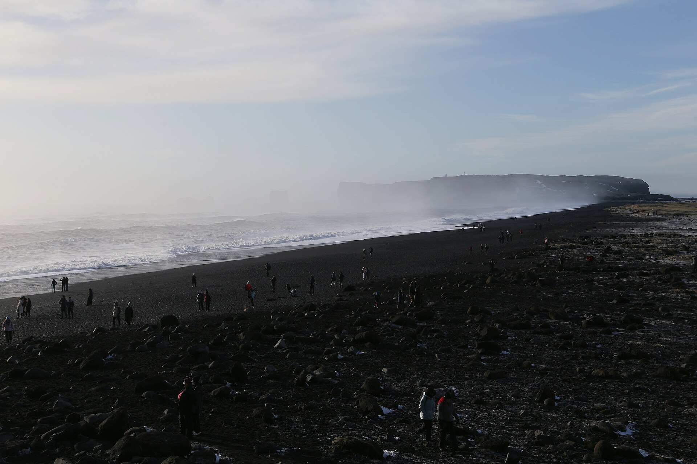
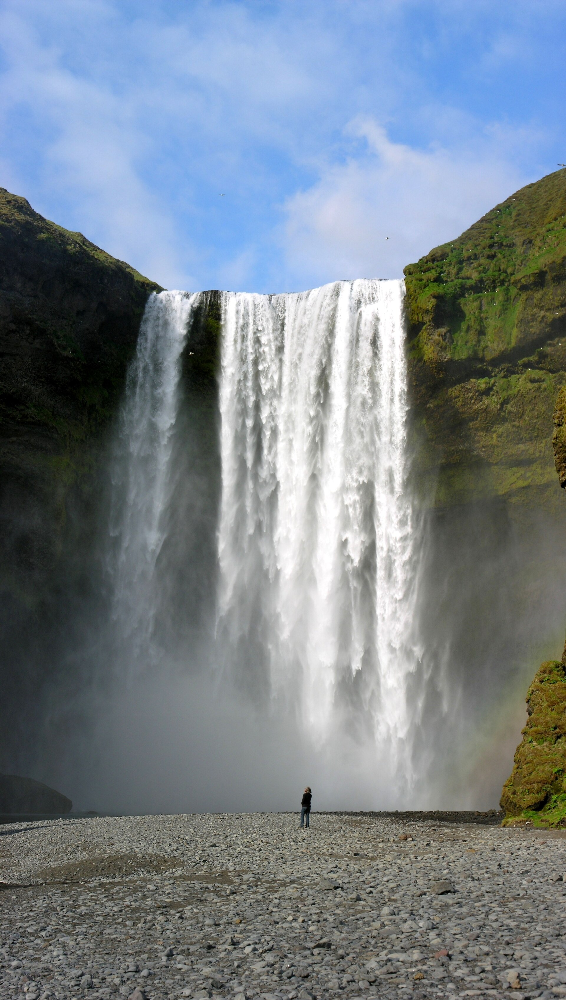
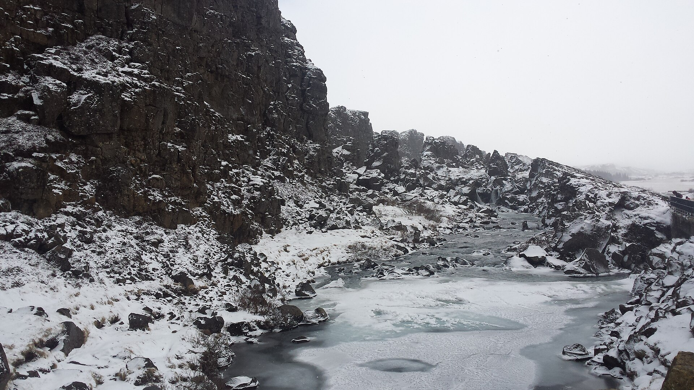

# 冰岛｜火山与冰川的环岛史诗｜9 天婚假执行手册

> **旅行时间**：6～8 月（夏季/午夜阳光窗口）  
> **旅行人数**：2 人（婚假）  
> **总天数**：9 天 8 晚  
> **核心目的地**：雷克雅未克 → 斯奈山半岛 → 北部冰岛 → 东部峡湾 → 南部海岸 → 黄金圈  
> **人均预算**：3.5～4.5 万元人民币（2 人总计约 7～9 万元）

---

## 为什么选冰岛？

如果你们想要的是**"地球上最不像地球的地方"**，那么冰岛是唯一的答案。

这里没有森林，没有高楼大厦，甚至没有蚊子。整个国家建在一座巨大的火山岛上，地表被熔岩、苔藓、冰川和瀑布覆盖。夏季的冰岛拥有**午夜阳光**——太阳在午夜时分依然悬挂在地平线上方，把天空染成淡粉色。这意味着你们可以晚上 11 点还在黑沙滩上看海浪，凌晨 1 点还在钻石沙滩上拍冰块。

与挪威相比：
- **挪威**是深邃峡湾与红色渔民小屋的"壮丽度假"；
- **冰岛**是火山喷发口、冰川舌和黑沙滩的"异世界探险"。

作为婚假，冰岛是一场**探险型浪漫**。你们会一起走过两大洲的裂缝，一起在冰川上徒步，一起在温泉里看黑色熔岩原。这种共同经历的" WOW 时刻"，会让这趟旅行成为你们关系里的一个里程碑。

---

## 行程总览

| 天数 | 星期 | 路线 | 住宿地 | 核心体验 | 开车距离 |
|:---:|:---:|:---|:---|:---|:---:|
| D1 | 六 | 国内 → 雷克雅未克 | 雷克雅未克 | 蓝湖温泉、首都漫步、适应极昼 | 约 50 km |
| D2 | 日 | 雷克雅未克 → 斯奈山半岛 | 斯蒂基斯霍尔米 | 教会山、黑教堂、阿尔纳斯塔皮悬崖 | 约 200 km |
| D3 | 一 | 斯奈山半岛 → 北部冰岛 | 阿克雷里 | 犀牛石、锡格吕菲厄泽、冰岛最北小镇 | 约 350 km |
| D4 | 二 | 北部冰岛 → 米湖 | 米湖/埃伊尔斯塔济 | 黛提瀑布、众神瀑布、米湖地热区 | 约 250 km |
| D5 | 三 | 米湖 → 东部峡湾 | 埃伊尔斯塔济 | 塞济斯菲厄泽、都皮沃古尔、野生驯鹿 | 约 200 km |
| D6 | 四 | 东部峡湾 → 杰古沙龙冰河湖 | 霍芬/教堂镇 | 冰河湖船游、钻石沙滩、冰川徒步 | 约 280 km |
| D7 | 五 | 南部海岸 | 维克/塞尔福斯 | 黑沙滩、斯科加瀑布、塞里雅兰瀑布 | 约 200 km |
| D8 | 六 | 黄金圈 → 雷克雅未克 | 雷克雅未克 | 辛格维利尔国家公园、间歇泉、黄金瀑布 | 约 200 km |
| D9 | 日 | 雷克雅未克 → 国内 | — | 返程 | 约 50 km |

> **设计逻辑**：经典的 1 号公路逆时针环岛。D1 从凯夫拉维克机场取车，D9 机场还车，全程一辆车，行李始终在后备箱里。每天开车 2～4 小时，景点密集但节奏可控。

---

# D1｜国内 → 雷克雅未克（Reykjavík）
**主题：抵达世界尽头**

*蓝湖温泉——黑色熔岩原中的奶蓝色温泉*

## 交通
- **航班**：建议选择 **冰岛航空 Icelandair** 或 **北欧航空 SAS** 的直飞或一次转机航班，**下午 14:00-17:00 抵达凯夫拉维克国际机场（KEF）** 最佳。
- **机场 → 蓝湖**：约 20 分钟车程。蓝湖位于机场和雷克雅未克之间，是抵达后放松的最佳第一站。
- **租车**：强烈建议在**凯夫拉维克机场取车**，并租满 9 天。夏季环岛推荐租 **四驱 SUV**（如斯巴鲁 Outback、丰田 RAV4、路虎 Discovery），因为部分路段是碎石路，且风大时轿车容易飘。
- **主要租车公司**：Hertz、Avis、Budget、Blue Car Rental（冰岛本地口碑极好）。

## 下午：蓝湖温泉（Blue Lagoon）
- 这是冰岛最著名的地热温泉，水温常年保持在 37～39℃。
- 湖水呈奶蓝色，是因为富含二氧化硅和矿物质。池底覆盖着白色的硅泥，可以免费取用敷脸。
- **预订提示**：必须**提前在官网预订入场时段**。建议预订下午 16:00-18:00 的场次（如果航班较早）或抵达当天晚上（如果航班下午到达）。
- **套餐**：Comfort（基础，约 80 欧元）含毛巾和一杯饮品；Premium（约 110 欧元）额外含浴袍、拖鞋和面膜小样。

## 晚上：雷克雅未克市区
- **自驾**：蓝湖 → 雷克雅未克市区约 45 分钟。
- **住宿**：
  - **推荐：Ion Adventure Hotel**（设计酒店，位于市区外 1 小时，极光/熔岩景观极佳，但偏离环岛路线）
  - **更实用：Reykjavík Residence Hotel**（位于市中心，步行到主街，有厨房可以自己做早餐）
  - 价格：约 2000～3500 元人民币/晚。
- **晚餐**：
  - **Grillmarkaðurinn**（"烧烤市场"，冰岛最佳餐厅之一，羊肉和鲸鱼排很有名，人均约 800 元）
  - 或 **Bæjarins Beztu Pylsur**（冰岛最著名的热狗摊，克林顿曾光顾，约 50 元一个，位于港口边）

> **小贴士**：冰岛夏季天黑只有约 2 小时（而且是"黄昏"而不是真正的黑）。抵达当晚不用早睡，趁天还亮着在市区逛逛，感受"时间被偷走"的奇妙感。

---

# D2｜雷克雅未克 → 斯奈山半岛（Snæfellsnes）
**主题：冰岛缩影**

*斯奈山半岛的教会山（Kirkjufell）与教会山瀑布*

斯奈山半岛被称为"冰岛缩影"，因为这里集中了冰岛几乎所有地貌：火山、冰川、黑沙滩、熔岩原、渔村和瀑布。

## 自驾路线
- **路线**：雷克雅未克 → Borgarnes（约 1 小时）→ 斯奈山半岛环岛 → 斯蒂基斯霍尔米（Stykkishólmur）。
- **总里程**：约 200 公里。
- **开车时间**：约 3～4 小时（含多次停车）。

## 途中亮点

### 教会山（Kirkjufell）与教会山瀑布
- 教会山是一座高约 463 米的独立山峰，形状像一座教堂的尖顶，因此得名。
- 它出现在《权力的游戏》第七季中，是"箭头山"的取景地。
- **最佳拍摄点**：山脚下的 Kirkjufellsfoss 瀑布。从瀑布后方的小桥拍摄，可以把瀑布作为前景、教会山作为背景。
- **时间建议**：夏季午夜阳光期间（晚上 10 点以后），游客散去，光线柔和，是拍摄的最佳时机。

### 阿尔纳斯塔皮（Arnarstapi）与海德纳尔（Hellnar）
- 这两个小渔村位于半岛南岸，之间有著名的**悬崖步道**。
- **Gatklettur 海蚀洞**：一个天然形成的拱形岩石洞，海浪从中穿过。
- **Lóndrangar 怪物海岸**：两座从海中拔地而起的玄武岩柱，高达 75 米，传说中这里是巨魔被阳光石化后留下的。

### 黑教堂（Búðakirkja）
- 位于 Búðir 小村的黑色木质教堂，矗立在一片熔岩原中，背景是远处的雪山和海洋。
- 这是冰岛最具代表性的"孤独感"照片机位之一。夏季时，周围的苔原会开满紫色和粉色的野花。

## 住宿
**斯蒂基斯霍尔米（Stykkishólmur）**
- 这是斯奈山半岛最大的小镇（人口约 1100），也是电影《白日梦想家》中格陵兰小镇的取景地。
- **推荐：Hotel Fransiskus**，由一座老修道院改造而成，安静且富有历史感。
- 或 **Airbnb 海景小屋**：半岛上有很多独立的度假小屋，带厨房，可以自己做饭。

---

# D3｜斯奈山半岛 → 北部冰岛（North Iceland）
**主题：穿越冰岛心脏**

*Vatnsnes 半岛上的犀牛石 Hvítserkur*

## 自驾路线
- **路线**：斯蒂基斯霍尔米 → Vatnsnes 半岛（犀牛石）→ Blönduós → 锡格吕菲厄泽（Siglufjörður）→ 阿克雷里（Akureyri）。
- **总里程**：约 350 公里。
- **开车时间**：约 5～6 小时（含停车）。

## 途中亮点

### 犀牛石（Hvítserkur）
- 位于 Vatnsnes 半岛海岸边，是一座高约 15 米的玄武岩海蚀柱。
- 从某个角度看，它像一头正在饮水的犀牛（或大象、巨龙）。
- 低潮时可以走到礁石附近，涨潮时它被海水环绕，更加神秘。

### 锡格吕菲厄泽（Siglufjörður）
- 冰岛本岛最北端的小镇，曾是 20 世纪初冰岛鲱鱼产业的中心。
- **鲱鱼时代博物馆（Herring Era Museum）**：了解这个小镇曾经的辉煌，博物馆内还保留着当年的工厂设备和渔村场景。
- 小镇被高山环绕，夏天时野花遍野，色彩极为丰富。

## 住宿
**阿克雷里（Akureyri）**
- 冰岛第二大城市（人口约 1.8 万），被称为"北方之都"。
- **推荐：Hotel Kea**，位于市中心主街，历史悠久，位置极佳。
- 或 **Icelandair Hotel Akureyri**，位于植物园旁边，环境安静。
- **红心信号灯**：阿克雷里的红绿灯是爱心形状的——最初于 2008 年夏天为当地家庭节庆而安装，后来在金融危机的阴影下成为提振民心的城市标志，一直保留至今。

## 晚餐
阿克雷里的餐厅比南部性价比更高。推荐 **Rub 23**（亚洲融合海鲜，人均约 500 元）或 **Bautinn**（冰岛传统菜，羊肉汤和龙虾汤很棒）。

---

# D4｜北部冰岛 → 米湖（Mývatn）
**主题：火山与瀑布的交响曲**

*欧洲水量最大的瀑布——黛提瀑布*

## 自驾路线
- **路线**：阿克雷里 → 众神瀑布（Goðafoss）→ 米湖（Mývatn）→ 黛提瀑布（Dettifoss）→ 埃伊尔斯塔济（Egilsstaðir）。
- **总里程**：约 250 公里。
- **开车时间**：约 4～5 小时（山路+碎石路）。

## 途中亮点

### 众神瀑布（Goðafoss）
- 名字意为"众神的瀑布"，因为公元 1000 年冰岛皈依基督教时，当地首领在这里将旧神像投入瀑布中。
- 瀑布呈弧形，宽约 30 米，水流分散成多道水帘，夏季时周围的苔原翠绿，非常适合拍照。

### 米湖地热区（Námafjall Hverir）
- 这里是冰岛最活跃的地热区之一，地表布满硫磺坑、蒸汽孔和沸腾的泥浆池。
- **景观**：地面呈现出橙黄、灰白、暗红的斑斓色彩，空气中弥漫着浓烈的硫磺味（像臭鸡蛋）。
- 附近还有 **Grjótagjá 洞穴温泉**——《权力的游戏》中琼恩·雪诺和耶哥蕊特的"定情之地"。但水温现在过高，已禁止泡澡，只能外观。

### 黛提瀑布（Dettifoss）
- **欧洲水量最大的瀑布之一**，平均每秒流量约 193 立方米（洪水期可达 500 立方米/秒）。
- 瀑布宽约 100 米，落差 44 米，水流从宽阔的悬崖边缘倾泻而下，发出雷鸣般的轰鸣。
- **电影取景地**：它是雷德利·斯科特《普罗米修斯》开场的外星景观取景地。
- **注意**：通往瀑布的 864 号公路是**碎石路**，对底盘较低的车不太友好。建议开慢一点（限速 80，建议开到 40-50）。

## 住宿
**埃伊尔斯塔济（Egilsstaðir）**
- 冰岛东部最大的城镇，是东部峡湾的门户。
- **推荐：Lake Hotel Egilsstaðir**，位于 Lake Lagarfljót 湖边，风景宁静。
- 或 **Airbnb 小屋**：东部住宿选择较少，建议提前预订。

---

# D5｜东部峡湾（East Fjords）
**主题：冰岛最安静的角落**

*塞济斯菲厄泽的彩虹路和蓝色教堂*

东部峡湾是冰岛游客最少、却最具回报的地区之一。这里没有著名的"大景点"，但每一个转弯都是一幅画。

## 自驾路线
- **路线**：埃伊尔斯塔济 → 塞济斯菲厄泽（Seyðisfjörður）→ 都皮沃古尔（Djúpivogur）→ 埃伊尔斯塔济。
- **总里程**：约 200 公里（往返+支线）。
- **开车时间**：约 4 小时。

## 途中亮点

### 塞济斯菲厄泽（Seyðisfjörður）
- 一座藏在峡湾尽头的小镇，以**蓝色教堂（Bláa Kirkjan）**和教堂前的**彩虹路**闻名。
- 小镇四周是 1000 多米高的雪山，夏天时瀑布从山上倾泻而下，直接流进海里。
- 这里是冰岛艺术氛围最浓的小镇之一，有很多画廊和独立设计师的工作室。
- **轮渡**：从丹麦法罗群岛和丹麦本土开往冰岛的 Smyril Line 轮渡，就停靠在这个小镇。

### 都皮沃古尔（Djúpivogur）
- 一个安静的渔村，以**"蛋步道（Eggin í Gleðivík）"**闻名——海边排列着 34 颗巨大的花岗岩蛋，代表冰岛本地 34 种鸟类。
- 从都皮沃古尔向南远眺，可以看到冰岛最高的独立山峰 **Hvannadalshnúkur**（2110 米，位于瓦特纳冰川上）。

### 野生驯鹿
- 北极狐（Arctic Fox）是冰岛唯一的原生陆生哺乳动物。**驯鹿**于 18 世纪后期（1771-1777 年）从挪威引入，主要栖息在东部峡湾。
- 夏季时，驯鹿会出现在高地和峡湾之间的平原上。如果运气好，你们会在路边看到一群棕色的驯鹿正在吃草。

## 住宿
回到埃伊尔斯塔济住宿，或者继续向东开到 **Brekkan** 或 **Fáskrúðsfjörður** 的小旅馆。

---

# D6｜东部峡湾 → 杰古沙龙冰河湖（Jökulsárlón）
**主题：冰与钻石**

*杰古沙龙冰河湖上的蓝色浮冰*

这一天是冰岛**最梦幻的一天**。你们会从安静的峡湾驶入冰的世界。

## 自驾路线
- **路线**：埃伊尔斯塔济 → 霍芬镇（Höfn）→ 杰古沙龙冰河湖。
- **总里程**：约 280 公里。
- **开车时间**：约 4 小时。

## 途中亮点

### 杰古沙龙冰河湖（Jökulsárlón）
- 冰岛最著名的自然景点之一，也是**007《择日而亡》和《古墓丽影》的取景地**。
- 这是一个深达 200 米的冰川湖，巨大的蓝色冰块从 Breiðamerkurjökull 冰川断裂后漂浮在湖面上。
- **冰河湖船游（必体验）**：
  - **两栖船（Amphibian Boat）**：约 40 分钟，可以近距离看到浮冰和海豹。
  - **快艇（Zodiac Boat）**：约 1 小时，穿梭在大冰块之间，体验更震撼。
  - **预订**：必须提前在官网预订，夏季每天有很多班次。

### 钻石沙滩（Diamond Beach）

*钻石沙滩上的冰块在阳光下闪烁*

- 冰河湖对面就是钻石沙滩。冰川碎块被海浪冲上岸，散落在黑色的火山沙滩上。
- 在阳光下，透明的冰块像钻石一样闪烁，因此得名。
- **午夜阳光拍摄**：夏季晚上 10 点以后游客散去，光线低平，是拍摄冰块最好的时间。你们可以一直待到晚上 11 点，天依然亮着。

### 冰川徒步（可选）
- 如果时间充裕，可以在 **斯卡夫塔山（Skaftafell）** 参加冰川徒步团。这里有瓦特纳冰川的分支，可以在向导带领下踏上冰川表面，探索冰缝和冰洞。
- 冰川徒步约 3 小时，需提前预订（推荐 Icelandic Mountain Guides 或 Troll Expeditions）。

## 住宿
**霍芬镇（Höfn）或教堂镇（Kirkjubæjarklaustur）**
- 霍芬镇以**龙虾**闻名，是吃冰岛龙虾汤（Humar Soup）的最佳地点。推荐餐厅 **Humarhöfnin**。
- 住宿选择：Hotel Höfn 或附近的农场民宿。

---

# D7｜南部海岸（South Coast）
**主题：瀑布与黑沙滩**

*维克镇附近的雷尼斯黑沙滩与玄武岩柱*

南部海岸是冰岛景点最密集的一段路，每隔几公里就有一个世界级景观。

## 自驾路线
- **路线**：霍芬 → 斯卡夫塔山 → 维克（Vík）→ 斯科加瀑布（Skógafoss）→ 塞里雅兰瀑布（Seljalandsfoss）→ 塞尔福斯（Selfoss）/ 维克。
- **总里程**：约 200 公里。
- **开车时间**：约 3～4 小时（不含徒步和拍照时间）。

## 途中亮点

### 斯卡夫塔山自然保护区（Skaftafell）
- 瓦特纳冰川国家公园的一部分，拥有冰岛最好的徒步路线。
- **斯瓦蒂瀑布（Svartifoss）**：往返徒步约 1.5 小时，瀑布被黑色的六角形玄武岩柱环绕，像一座天然管风琴。

### 维克镇（Vík）与黑沙滩（Reynisfjara）
- **维克镇**：冰岛最南端的村庄，红顶教堂（Vík í Mýrdal Church）坐落在山坡上，是经典的冰岛南部照片机位。
- **雷尼斯黑沙滩（Reynisfjara）**：
  - 黑色的火山沙、汹涌的白色海浪、海边矗立着巨大的**玄武岩柱**。
  - 海中有 **Reynisdrangar 岩柱群**，传说是巨魔被阳光石化后形成的。
  - **安全警告**：这里的海浪非常危险，存在"疯狗浪（Sneaker Waves）"，会突然冲上沙滩把人卷走。**请与海浪保持至少 30 米距离，绝对不要背对大海。**

### 斯科加瀑布（Skógafoss）

*斯科加瀑布——冰岛最壮丽的瀑布之一*

- 宽约 25 米，落差 60 米，水流从悬崖上直接砸下来，气势磅礴。
- 瀑布右侧有步道可以爬到山顶，俯瞰瀑布和南岸平原。
- 晴天时，瀑布水雾中几乎永远有双彩虹。

### 塞里雅兰瀑布（Seljalandsfoss）
- 冰岛最上镜的瀑布之一，因为可以**走到瀑布后方**。
- 穿上防水外套和鞋，沿着小径绕到瀑布后面，从水帘内部看世界——这是一种独特的体验。
- 瀑布旁边还有一个隐藏的 **Gljúfrabúi（秘密瀑布）**，藏在一个峡谷里，需要蹚水进入。

## 住宿
**塞尔福斯（Selfoss）或维克镇**
- Selfoss 是南部较大的城镇，有超市和餐厅。推荐 **Hotel South Coast** 或 **The Greenhouse Hotel**（设计酒店，有屋顶温泉池）。

---

# D8｜黄金圈（Golden Circle）→ 雷克雅未克
**主题：冰岛的心跳**

*黄金瀑布——欧洲最著名的瀑布之一*

黄金圈是冰岛最经典的旅游路线，由三个景点组成：辛格维利尔国家公园、间歇泉地热区和黄金瀑布。这一天是环岛之旅的完美收尾。

## 自驾路线
- **路线**：塞尔福斯 → 辛格维利尔（Þingvellir）→ 间歇泉（Geysir）→ 黄金瀑布（Gullfoss）→ 雷克雅未克。
- **总里程**：约 200 公里。
- **开车时间**：约 3 小时（不含游览时间）。

## 途中亮点

### 辛格维利尔国家公园（Þingvellir）
- **世界文化遗产**，世界上最古老的民主议会（Alþingi）于公元 930 年在此成立。
- **板块裂缝**：这里是**欧亚板块与北美板块的交界处**。你们可以徒步走在两大洲之间的裂缝中，两侧的岩壁是板块撕裂后留下的痕迹。
- **丝浮拉大裂缝（Silfra）浮潜**：
  - 这是地球上最清澈的水域之一，能见度超过 100 米。
  - 穿着干式潜水服，在冰川融水中浮潜，左手摸欧亚板块，右手摸北美板块。
  - 需提前预订（推荐 Dive.is），价格约 2000 元人民币/人。

### 盖歇尔地热区（Geysir Geothermal Area）

*史托克间歇泉喷发瞬间*

- 这里的大间歇泉 Geysir 已很少喷发，但它的"小弟弟" **Strokkur** 非常活跃。
- **Strokkur 每隔 5～10 分钟喷发一次**，滚烫的水柱直冲 20～30 米高空。每次喷发前，水面会先鼓起一个巨大的蓝色水泡，这是按下快门的最佳时机。

### 黄金瀑布（Gullfoss）
- 宽约 70 米，落差 32 米，分两层倾泻而下。
- 晴天时，瀑布水雾中会出现彩虹；阳光照射在水面上时，瀑布会泛出金色光芒，因此得名"黄金瀑布"。

## 晚上：雷克雅未克
- **住宿**：回到雷克雅未克市区的酒店。
- **晚餐**：
  - **Dill**（冰岛唯一的米其林一星餐厅，新北欧料理，需提前预订，人均约 1500 元）
  - 或 **Slippbarinn**（创意鸡尾酒和本地海鲜，氛围轻松）
- **最后的午夜阳光**：晚上 10 点后去太阳航海者雕塑（Sólfar）或哈帕音乐厅（Harpa）看最后一次极昼日落。

---

# D9｜雷克雅未克 → 国内
**主题：从异世界回到现实**

*辛格维利尔国家公园的板块裂缝*

- **上午**：如果航班在下午或晚上，可以前往 **雷克雅内斯半岛（Reykjanes）** 做最后的短途自驾（距离机场很近）。
  - **横跨两大洲之桥（Bridge Between Continents）**：再次踏足欧亚与北美板块之间。
  - **Gunnuhver 地热区**：蒸汽弥漫的火山地貌。
  - **蓝湖温泉**：如果 D1 没来得及去，或者想再去一次，可以安排在返程当天。
- **机场还车**：凯夫拉维克机场（KEF）还车，办理登机手续。
- **购物**：机场免税店可以买到 **Bioeffect 精华**、**蓝湖面膜**、**冰岛羊毛毛衣（Lopapeysa）** 和 **OMNOM 巧克力**。

---

## 附录一：全程预算拆分（2 人总计）

| 项目 | 金额（人民币） | 说明 |
|:---|:---:|:---|
| **国际往返机票** | 25,000～35,000 | 暑假直飞/一次转机经济舱，约 1.2～1.8 万/人 |
| **租车（9 天）** | 12,000～18,000 | 四驱 SUV，含全险（碎石险、超级碰撞险强烈建议购买） |
| **油费** | 3,500～5,000 | 环岛约 2000 公里，冰岛油价约 14～16 元/升 |
| **住宿（8 晚）** | 20,000～32,000 | 旺季冰岛住宿紧张，普通酒店/民宿约 1500～3000 元/晚 |
| **餐饮** | 12,000～18,000 | 外食人均 300～500 元/顿，超市自己做人均 100 元/顿 |
| **门票/体验** | 4,000～7,000 | 蓝湖温泉、冰河湖船游、冰川徒步、浮潜（可选） |
| **签证/保险/杂费** | 2,000～3,000 | 申根签证约 800 元/人，保险 200 元/人 |
| **总计** | **约 78,500～118,000 元** | **人均 3.9～5.9 万** |

> **省钱小贴士**：冰岛是北欧消费最高的国家。建议每天至少有一餐在超市（Bónus"小猪超市"、Krónan）买食材自己做。民宿通常带厨房，煮一碗泡面加煎三文鱼排，既省钱又温馨。

---

## 附录二：行前准备清单

### 证件与签证
- [ ] **申根签证（冰岛）**：至少提前 6～8 周申请。冰岛签证通常由丹麦签证中心代办（因为丹麦驻北京大使馆代管冰岛签证事务）。
- [ ] 护照（有效期 6 个月以上）。
- [ ] 驾照原件 + 英文翻译件（租租车 APP 可免费办理）。
- [ ] 旅行保险（申根强制要求，保额 ≥ 3 万欧元）。

### 预订确认（按优先级）
1. [ ] 国际机票
2. [ ] 凯夫拉维克机场租车（9 天四驱 SUV，建议购买全险）
3. [ ] 雷克雅未克、阿克雷里、霍芬等地的住宿（夏季提前 2～3 个月预订）
4. [ ] 蓝湖温泉门票（bluelagoon.com）
5. [ ] 杰古沙龙冰河湖船游（jokulsarlon.is 或 Guide to Iceland）
6. [ ] 冰川徒步团（Icelandic Mountain Guides / Troll Expeditions）
7. [ ] 丝浮拉大裂缝浮潜（Dive.is，可选）

### 衣物与装备
- [ ] **防水冲锋衣 + 防水裤**：冰岛夏季多雨，瀑布区域水雾极大。
- [ ] **防水徒步鞋/登山鞋**：黑沙滩、瀑布、冰川徒步都需要。
- [ ] **抓绒衣 + 薄羽绒服**：夏季气温 10～15℃，山顶和海边风大时体感更低。
- [ ] **防水手套 + 毛线帽**：冰川徒步和观鲸时必备。
- [ ] **防晒霜 + 墨镜**：极昼下紫外线极强，雪地/冰川反射严重。
- [ ] **转换插头**：冰岛使用欧标 C/F 型插头。
- [ ] **保温杯/便携烧水壶**
- [ ] **泳衣**：泡温泉用。
- [ ] **少量零食/泡面/自热火锅**

### APP 下载
- **Google Maps**：离线地图必备（很多山区没信号）。
- **Vedur**：冰岛气象局官方 APP，查询天气预报和极光指数。
- **SafeTravel Iceland**：冰岛安全旅行官方 APP，查询道路封闭和路况预警。
- **Parka / EasyPark**：冰岛停车缴费 APP。

---

## 附录三：关键决策说明（FAQ）

### Q1：冰岛夏季自驾安全吗？
只要遵守交通规则、时刻关注天气、不要开快车，**非常安全**。冰岛 1 号公路（Ring Road）维护极好，全程铺装路面。但需要注意：
- **侧风极大**：冰岛常年刮大风，开门时要用双手扶住车门，否则车门可能被风吹断（这种损坏保险通常不赔）。
- **羊群**：夏季公路两边常有羊群 wandering，它们可能会突然冲上马路。
- **碎石路**：通往黛提瀑布、部分东部峡湾支路是碎石路，建议租底盘较高的 SUV。

### Q2：为什么不顺时针环岛？
逆时针和顺时针都可以。我们选择逆时针，是因为把南部海岸和黄金圈放在后半段。这样如果前几天在北部或东部因为天气原因耽搁了，后几天在南部（靠近首都和机场）更容易调整行程。另一个原因是：逆时针时，南部海岸的瀑布和黑沙滩是在你们的右侧（行车方向），停车观景更方便。

### Q3：冰川徒步和浮潜需要经验吗？
**不需要**。冰川徒步团会提供冰爪、冰镐、头盔和安全绳，向导会手把手教你。只要身体健康、能正常行走即可。浮潜（Silfra）需要会游泳，但不需要潜水证——穿着干式潜水服，人其实是浮在水面上的，只需要用嘴呼吸管呼吸即可。

### Q4：冰岛能看到极光吗？
夏季（6～8 月）**看不到极光**。因为午夜阳光的存在，天空始终不够黑。想看极光需要 9 月中旬以后。夏季的补偿是：你们有几乎 24 小时的日照，每天可以利用的时间非常长。

### Q5：如果预算充裕，有什么可以提升体验的？
- **直升机观光**：从空中俯瞰火山口、冰川舌和瀑布，震撼度翻倍。
- **高地徒步（Landmannalaugar）**：冰岛高地是徒步圣地，但普通租车无法进入，需要租四驱越野车或参加越野团。
- **米其林餐厅 Dill**：冰岛唯一的米其林一星，需提前数月预订。

---

## 附录四：一句话总结

这 9 天，你们会一起走过两大洲的裂缝，一起在蓝湖的奶蓝色温泉里放松，一起在世界最清澈的湖水中浮潜，一起在黑沙滩上看巨浪拍打玄武岩柱，一起在午夜阳光下拍下钻石沙滩上的冰块。

**这是冰岛在夏天唯一的样子，也是你们人生中最像电影的一场旅行。**

---

*文档生成时间：2026 年 4 月*  
*祝你们旅途愉快，新婚快乐！*
