# 意大利多洛米蒂 + 威尼斯｜阿尔卑斯巅峰与文艺复兴｜9 天执行手册

> **旅行时间**：7～8 月（夏季黄金窗口）  
> **旅行人数**：2 人  
> **总天数**：9 天 8 晚  
> **核心目的地**：威尼斯 → 维罗纳 → 多洛米蒂（科尔蒂纳丹佩佐、三峰山、布莱斯湖、富纳斯山谷）→ 加尔达湖  
> **人均预算**：2.5～3.5 万元人民币（2 人总计约 5～7 万元）

---

## 为什么选意大利多洛米蒂 + 威尼斯？

如果你们想要的是**"风景震撼与人文美食双满分"**的旅行，那么这条线路是比北欧更热烈、更丰盈的答案。

北欧的夏天是清冷克制的——漫长的白昼、灰蓝色的峡湾、寂静的雪山。它美得让人屏息，却也带着一种遥远的疏离感。而意大利北部完全是另一种气质：威尼斯的大运河上，贡多拉划过巴洛克宫殿的倒影；多洛米蒂的白云岩山峰在日出时被点燃成玫瑰金色，像阿尔卑斯山脉最后的狂想曲；傍晚在维罗纳的露天歌剧院听一场《卡门》，在加尔达湖畔的西尔苗内吃着手工意面和本地白葡萄酒——这里的美是**可以触摸、可以品尝、可以枕着入睡**的。

7～8 月的多洛米蒂，高山草甸开满野花，气温凉爽宜人（15～25℃），是欧洲本地人最钟爱的避暑圣地。与瑞士相比，这里的景观同样世界级的壮丽，但物价更合理、美食更丰富、人文气息更浓郁。9 天时间，你们可以在水城里迷失，在山峰上相拥，在湖边小镇发呆。这是一段**既有史诗感，又有烟火气**的旅行。

---

## 行程总览

| 天数 | 星期 | 路线 | 住宿地 | 核心体验 | 开车距离 |
|:---:|:---:|:---|:---|:---|:---:|
| D1 | 六 | 国内 → 威尼斯 | 威尼斯本岛 | 抵达水上之城，大运河日落 | — |
| D2 | 日 | 威尼斯 | 威尼斯本岛 | 圣马可广场、彩色岛、贡多拉巡游 | — |
| D3 | 一 | 威尼斯 → 维罗纳 → 科尔蒂纳丹佩佐 | 科尔蒂纳丹佩佐 | 朱丽叶故居、圆形剧场、开启多洛米蒂自驾 | 约 270 km |
| D4 | 二 | 科尔蒂纳丹佩佐 | 科尔蒂纳丹佩佐 | 三峰山（Tre Cime）徒步、Sella Ronda 公路 | 约 80 km |
| D5 | 三 | 科尔蒂纳丹佩佐 → 布莱斯湖 → 富纳斯山谷 | 圣玛格达莱纳/奥蒂塞伊 | 布莱斯湖泛舟、富纳斯山谷日落、Seceda 缆车 | 约 120 km |
| D6 | 四 | 奥蒂塞伊 → Passo Giau → 马尔莫拉达 | 科尔蒂纳丹佩佐/卡纳泽伊 | Passo Giau 公路自驾、高山草甸徒步 | 约 100 km |
| D7 | 五 | 多洛米蒂 → SS48 刀脊公路 → 加尔达湖 | 西尔苗内 | 高山公路自驾巅峰、抵达意大利最大湖泊 | 约 180 km |
| D8 | 六 | 西尔苗内 → 米兰 | 米兰 | 加尔达湖畔温泉小镇、米兰大教堂与埃马努埃莱长廊 | 约 140 km |
| D9 | 日 | 米兰 → 国内 | — | 马尔彭萨机场返程 | — |

> **设计逻辑**：D1-D2 威尼斯公共交通慢游；D3 在维罗纳取车开启自驾；D4-D6 多洛米蒂核心三角深度探索；D7 经刀脊公路南下到加尔达湖过渡；D8 米兰作为出口，购物与休整兼备。

---

# D1｜国内 → 威尼斯（Venice）
**主题：抵达水上之城**

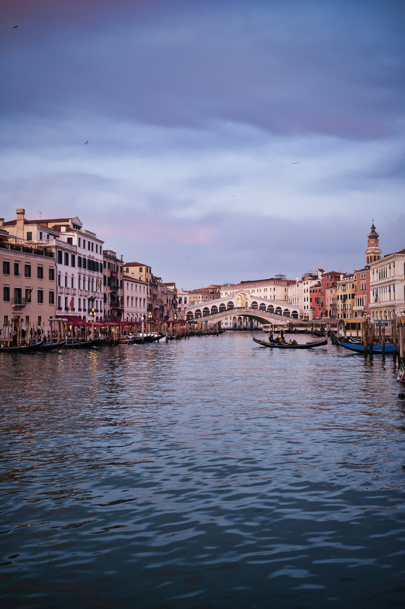
*威尼斯大运河的贡多拉与彩色宫殿*

## 交通
- **航班**：建议选择 **阿联酋航空**、**汉莎航空** 或 **中国国际航空** 经法兰克福/慕尼黑转机，或 **海南航空** 直飞米兰后转乘火车。**下午 14:00-17:00 抵达威尼斯马可波罗机场（VCE）** 最佳，可以在日落前入住并享受第一晚的大运河。
- **机场 → 威尼斯本岛**：
  - 最浪漫的方式是乘坐 **水上出租车（Water Taxi）**，约 30 分钟直达酒店门口，费用约 120～140 欧元/船（可坐 6-8 人，2 人坐略贵但值得体验一次）。
  - 性价比之选是 **Alilaguna 水上巴士**，蓝线约 1 小时到圣马可广场附近，票价约 15 欧元/人。

> **重要提示**：威尼斯本岛**完全没有汽车**。你们的行李箱需要靠自己提着走过石板桥和狭窄的巷子。建议行李尽量精简，或提前联系酒店是否提供码头接应服务。

## 住宿
**推荐：Hotel Metropole（大都会酒店）或 Bauer Palazzo**
- 位置：圣马可广场步行 3～5 分钟，大运河沿岸。
- 价格：约 350～600 欧元/晚。
- 理由：推开窗就是大运河，清晨和黄昏的威尼斯最迷人。在威尼斯住一晚运河景观房是**必须的投资**。Bauer Palazzo 的露台餐厅是拍摄贡多拉和大运河的经典机位。
- 备选：如果预算有限，可以选择 Cannaregio 或 Dorsoduro 区域的设计民宿（约 150～250 欧元/晚），更安静、更本地化。

## 活动
- **傍晚**：从酒店步行到 **里亚托桥（Ponte di Rialto）**，这是大运河上最古老、最壮观的桥梁。站在桥中央，左右两侧是威尼斯最经典的画面——粉色的宫殿、穿梭的贡多拉、橙红色的落日。
- **晚餐**：推荐 **Antiche Carampane**，藏在巷弄深处的本地海鲜餐厅，招牌是**蜘蛛蟹意面（Tagliolini al Gransporco）**和**炸小海鲜（Fritto Misto）**。人均约 80～120 欧元。威尼斯游客餐厅很多，这家是本地人也会光顾的宝藏。
- **小贴士**：威尼斯晚上 9 点后天色才完全暗下来。晚餐后沿着大运河散步，看灯火倒映在水面上，会有一种穿越到 16 世纪的恍惚感。

---

# D2｜威尼斯（Venice）
**主题：迷失与巡游**

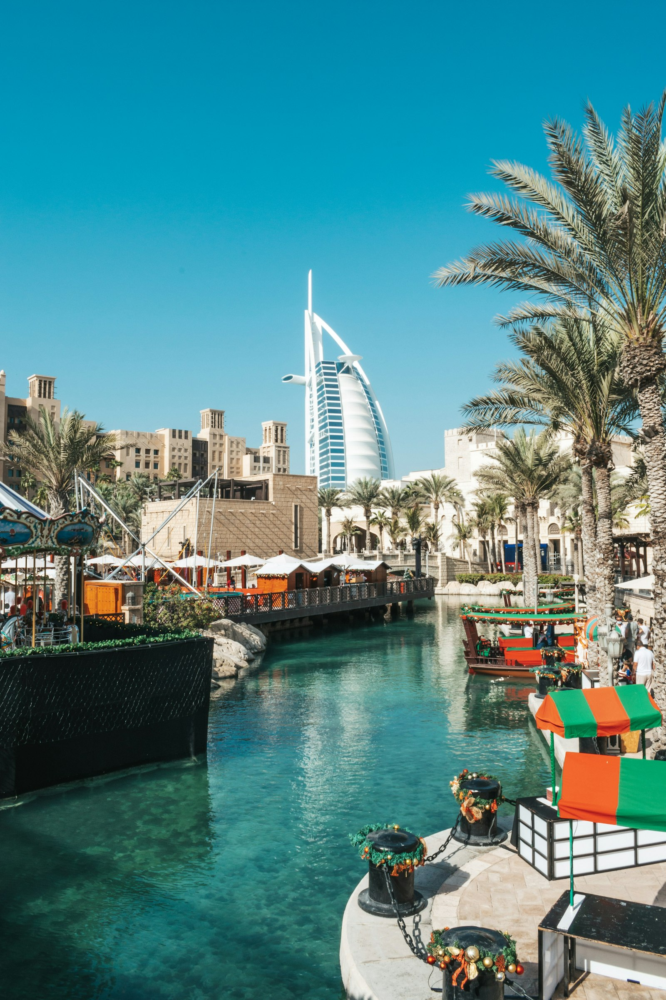
*圣马可广场上的钟楼与总督宫*

## 上午：圣马可广场（Piazza San Marco）
这是欧洲最美的客厅，也是威尼斯 1000 年海洋霸权的象征。

- **圣马可大教堂（Basilica di San Marco）**：拜占庭风格的金色穹顶、马赛克镶嵌画、从君士坦丁堡掠夺来的青铜骏马——这座教堂是威尼斯作为"东方女王"的宣言。建议提前在网上预订 **Pala d'Oro 黄金祭坛屏**和**露台登临**的联票。
- **总督宫（Palazzo Ducale）**：哥特式建筑的巅峰，内部有丁托列托的巨幅天顶画《天堂》，以及著名的**叹息桥（Ponte dei Sospiri）**——传说囚犯过桥时透过小窗看到外面的世界，会发出最后一声叹息。
- **钟楼（Campanile）**：乘电梯登顶，俯瞰威尼斯 118 座岛屿和远处潟湖的碧蓝水面。

> **时间建议**：早上 8:30 前到达广场，可以避开旅行团的人潮。广场上的露天咖啡馆（如 Florian 或 Quadri）一杯咖啡要 15～20 欧元，且伴有乐队演奏——这不是喝咖啡，是买座位和氛围。如果只是想休息，建议去旁边的巷子里找普通咖啡馆。

## 下午：彩色岛（Burano）

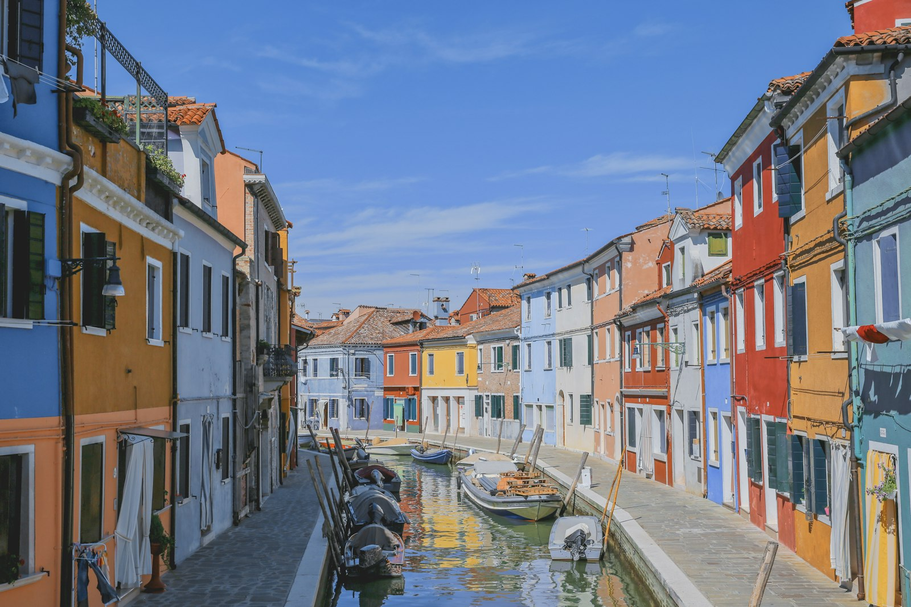
*布拉诺岛上的彩虹色渔民小屋*

- **交通**：从圣马可广场附近的码头乘坐 **LN 号线水上巴士**，约 45 分钟抵达 Burano。
- **看点**：岛上每一栋房子都被漆成了不同的颜色——柠檬黄、薄荷绿、珊瑚粉、天蓝色。传说渔民们出海归来时，需要通过房子的颜色在雾中辨认自己的家。如今这里是威尼斯最上镜的地方，也是**蕾丝工艺**的发源地。
- **活动**：在岛上慢慢逛，买一盒手工蕾丝手帕作为旅行纪念；在运河边的冰淇淋店买一个 Gelato；找一家小餐馆吃**墨鱼面（Spaghetti al Nero di Seppia）**，吃完嘴唇会染成黑色——这是威尼斯特有的浪漫恶作剧。

## 傍晚：贡多拉巡游

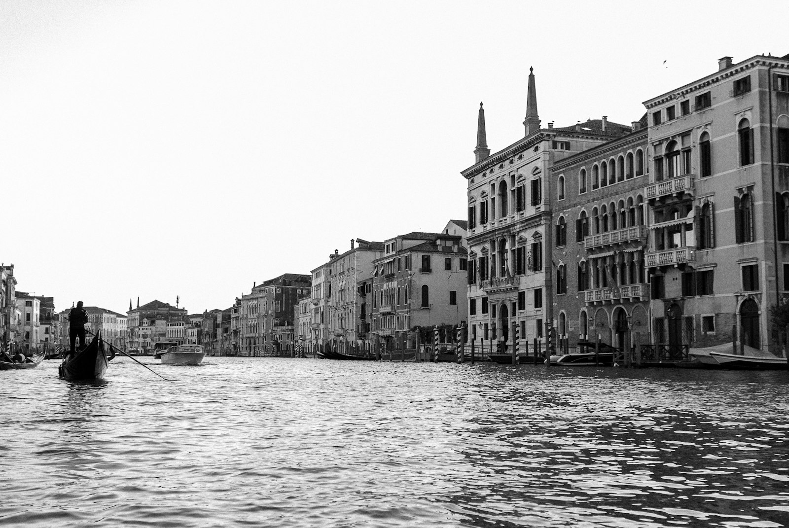
*黄昏时分的贡多拉巡游*

- **时长**：30 分钟。
- **价格**：官方定价白天 80 欧元/船，晚上 19:00 后 100 欧元/船（最多坐 6 人）。可以拼船，也可以独享。
- **路线**：从圣马可广场附近的码头出发，穿过小桥和狭窄的水巷（Rio），最终汇入大运河。船夫会唱几句意大利民歌，桨声欸乃，水波荡漾。
- **旅行价值**：这也许是世界上最贵的 30 分钟划船体验，但在威尼斯，坐一次贡多拉不是"旅游项目"，而是**进入这座城市梦境的门票**。作为新婚夫妇，这一刻的仪式感无可替代。

## 晚餐
推荐 **Osteria alle Testiere**，一家只有 8 张桌子的小店，主打当天从潟湖捕捞的海鲜。没有固定菜单，厨师根据早晨鱼市的收获决定做什么。人均约 100～150 欧元，必须提前预订。

---

# D3｜威尼斯 → 维罗纳（Verona）→ 科尔蒂纳丹佩佐（Cortina d'Ampezzo）
**主题：从罗密欧朱丽叶到白云岩大门**

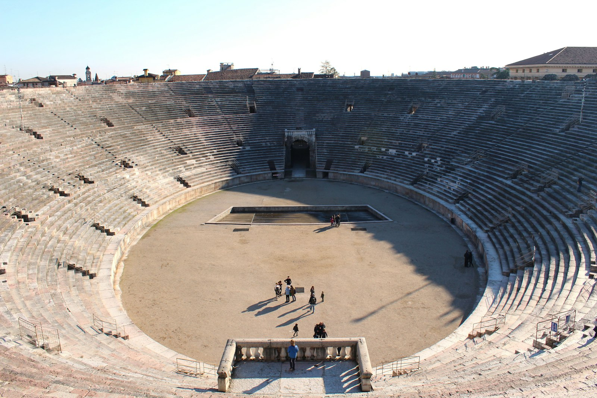
*维罗纳圆形剧场——世界上保存最完好的古罗马剧场之一*

## 交通
从今天起，你们正式开启**自驾**模式。
- **威尼斯 → 维罗纳**：
  - 上午退房后，乘坐水上巴士或酒店安排的接驳船到 **Tronchetto 停车场**（或前一晚提前将车停放在 **Mestre 火车站停车场**，乘火车到维罗纳取车——后者更便宜，停车费约 15～20 欧元/天）。
  - 如果从 Tronchetto 开车，沿 A4 高速公路向东行驶约 120 公里，约 1.5 小时抵达维罗纳。
- **维罗纳 → 科尔蒂纳丹佩佐**：
  - 下午游览结束后，从维罗纳向北驶入多洛米蒂山区。前段是高速公路，进入山区后变为风景公路（SS51），约 150 公里，开车约 2.5 小时。
- **总里程**：约 270 公里。

> **租车提示**：建议在维罗纳机场或市区取车（Hertz、Avis、Sixt 均有门店），车型推荐**紧凑型 SUV 或旅行车**（如宝马 X1、奥迪 Q3、沃尔沃 V60），意大利山区公路弯道多、坡度大，动力充足且底盘较高的车更从容。

## 维罗纳活动

### 朱丽叶故居（Casa di Giulietta）
- 位于市中心卡佩罗路（Via Cappello），是一座中世纪塔楼。
-  courtyard 里有一座朱丽叶的青铜雕像，传说摸她的右胸会带来爱情好运——现在被无数游客摸得锃亮。
- 墙上贴满了爱情便签，二楼是著名的"朱丽叶阳台"，据说罗密欧就是在这里向朱丽叶求爱的。
- **旅行价值**：虽然这是一个半虚构的景点，但维罗纳作为"爱之城"的氛围是真实的。在便签墙上贴一张你们的名字，是新婚夫妇的可爱仪式。

### 维罗纳圆形剧场（Arena di Verona）
- 建于公元 1 世纪，是世界上保存最完好、仍在使用的古罗马圆形剧场之一，可容纳 3 万名观众。
- 7～8 月是**维罗纳歌剧节（Arena di Verona Opera Festival）**的季节，晚上通常会上演《阿依达》《卡门》《托斯卡》等经典歌剧。
- 如果你们时间允许且恰好有演出，强烈建议预订一场晚间歌剧——在星空下的古罗马剧场里听《卡门》的咏叹调，是意大利能给你们的最高级浪漫。

## 午餐
推荐 **Osteria Le Civette**，位于圆形剧场附近，主打维罗纳传统菜。**Amarone 红酒炖牛肉（Stracotto all'Amarone）**是当地名产，肉质酥烂，酱汁浓郁。人均约 40～60 欧元。

## 住宿
**推荐：Cristallo Resort & Spa（克里斯塔洛温泉度假酒店）**
- 位置：科尔蒂纳丹佩佐小镇边缘，正对白云岩山峰。
- 价格：约 400～700 欧元/晚。
- 特点：多洛米蒂最传奇的酒店之一，建于 1901 年，曾接待过无数皇室和好莱坞明星。拥有绝佳的SPA设施和山景露台。
- 备选：**Hotel Corona** 或小镇上的精品木屋民宿（约 200～350 欧元/晚）。

> **设计逻辑**：科尔蒂纳是 1956 年冬奥会举办地，也是多洛米蒂最奢华、设施最完善的小镇。把它作为多洛米蒂自驾的大本营，可以辐射三峰山、Sella Ronda、Passo Giau 等核心景点。

---

# D4｜科尔蒂纳丹佩佐 → 三峰山（Tre Cime di Lavaredo）→ Sella Ronda
**主题：多洛米蒂的图腾**

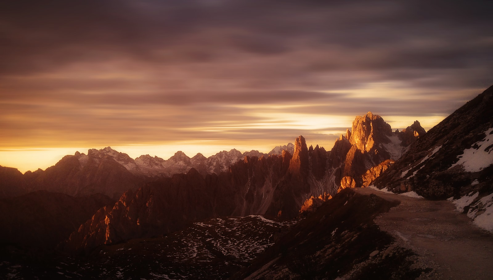
*三峰山（Tre Cime di Lavaredo）——多洛米蒂最具标志性的白云岩峰群*

这是整个行程中**自然景观最震撼的一天**。三峰山是多洛米蒂的灵魂，也是阿尔卑斯山脉最上镜的山峰之一。

## 上午：三峰山徒步

### 交通
- 从科尔蒂纳开车约 30 分钟到 **Misurina 湖**，再沿山路开约 15 分钟到达 **Rifugio Auronzo 停车场**（海拔 2320 米）。
- **注意**：夏季三峰山公路极为热门，停车场每天 10:00 前就满员。建议**早上 7:30 前从酒店出发**，或者前一晚直接住在山里的 Rifugio（高山小屋）。
- 停车费：约 30 欧元/车（夏季旺季）。

### 徒步路线
**经典环线路线：Rifugio Auronzo → Rifugio Lavaredo → Forcella Lavaredo → 三峰山北坡 → Rifugio Locatelli → 返回 Auronzo**
- 距离：约 9.5 公里（环线）。
- 爬升：约 500 米。
- 时间：3.5～4.5 小时。
- 难度：中等。路线清晰，大部分是碎石和土路，没有技术难度。

### 景观价值
- **三峰山本体**：三座锯齿状的白云岩巨峰从海拔 3000 米处拔地而起，岩壁垂直如刀削。清晨的阳光从东方照来，山峰会呈现出**玫瑰金色到亮白色的渐变**——这种现象被称为"Enrosadira"（阿尔卑斯之光），是多洛米蒂最独特的自然奇观。
- **Rifugio Locatelli**：位于三峰山北坡的观景台，可以拍到三峰山倒映在高山小湖中的经典画面。这里也是拍摄婚纱照的热门机位。
- **Cappella degli Alpini**：一座建在山坡上的小小教堂，背景就是三峰山的巨型岩壁，比例悬殊得令人敬畏。

> **徒步建议**：
> - 穿**登山鞋或高帮徒步鞋**，碎石路段容易崴脚；
> - 带足水和防晒霜，高海拔紫外线极强；
> - 山顶天气多变，即使是 7 月也要带一件**防风外套或薄羽绒**；
> - 如果体力有限，可以只走到 Rifugio Lavaredo（约 1 小时往返），风景已经足够震撼。

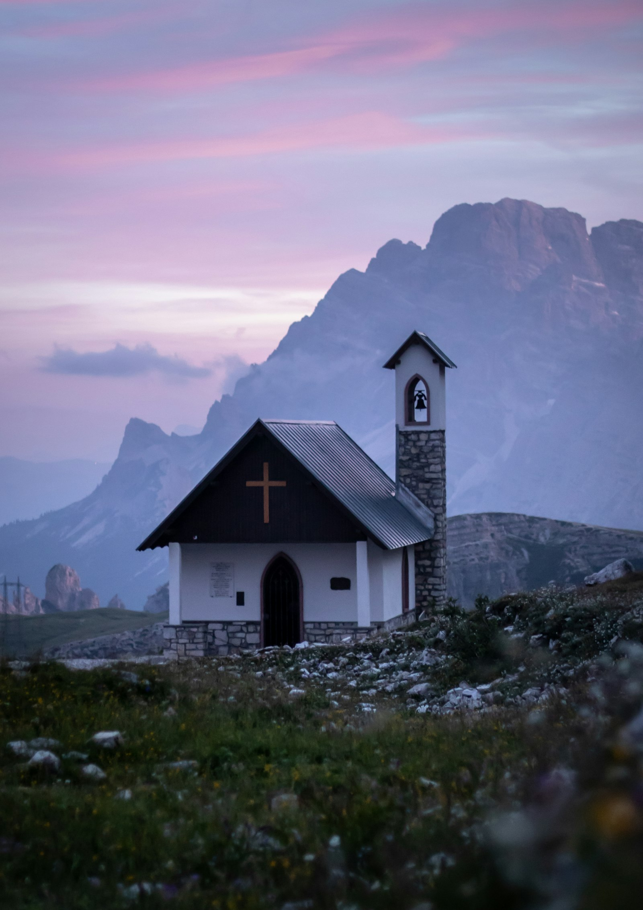
*三峰山脚下的 Cappella degli Alpini 小教堂*

## 下午：Sella Ronda 公路自驾
- 从三峰山返回科尔蒂纳后，可以开车绕一段 **Sella Ronda**——这是围绕 Sella 群山的一条环形高山公路，连接 Passo Gardena、Passo Sella、Passo Pordoi 和 Passo Campolongo 四个山口。
- 即使不完成完整环线（约 4 小时），只开其中一段也足够惊艳。公路在海拔 2000 米以上的山脊间盘旋，一侧是垂直的白云岩悬崖，另一侧是深绿色的山谷和散落的木屋。
- **Passo Giau** 不在 Sella Ronda 主环线上，但离科尔蒂纳很近（约 20 分钟车程），可以作为傍晚的加餐——日落时分这里是整个多洛米蒂最壮丽的山口之一。

## 晚餐
回到科尔蒂纳小镇，推荐 **El Camineto**。这家餐厅以**高山奶酪火锅（Fonduta）**、**野猪肉意面（Pappardelle al Cinghiale）**和**烤鹿肉**闻名。配上当地酿造的**Prosecco 起泡酒**，是对一天徒步最好的犒赏。人均约 60～90 欧元。

---

# D5｜科尔蒂纳丹佩佐 → 布莱斯湖（Lago di Braies）→ 富纳斯山谷（Val di Funes）
**主题：阿尔卑斯的明信片**

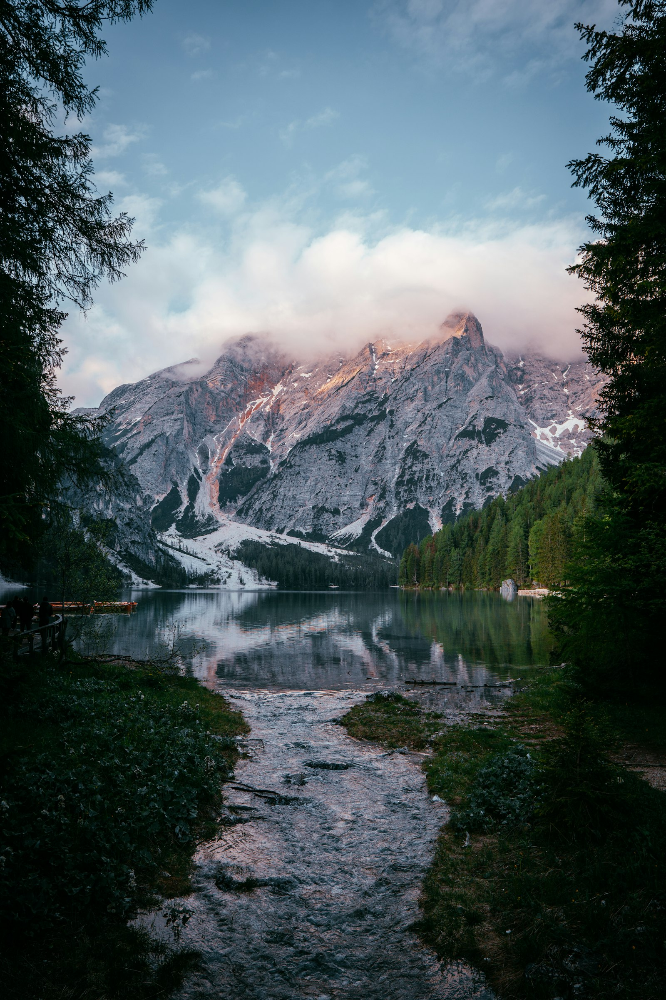
*布莱斯湖的祖母绿色湖水与木质划艇*

## 上午：布莱斯湖（Lago di Braies）
这是多洛米蒂最网红的湖泊，也是 Instagram 上出镜率最高的意大利高山湖之一。

- **交通**：从科尔蒂纳开车约 1 小时（约 60 公里），沿风景公路向北进入 Pusteria 山谷。
- **看点**：湖水呈现出不可思议的**祖母绿色到蓝绿色**，背景是垂直的 Croda del Becco 山峰（海拔 2810 米）。湖边有一座小教堂和一排木质划艇，是拍摄婚纱照的绝佳背景。
- **活动**：
  - **租划艇游湖**：约 25 欧元/小时。在平静的湖面上划船，山峰倒影触手可及，是多洛米蒂最浪漫的体验之一。
  - **环湖徒步**：约 3.5 公里，平路，1～1.5 小时。可以避开人群，找到属于自己的湖边角落。

> **时间建议**：布莱斯湖夏季 09:00 后停车场就开始排队。建议**早上 8:00 前抵达**，或者前一晚住在湖边附近的酒店。如果 10:00 后才到，体验会大打折扣。

## 下午：富纳斯山谷（Val di Funes）与 Santa Maddalena

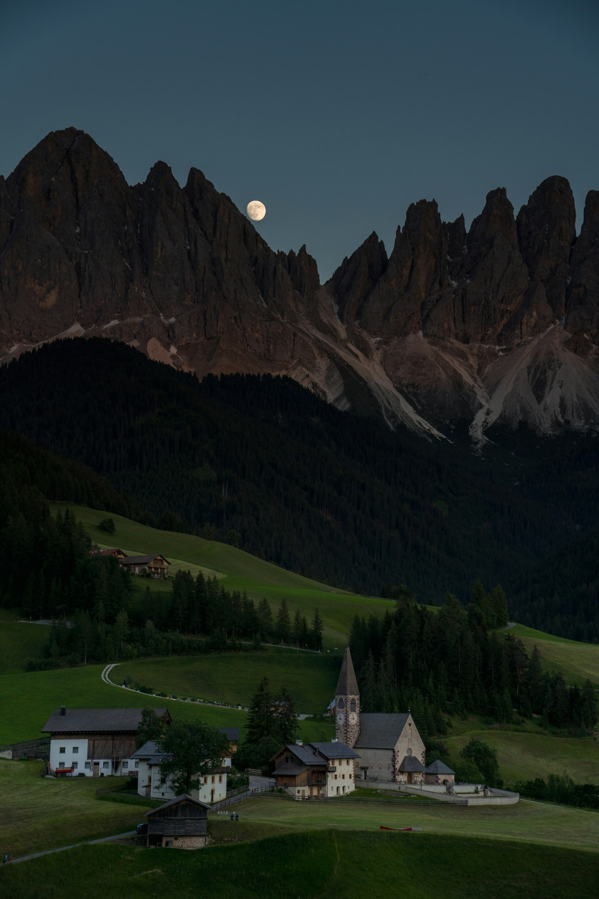
*富纳斯山谷的 Santa Maddalena 教堂与锯齿状白云岩山峰*

- **交通**：从布莱斯湖开车约 1 小时（约 50 公里）到达富纳斯山谷。
- **看点**：这里有多洛米蒂最具代表性的田园画面——一座小小的**Santa Maddalena 教堂**坐落在翠绿的草甸上，背景是锯齿状的 Odle 群峰。日落时分（约 19:30-20:30），山峰被染成玫瑰金色，教堂的尖顶剪影如同童话世界。
- **拍摄机位**：
  - 教堂后方的山坡是最佳机位，但需要尊重私人领地；
  - 更推荐从村庄主路尽头的公共步道进入，视野开阔且合法。

## 傍晚：Seceda 山顶（可选）
- 如果你们体力尚好，可以从奥蒂塞伊（Ortisei）乘坐 **Seceda 缆车**（约 15 分钟）上到海拔 2500 米的山顶。
- 这里是多洛米蒂另一个史诗级机位——从山顶俯瞰，Geisler/Odle 群峰像一堵巨大的刀锋墙突然从绿色草甸中拔起，落差超过 1000 米。日落时分的明暗对比极其强烈。
- 缆车夏季运营到 18:00 左右，建议查好时间。

## 住宿
**推荐：Adler Spa Resort Dolomiti（奥蒂塞伊）或富纳斯山谷的精品民宿**
- Adler 是多洛米蒂最著名的 Wellness 酒店之一，拥有顶级SPA和泳池，价格在 400～700 欧元/晚。
- 更本地化且性价比更高的选择是富纳斯山谷或 Santa Cristina 的**家庭式木屋酒店（Garni）**，约 150～250 欧元/晚，通常包含丰盛的阿尔卑斯早餐。

---

# D6｜奥蒂塞伊 → Passo Giau → 马尔莫拉达（Marmolada）→ 科尔蒂纳
**主题：高山公路的巅峰**

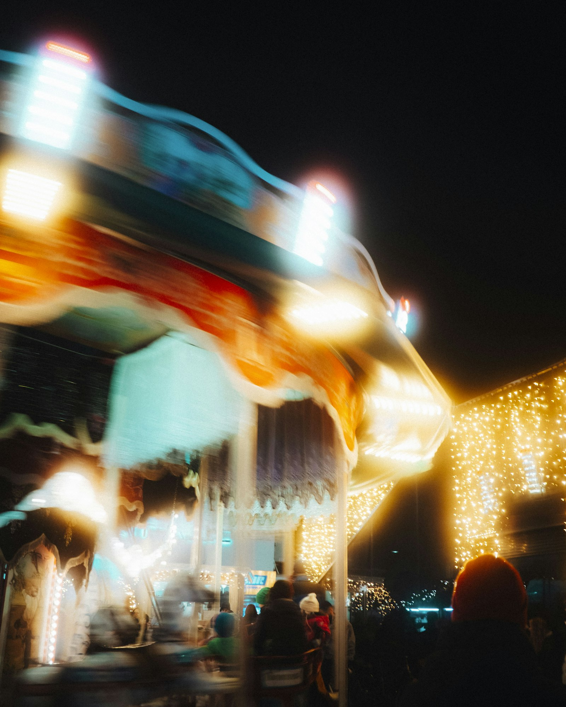
*Passo Giau 山口——多洛米蒂最壮丽的自驾公路之一*

这一天是**多洛米蒂自驾的精华日**。你们会穿越欧洲最美的高山公路之一，感受阿尔卑斯山脉的磅礴气势。

## 上午：Passo Giau（海拔 2236 米）

- **路线**：从奥蒂塞伊/科尔蒂纳出发，沿 SP638 公路 climbing 至 Passo Giau 山口。
- **景观**：这条公路在多洛米蒂自驾爱好者心中排名第一。公路在陡峭的山坡上呈之字形攀升，每一个发卡弯都带来新的震撼视角。到达山口后，360 度被白云岩巨峰环绕——东南方向是 Cinque Torri，西北方向是 Nuvolau 和 Averau。
- **山顶 Rifugio**：Passo Giau 山顶有一家 Rifugio Passo Giau，露台是拍摄山景和公路曲线的绝佳位置。在这里喝一杯高山咖啡，吃一块苹果派（Apfelstrudel），是对自驾最好的中场休息。

## 下午：Cinque Torri 与马尔莫拉达

- **Cinque Torri（五塔山）**：从 Passo Giau 下山约 15 分钟即到。这里是第一次世界大战的遗址区，山上有保存完好的战壕和露天博物馆。五座奇特的白云岩尖塔从草甸中升起，形状怪异而优美，是攀岩圣地，也适合轻松徒步。
- **马尔莫拉达（Marmolada）**：多洛米蒂最高峰（海拔 3343 米），被称为"多洛米蒂的女王"。夏季可以乘坐缆车登上山顶的冰川区，俯瞰整个山脉。从 Passo Fedaia 看马尔莫拉达的北壁，是阿尔卑斯最壮观的冰岩混合山体之一。

## 住宿
建议返回**科尔蒂纳丹佩佐**住宿，方便第二天向南出发前往加尔达湖。如果不想移动，也可以住在 **Canazei（卡纳泽伊）**，这是 Dolomiti Superski 区域的另一个核心小镇，氛围更休闲。

## 晚餐
在科尔蒂纳尝试 **Ristorante Tivoli**，这是米其林推荐的餐厅，主打现代阿尔卑斯料理。**松露意面（Tagliolini al Tartufo）**和多洛米蒂本地奶酪是必点。人均约 80～120 欧元。

---

# D7｜多洛米蒂 → SS48 刀脊公路 → 加尔达湖（Sirmione）
**主题：从雪山到湖泊的过渡**

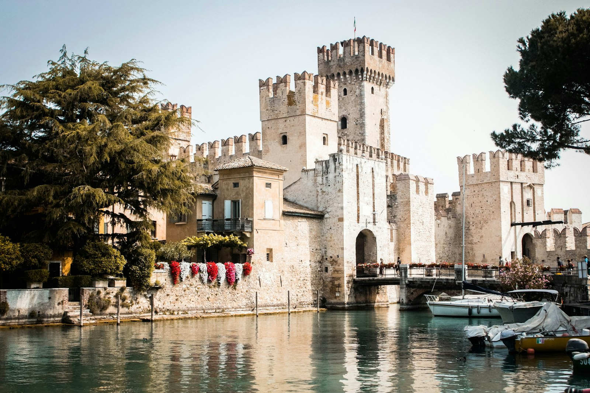
*加尔达湖畔的西尔苗内小镇与斯卡利杰罗城堡*

## 自驾路线
- **多洛米蒂 → 特伦托（Trento）**：沿 SS48 公路向南，穿越 **Passo Costalunga 和 Passo Rolle**（如果走东线）或沿 A22 高速公路直下（更快）。
- **特伦托 → 加尔达湖**：沿公路向南约 1 小时，抵达西尔苗内（Sirmione）。
- **总里程**：约 180～220 公里（取决于具体路线）。
- **开车时间**：约 3.5～4.5 小时（含休息和拍照）。

> **路线建议**：如果时间充裕，可以走风景路线经过 **Passo Rolle** 和 **Pale di San Martino**，这是多洛米蒂另一个世界级的山景区域；如果想轻松一些，直接走 A22 高速公路南下，沿途欣赏阿尔卑斯山南麓的葡萄园和橄榄树林。

## 西尔苗内（Sirmione）
这是加尔达湖上最美丽的小镇，伸入湖中的狭长半岛上布满了柠檬树、温泉浴场和中世纪城堡。

- **斯卡利杰罗城堡（Castello Scaligero）**：一座建于 13 世纪的水上城堡，通过一座木桥与陆地相连。登上塔楼可以俯瞰整个加尔达湖的碧蓝水面。
- **卡图卢斯石窟（Grotte di Catullo）**：罗马诗人卡图卢斯的别墅遗址，位于半岛尽头的山坡上，可以远眺湖泊北岸的群山。
- **温泉**：西尔苗内以硫磺温泉闻名，湖畔有多家温泉浴场（如 Terme di Sirmione 和 Aquaria Thermal SPA）。在阿尔卑斯徒步几天后，泡一个温泉是身体的救赎。

## 住宿
**推荐：Hotel Sirmione e Promessi Sposi**
- 位置：西尔苗内老城入口附近，临湖。
- 价格：约 250～450 欧元/晚。
- 特点：拥有私人湖滩和露天泳池，部分房间带有湖景阳台。
- 备选：老城内的精品民宿或湖畔的 Agriturismo（农家乐）。

## 晚餐
西尔苗内的餐厅以**柠檬风味料理**和**湖鱼**闻名。推荐 **Ristorante L'Arcimboldo**，招牌菜是**香煎白鱼（Coregone）**和**柠檬意式烩饭（Risotto al Limone）**。配上一杯加尔达湖本地的**Lugana 白葡萄酒**，在湖畔露台上看着夕阳沉入湖面。人均约 50～80 欧元。

---

# D8｜西尔苗内 → 米兰（Milano）
**主题：从湖畔到时尚之都**

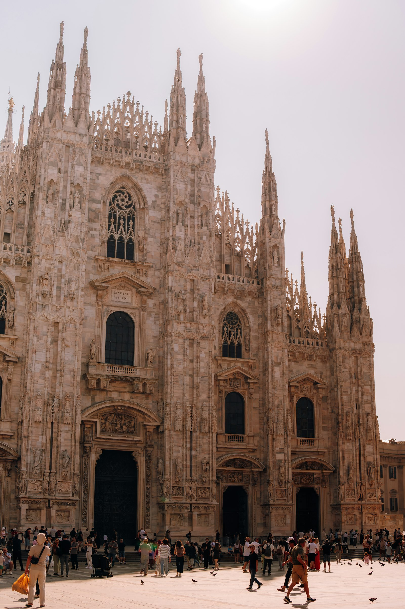
*米兰大教堂（Duomo di Milano）与埃马努埃莱二世长廊*

## 上午：加尔达湖告别
- 早上在西尔苗内再散步一圈，或者租一艘小船在湖中巡游（无需驾照，约 40 欧元/小时）。从水上看城堡和小镇，是另一种角度的美。
- **购物**：西尔苗内有很多柠檬主题的纪念品店——柠檬酒（Limoncello）、柠檬香皂、柠檬巧克力，适合作为伴手礼。

## 下午：米兰
- **交通**：从西尔苗内开车约 1.5 小时（约 140 公里）抵达米兰市区。
- **停车**：米兰 ZTL（限行区）非常严格，建议将车停放在酒店合作停车场或城外的 P+R，然后步行游览。

## 活动

### 米兰大教堂（Duomo di Milano）
- 意大利最大的教堂，哥特式建筑的巅峰，外墙上有 3400 多座雕像，是世界上规模最大的教堂之一。
- 建议购买**登顶电梯票**，到屋顶露台近距离欣赏尖塔和金色圣母像（La Madonnina），同时俯瞰整个米兰城。

### 埃马努埃莱二世长廊（Galleria Vittorio Emanuele II）
- 世界上最古老的购物中心之一，穹顶是玻璃和铁结构的杰作。
- 地面上的公牛马赛克是一个著名传统——用脚跟踩着公牛的生殖器旋转三圈，会带来好运。现在那里已经磨出了一个小坑。
- 长廊两侧是 Prada、Gucci、Louis Vuitton 等奢侈品牌的旗舰店。即使不购物，来这里喝咖啡、看人也足够愉悦。

### 斯福尔扎城堡（Castello Sforzesco）与感恩圣母堂（Santa Maria delle Grazie）
- 如果时间充裕，可以去感恩圣母堂看达·芬奇的《最后的晚餐》。但门票**必须提前数月预订**，现场几乎买不到。
- 斯福尔扎城堡是米兰最大的历史建筑，内部有多家博物馆，城堡后的公园是市民休闲的好去处。

## 住宿
**推荐：Bulgari Hotel Milano 或 Hotel Spadari al Duomo**
- Bulgari Hotel 位于蒙特拿破仑大街附近，是米兰最奢华的设计酒店之一（约 800～1500 欧元/晚）。
- Hotel Spadari al Duomo 位置极佳，步行到大教堂 3 分钟，价格更合理（约 250～400 欧元/晚）。

## 晚餐
推荐 **Trattoria Milanese**，一家成立于 1933 年的传统米兰餐厅。招牌菜是**米兰炸肉排（Cotoletta alla Milanese）**——一块比脸还大的带骨小牛肉排，裹上面包糠炸至金黄，配柠檬角和烤土豆。这是米兰的国民美食，粗暴而满足。人均约 40～70 欧元。

---

# D9｜米兰 → 国内
**主题：回家**

- **航班**：建议选择**中午或下午**的航班（12:00～16:00 起飞），这样上午还有时间在米兰买最后的伴手礼。
- **机场交通**：从米兰市中心到 **马尔彭萨机场（MXP）**约 50 分钟：
  - **Malpensa Express 机场快线**：从 Milano Cadorna 或 Milano Centrale 出发，约 50 分钟，票价 13 欧元/人；
  - **出租车/网约车**：约 90～120 欧元，适合行李较多的情况。
- **退税**：马尔彭萨机场 T1 的退税柜台通常在值机大厅和安检后都有。如果在米兰购买了奢侈品，建议提前 3 小时到达机场办理退税和值机。

带着威尼斯的水巷记忆、多洛米蒂的玫瑰金日出、加尔达湖的柠檬香气，和旅行的满足感回家。

---

## 附录一：全程预算拆分（2 人总计）

| 项目 | 金额（人民币） | 说明 |
|:---|:---:|:---|
| **国际往返机票** | 18,000～28,000 | 暑假经欧洲转机经济舱，约 0.9～1.4 万/人；直飞约 1.5～2 万/人 |
| **意大利境内交通（火车/租车/油费/停车/高速）** | 10,000～14,000 | 租车约 6 天（紧凑型 SUV），含油费、高速费、威尼斯 Tronchetto 停车费等 |
| **住宿（8 晚）** | 16,000～28,000 | 威尼斯/米兰 1200～2000 元/晚，多洛米蒂/加尔达湖 800～1500 元/晚 |
| **餐饮** | 10,000～16,000 | 外食人均 200～400 元/顿，简餐人均 80～150 元/顿 |
| **门票/体验** | 3,000～5,000 | 总督宫、钟楼登顶、贡多拉（约 800 元/次）、三峰山停车费、缆车、布莱斯湖划艇、温泉等 |
| **签证/保险/杂费** | 2,000～3,000 | 申根签证约 800 元/人，保险 200 元/人 |
| **总计** | **约 59,000～94,000 元** | **人均 2.95～4.7 万** |

> **省钱小贴士**：
> - 威尼斯住宿是全程最贵的一项，如果预算有限，可以住 Mestre（大陆）的精品酒店，价格约为本岛的 1/3，乘火车 10 分钟可达圣露西亚火车站。
> - 多洛米蒂的餐厅价格较高，但超市（Coop、Despar）的火腿、奶酪、面包和水果价格合理，很多民宿带厨房，可以自己做早餐和简单晚餐。
> - 贡多拉费用固定，但可以和他人拼船（最多 6 人），将人均成本降至 150 元左右。

---

## 附录二：行前准备清单

### 证件与签证
- [ ] **申根签证（意大利）**：至少提前 **6～8 周**申请。7～8 月是欧洲旅游旺季，签证 slot 紧张，建议尽早预约。
- [ ] 护照（有效期 6 个月以上）。
- [ ] 驾照原件 + **国际驾照翻译认证件**（租租车 APP 可免费办理）。
- [ ] 旅行保险（申根强制要求，保额 ≥ 3 万欧元）。

### 预订确认（按优先级）
1. [ ] **国际机票**
2. [ ] **威尼斯本岛酒店**（尤其是带运河景观的房间，旺季紧张）
3. [ ] **多洛米蒂住宿**（科尔蒂纳或奥蒂塞伊，7～8 月提前 2～3 个月预订）
4. [ ] **租车**：维罗纳取车 → 米兰还车（建议提前预订紧凑型 SUV）
5. [ ] **三峰山停车位**（夏季需提前预约，网址：parcheggiotrecime.it）
6. [ ] **《最后的晚餐》门票**（如果计划去米兰，必须提前 2～3 个月预订）
7. [ ] **维罗纳歌剧节门票**（如果行程恰逢演出日，可在 arena.it 查询）
8. [ ] **布莱斯湖划艇/缆车**：现场租赁即可，但旺季建议早到

### 衣物与装备
- [ ] **轻便防水冲锋衣**：多洛米蒂山区天气多变，夏季也可能突然降雨。
- [ ] **登山鞋/高帮徒步鞋**：三峰山徒步必备，碎石路段多。
- [ ] **防晒装备**：高海拔紫外线极强，防晒霜（SPF50+）、墨镜、遮阳帽必不可少。
- [ ] **薄羽绒或抓绒内胆**：多洛米蒂山顶和清晨气温可能降至 10℃左右。
- [ ] **泳装**：加尔达湖温泉和夏季游泳需要。
- [ ] **转换插头**：意大利使用**欧标双圆孔插头**（C/F 型，220V）。
- [ ] **便携烧水壶**：意大利酒店通常不提供热水壶。
- [ ] **少量现金**：意大利很多小店、停车场和缆车只收现金，建议携带 200～300 欧元零钱。

### APP 下载
- **Google Maps**：离线地图必备，多洛米蒂山区信号不稳定。
- **Trenitalia / Italo**：意大利铁路官方 APP，可查询和购买火车票。
- **TheFork**：餐厅预订（意大利版大众点评）。
- **Parkopedia**：查找意大利城市停车场和实时空位。
- **Google Translate**：拍照翻译菜单非常有用。

---

## 附录三：关键决策说明（FAQ）

### Q1：为什么不直接飞到米兰，而是从威尼斯开始？
威尼斯到米兰的自驾路线（经维罗纳、多洛米蒂、加尔达湖）是一条完美的弧线，不走回头路。如果直飞米兰，再去威尼斯会多跑约 500 公里的回头路。而且从机场体验来说，**威尼斯马可波罗机场**规模适中，入关快，作为蜜月起点更有仪式感。如果国内飞威尼斯票价过高，也可以先飞米兰，当天乘火车到威尼斯过夜。

### Q2：威尼斯本岛不能开车，车停在哪里最合理？
推荐两个方案：
- **Tronchetto 停车场**：威尼斯本岛边缘的大型停车场，通过 Ponte della Libertà 公路桥直接可达，约 25～35 欧元/天。从停车场可乘水上巴士或 People Mover 进入本岛核心。
- **Mestre 火车站停车场**：位于威尼斯大陆（Mestre），约 15～20 欧元/天。把车停在这里，乘火车 10 分钟到威尼斯圣露西亚火车站（Santa Lucia），不仅省钱，还能避免开车过桥的不便。

### Q3：多洛米蒂自驾对驾驶技术要求高吗？
**只要有一定山路驾驶经验，就完全没问题。** 多洛米蒂的公路维护极好，标志清晰，夏季车流虽大但秩序井然。需要注意的是：
- 山路弯道多、坡度大，手动挡车会比较累，建议租自动挡；
- 部分高山公路（如 Passo Giau）狭窄，会车时要减速；
- 夏季是骑行旺季，公路上常有自行车队，超车时要保持安全距离。

### Q4：三峰山徒步难度大吗？普通人能完成吗？
**经典环线的难度属于中等**，没有技术攀爬，全程是明显的步道。主要挑战在于：
- 海拔较高（起点 2320 米），部分人可能有轻微高反；
- 全程约 9.5 公里，爬升 400 米，对体力有一定要求；
- 碎石路段较多，需要防滑的登山鞋。
如果体力有限，可以只走到 Rifugio Lavaredo（约 1 小时往返），风景已经非常震撼。带老人或小孩的游客，也可以在山顶平台附近轻松漫步。

### Q5：这条线和瑞士阿尔卑斯相比有什么优势？
多洛米蒂和瑞士阿尔卑斯相比，有三大优势：
- **景观独特性**：白云岩（Dolomite）是一种特殊的碳酸钙岩石，在阳光照射下会呈现玫瑰金色，这是瑞士的花岗岩山峰所没有的色彩魔法；
- **人文与美食**：意大利北部有丰富的历史遗迹（维罗纳圆形剧场、米兰大教堂）和世界顶级的饮食文化，而瑞士更偏向纯自然风光；
- **性价比**：同等住宿和餐饮标准下，意大利北部的花费约为瑞士的 60%～70%。

---

## 附录四：一句话总结

这 9 天，你们会在威尼斯的大运河上坐一次贡多拉，在维罗纳的圆形剧场下贴一张爱情便签，在多洛米蒂的玫瑰金日出里徒步环绕三峰山，在布莱斯湖的祖母绿湖水里划一艘木船，最后在加尔达湖畔的温泉中看着阿尔卑斯的余晖沉入意大利最深的湖泊。

**这是意大利北部在夏天唯一的样子，也是你们旅行最丰盈的记忆。**

---

*文档生成时间：2026 年 4 月*  
*祝你们旅途愉快，新婚快乐！*
