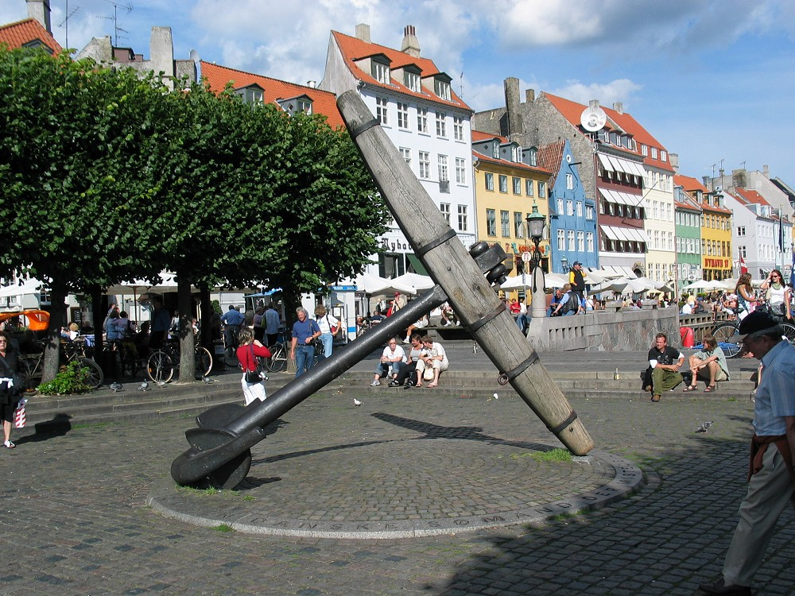
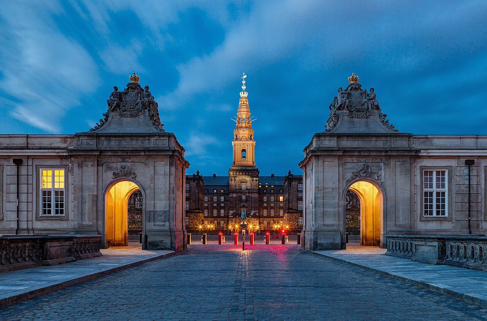
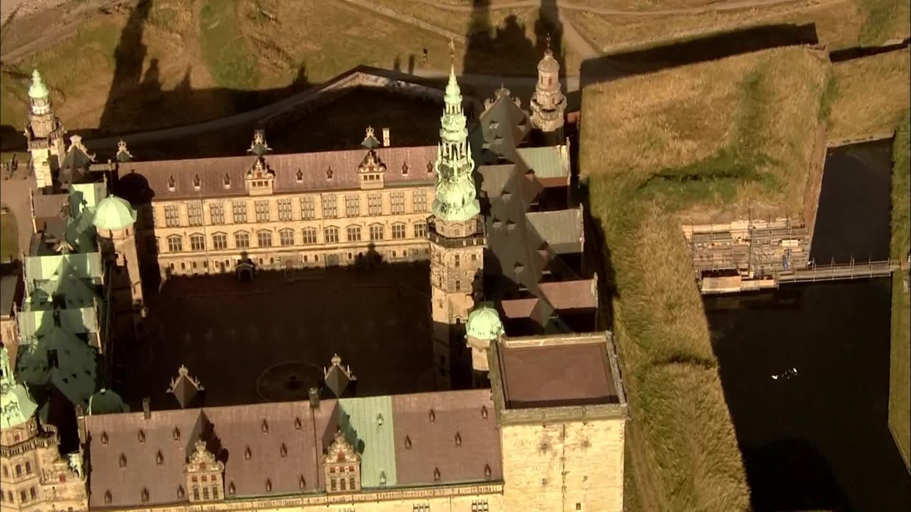
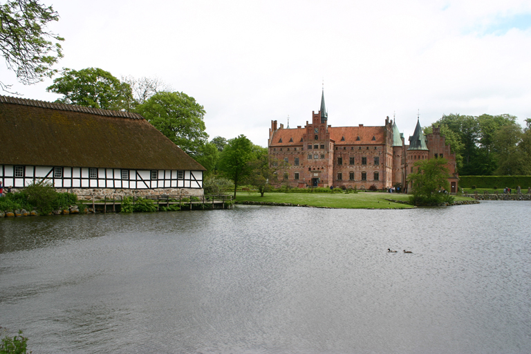
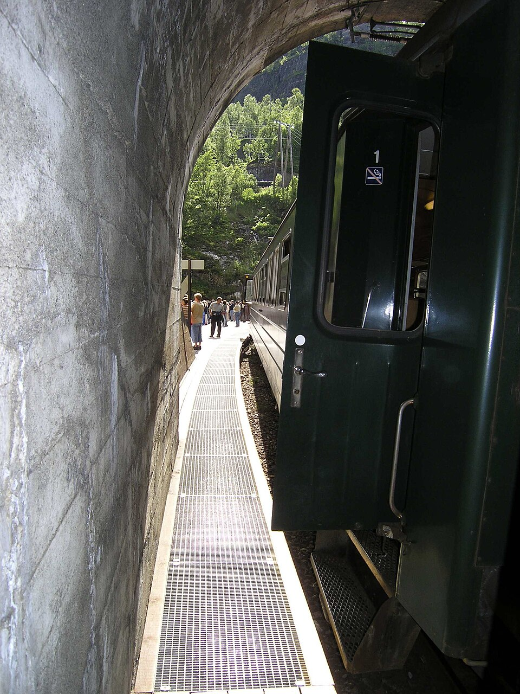
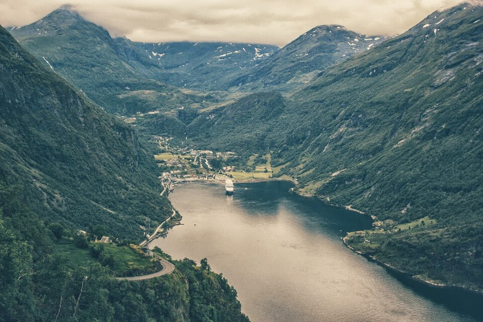
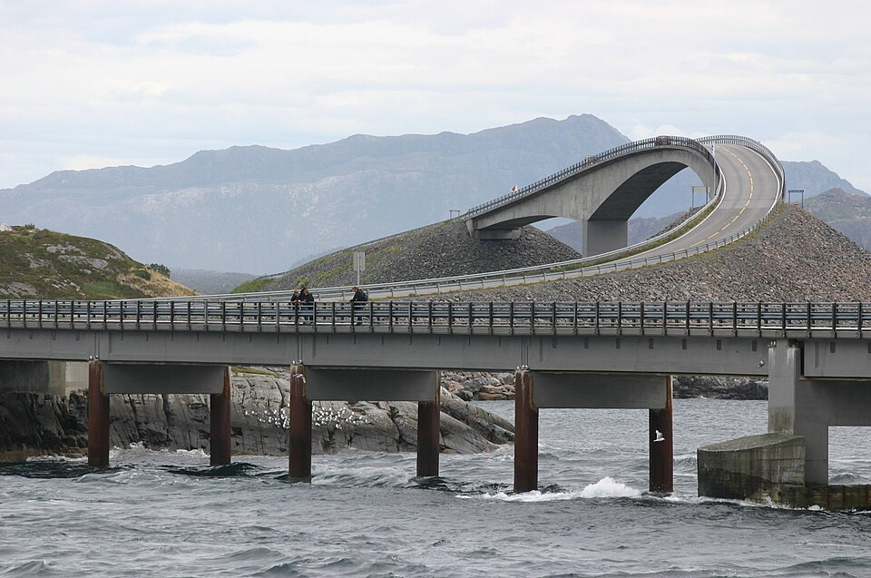

# 挪威 + 丹麦｜峡湾童话双国记｜9 天婚假执行手册

> **旅行时间**：7～8 月（夏季黄金窗口）  
> **旅行人数**：2 人（婚假）  
> **总天数**：9 天 8 晚  
> **核心目的地**：哥本哈根 → 北西兰岛 → 欧登塞 → 卑尔根 → 松恩峡湾 → 盖朗厄尔峡湾 → 大西洋公路  
> **人均预算**：3.0～4.0 万元人民币（舒适不奢华，2 人总计约 6～8 万元）

---

## 为什么选挪威 + 丹麦？

这是北欧唯一能做到**"风景震撼"与"人文美食"双满分**的两国组合。

如果你们想要的是"国内没有的壮丽风光"，挪威的峡湾、发卡弯公路和午夜阳光是正确答案；如果你们同时也不想放弃米其林餐厅、童话城堡和松弛的城市漫步，丹麦就是最完美的另一半。

- **丹麦**负责温柔：安徒生的故乡、米其林密度最高的城市、可以骑自行车逛遍的哥本哈根、海边悬崖上的现代美术馆。
- **挪威**负责震撼：世界最陡的高山火车、冲入大海的公路、垂直的峡湾悬崖和粉紫色的午夜阳光。

这 9 天，你们会在伊埃斯科城堡的迷宫花园里牵手，也会在老鹰之路与 Gudbrandsjuvet 的峡谷观景台上惊叹；会在哥本哈根的米其林餐厅里碰杯，也会在艾于兰峡湾的民宿露台上看太阳不落山。

**这是"震撼"与"松弛"的最佳双国平衡。**

---

## 行程总览

| 天数 | 星期 | 路线 | 住宿地 | 核心体验 | 开车距离 |
|:---:|:---:|:---|:---|:---|:---:|
| D1 | 六 | 国内 → 哥本哈根 | 哥本哈根 | 新港彩色房子、运河游船、适应极昼 | — |
| D2 | 日 | 哥本哈根 | 哥本哈根 | 克里斯蒂安堡宫、设计区、趣伏里公园 | — |
| D3 | 一 | 北西兰岛 | 哥本哈根 | 克伦堡城堡、路易斯安那现代美术馆 | 约 100 km |
| D4 | 二 | 欧登塞 → 卑尔根 | 卑尔根 | 伊埃斯科城堡、安徒生博物馆、晚班机飞挪威 | 丹麦境内约 200 km |
| D5 | 三 | 卑尔根 → 弗洛姆 → 艾于兰 | 艾于兰 | 布吕根、弗洛姆高山火车、峡湾游船 | — |
| D6 | 四 | 艾于兰 → 盖朗厄尔 | 盖朗厄尔 | 自驾峡湾公路、老鹰之路俯瞰 | 约 200 km |
| D7 | 五 | 盖朗厄尔 → 老鹰之路 → Gudbrandsjuvet → 大西洋公路 → 克里斯蒂安松 | 克里斯蒂安松 | 老鹰之路 + Gudbrandsjuvet + 大西洋公路海上飞车 | 约 300 km |
| D8 | 六 | 克里斯蒂安松 → 奥斯陆 | 奥斯陆 | 飞回首都，最后的城市之夜 | — |
| D9 | 日 | 奥斯陆 → 国内 | — | 返程 | — |

> **设计逻辑**：丹麦 3.5 天慢游童话与人文；挪威 4.5 天自驾峡湾精华；不走罗弗敦（时间不够），但保留了挪威南部最震撼的峡湾与公路。奥斯陆只作为返程中转口。

---

# D1｜国内 → 哥本哈根（Copenhagen）
**主题：抵达童话王国**

*哥本哈根新港（Nyhavn）彩色房子与运河*

## 交通
- **航班**：建议选择 **北欧航空 SAS**、**汉莎航空** 或 **芬兰航空** 的直飞或一次转机航班，**下午 14:00-17:00 抵达哥本哈根凯斯楚普机场（CPH）** 最佳。
- **机场 → 市区**：地铁 M2 线约 15 分钟到市中心，或机场快线火车约 13 分钟到中央车站（København H）。
- **租车**：抵达当天不租车。哥本哈根市区非常适合步行+地铁，且停车极贵。建议**D3 早上再取车**，用于北西兰岛和欧登塞的自驾。

## 住宿
**推荐：Hotel Sanders 或 Hotel Kong Arthur**
- **Hotel Sanders**：位于 Indre By（内城区），设计酒店，北欧极简风，步行 10 分钟到新港。
- **Hotel Kong Arthur**：位于 Nørrebro，价格更适中，自带庭院和温泉池，步行可达湖区散步。
- 价格：约 1500～2500 DKK/晚。

## 活动
- **傍晚**：在新港（Nyhavn）散步。这里曾是安徒生住过的地方（他在 18、20 和 67 号都住过）。彩色房子从赭黄到深红排列，夏季傍晚阳光把它们照得像糖果盒。
- **晚餐**：
  - **Restaurant Barr**：在 Noma 旧址上开设的新北欧料理，由厨师 Thorsten Schmidt 与 Noma 创始人 René Redzepi 合作打造，位于 Nyhavn 尽头的老仓库里，氛围轻松，人均约 800 DKK。
  - 或 **Torvehallerne KBH**：哥本哈根最美的室内食品市场，生蚝、开放三明治（Smørrebrød）、新鲜海鲜，人均 200～400 DKK。
- **小贴士**：7～8 月的哥本哈根晚上 10 点天还亮着。吃完饭后在运河边散步，看着夕阳把彩色房子的倒影染成金色，是抵达丹麦最好的开场。

---

# D2｜哥本哈根（Copenhagen）
**主题：设计、历史与童话之夜**

*克里斯蒂安堡宫与皇家马厩*

## 活动

### 上午：克里斯蒂安堡宫（Christiansborg Slot）
- 这里是丹麦议会、最高法院和首相办公室的所在地，也是王室举行国宴的地方。
- **必做**：登上塔楼（免费），这是哥本哈根市区最高点，可以 360 度俯瞰全城——能看到远处的厄勒海峡大桥和瑞典海岸。
- 宫殿地下还有**罗马时期遗址博物馆**，可以看到 1167 年城堡原址的地基。

### 下午：设计区漫步与阿美琳堡宫
- **设计区**：Strøget 步行街附近集中了 Hay House、Georg Jensen、Illums Bolighus 等北欧设计名店。即使不买，光是看橱窗陈列也是一种视觉享受。
- **阿美琳堡宫（Amalienborg）**：中午 12:00 看**皇家卫队换岗仪式**。卫队身着黑色熊皮帽和红色军装，从罗森堡宫步行过来，气势庄严。
- **救主堂（Vor Frelsers Kirke）**：螺旋塔楼可以攀登，从外部螺旋楼梯登顶，俯瞰克里斯钦自由城（Christiania）的彩色涂鸦屋顶。

### 晚上：趣伏里公园（Tivoli Gardens）
- 这是世界上最古老的游乐园之一（1843 年开园），也是华特·迪士尼建造迪士尼乐园的灵感来源。
- 夏季夜晚，花园里有超过 10 万盏灯装饰，还有现场古典音乐会和烟花表演。
- **晚餐**：趣伏里园内的 **Nimb** 餐厅（米其林推荐）或园外的 **Kadeau**（新北欧料理一星）。

---

# D3｜北西兰岛（Nordsjælland）
**主题：城堡与现代艺术的对话**

*克伦堡城堡——莎士比亚《哈姆雷特》的取景地*

## 自驾路线
- **取车**：早上在哥本哈根中央车站或机场附近取车。推荐 Europcar、Hertz。
- **路线**：哥本哈根 → 赫尔辛格（Helsingør）约 45 分钟 → 路易斯安那美术馆约 20 分钟 → 返回哥本哈根。
- **总里程**：约 100 公里。

## 上午：克伦堡宫（Kronborg Slot）
- 这座海边城堡是**莎士比亚《哈姆雷特》的故事发生地**，每年夏天城堡里都会上演《哈姆雷特》露天戏剧。
- 城堡位于厄勒海峡最窄处，正对瑞典的赫尔辛堡，历史上是控制波罗的海入口的军事要塞。
- **必看**：地下隧道（Kasematterne）——昏暗潮湿的石砌地道，传说中丹麦传奇英雄 Holger Danske 就在这里沉睡，一旦丹麦遭遇危机，他就会苏醒。

## 下午：路易斯安那现代艺术博物馆（Louisiana Museum of Modern Art）

*路易斯安那美术馆的雕塑花园与厄勒海峡*

这是**全球最美的海边现代美术馆**，没有之一。

- **建筑**：美术馆依山而建，白色混凝土建筑与绿色植被融为一体，巨大的落地窗将海景框成一幅幅活的画作。
- **雕塑花园**：室外花园里摆放着亚历山大·考尔德（Alexander Calder）的动态雕塑、亨利·摩尔（Henry Moore）的青铜人体。夏天，游客可以躺在草坪上，看着海面上的瑞典渡轮缓缓驶过。
- **咖啡厅**：馆内咖啡厅拥有全馆最佳海景位，点一杯咖啡和一块丹麦酥（Wienerbrød），是北西兰岛最惬意的下午茶。

## 晚餐
返回哥本哈根市区，推荐 **Alchemist**（二星，需提前数月预订）或性价比更高的 **Marv & Ben**（新派丹麦菜，人均 400 DKK）。

---

# D4｜欧登塞（Odense）→ 卑尔根（Bergen）
**主题：从童话城堡到峡湾之门**

*伊埃斯科城堡——欧洲保存最完好的文艺复兴水边城堡*

## 自驾路线
- **路线**：哥本哈根 → 欧登塞（Odense）约 1.5 小时。途中务必绕去伊埃斯科城堡（Egeskov Slot），距欧登塞约 30 分钟。
- **总里程**：约 200 公里。

## 上午：伊埃斯科城堡（Egeskov Slot）
- 建于 1554 年，是**欧洲保存最好的文艺复兴水边城堡**。护城河环绕，尖塔倒映在水中，迷宫花园占地超过 4 公顷。
- **浪漫体验**：城堡主人 Michael 伯爵至今住在这里（住在一侧 wing，游客区域在另一侧）。花园里有一座巨大的树顶迷宫和一座悬浮在空中的树顶步道（Treetop Walk）。
- 如果天气好，在城堡草坪上野餐是极其浪漫的体验。

## 下午：欧登塞市区
- **安徒生博物馆（H.C. Andersen Museum）**：2021 年由日本建筑师隈研吾重新设计，建筑本身就像一个巨大的童话盒子，倾斜的屋顶和玻璃幕墙充满梦幻感。
- **安徒生童年故居**：位于博物馆隔壁，是一座黄色的小房子，内部保持着 19 世纪初的原貌。
- **欧登塞老城步行街**：鹅卵石街道、彩色木屋、街头艺人和咖啡馆。

## 晚上：飞赴挪威
- **还车**：欧登塞市区或哥本哈根机场还车（取决于航班时间）。
- **航班**：**SAS 或 Norwegian 晚班机**（约 19:00-20:00 起飞），哥本哈根(CPH) ✈ 卑尔根(BGO)，航程约 1 小时 20 分钟。
- **抵达卑尔根**：机场取第二段租的车（建议预订四驱 SUV，如沃尔沃 XC60），自驾 30 分钟到市区酒店。

## 住宿
**推荐：Radisson Blu Royal Hotel, Bergen**
- 位置：布吕根港口内，出门就是彩色木屋。
- 价格：约 2000～2800 NOK/晚。

---

# D5｜卑尔根 → 弗洛姆 → 艾于兰（Aurland）
**主题：全世界最美的火车线路**

*卑尔根布吕根世界文化遗产港区*

## 上午：卑尔根市区
- **布吕根（Bryggen）**：世界文化遗产，一排排三角屋顶的彩色木屋沿着码头排列。这里是汉萨同盟时期（14 世纪）的贸易港口遗址。
- **鱼市场（Fisketorget）**：现场吃帝王蟹、龙虾、三文鱼汤。
- **弗洛伊恩山缆车（Fløibanen）**：山顶俯瞰卑尔根全景，红色屋顶的城市 nestled 在绿色山谷与蓝色海湾之间。

## 下午：挪威缩影精华段

*弗洛姆高山火车停靠在 Kjosfossen 瀑布站*

### 卑尔根 → Myrdal（高山火车站）
- 乘坐 **Bergensbanen（卑尔根铁路）**，约 2 小时。欧洲海拔最高的干线铁路，穿越哈当厄高原。

### Myrdal → 弗洛姆（Flåm）：弗洛姆高山火车（Flåmsbana）
- **全世界最陡的标准轨距铁路**，20 公里内海拔从 866 米骤降至海平面。
- **中途停靠 Kjosfossen 瀑布**：累计落差约 225 米（主瀑布约 93 米），夏季常有穿着传统服饰的"山妖"舞者表演。
- **选座技巧**：下行坐**左侧**风景更佳。

### 弗洛姆 → 艾于兰：峡湾游船
- 游览 **艾于兰峡湾（Aurlandsfjorden）** 和 **纳柔依峡湾（Nærøyfjorden）**——后者是联合国教科文组织世界遗产。
- 终点 **Gudvangen**，再乘大巴/出租车到艾于兰（约 30 分钟）。

> **行李提示**：这一天换乘频繁，建议前一晚在卑尔根将大件行李**寄存在酒店或寄送到后续酒店**，只带轻便背包。

## 住宿
**强烈推荐：29|2 Aurland**
- 峡湾景观设计酒店，房间极少，**落地窗正对艾于兰峡湾**。傍晚坐在露台上看太阳滑向雪山背后，是这一天的高潮。
- 备选：**Fretheim Hotel**，老牌峡湾酒店，花园可直接走到峡湾边。

---

# D6｜艾于兰 → 盖朗厄尔（Geiranger）
**主题：峡湾自驾的巅峰**

*从 Stegastein 观景台俯瞰艾于兰峡湾*

## 自驾路线
- **取车**：上午在 Sogndal 市区或机场取车（如果从艾于兰打车到 Sogndal 约 40 分钟）。
- **路线**：Sogndal → **Lærdal 隧道**（世界最长公路隧道，24.5 公里）→ Stryn → Hellesylt → 乘轮渡进入盖朗厄尔峡湾 → 盖朗厄尔小镇。
- **总里程**：约 200 公里（陆路）+ 轮渡。
- **开车时间**：约 4.5～5.5 小时（含多次停车）。

## 途中亮点

### Lærdal 隧道
- 全长 24.5 公里，是世界上最长的公路隧道。
- 隧道中设有三个"洞穴"休息区，用蓝色和黄色灯光模拟日出，像地下宫殿。

### Hellesylt → Geiranger 轮渡
- 轮渡上会远眺 **"七姐妹瀑布（De Syv Søstre）"**——七道水流从 250 米高的悬崖同时倾泻而下。
- **重要提示**：7～8 月非常热门，建议提前在 Fjord1 官网预订船票。

*盖朗厄尔峡湾的七姐妹瀑布*

## 下午：老鹰之路（Ørnevegen）
- **11 个发卡弯**，在约 7 公里内攀升 620 米海拔。
- **观景台 Ørnesvingen**：俯瞰盖朗厄尔峡湾像一条深蓝色丝带蜿蜒在灰色群山之间。
- **时间建议**：下午 5 点后再去，避开邮轮游客，光线柔和。

## 住宿
**推荐：Hotel Union Geiranger**
- 拥有盖朗厄尔最好的**室外温水泳池**——泡在池子里看着峡湾和雪山。

---

# D7｜盖朗厄尔 → 老鹰之路 → Gudbrandsjuvet → 大西洋公路 → 克里斯蒂安松（Kristiansund）
**主题：世界最美公路之一**

*从老鹰之路 Ørnesvingen 观景台俯瞰盖朗厄尔峡湾*

这一天是整个自驾行程的高潮。由于 **Trollstigen 在 2026 年仍未恢复常规通行**，这里改为当前可执行的**Valldal 绕行版**，依然保留峡湾公路和大西洋公路两段高光。

## 自驾路线
**盖朗厄尔 → 老鹰之路（Ørnevegen）→ Eidsdal–Linge 轮渡 → Valldal → Gudbrandsjuvet → Vestnes / Molde → 大西洋公路（Atlanterhavsveien）→ 克里斯蒂安松**

### 第一段：老鹰之路（Ørnevegen）+ Gudbrandsjuvet
- 从盖朗厄尔出发，先沿 **老鹰之路** 翻上山脊，再通过 **Eidsdal–Linge** 轮渡进入 Valldal 山谷。
- **Gudbrandsjuvet** 位于 63 号公路旁，是一条被现代观景平台包裹的狭窄峡谷。河水在深槽中急冲而下，建筑和自然结合得非常克制，是绕行版里最值回票价的停靠点。
- **当前说明**：截至 **2026 年 4 月 11 日**，Trollstigen 路段仍关闭，因此不把穿越 Trollstigen 写入主路线。

### 第二段：大西洋公路（Atlanterhavsveien）

*大西洋公路的标志性桥梁 Storseisundet Bridge*

- 全长仅 8.3 公里，由 8 座桥梁连接小岛和礁石。
- **Storseisundet Bridge**：从某个角度望去，桥面在最高点突然弯曲下坠，仿佛**公路在前方断入大海**。开车驶上桥顶时，会有一种"要冲入海里"的错觉。
- 这是《卫报》评选的"世界最佳公路旅行"之一。

> **AutoPASS 提示**：挪威高速公路、隧道、桥梁普遍收费。租车通常会自带 AutoPASS 电子标签，还车时由租车公司统一结算。西部峡湾全程建议预留 **500～800 NOK** 的过路费预算。

## 住宿
**克里斯蒂安松（Kristiansund）**
- **推荐：Thon Hotel Kristiansund**
- 城市安静，停车方便，晚上可以品尝当地特产 **Klipfish（盐渍鳕鱼）**。推荐餐厅 **Sørlandet**。

---

# D8｜克里斯蒂安松 → 奥斯陆
**主题：从峡湾回到城市**

*奥斯陆歌剧院与比约维卡港区*

## 交通
- **航班**：Widerøe 或 SAS **克里斯蒂安松(KSU) ✈ 奥斯陆(OSL)**，约 1 小时。建议预订上午或中午的航班。
- **机场 → 市区**：机场快线 Flytoget，19 分钟直达奥斯陆中央车站。
- **还车**：克里斯蒂安松机场还掉第一段租的车。

## 奥斯陆晚间
- **住宿**：Thon Hotel Opera 或 Hotel Continental。
- **晚餐**：
  - **Kontrast**（米其林一星，北欧新派料理，人均约 1500 元，需提前预订）
  - 或 **Mathallen Oslo** 美食广场（更轻松，人均 300～500 元）
- **散步**：沿着 Aker Brygge 码头散步，享受极昼下的城市夜景。

---

# D9｜奥斯陆 → 国内
**主题：回家**

- **航班**：早班机返程（建议 10:00～12:00 起飞）。
- 带着丹麦的童话记忆、挪威的峡湾震撼和婚假的满足感回家。

---

## 附录一：全程预算拆分（2 人总计）

| 项目 | 金额（人民币） | 说明 |
|:---|:---:|:---|
| **国际往返机票** | 22,000～32,000 | 暑假直飞/一次转机经济舱，约 1.1～1.6 万/人 |
| **丹麦境内机票/火车** | 0 | 全程自驾或地铁，无境内飞行 |
| **跨国机票（CPH→BGO）** | 2,000～4,000 | 哥本哈根飞卑尔根，约 1000～2000 元/人 |
| **挪威境内机票（KSU→OSL）** | 1,500～3,000 | 克里斯蒂安松飞奥斯陆 |
| **租车** | 8,000～12,000 | 约 5 天租车（丹麦 1 天 + 挪威 4 天），含异地还车费 |
| **轮渡/火车/停车/油费/过路费** | 3,500～5,000 | 含峡湾轮渡、弗洛姆高山火车、油费、AutoPASS |
| **住宿（8 晚）** | 18,000～26,000 | 峡湾民宿/城市酒店 1200～2500 元/晚 |
| **餐饮** | 12,000～18,000 | 丹麦米其林/挪威外食，人均 300～600 元/顿 |
| **门票/体验** | 2,000～3,000 | 城堡门票、缆车、游船 |
| **签证/保险/杂费** | 2,000～3,000 | 申根签证约 800 元/人，保险 200 元/人 |
| **总计** | **约 68,000～106,000 元** | **人均 3.4～5.3 万** |

> **省钱小贴士**：挪威餐饮极贵，但超市价格合理。建议订带厨房的民宿，自己做早餐和晚餐。丹麦的 Torvehallerne 食品市场和街头热狗（Rød Pølse）也是性价比之选。

---

## 附录二：行前准备清单

### 证件与签证
- [ ] **申根签证**：至少提前 6～8 周申请。7～8 月是高峰期。
- [ ] 护照（有效期 6 个月以上）。
- [ ] 驾照原件 + 英文翻译件（租租车 APP 可免费办理）。
- [ ] 旅行保险（申根强制要求，保额 ≥ 3 万欧元）。

### 预订确认（按优先级）
1. [ ] 国际机票
2. [ ] CPH → BGO 航班
3. [ ] KSU → OSL 航班
4. [ ] 丹麦租车（哥本哈根取还，1 天）
5. [ ] 挪威租车（卑尔根机场取车 → 克里斯蒂安松机场还车）
6. [ ] 29|2 Aurland 或 Fretheim Hotel
7. [ ] Hotel Union Geiranger
8. [ ] 哥本哈根、卑尔根、奥斯陆酒店
9. [ ] 弗洛姆高山火车票 + 峡湾游船票（vy.no 购买）
10. [ ] Hellesylt → Geiranger 轮渡票（Fjord1 官网预订）

### 衣物与装备
- [ ] 防水冲锋衣 + 软壳/抓绒内胆
- [ ] 防水徒步鞋/登山鞋
- [ ] 轻便雨衣
- [ ] 薄羽绒服（峡湾山顶风大）
- [ ] 防晒霜 + 墨镜
- [ ] 转换插头（欧标 C/F 型）
- [ ] 少量零食/泡面

### APP 下载
- **Google Maps**：离线地图必备
- **Vy**：挪威铁路官方 APP
- **Fjord1 / Torghatten Nord**：轮渡购票
- **Rejseplanen**：丹麦公共交通查询
- **TheFork**：餐厅预订

---

## 附录三：关键决策说明（FAQ）

### Q1：为什么不去罗弗敦？
罗弗敦是挪威最震撼的群岛，但从大西洋公路前往罗弗敦需要再飞一次或经历漫长的轮渡（克里斯蒂安松 → 博德 → Moskenes 轮渡 → 雷讷），往返至少占用 2 整天。在 9 天的双国行程中，保留罗弗敦会严重压缩丹麦的时间。我们选择**用丹麦的童话体验替代罗弗敦**，换取更平衡的节奏。

### Q2：丹麦只租一天车够吗？
够。哥本哈根市区完全不需要车（地铁+步行+自行车即可）。D3 早上取车去北西兰岛，当晚回哥本哈根；D4 开车去欧登塞，下午/傍晚还车。这样只租一天即可省去昂贵的市区停车费。

### Q3：为什么不从欧登塞开车去挪威？
欧登塞到奥斯陆开车约 6 小时，到卑尔根约 9 小时，还要经历跨海轮渡。时间和成本都不如飞过去。CPH → BGO 的航班密集且便宜（尤其是 SAS 会员日或 Norwegian 促销时），是最优选择。

### Q4：Trollstigen 关闭后，这条路还值得吗？
**值得。** 2026 版虽然不再把 Trollstigen 作为必经段，但老鹰之路、Valldal 山谷、Gudbrandsjuvet 和大西洋公路依然足够精彩，而且路线更稳定、执行风险更低。对婚假行程来说，这种“少一点赌路况、多一点确定性”的版本反而更合理。

---

## 附录四：一句话总结

这 9 天，你们会在哥本哈根的新港运河边看彩色房子倒映在夕阳里，在伊埃斯科城堡的迷宫花园里牵手，然后飞到挪威，坐着世界最陡的火车滑入峡湾，开车经过悬在空中的老鹰之路、Valldal 山谷的 Gudbrandsjuvet 和冲入海里的大西洋公路。

**这是丹麦的温柔与挪威的壮丽，写给彼此最好的婚假情书。**

---

*文档生成时间：2026 年 4 月*  
*祝你们旅途愉快，新婚快乐！*
