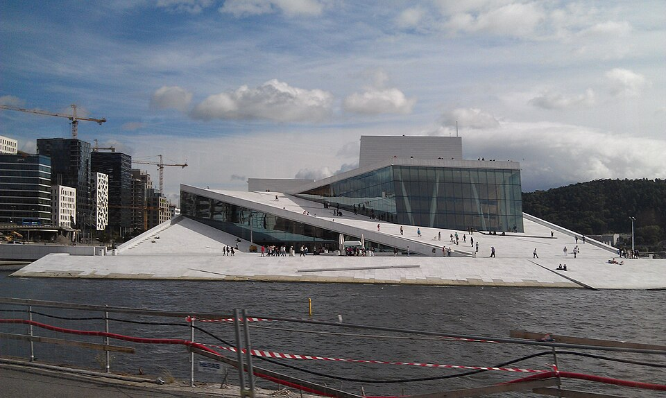
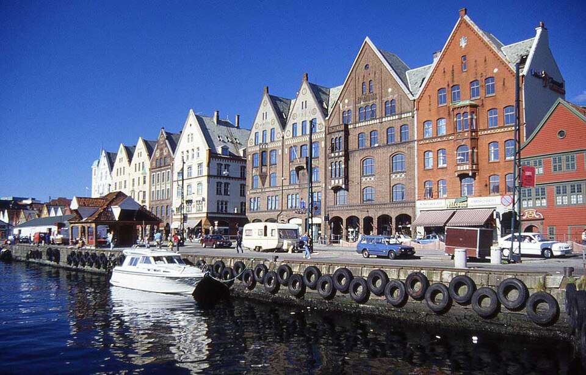
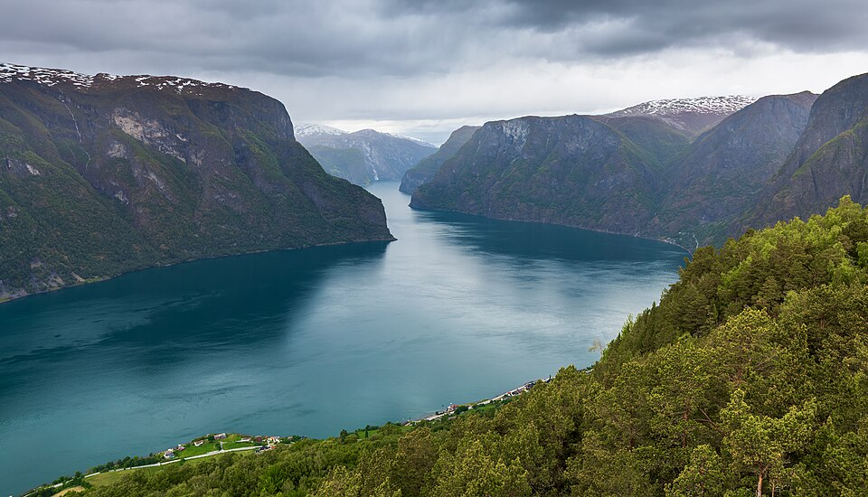
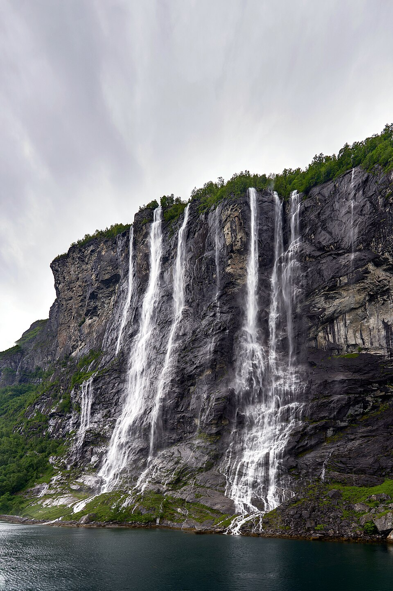
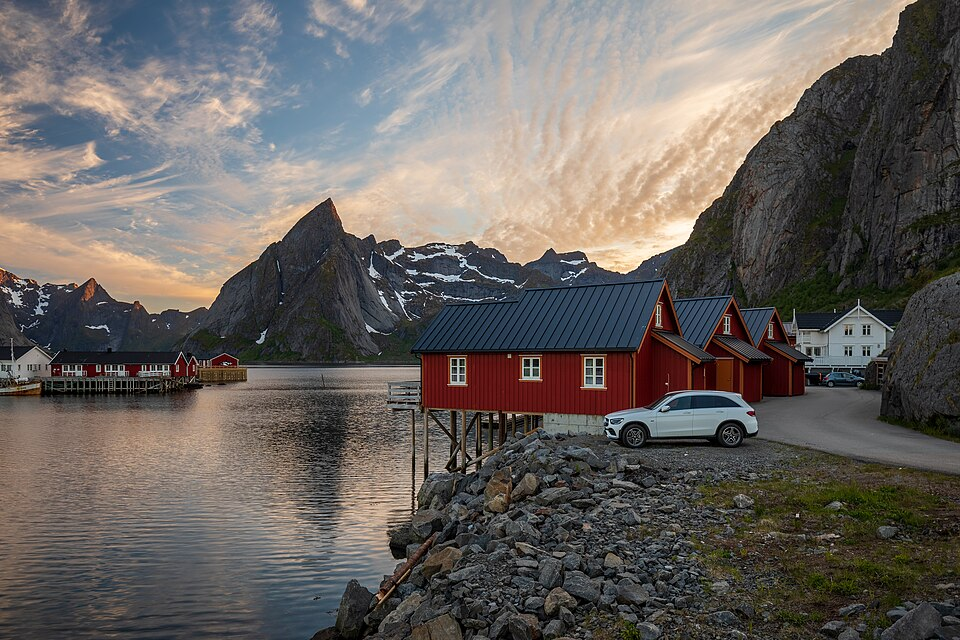
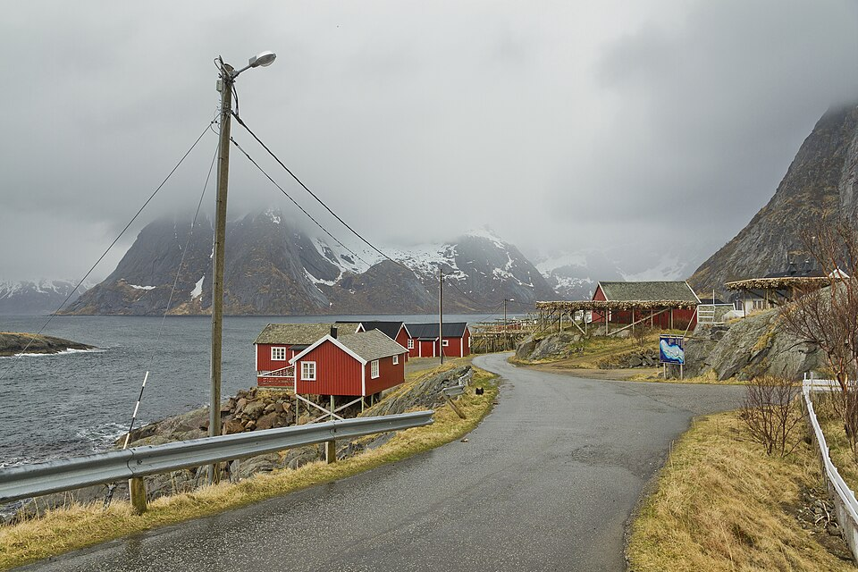
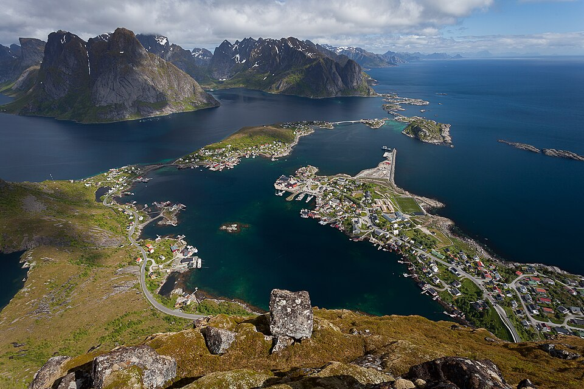
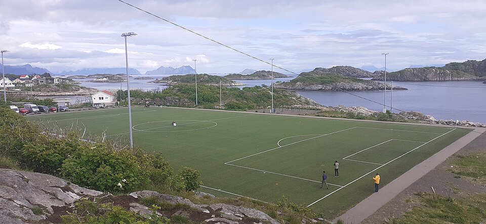

# 挪威 · 峡湾与午夜阳光｜9 天婚假执行手册

> **旅行时间**：7～8 月（夏季黄金窗口）  
> **旅行人数**：2 人（婚假）  
> **总天数**：9 天 8 晚  
> **核心目的地**：卑尔根 → 松恩峡湾 → 盖朗厄尔峡湾 → 大西洋公路 → 罗弗敦群岛  
> **人均预算**：3.5～4.5 万元人民币（舒适不奢华，2 人总计约 7～9 万元）

---

## 为什么选挪威？

如果你们想要的是**"国内没有的壮丽风光"**，那么 7～8 月的挪威几乎是唯一正确的答案。

这个季节的挪威，气温只有 15～22℃，白昼长达 20 小时以上——这意味着你们可以在晚上 11 点坐在海边的红色渔民小屋里，看着太阳贴着海平面滑过，把天空染成粉紫色。这种体验叫做**"午夜阳光"**，只在北极圈附近的夏季出现。

与冰岛相比，挪威的风景同样是世界级，但气质完全不同：
- **冰岛**是荒凉、粗粝、像外星的"探险"，9 天环岛会很累，且住宿和餐饮条件有限；
- **挪威**是深邃峡湾、垂直雪山、平静海面的"壮丽度假"，你们可以每天开车 2～3 小时，然后住进风景里，自己煮海鲜、看日落。

作为婚假，挪威是**"震撼"与"松弛"**的最佳平衡点。

---

## 行程总览

| 天数 | 星期 | 路线 | 住宿地 | 核心体验 | 开车距离 |
|:---:|:---:|:---|:---|:---|:---:|
| D1 | 六 | 国内 → 奥斯陆 | 奥斯陆 | 抵达、休整、适应极昼 | — |
| D2 | 日 | 奥斯陆 → 卑尔根 | 卑尔根 | 布吕根彩色木屋、弗洛伊恩山、鱼市场 | — |
| D3 | 一 | 卑尔根 → 弗洛姆 → 艾于兰 | 艾于兰 | **弗洛姆高山火车**（世界最陡铁路）+ 峡湾游船 | — |
| D4 | 二 | 艾于兰 → 海尔西特 → 盖朗厄尔 | 盖朗厄尔 | 取车自驾：峡湾公路、**老鹰之路**俯瞰 | 约 200 km |
| D5 | 三 | 盖朗厄尔 → 老鹰之路 → Gudbrandsjuvet → 大西洋公路 → 克里斯蒂安松 | 克里斯蒂安松 | **老鹰之路**峡湾俯瞰 + **Gudbrandsjuvet** + **大西洋公路**海上飞车 | 约 300 km |
| D6 | 四 | 克里斯蒂安松 → 奥勒松 → 博德 → **雷讷（罗弗敦）** | 雷讷 | 长途转场，抵达北极圈，入住红色渔民小屋 | 陆路+轮渡 |
| D7 | 五 | **罗弗敦群岛**（雷讷 + 亨宁斯韦尔） | 雷讷 | **Reinebringen 徒步** + "世界最美足球场" | 约 80 km |
| D8 | 六 | 雷讷 → 斯沃尔韦尔 → 奥斯陆 | 奥斯陆 | 告别罗弗敦，飞回首都 | 约 120 km |
| D9 | 日 | 奥斯陆 → 国内 | — | 返程 | — |

> **设计逻辑**：奥斯陆只作出入口；卑尔根进峡湾，一路北上到罗弗敦，不走回头路；把最累的转场集中在 D6 一天，换取罗弗敦两天半的纯粹享受。

---

# D1｜国内 → 奥斯陆（Oslo）
**主题：抵达，调整时差，轻松适应**

*奥斯陆歌剧院与比约维卡港区*

## 交通
- **航班**：建议选择 **北欧航空 SAS**、**汉莎航空** 或 **芬兰航空** 的直飞或一次转机航班，**下午 14:00-17:00 抵达奥斯陆加勒穆恩机场（OSL）** 最佳。
- **机场 → 市区**：乘坐 **机场快线 Flytoget**，20 分钟直达奥斯陆中央车站（Oslo S），票价约 220 NOK/人。

## 住宿
**推荐：Thon Hotel Opera（索恩歌剧院酒店）**
- 位置：中央车站步行 3 分钟，歌剧院正对面。
- 价格：约 1800～2500 NOK/晚。
- 理由：交通便利，方便第二天一早赶飞机去卑尔根；房间干净现代，景观房可直接看到歌剧院白色大理石屋顶滑入海中。

## 活动
- **傍晚**：沿着 **Aker Brygge（阿克尔码头）** 散步。这是奥斯陆最热闹的海滨步道，有餐厅、酒吧和街头艺人。
- **晚餐**：推荐 **Vulkan Mathallen Oslo**，这是一个室内美食广场，集合了多家小餐馆、奶酪店、烘焙坊和海鲜摊位，可以吃到新鲜的生蚝、北极甜虾、烟熏三文鱼。人均约 300～400 元人民币。
- **小贴士**：7～8 月的奥斯陆晚上 10 点天还亮着，吃完饭后在海边散步会有一种"时间被偷走了"的奇妙感。不要硬撑，早点休息调整时差。

## 为什么不在奥斯陆多待？
奥斯陆是一座精致的首都，有蒙克美术馆、维格兰雕塑公园和一流的北欧设计店。但这些都是**城市人文**，不是你们这次要的"壮丽风光"。9 天时间宝贵，我们把它当作**入口和出口**，把全部精力留给西部的峡湾和北部的罗弗敦。

---

# D2｜奥斯陆 → 卑尔根（Bergen）
**主题：峡湾之门**

*卑尔根布吕根世界文化遗产港区*

## 交通
- **航班**：**SAS 或 Norwegian 早班机**（约 08:00 起飞，09:00 抵达）。航程仅 **55 分钟**。
- **机场 → 市区**：轻轨 **Bybanen** 约 45 分钟到市中心，票价约 40 NOK/人；或机场大巴约 30 分钟。

## 住宿
**推荐：Radisson Blu Royal Hotel, Bergen**
- 位置：布吕根（Bryggen）港口内，出门就是彩色木屋。
- 价格：约 2000～2800 NOK/晚。
- 备选：Hotel Bergen Børs（设计酒店，位于旧证券交易所大楼内，步行 5 分钟到港口）。

## 活动

### 上午：布吕根（Bryggen）
这是卑尔根乃至挪威最具标志性的画面——一排排三角屋顶的**彩色木屋**沿着码头排列，颜色从赭黄到深红不等。布吕根是**世界文化遗产**，始建于汉萨同盟时期（14 世纪），曾是北欧最重要的贸易港口之一。

- **看点**：木屋之间的狭窄巷道、古老的木结构、临海的咖啡馆。
- **小贴士**：卑尔根被称为"欧洲雨都"，一年有 200 多天在下雨。但下雨时的布吕根反而更有味道——木屋颜色在湿润空气中更饱和，石板路倒映着灯光。**备好轻便雨衣和防水 walking shoes。**

### 下午：弗洛伊恩山缆车（Fløibanen）
- 缆车站就在布吕根旁边，步行 5 分钟。
- 单程约 8 分钟登顶，山顶有观景台、徒步步道和一家景观餐厅。
- **必做**：在山顶俯瞰卑尔根全景。你会看到红色屋顶的城市 nestled 在绿色的山谷与蓝色的海湾之间，远处是峡湾的入口。这是理解"卑尔根为什么是峡湾之门"的最佳视角。

### 晚餐：卑尔根鱼市场（Fisketorget）
- 位于港口边，步行可达。
- **推荐**：**鱼汤（Bergensk fiskesuppe）**、**烟熏三文鱼（Røkt laks）**、**本地捕捞的鳕鱼（Torsk）**。这里是游客聚集地，价格不便宜，但海鲜非常新鲜——很多摊位是渔民自营，早上出海下午就摆上了摊。
- 人均：400～600 元人民币。

## 这一天的价值
卑尔根本身不是终点，它是进入峡湾的门户。但在进入自然之前，先在这座城市里吃顿好的、买齐补给（防晒霜、零食、矿泉水），为后面几天的自驾做好准备。

---

# D3｜卑尔根 → 弗洛姆 → 艾于兰（Aurland）
**主题：全世界最美的火车线路**

*弗洛姆高山火车停靠在 Kjosfossen 瀑布站*

## 行程详解（精华段"挪威缩影"）

完整的"挪威缩影（Norway in a Nutshell）"是从奥斯陆到卑尔根的一整天旅程，但我们只取**卑尔根 → 弗洛姆 → 艾于兰**这一段公认的精华，既节省时间，又能住进峡湾里。

### 1. 卑尔根 → Myrdal（高山火车站）
- **交通**：乘坐 **Bergensbanen（卑尔根铁路）**。
- 时长：约 2 小时。
- 体验：这是欧洲海拔最高的干线铁路，穿越哈当厄高原（Hardangervidda），窗外是苔原、湖泊和雪山。

### 2. Myrdal → 弗洛姆（Flåm）：弗洛姆高山火车（Flåmsbana）
- **交通**：在 Myrdal 站台换乘 **Flåmsbana**。
- 时长：约 1 小时。
- 距离：仅 20 公里，但海拔从 **866 米骤降至海平面**。
- **工程奇迹**：这是**全世界最陡的标准轨距铁路**，平均坡度 5.5%，20 条隧道中有 18 条是**手工开凿**的（1924-1940 年建造）。列车会在隧道中螺旋穿行，甚至从瀑布下方穿过。
- **中途停靠 Kjosfossen 瀑布**：列车会在这里停车 5 分钟，乘客可以下车走到观景平台。瀑布落差 225 米，水雾扑面而来，夏季有时还有穿着传统服饰的"Huldra（山妖）"舞者在此表演——这是挪威铁路为游客准备的独特浪漫。

> **选座技巧**：从 Myrdal **下行至弗洛姆**时，坐在**左侧**（列车前进方向的左边）风景更佳，可以看到瀑布和山谷。

### 3. 弗洛姆 → 艾于兰：峡湾游船
- **交通**：抵达弗洛姆后，换乘 **峡湾游船**（Fjord Cruise）。
- 时长：约 2 小时。
- 路线：游览 **艾于兰峡湾（Aurlandsfjorden）** 和 **纳柔依峡湾（Nærøyfjorden）**——后者是联合国教科文组织世界遗产，被誉为"世界上最美丽的峡湾航行之一"。
- 体验：船在深邃狭窄的水道中穿行，两岸是垂直耸立 1000 多米的悬崖，山顶还有积雪。你会看到零星的山间农场（现在大多已废弃），它们像贴纸一样贴在悬崖上，让人感叹人类曾经的生存能力。
- 终点：**Gudvangen**。

### 4. Gudvangen → 艾于兰
- **交通**：从 Gudvangen 乘大巴/出租车到艾于兰（Aurland），约 30 分钟。

> **行李提示**：这一天的火车+游船+大巴换乘非常频繁，拖着大行李箱极不方便。建议前一晚在卑尔根将大件行李**寄存在酒店或寄送到后续酒店**（可通过挪威邮政 Posten 的行李托运服务，或请酒店协助 forwarding），只带轻便背包走这一程。

## 住宿
**强烈推荐：29|2 Aurland**
- 类型：峡湾景观设计酒店/民宿。
- 价格：约 2500～3500 NOK/晚。
- 特点：房间极少（通常只有 4～6 间），安静私密，**落地窗正对艾于兰峡湾**。傍晚坐在露台或窗边，看着太阳慢慢滑向雪山背后，是这一天的高潮。
- 备选：**Fretheim Hotel**，老牌峡湾酒店，历史悠久，花园可直接走到峡湾边。

## 活动
- **傍晚**：入住后不需要再出门。在房间露台发呆，看峡湾水面上的倒影。
- **晚餐**：酒店通常提供晚餐预订，或可以步行到附近的艾于兰镇上找一家当地餐厅。推荐尝试 **sider（苹果酒）**——这是当地的特产。

## 为什么这一天的交通换乘如此复杂，却依然值得？
弗洛姆高山火车不是"交通工具"，它本身就是**挪威排名第一的旅游体验**。而峡湾游船则是从水面视角感受垂直悬崖的最佳方式。这两者组合在一起，构成了挪威峡湾的"王炸开场"。

---

# D4｜艾于兰 → 海尔西特（Hellesylt）→ 盖朗厄尔（Geiranger）
**主题：峡湾自驾的巅峰**

*从 Stegastein 观景台俯瞰艾于兰峡湾*

## 自驾路线
从今天起，你们正式开始**自驾**。这是体验挪威西部峡湾的唯一正确方式——因为很多世界级景观公路无法通过公共交通完整覆盖。

- **取车**：上午在 **Sogndal 机场（SOG）** 或 **Sogndal 市区**取车（Sogndal 是艾于兰附近最大的城镇，有 Hertz、Avis 等租车点）。如果从艾于兰打车到 Sogndal 取车，车程约 40 分钟。
- **路线**：Sogndal → **Lærdal 隧道**（世界最长公路隧道，24.5 公里）→ Stryn → **海尔西特（Hellesylt）** → 乘 **Hellesylt–Geiranger 轮渡** 进入盖朗厄尔峡湾 → 盖朗厄尔小镇。
- **总里程**：约 200 公里（陆路）+ 轮渡。
- **开车时间**：约 4.5～5.5 小时（含多次停车休息和拍照）。

## 途中亮点

### Lærdal 隧道（Lærdalstunnelen）
- 全长 **24.5 公里**，是世界上最长的公路隧道。
- 为了避免司机在单调的隧道中产生疲劳和幽闭恐惧，工程师在隧道中设置了**三个"洞穴"休息区**——用蓝色和黄色的灯光模拟日出，洞顶喷涂了淡蓝色，像一片人造天空。开车经过时，你会有一种在地下穿越到另一个世界的 surreal 感。

### Hellesylt → Geiranger 轮渡
- 这是盖朗厄尔峡湾的**入门体验**。轮渡沿着峡湾缓缓驶入，两岸是近乎垂直的岩壁。
- 在船上可以远眺 **"七姐妹瀑布（De Syv Søstre）"**——七道水流从 250 米高的悬崖上同时倾泻而下，是盖朗厄尔峡湾最著名的地标。
- 与瀑布隔峡相望的是 **"求婚者瀑布（Friaren）"**，传说中它试图追求七姐妹，但始终被拒绝。
- **重要提示**：这趟轮渡在 7～8 月非常热门，建议提前在 **Fjord1** 或 **Geiranger Fjordservice** 官网预订船票。

*盖朗厄尔峡湾的七姐妹瀑布*

## 下午抵达后的活动：老鹰之路（Ørnevegen / Eagle Road）

盖朗厄尔峡湾被《国家地理》评为"世界最佳世界遗产"之一，而**老鹰之路**则是俯瞰它的最佳方式。

- **路线**：从盖朗厄尔小镇出发，沿 63 号公路向上攀爬。
- 特点：**11 个发卡弯**，在约 6 公里内攀升 **620 米**海拔，坡度最陡处达 10%。
- **观景台 Ørnesvingen**：位于最顶端的第 11 个发卡弯，建有现代化的玻璃与钢结构的观景平台。
- **景观**：从这里俯瞰，盖朗厄尔峡湾像一条深蓝色的丝带蜿蜒在灰色的群山之间；七姐妹瀑布变成细细的白线；小镇如同模型般渺小；对面的悬崖上还能看到废弃的 **Knivsflå 农场**——它建在 250 米高的悬崖边缘，是挪威最险峻的废弃农场之一。

*从老鹰之路 Ørnesvingen 观景台俯瞰盖朗厄尔峡湾*

> **时间建议**：夏季邮轮通常在上午和中午抵达盖朗厄尔，会释放大量游客到观景台上。建议你们**下午 5 点后再开车上老鹰之路**，此时光线柔和，游客散去，拍照不用排队。

## 住宿
**推荐：Hotel Union Geiranger**
- 位置：盖朗厄尔小镇上方的山坡，正对峡湾。
- 价格：约 2500～4000 NOK/晚。
- 特点：这是一家有 130 年历史的老牌酒店，拥有盖朗厄尔最好的**室外温水泳池**——泡在池子里看着峡湾和雪山，是婚假的正确打开方式。
- 备选：Grande Fjord Hotel，位置稍偏但性价比高，同样拥有峡湾景观。

## 晚餐
推荐在酒店餐厅或镇上的 **Geiranger Fjordbuda** 用餐。这里的招牌是**当地捕捞的鳕鱼（Torsk）**和**羊肉（Lam）**。

---

# D5｜盖朗厄尔 → 老鹰之路 → Gudbrandsjuvet → 大西洋公路 → 克里斯蒂安松（Kristiansund）
**主题：世界最美公路之一**

*从老鹰之路 Ørnesvingen 观景台俯瞰盖朗厄尔峡湾*

这一天是**整个自驾行程的高潮**。由于 **Trollstigen 截至 2026 年 4 月 11 日仍未恢复常规通行**，这里改为当前更稳妥的 **Valldal 绕行版**。虽然开车时间较长，但这条替代路线依旧极具景观价值。

## 自驾路线
**盖朗厄尔 → 老鹰之路（Ørnevegen）→ Eidsdal–Linge 轮渡 → Valldal → Gudbrandsjuvet → Vestnes / Molde → 大西洋公路（Atlanterhavsveien）→ 克里斯蒂安松**

### 第一段：老鹰之路（Ørnevegen）+ Gudbrandsjuvet
- 从盖朗厄尔先走 **老鹰之路** 翻上山脊，再经 **Eidsdal–Linge** 轮渡进入 Valldal 山谷。
- **Gudbrandsjuvet** 位于 63 号公路旁，是一条 5 米宽、20 多米深的峡谷，现代化观景平台直接架在激流上方。它是当前这条绕行线上最值得下车的点。
- **当前说明**：Trollstigen 因落石治理关闭，不纳入 2026 年主路线假设；如果未来重新开放，可在出发前再按官方路况调整。

### 第二段：Valldal / Vestnes → Molde
- 从 Valldal 山谷离开后，向西接主干路前往 **Vestnes / Molde** 方向。
- 这段路相对平缓，是驾驶后的"喘息期"。Molde 被称为"玫瑰之城"，夏季满城玫瑰盛开，可以在超市补充补给，吃个简餐。

### 第三段：大西洋公路（Atlanterhavsveien / Atlantic Ocean Road）

*大西洋公路的标志性桥梁 Storseisundet Bridge*

这是《卫报》评选的**"世界最佳公路旅行"**之一，也是无数汽车广告的取景地。

- **数据**：全长仅 **8.3 公里**，由 8 座桥梁连接一系列小岛和礁石组成。
- **核心桥梁**：**Storseisundet Bridge**。这是最长、最著名的一座桥，长约 260 米。它的设计极具戏剧性——从某个角度望去，桥面在最高点突然弯曲下坠，仿佛**公路在前方断入大海**。开车驶上桥顶时，你会有一种"要冲入海里"的错觉。
- **体验**：公路几乎与海平面齐平，一侧是平静的挪威海，另一侧是怪石嶙峋的礁石。如果运气好，还能看到海豹在礁石上晒太阳。公路沿线设有多个停车观景台，可以随时下车拍照。
- **背景**：这条路 1989 年才通车，建造期间工人们经历了 12 次飓风。它不仅是工程奇迹，更是人类在极端自然环境中"硬刚"出来的艺术品。

> **AutoPASS 提示**：挪威高速公路、隧道、桥梁普遍收费。租来的车通常会自带 **AutoPASS 电子标签**，过路费和隧道费会自动记录，还车时由租车公司统一结算。西部峡湾和进入克里斯蒂安松的途中会经过若干收费隧道，建议预留 **500～800 NOK** 的 toll 预算。

## 住宿
**克里斯蒂安松（Kristiansund）**
- 这是一个安静的海滨小城，以大西洋鳕鱼（Klipfish）贸易闻名。
- **推荐：Thon Hotel Kristiansund**，或港口附近的 Airbnb。
- 价格：约 1500～2200 NOK/晚。
- 特点：城市规模小，停车方便，晚上非常安静。明天一早要去机场，住在市区可以节省赶路时间。

## 晚餐
克里斯蒂安松的特产是 **Klipfish（盐渍鳕鱼）** 和 **Bacalao（鳕鱼炖菜）**。推荐餐厅 **Sørlandet**，主打本地海鲜，人均约 350～500 元人民币。

---

# D6｜克里斯蒂安松 → 奥勒松 → 博德 → 雷讷（Reine, Lofoten）
**主题：痛苦的转场日，为了高潮**

*雷讷村的传统红色渔民小屋（Rorbuer）*

这一天是整个行程中**移动最多、最累的一天**。从挪威大陆中北部飞往北极圈内的罗弗敦群岛，没有直达航班，必须分三段走。但请相信，这一切都是值得的——因为罗弗敦是挪威最浪漫的象征。

## 交通详解

### 1. 克里斯蒂安松 → 奥勒松机场（Ålesund Vigra, AES）
- **方式**：自驾。
- 距离：约 110 公里。
- 时间：约 2 小时。
- 建议：**08:00 前出发**，确保赶上中午的航班。在奥勒松机场还掉第一段租的车，注意**异地还车费约 2000～3500 NOK**。

### 2. 奥勒松 → 博德（Bodø）
- **航班**：Widerøe 或 SAS 内陆航班。
- 航程：约 1 小时。
- 注意：这是小型螺旋桨飞机，行李限重较严格，建议提前购买行李额。

### 3. 博德 → 罗弗敦（Moskenes 码头）
- **方式**：轮渡。
- 时长：约 **3.5 小时**。
- 班次：夏季通常每天 1～2 班，**下午约 15:00 有一班**（具体时刻每年更新，需在 torghatten-nord.no 查询）。
- 体验：轮渡从博德出发，穿过 Vestfjorden 海峡，逐渐接近罗弗敦群岛。当第一座锯齿状的山峰出现在海平面上时，你会知道"真正的挪威"从这里开始。

### 4. Moskenes 码头 → 雷讷（Reine）
- **方式**：取第二段租的车。
- 距离：约 30 公里（沿 E10 公路）。
- 时间：约 30 分钟。
- **重要提示**：Moskenes 是小镇码头，**没有大型租车公司的门店**。这里的租车必须是**提前预订的本地小型租车公司送车上门服务**（如 Lofoten Car Rental、Arctic Rent-a-car），他们会把车直接送到码头停车场。这个服务**必须提前数周预订**，夏季非常紧张。如果订不到 Moskenes 取车，建议改为：
  - **方案 B**：从博德乘飞机到 **Leknes（LKN）** 或 **Svolvær（SVJ）**，在机场租车柜台正常取车，再自驾南下到雷讷。这样会错过渡海体验，但更稳妥。

> **E10 公路隧道费提示**：罗弗敦群岛的 E10 公路包含多条海底隧道（如 Nappstraumtunnelen），走 AutoPASS 自动扣费，全程约 **150～200 NOK**。

## 住宿
**强烈推荐：Eliassen Rorbuer 或 Reine Rorbuer**

*Hamnøy 村的 Eliassen Rorbuer 红色渔民小屋*

- **什么是 Rorbuer？**
  这是罗弗敦群岛最具代表性的传统**渔民小屋**。它们通常是红色的（因为红色鱼油油漆 historically 最便宜），建在木桩上，直接立于水面之上。过去是渔民冬季捕鳕鱼时的临时住所，现在被改造成了极具特色的度假小屋。
- **Eliassen Rorbuer**：位于 Hamnøy 村，距离 Reine 约 5 分钟车程。这是社交媒体上最火的红色小屋机位——那一排排建在水上的红色房子，背景是尖锐的雪山，几乎就是"挪威"的代名词。
- **Reine Rorbuer**：位于 Reine 村中心，设施更现代化，部分小屋带有私人露台和厨房。
- 价格：约 2500～4000 NOK/晚。
- **预订紧迫性**：这是整个行程**最难订的住宿**，7～8 月通常提前 3 个月售罄。如果现在还没订，这是第一件要做的事。

## 晚间活动
- **午夜阳光**：晚上 11 点，天还是亮的。太阳不会完全落下，它只是贴着西北方的海平面缓缓移动，把天空染成金色、粉色、紫色，然后再次升起。
- **推荐活动**：坐在小屋的露台上，打开一瓶葡萄酒，或者煮一壶咖啡。看着雪山倒映在平静的海面上，四周安静得只有海鸥的叫声。这种时刻，你会明白为什么这里被称为"欧洲最后一片净土"。

---

# D7｜罗弗敦群岛（雷讷 + 亨宁斯韦尔）
**主题：婚假的高潮**

*从 Reinebringen 山顶俯瞰雷讷、Hamnøy 和 surrounding 峡湾*

这一天是**整个 9 天行程情感价值最高的一天**。没有长途驾驶，只有两个世界级的体验：徒步俯瞰最美渔村，以及探访"世界最美足球场"。

## 上午：Reinebringen 徒步

这是罗弗敦**排名第一的徒步路线**，也是社交媒体上最火的挪威照片机位之一。

- **起点**：位于 Reine 村西侧，Ramsvik 隧道旁边的老公路边。
- **距离**：往返约 2.2 公里（从步道起点算起）。
- **爬升**：约 450 米。
- **时间**：往返 2～3 小时。
- **难度**：中等偏上。2019 年当地政府请尼泊尔夏尔巴人用石头修建了约 **1500 级石阶**，取代了原来泥泞易滑的土路，但仍然全程爬坡，没有平路。

### 景观价值
登顶后，你会看到**罗弗敦最著名的全景**：
- 脚下是 **Reine** 渔村的红色小屋，错落有致地分布在水边；
- 左侧是 **Hamnøy** 村，Eliassen Rorbuer 的红色小屋一排排建在海面上；
- 右侧是 **Sakrisøy** 村（以黄色小屋闻名）；
- 背景是锯齿状的灰色花岗岩山峰（如 Olstind），山顶可能还有残雪；
- 海水呈现出深绿或深蓝色，平静得像镜子。

这张照片的价值在于：**它把"山、海、人、屋"四个元素压缩在一个画面里，而且比例完美**。这是国内任何风景都无法复制的——三峡没有海，川西没有渔民小屋，霞浦没有雪山。

> **徒步建议**：
> - 穿**登山鞋或防滑运动鞋**，石阶在雨后可能湿滑；
> - 早上 8:00 前出发，避开人流和正午的阳光；
> - 带上水和少量零食；
> - 山顶风大，即使是 7 月也建议带一件防风外套。

## 下午：亨宁斯韦尔（Henningsvær）

*亨宁斯韦尔 Idrettslag Stadion——被媒体广泛报道的"世界最美足球场"*

从雷讷开车向北约 1 小时，抵达罗弗敦最文艺的渔村——**亨宁斯韦尔**。它被称为"罗弗敦的威尼斯"，因为整个村庄建在多个小岛之上，由几座小桥连接。

### "世界最美足球场"（Henningsvær Idrettslag Stadion）
这是被多家国际旅游媒体和足球博客评为"世界最美足球场"之一的超级网红场地，也曾出现在 UEFA 的 #PlayAnywhere 推广活动中。

- **特点**：
  - 没有看台，没有座位，只有一圈沥青路面充当场边站席；
  - 球场建在一个小岛的南端，三面环海，背后是锯齿状的山峰；
  - 球场周围是传统的**鳕鱼晾晒架（hjeller）**，夏季你可能会闻到淡淡的海腥味和鱼干味；
  - 这里踢球的主要是当地业余队 Henningsvær IL 的孩子们，但午夜阳光下，凌晨 2 点都可能有人在踢球。
- **拍摄**：最佳角度在小岛南端的山坡上（靠近灯塔的小路），无人机视角最震撼（但需注意当地可能有禁飞规定，请尊重）。

### 亨宁斯韦尔的其他看点
- **KaviarFactory**：一家由旧鱼酱工厂改造而成的当代艺术画廊，展出北欧和国际艺术家的作品。
- **Galleri Lofoten**：收藏了大量北方挪威"黄金时代"绘画的私人画廊。
- **咖啡馆与手工艺品店**：村庄虽小，但有很多独立设计师的小店，出售陶器、玻璃制品和羊毛制品。

## 晚餐
- **推荐**：回雷讷的渔民小屋里，**自己做饭**。
- 食材：从超市（如 Coop 或 Joker）购买新鲜的三文鱼排、鳕鱼肉、青口贝、土豆和蔬菜。
- 体验：在小屋的厨房里煎鱼，配一杯白葡萄酒，坐在露台上看午夜阳光。这种"自己动手"的晚餐，比米其林餐厅更浪漫。
- 如果外食：推荐 **Anita's Sjømat**（位于 Sakrisøy，以鱼肉汉堡和海鲜汤闻名）或 **Lofotmat**（亨宁斯韦尔的高级海鲜餐厅）。

---

# D8｜雷讷 → 斯沃尔韦尔（Svolvær）→ 奥斯陆
**主题：返程，带回城市**

## 交通
### 1. 雷讷 → 斯沃尔韦尔机场（Svolvær, SVJ）
- **方式**：自驾。
- 距离：约 120 公里。
- 时间：约 1.5～2 小时。
- **沿途亮点**：这是罗弗敦 E10 公路的精华段。你们会经过：
  - **Ramberg 白沙滩**：一片令人难以置信的白色细沙滩，海水 turquoise，像热带海岛——但水温只有 10℃。下车拍个照即可，除非你想挑战极地游泳。
  - **Sakrisøy 黄色小屋**：如果昨天没停，今天可以补拍。
  - **Kabelvåg 和 Henningsvær**：如果时间充裕，可以再次停靠。

### 2. 斯沃尔韦尔 → 奥斯陆
- **航班**：SAS 或 Widerøe **飞往奥斯陆**（部分班次需在博德 Bodø 转机一次）。
- 航程：直飞约 1.5 小时；经博德转机约 2.5～3.5 小时。
- 建议预订**下午 14:00-16:00 的航班**，这样上午还有时间在罗弗敦做最后的停留。

## 奥斯陆晚间
- **住宿**：奥斯陆市中心（Thon Hotel Opera 或 Hotel Continental）。
- **晚餐**：
  - **Kontrast**（米其林一星，北欧新派料理，需提前预订，人均约 1500 元）；
  - 或 **Mathallen Oslo** 的美食广场（更轻松，人均 300～500 元）。
- **购物**：卡尔·约翰斯大道（Karl Johans gate）有户外品牌店（如 Bergans、Norrona）。**注意**：挪威物价极高，这些户外品牌的 base price 通常比德国、英国或中国代购更贵，即便退税后也未必划算。不建议为了"省钱"在这里大量采购，更适合买一两件纪念性质的单品。

---

# D9｜奥斯陆 → 国内
**主题：回家**

- **航班**：早班机返程（建议 10:00～12:00 起飞）。
- **机场快线**：从中央车站到机场约 20 分钟。
- 带着 9 天的峡湾记忆、午夜阳光的照片、和婚假的满足感回家。

---

## 附录一：全程预算拆分（2 人总计）

| 项目 | 金额（人民币） | 说明 |
|:---|:---:|:---|
| **国际往返机票** | 25,000～35,000 | 暑假直飞/一次转机经济舱，约 1.2～1.8 万/人 |
| **挪威境内机票** | 8,000～12,000 | 奥斯陆↔卑尔根、奥勒松↔博德、斯沃尔韦尔↔奥斯陆（部分经博德转机） |
| **租车（2 段）** | 10,000～14,000 | 约 6 天租车，含第一段异地还车费（约 1500～2500 NOK），车型为沃尔沃/斯巴鲁四驱 |
| **轮渡/火车/停车/油费/过路费** | 4,000～5,500 | 含峡湾轮渡（Hellesylt→Geiranger）、弗洛姆高山火车、博德→Moskenes 轮渡、油费、AutoPASS 隧道桥费 |
| **住宿（8 晚）** | 20,000～28,000 | 峡湾民宿/渔民小屋 1500～3000 元/晚，城市酒店 1200～2000 元/晚 |
| **餐饮** | 12,000～15,000 | 外食人均 300～500 元/顿，自己做人均 100～150 元/顿 |
| **门票/体验** | 2,000～3,000 | 弗洛伊恩缆车、盖朗厄尔峡湾游船、少量徒步装备 |
| **签证/保险/杂费** | 2,000～3,000 | 申根签证约 800 元/人，保险 200 元/人 |
| **总计** | **约 83,000～115,500 元** | **人均 4.15～5.78 万** |

> **省钱小贴士**：挪威餐饮极贵，但超市（Rema 1000、Coop、Bónus"小猪超市"）的三文鱼、鳕鱼和蔬菜价格合理。建议订带厨房的民宿，自己做早餐和晚餐，可以省下近一半的餐饮预算。

---

## 附录二：行前准备清单

### 证件与签证
- [ ] **申根签证（挪威）**：至少提前 **6～8 周** 申请。7～8 月是签证高峰期，slot 紧张。
- [ ] 护照（有效期 6 个月以上）。
- [ ] 驾照原件 + **英文翻译件**（租租车 APP 可免费办理国际驾照翻译认证件）。
- [ ] 旅行保险（申根强制要求，保额 ≥ 3 万欧元）。

### 预订确认（按优先级）
1. [ ] **国际机票**
2. [ ] **Eliassen Rorbuer 或 Reine Rorbuer**（最难订，瓶颈项）
3. [ ] **29|2 Aurland 或 Hotel Union Geiranger**
4. [ ] **挪威境内机票**（SAS / Widerøe / Norwegian）
5. [ ] **第一段租车**：卑尔根机场取车 → 奥勒松机场还车（覆盖西部峡湾）
6. [ ] **第二段租车**：Moskenes 码头取车（须为**本地小公司送车上门服务**，提前数周预订）→ Svolvær 机场还车。如订不到，改为 **博德→Leknes/Svolvær 飞机+机场取车**。
7. [ ] **弗洛姆高山火车票 + 峡湾游船票**（旺季建议提前在 vy.no 购买）
8. [ ] **Hellesylt → Geiranger 轮渡票**（7～8 月热门，提前在 Fjord1 官网预订）
9. [ ] **博德 → Moskenes 轮渡票**（torghatten-nord.no，夏季时刻表每年 4～5 月更新）

### 衣物与装备
- [ ] **防水冲锋衣 + 软壳/抓绒内胆**：挪威夏季多雨，山区风大。
- [ ] **防水徒步鞋/登山鞋**：Reinebringen 徒步必备。
- [ ] **轻便雨衣**：比雨伞实用（峡湾风大）。
- [ ] **薄羽绒服**：罗弗敦傍晚和山顶风大，7 月也可能只有 10℃。
- [ ] **防晒霜 + 墨镜**：极昼下紫外线极强，且雪地/水面反射严重。
- [ ] **转换插头**：挪威使用**欧标双圆孔插头**（C/F 型）。
- [ ] **保温杯/便携烧水壶**：挪威人喜欢喝冷水，但中国人的胃需要热水。
- [ ] **少量零食/泡面**：防止深夜抵达偏远小镇时餐厅关门。

### APP 下载
- **Google Maps**：离线地图必备（很多山区没信号）。
- **Vy**：挪威铁路官方 APP，可买火车票。
- **Fjord1 / Torghatten Nord**：轮渡时刻查询与购票。
- **Booking.com / Airbnb**：住宿管理。
- **TheFork**：餐厅预订（主要用于奥斯陆和卑尔根）。

---

## 附录三：关键决策说明（FAQ）

### Q1：为什么不走完整的"挪威缩影"？
完整版是从奥斯陆坐火车到卑尔根，耗时一整天，其中奥斯陆→Myrdal 的火车虽然漂亮，但和弗洛姆→卑尔根段有景观重复。我们只坐**卑尔根→弗洛姆→艾于兰**这段精华，既节省了整整一天时间，又避免了重复路线。

### Q2：为什么租车要分两段？还要异地还车？
从大陆开车到罗弗敦群岛需要多次轮渡，且异地还车费极高。更合理的方案是：
- **第一段**：卑尔根机场取车 → 奥勒松机场还车（覆盖西部峡湾，产生一次性异地还车费约 2000～3500 NOK）；
- **第二段**：Moskenes 码头取车（须提前预订本地小公司送车）→ Svolvær 机场还车（同岛还车，无异地费）。

如果第二段在 Moskenes 订不到车，建议改为 **博德飞 Leknes/Svolvær**，直接在机场柜台取车。

### Q3：Trollstigen 关闭后，这一天还值得吗？
**值得。** 2026 版虽然少了 Trollstigen 发卡弯，但老鹰之路、Valldal 山谷的 Gudbrandsjuvet 和大西洋公路仍然足够震撼，而且路线执行风险更低。对只有 9 天的婚假来说，这种确定性比“赌当天开路”更重要。

### Q4：罗弗敦真的值得这么折腾吗？
**绝对值得。** 罗弗敦是挪威最独特的存在——北极圈内的群岛，却有墨西哥湾流带来的温和气候；雪山直接从海里升起，渔民小屋就建在水面上。D6 的转场虽然累，但 D7 站在 Reinebringen 山顶的那一刻，你会觉得一切都值了。那张俯瞰雷讷的全景，可能是你们这辈子见过最美的风景之一。

### Q5：如果预算充裕，有什么可以提升体验的？
- **直升机观光**：在盖朗厄尔或罗弗敦都有直升机观光项目，从空中俯瞰峡湾和雪山，震撼度翻倍（约 3000～5000 元/人/30 分钟）。
- **海钓体验**：在罗弗敦报一个半日海钓团，钓上来的鳕鱼可以直接在民宿里做晚餐。
- **米其林餐厅**：奥斯陆的 **Maaemo**（米其林三星）是北欧料理的巅峰，需提前数月预订。

---

## 附录四：一句话总结

这 9 天，你们会从卑尔根的彩色港口出发，坐着世界上最陡的火车滑入峡湾，开车经过悬在空中的老鹰之路、Valldal 山谷的 Gudbrandsjuvet 和冲入海里的大西洋公路，最后住进北极圈内的红色渔民小屋，在晚上 11 点的阳光下看着雪山倒映在海面。

**这是挪威在夏天唯一的样子，也是你们婚假最值得买的记忆。**

---

*文档生成时间：2026 年 4 月*  
*祝你们旅途愉快，新婚快乐！*
