# 苏格兰｜高地史诗与威士忌之旅｜9 天执行手册

> **旅行时间**：6～8 月（夏季/长白昼窗口）  
> **旅行人数**：2 人  
> **总天数**：9 天 8 晚  
> **核心目的地**：爱丁堡 → 格拉斯哥/斯特灵 → 格伦科峡谷 → 斯凯岛 → 尼斯湖 → NC500 公路  
> **人均预算**：2.5～3.5 万元人民币（2 人总计约 5～7 万元）

---

## 为什么选苏格兰？

如果你们钟情于挪威的峡湾与午夜阳光，却又渴望一场**人文更厚重、传说更缭绕**的旅程，苏格兰是北欧气质最完美的「英伦分身」。

这里的地貌同样魔幻——苍茫的高地如同被巨人的手掌揉皱过，灰色的山峦在薄雾中若隐若现，湖泊深不见底，悬崖直插大西洋。但挪威的荒野是清冷的新教气质，苏格兰的荒野却浸透了凯尔特神话、氏族悲歌和威士忌的焦糖香。每一块苔藓覆盖的石头都在低语，每一座破败的古堡都藏着 Romeo 与 Juliet 式的家族恩怨。

6～8 月的苏格兰，白昼可以拉长到 18 个小时以上，和挪威一样拥有「用不完的白昼」。但你们的夜晚不会只在看太阳，而是在爱丁堡的老酒馆里听一场民谣 live，在斯凯岛的民宿客厅里就着 peat smoke 味的威士忌聊到窗帘外的天依然明亮。

**苏格兰是「壮丽风景」与「浪漫人文」的黄金交叉点。**

---

## 行程总览

| 天数 | 星期 | 路线 | 住宿地 | 核心体验 | 开车距离 |
|:---:|:---:|:---|:---|:---|:---:|
| D1 | 六 | 国内 → 爱丁堡 | 爱丁堡 | 抵达、休整、老城初探 | — |
| D2 | 日 | 爱丁堡 | 爱丁堡 | 爱丁堡城堡、皇家英里、卡尔顿山日落 | — |
| D3 | 一 | 爱丁堡 → 斯特灵 → 格拉斯哥 → 洛蒙德湖 | 洛蒙德湖/特罗萨克斯 | 斯特灵城堡、格拉斯哥西区、进入高地门户 | 约 110 km |
| D4 | 二 | 洛蒙德湖 → 格伦科 → 马莱格 → 斯凯岛 | 波特里 | 格伦科峡谷三姐妹山、马莱格渡轮、上岛 | 约 180 km |
| D5 | 三 | 斯凯岛（北/东环线） | 波特里 | 老人峰徒步、裙岩悬崖、仙女池 | 约 90 km |
| D6 | 四 | 斯凯岛（西/南环线） | 波特里 | 内斯特角灯塔、邓韦根城堡、珊瑚海滩 | 约 120 km |
| D7 | 五 | 斯凯岛 → 格伦科 → 尼斯湖 | 因弗内斯 | 格伦科观景台深度停留、厄克特城堡、尼斯湖 | 约 160 km |
| D8 | 六 | 尼斯湖 → NC500 精华段 → 皮特洛赫里 → 爱丁堡 | 爱丁堡/格拉斯哥 | NC500 公路、皮特洛赫里小镇、返回城市 | 约 280 km |
| D9 | 日 | 爱丁堡/格拉斯哥 → 国内 | — | 返程 | — |

> **设计逻辑**：爱丁堡双城作为文化开场；D3 由南向北渐入高地，斯特灵和格拉斯哥作为人文缓冲；D4-D6 把斯凯岛作为行程核心，马莱格渡轮上岛体验仪式感；D7-D8 走经典北高地环线返回，不走回头路。

---

# D1｜国内 → 爱丁堡（Edinburgh）
**主题：抵达北方雅典**

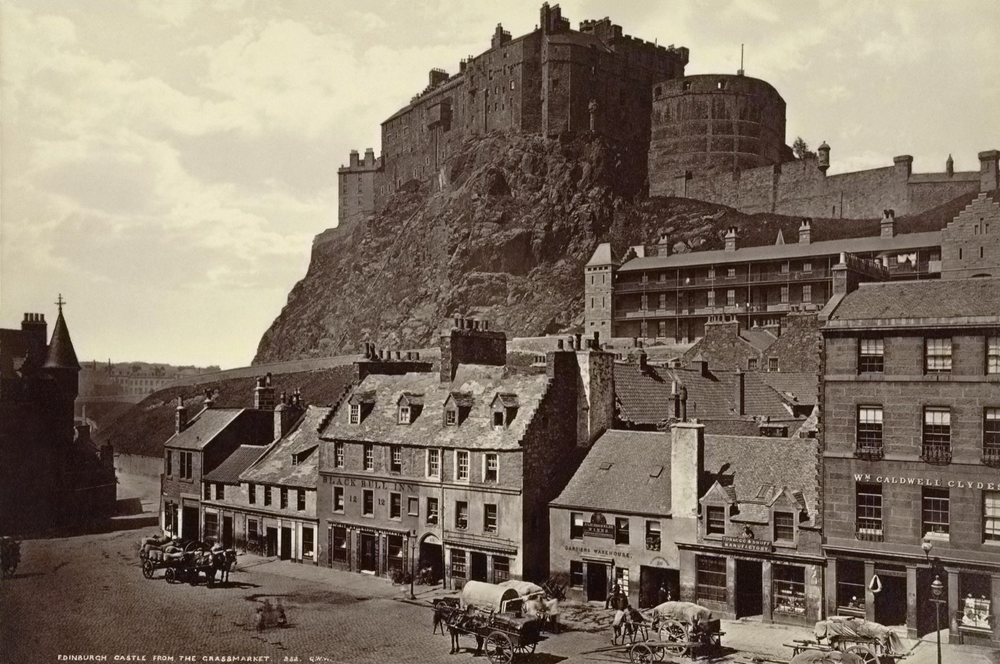
*爱丁堡城堡俯瞰皇家英里大道*

## 交通
- **航班**：建议选择 **英国航空 BA**、**维珍航空 VS** 或 **阿联酋航空 EK** 的联程航班，**下午 14:00-17:00 抵达爱丁堡机场（EDI）** 最佳。国内无直飞，通常经伦敦希思罗或阿姆斯特丹转机一次。
- **机场 → 市区**：乘坐 **Airlink 100 快线大巴**，约 30 分钟到达王子街（Waverley Bridge），票价约 5.5 英镑/人；或打车约 25 分钟，费用 20～25 英镑。

## 住宿
**推荐：The Scotsman Hotel 或 Kimpton Charlotte Square Hotel**
- **The Scotsman Hotel**：位于北桥（North Bridge），由旧苏格兰人报社大楼改造，正对卡尔顿山。价格约 180～280 英镑/晚。
- **Kimpton Charlotte Square**：乔治式联排别墅酒店，内部庭院安静，步行 5 分钟到王子街。价格约 200～320 英镑/晚。
- 备选：老城皇家英里沿线的精品民宿（Airbnb），可以体验「住在 300 年历史的石头房子里」的感觉。

## 活动
- **傍晚**：从酒店步行至 **王子街花园（Princes Street Gardens）**，仰望矗立在火山岩上的爱丁堡城堡。这是你们对这座城市的第一印象——一座城市与一座城堡共生 900 年。
- **晚餐**：推荐 **The Witchery by the Castle**，位于城堡脚下的皇家英里大道上，是 Edinburgh 最具哥特浪漫气质的餐厅。16 世纪的地下石窖、天鹅绒座椅、烛光摇曳，招牌菜是苏格兰龙虾和鹿肉。人均约 60～90 英镑，**建议提前预订**。
- **夜间**：如果精力尚可，在皇家英里大道上随便找一家 pub 听一场现场民谣。苏格兰风笛在这里不是旅游表演，而是当地人的音乐语言。

## 小贴士
抵达当晚不要安排太多行程。爱丁堡是一座需要「用脚步丈量坡度」的城市，老城的石板路和 7 层楼高的陡坡会在第一天就给你下马威。早点休息，明天才是真正的高能开始。

---

# D2｜爱丁堡（Edinburgh）
**主题：在石与火之间漫步**

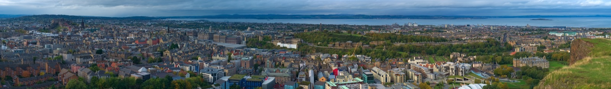
*爱丁堡老城蜿蜒的石板街道*

## 上午：爱丁堡城堡（Edinburgh Castle）

*爱丁堡城堡正门与半月炮台*

- **时间**：建议 09:00 开门即入场，避开旅行团高峰。
- **门票**：约 19.5 英镑/人，建议提前官网预订。
- **看点**：
  - **皇冠珠宝室（Crown Jewels）**：苏格兰王冠、权杖和命运之石，是苏格兰独立的象征。
  - **圣玛格丽特礼拜堂（St Margaret's Chapel）**：城堡内最古老的建筑，约 1130 年，比城堡本身还早。
  - **半月炮台（Half Moon Battery）**：俯瞰全城的最佳位置，可以清晰地看到新城区乔治式建筑的网格与老城中世纪迷宫的对比。
  - **一点钟鸣炮（One O'Clock Gun）**：每天 13:00 鸣炮，这项传统自 1861 年延续至今（除了周日）。

> **历史感**：这座城堡不是童话里的王子公主城堡，而是一座真正的军事要塞。它见证了苏格兰与英格兰数百年的战争、詹姆斯六世南下继承英格兰王位、以及玛丽女王的悲剧。站在城墙上，你会理解为什么苏格兰人总说「We were a country before we were a region」。

## 下午：皇家英里大道（Royal Mile）与威士忌体验中心

- **路线**：从城堡正门沿 **Royal Mile** 一路向东走到底，约 1.8 公里。这是爱丁堡老城的主轴，两旁是 16-17 世纪的高耸石屋、关闭（Close，狭窄的巷道）、教堂和议会大楼。
- **荷里路德宫（Palace of Holyroodhouse）**：Royal Mile 的终点，英国王室在苏格兰的官邸。如果兴趣不大，可以在宫殿花园外拍照即可。
- **苏格兰威士忌体验中心（The Scotch Whisky Experience）**：位于 Royal Mile 靠近城堡的一端。推荐预订 **Silver Tour**（约 23 英镑/人），乘坐橡木桶形状的小火车穿越威士忌酿造过程，最后品尝 3 种不同产区的威士忌。对于新手，这是最高效的入门方式。

## 傍晚：卡尔顿山（Calton Hill）日落

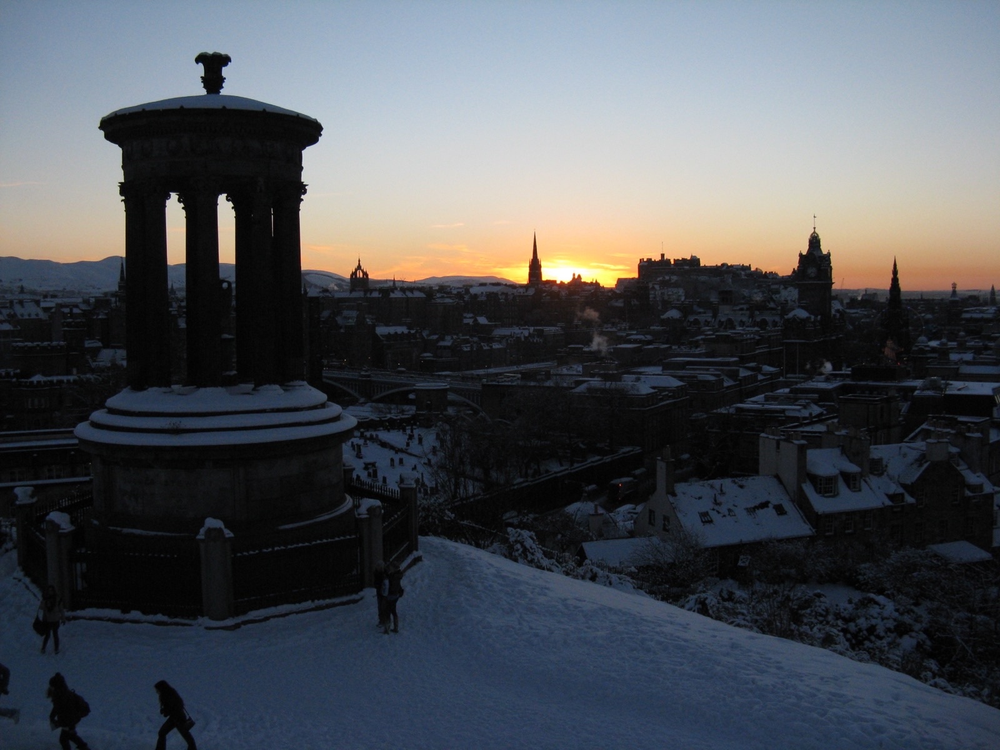
*从卡尔顿山俯瞰爱丁堡新城与福斯湾*

- **时间**：夏季日落约 21:30-22:00，但最美的光线在 20:00-21:00。
- **路线**：从王子街向东步行 10 分钟即可登顶，几乎没有难度。
- **景观**：山顶有仿古希腊的未完工纪念碑、纳尔逊纪念塔，以及俯瞰全城的最佳视角。向东可以看到福斯湾（Firth of Forth）和远处的北海；向西可以看到城堡剪影在夕阳中变成金色。
- **浪漫时刻**：带一瓶超市买的白葡萄酒或本地精酿啤酒，坐在山顶的草地上等待天黑。这是爱丁堡最像电影的一幕。

## 晚餐
推荐 **Ondori」，位于 Leith 区的意大利/苏格兰融合餐厅，或者老城里的 **The Dogs**（现代苏格兰菜，性价比极高）。如果想更 casual，可以在 **Stockbridge** 街区找一家 gastro pub。

---

# D3｜爱丁堡 → 斯特灵（Stirling）→ 格拉斯哥（Glasgow）→ 洛蒙德湖（Loch Lomond）
**主题：从王国之心驶入高地门户**

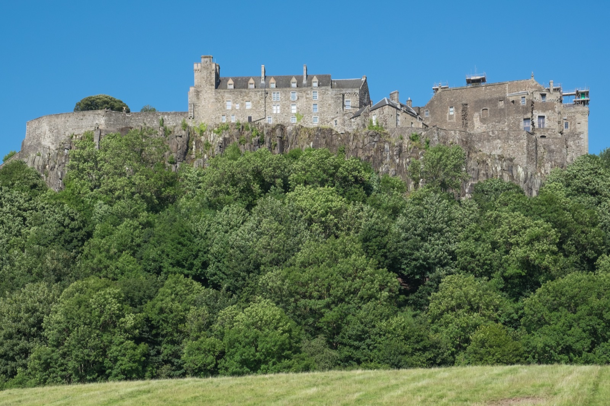
*斯特灵城堡俯瞰苏格兰中部平原*

## 自驾开始
- **取车**：上午在爱丁堡 Waverley 火车站附近或机场取车。苏格兰高地公共交通不便，**从今天起开启自驾**。
- **重要提醒**：英国是**右舵左行**。前 30 分钟请格外小心环岛（Roundabout）的行驶方向，建议先在市区低速适应。

## 上午：斯特灵城堡（Stirling Castle）
- **距离**：爱丁堡 → 斯特灵约 60 公里，车程 1 小时。
- **门票**：约 17 英镑/人。
- **看点**：
  - 斯特灵被称为「苏格兰的咽喉」，因为它是低地通往高地的要塞。
  - 城堡内还原了 16 世纪詹姆斯五世的宫廷装饰，是苏格兰城堡中「王室生活感」最强的一座。
  - 从城墙可以远眺 **华莱士纪念碑（Wallace Monument）**——一座维多利亚时代的哥特式尖塔，纪念《勇敢的心》主人公威廉·华莱士。

> **历史感**：如果说爱丁堡城堡是军事要塞，斯特灵城堡就是苏格兰王室的摇篮。玛丽女王在这里加冕，詹姆斯六世在这里长大。它的战略地位让苏格兰人相信：「谁控制了斯特灵，谁就控制了苏格兰。」

## 下午：格拉斯哥西区（Glasgow West End）
- **距离**：斯特灵 → 格拉斯哥约 40 公里，车程 40 分钟。
- **活动**：格拉斯哥是苏格兰最大的城市，但与爱丁堡的古典气质截然不同——这里是工业革命的引擎、朋克音乐的发源地、以及苏格兰最热情（也最粗犷）的城市。
- **推荐停留**：
  - **凯文葛罗夫艺术博物馆（Kelvingrove Art Museum）**：免费入场，收藏了萨尔瓦多·达利的《十字架上的圣约翰基督》。
  - **阿什顿巷（Ashton Lane）**：一条鹅卵石铺成的小巷，两旁是酒吧、餐厅和独立电影院，挂满了串灯，非常适合拍照和喝一杯咖啡。

## 傍晚：进入高地，抵达洛蒙德湖
- **距离**：格拉斯哥 → 洛蒙德湖（Balloch 或 Luss 小镇）约 30 公里，车程 35 分钟。
- **路线**：沿 A82 公路向北，这是苏格兰最著名的景观公路之一。当城市的痕迹逐渐消失，取而代之的是湖泊、松树林和远处开始出现的高地山影时，你们会有一种「真正开始旅行」的仪式感。

## 住宿
**推荐：Lodge on Loch Lomond Hotel 或 Loch Lomond 湖畔 Airbnb**
- 价格：约 150～250 英镑/晚。
- 特点：湖畔景观房，夏季傍晚可以在湖边散步，看天鹅和水鸟。

## 晚餐
酒店餐厅或 **The Drovers Inn**，一家 1705 年开业的老酒馆，据说闹鬼，但氛围极好，壁炉里烧着真正的柴火。

---

# D4｜洛蒙德湖 → 格伦科峡谷（Glencoe）→ 马莱格（Mallaig）→ 斯凯岛（Isle of Skye）
**主题：穿越苏格兰最美的公路**

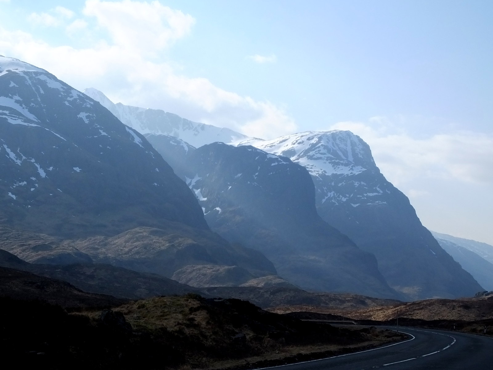
*格伦科峡谷标志性的三姐妹山*

## 自驾路线
- **洛蒙德湖 → 格伦科**：沿 A82 公路继续向北，约 70 公里，车程 1.5 小时。这是全世界最美的公路之一，沿途经过 **特罗萨克斯国家公园（Trossachs）**、**兰诺克沼地（Rannoch Moor）** 和最终抵达格伦科峡谷。
- **格伦科 → 马莱格**：约 75 公里，车程 1.5 小时。这段路会经过威廉堡（Fort William），英国本土最高峰 **本尼维斯山（Ben Nevis）** 就在西侧。
- **马莱格 → 斯凯岛（Armadale）**：乘 **Caledonian MacBrayne 轮渡**，航程约 30 分钟。夏季班次密集，约每小时一班。

## 上午：格伦科峡谷（Glencoe）

格伦科是苏格兰高地的代名词。这里的山体呈现出一种奇异的阶梯状纹理，是冰川侵蚀留下的痕迹。山谷常年笼罩在云雾中，阳光偶尔穿透云层，照亮某一座山峰的顶部——这种景象被称为「上帝的聚光灯」。

- **三姐妹山（Three Sisters）**：位于 A82 公路旁，有三条清晰的停车场。最经典的机位在 **Three Sisters Carpark**，可以拍到三座锯齿状山峰并排而立。
- **Glencoe Visitor Centre**：了解 1692 年「格伦科大屠杀」的历史——英国政府派遣的阿盖尔军团（与坎贝尔氏族有关联）以王室名义屠杀了接待他们的麦克唐纳氏族约 38 人，更多人死于逃离时的严寒。这是苏格兰历史上最黑暗的背叛之一，也让这片土地多了一层悲怆的氛围。
- **徒步推荐**：如果有 1.5 小时，可以走 **Glencoe Lochan Trail**，一条轻松的环湖步道，湖水倒映着松林和远山。

> **摄影建议**：格伦科的天气变化极快，前一秒大雾弥漫，后一秒阳光普照。不要急着离开，在停车场多等 15 分钟，天气可能会给你惊喜。

## 下午：马莱格轮渡与上岛
- **马莱格** 是一个宁静的白色渔村，轮渡码头附近有几家海鲜餐馆。推荐在 **The Tea Garden** 吃一份龙虾卷或蟹肉三明治。
- **轮渡体验**：当船驶离马莱格，你们会逐渐看到斯凯岛锯齿状的 **库林山脉（Cuillin Mountains）** 出现在海平面上。黑色的山体像一堵墙从海中升起，这种视觉冲击几乎和挪威罗弗敦的雪山一样震撼。

## 住宿
**强烈推荐：波特里（Portree）的 The Royal Hotel 或 Cuillin Hills Hotel**
- **Cuillin Hills Hotel**：位于波特里郊区的小山坡上，所有房间都面向波特里海湾和远处的库林山。价格约 200～350 英镑/晚。
- 备选：波特里镇中心的精品民宿或 B&B。斯凯岛的住宿在夏季非常紧张，建议提前 2-3 个月预订。

## 晚餐
波特里港口边有一排彩色房子，其中最著名的是 **The Seafood Restaurant**，主打当天捕捞的龙虾、扇贝和鳕鱼。需要提前预订，人均约 40～60 英镑。如果订不到，旁边的 **Sea Breezes** 也是当地人推荐的海鲜餐厅。

---

# D5｜斯凯岛（北/东环线）
**主题：在精灵与巨人的土地上行走**

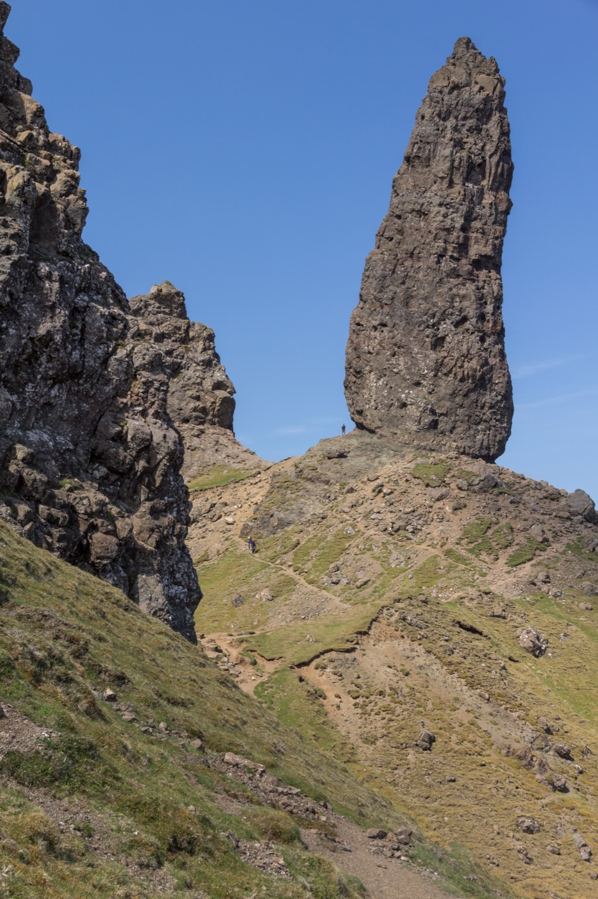
*晨曦中的老人峰徒步路线*

## 上午：老人峰（Old Man of Storr）徒步

这是斯凯岛乃至苏格兰排名第一的徒步路线。

- **起点**：位于 A855 公路旁，波特里以北约 15 分钟车程。
- **距离**：往返约 3.8 公里。
- **爬升**：约 270 米。
- **时间**：往返 1.5～2.5 小时。
- **难度**：中等。前半段是碎石坡和土路，后半段需要在岩石间攀爬，但不需要专业装备。

### 景观价值
登顶后，你们会看到苏格兰最著名的自然地标之一——**老人峰**，一座从山坡突兀升起的巨大玄武岩柱。传说这是一位巨人在死后石化成的山峰。背景是特罗特尼什半岛（Trotternish Ridge）锯齿状的山脊线，以及远处蓝色的大西洋。

> **徒步建议**：
> - 早上 7:00-8:00 出发，避开旅行团和正午的风；
> - 穿防水登山鞋，苏格兰高地夏季多雨，岩石湿滑；
> - 山顶风极大，即使是 7 月也建议带防风冲锋衣；
> - 老人峰本身不是最高点，继续向前走到主观景台才是最佳机位。

## 下午：裙岩悬崖（Kilt Rock）与仙女池（Fairy Pools）

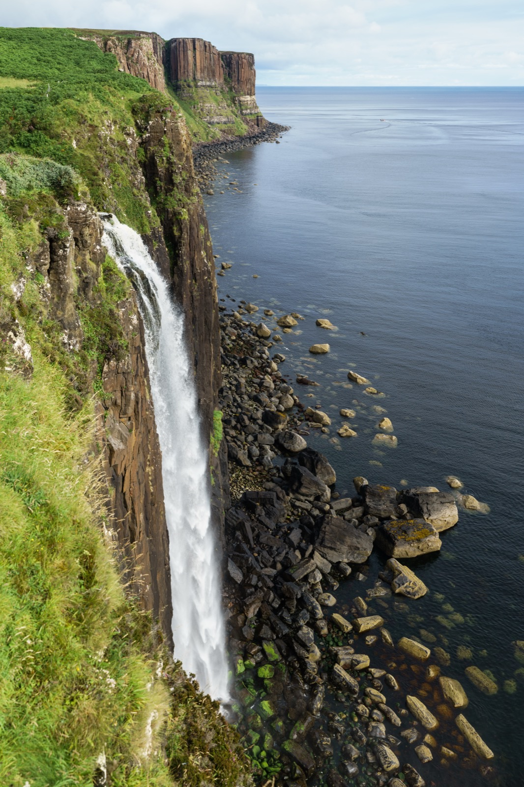
*裙岩悬崖与 Mealt 瀑布*

### 裙岩悬崖（Kilt Rock & Mealt Falls）
- **位置**：A855 公路沿线，老人峰以北约 15 分钟车程。
- **看点**：高达 55 米的玄武岩悬崖，岩柱垂直排列如同苏格兰传统格裙（Kilt）的褶皱。悬崖边有一条 **Mealt 瀑布** 直接坠入大海。观景台上设有免费的望远镜和说明牌。

### 仙女池（Fairy Pools）
- **位置**：位于 Cuillin 山脉脚下，波特里以西约 30 分钟车程（沿 B8009 和 Glen Brittle 路）。
- **看点**：一系列清澈的碧蓝色水潭，由山间溪流串联而成，背景是黑色的库林山。水温常年冰冷，但夏季有勇敢者在此跳水游泳。
- **徒步**：从停车场到第一个水潭约 20 分钟步行，路况平坦但可能泥泞。

> **凯尔特传说**：斯凯岛的名字来源于古诺尔斯语「Skye」，意为「云雾笼罩的岛屿」。这里流传着大量精灵、巨人和仙女的传说。当地人至今仍相信某些山丘和湖泊是精灵的领地，晚上最好不要打扰。

## 晚餐
回到波特里，如果昨晚没有吃到海鲜，今晚务必补上。或者可以在镇上的超市（Co-op）购买当地食材，回民宿自己做一顿高地牛排配红酒——斯凯岛的自炊体验也是一种浪漫。

---

# D6｜斯凯岛（西/南环线）
**主题：大陆尽头的灯塔与古堡**

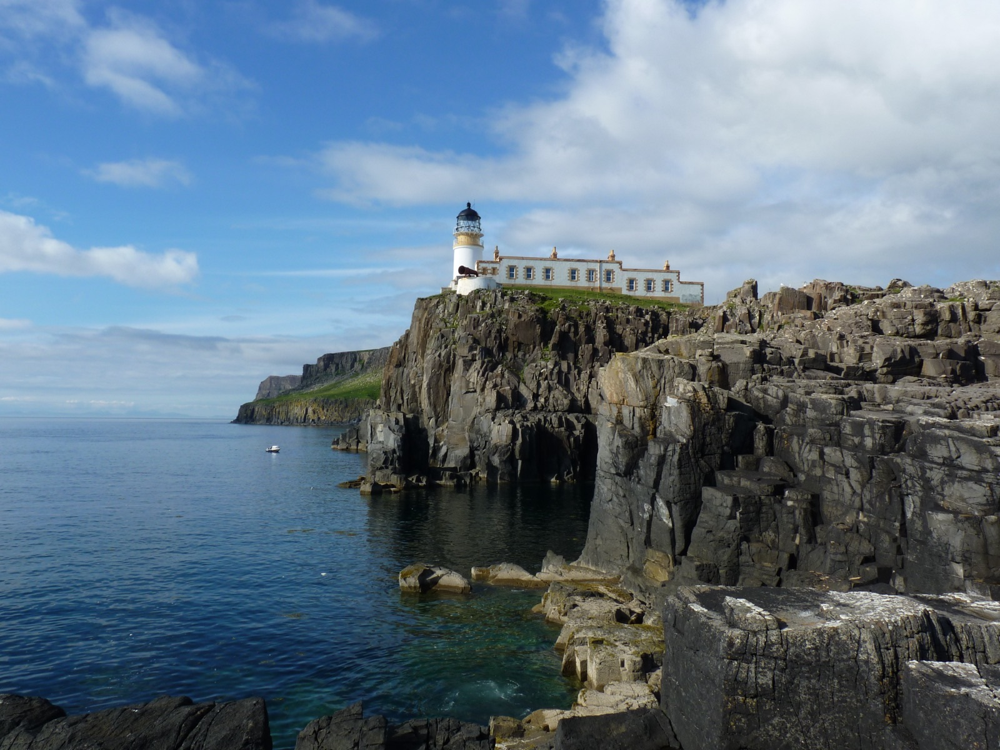
*内斯特角灯塔——苏格兰最西端的地标*

## 上午：内斯特角灯塔（Neist Point Lighthouse）

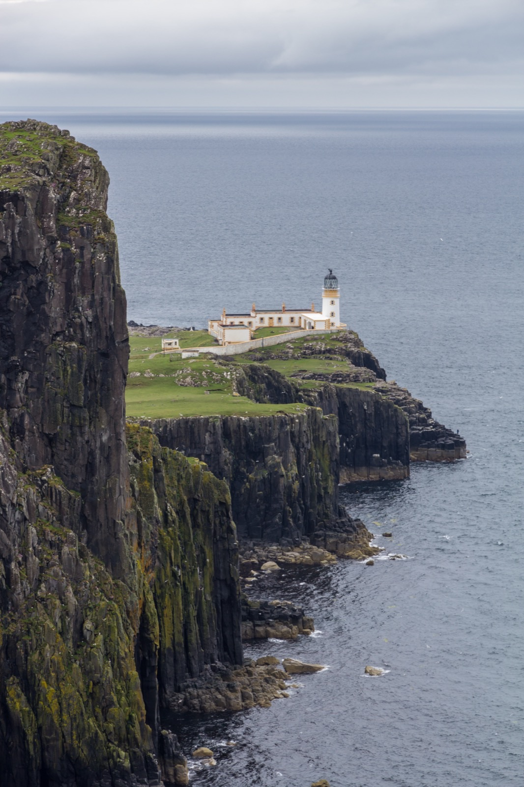
*内斯特角灯塔与周围的海蚀悬崖*

- **位置**：斯凯岛最西端，波特里以西约 1 小时车程（沿 B8009 和 single-track 公路）。
- **看点**：
  - 这座灯塔建于 1909 年，矗立在一条狭窄海岬的尽头，被《国家地理》评为「全球最美灯塔」之一。
  - 从停车场步行到灯塔约 20 分钟（下坡），回程上坡约 30 分钟。沿途可以看到壮观的海蚀悬崖，夏季常有鲸鱼、海豚和海豹出没。
  - 最佳拍摄点在通往灯塔的石板路中段，以及灯塔东侧的悬崖边（注意安全）。

> **自驾提醒**：通往内斯特角的路是一条狭窄的单车道（Single-track road），每隔一段设有会车点（Passing place）。遇到对向来车时，请主动倒车进入 passing place 避让。英国司机通常会用挥手或闪灯表示感谢。

## 下午：邓韦根城堡（Dunvegan Castle）与珊瑚海滩（Coral Beach）

### 邓韦根城堡
- **位置**：波特里以西约 30 分钟车程，是**苏格兰一直有人居住的最古老城堡**（自 13 世纪起）。
- **看点**：
  - 城堡是麦克劳德氏族（Clan MacLeod）的祖宅，内部收藏了大量家族文物和油画。
  - 花园非常精美，尤其是夏季，玫瑰和绣球花盛开。
  - 可以乘船到附近的 **海豹殖民地** 观赏海豹。

### 珊瑚海滩（Coral Beach）
- **位置**：邓韦根以北约 10 分钟车程。
- **看点**：这里的「沙子」其实是海藻钙化后形成的白色碎屑，在阳光下呈现出奇异的白色。海水呈现出加勒比海般的 turquoise 色，与周围深色高地形成强烈对比。
- **徒步**：从停车场到海滩约 25 分钟步行，路况平缓。

> **浪漫时刻**：如果天气晴朗，珊瑚海滩是斯凯岛最像热带海岛的地方。带一条毯子和一些零食，坐在白色的「沙滩」上，看着绿松石色的海水拍打岸边——这是旅行里最适合野餐的一站。

## 晚餐
回到波特里，推荐尝试 **The Cellar**，一家米其林指南推荐的现代苏格兰海鲜餐厅，人均约 60～80 英镑，需提前预订。

---

# D7｜斯凯岛 → 格伦科峡谷 → 尼斯湖（Loch Ness）
**主题：重返峡谷，追寻水怪传说**

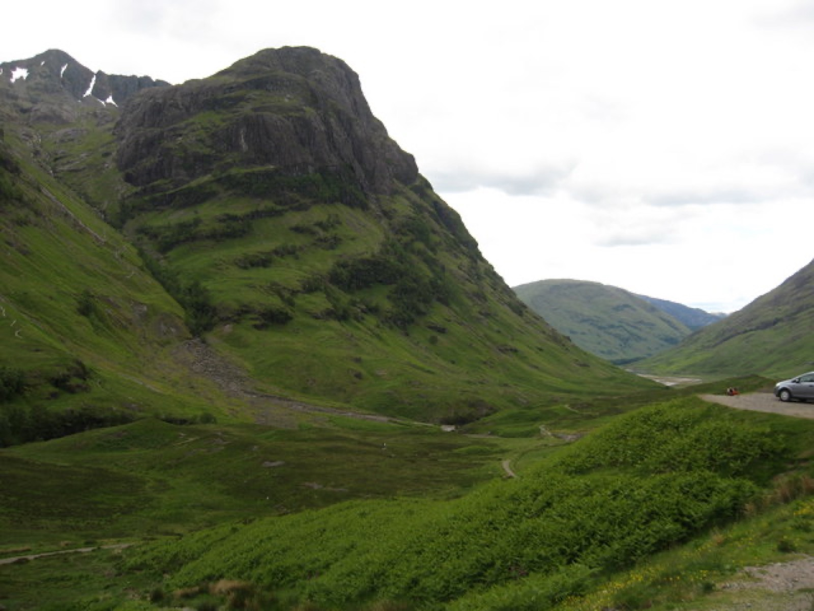
*从 Glencoe 观景台俯瞰峡谷全景*

## 自驾路线
- **斯凯岛 → 格伦科**：从斯凯桥（Skye Bridge）离开岛屿，沿 A87 公路向东至威廉堡附近，再沿 A82 公路向南进入格伦科峡谷，约 120 公里，车程 2 小时。
- **格伦科 → 尼斯湖（厄克特城堡）**：从格伦科沿 A82 向北折返经过威廉堡，继续沿 A82 向北沿尼斯湖前行，约 80 公里，车程 1.5 小时。
- **尼斯湖 → 因弗内斯**：约 25 公里，车程 30 分钟。

## 上午：重返格伦科，三姐妹山观景台深度停留

由于 D4 是从南向北穿过格伦科，而今天是从北向南（从斯凯岛过来），所以你们会从另一个角度重新欣赏这座峡谷。

- **Three Sisters Carpark**：今天可以花时间走到 **Lost Valley（Coire Gabhail）** 的入口。这是一条通往隐藏山谷的徒步路线，据说 1692 年格伦科大屠杀时，部分麦克唐纳氏族成员逃入这个山谷避难。
  - 往返约 4 公里，爬升约 300 米，难度中等偏上，需要穿越溪流和碎石坡。
  - 如果时间或体力有限，可以在停车场附近的山谷底部拍照，同样壮观。
- **Glencoe Viewpoint**：位于 A82 公路南侧，是拍摄峡谷全景的最佳机位之一。

## 下午：尼斯湖与厄克特城堡（Urquhart Castle）

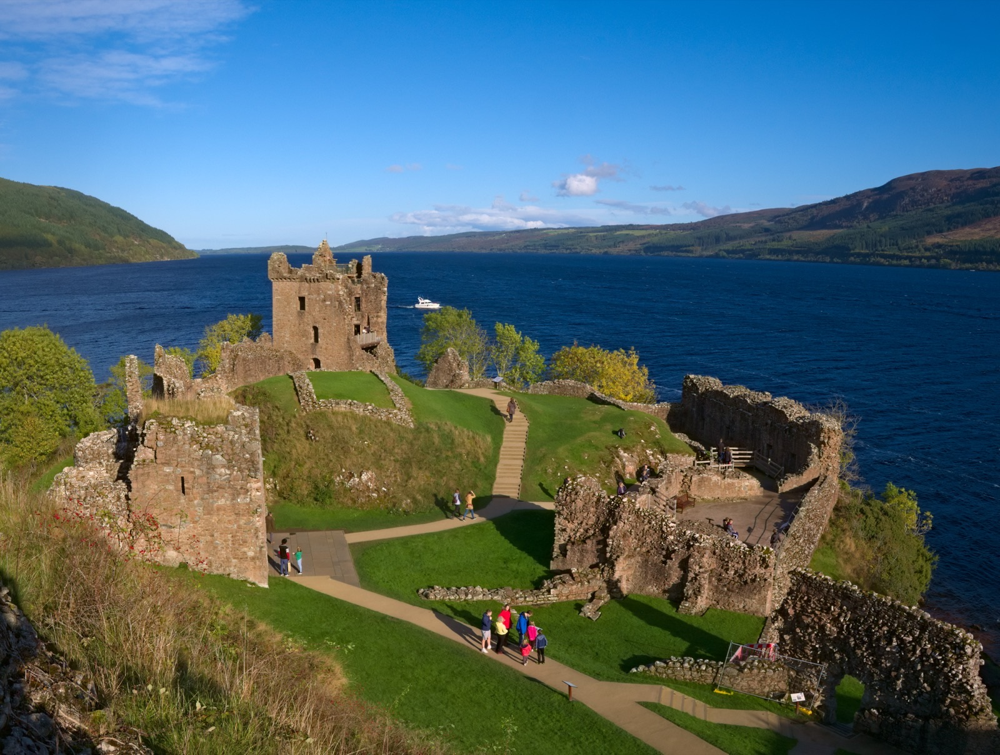
*厄克特城堡遗址矗立在尼斯湖畔*

- **厄克特城堡**：位于尼斯湖（Loch Ness）西岸，是苏格兰出镜率最高的城堡遗址之一。
  - 门票：约 14 英镑/人。
  - 历史：这座城堡始建于 13 世纪，在 17 世纪英国内战期间被部分炸毁，如今只剩下断壁残垣。但正是这些废墟与尼斯湖的深绿色湖水形成了极具戏剧性的画面。
  - **水怪传说**：尼斯湖水怪（Nessie）的故事始于 1933 年，但当地传说可以追溯到 6 世纪。城堡设有专门的「水怪展览」，展示了历年来的目击记录和（大部分是造假的）照片。

> **有趣的事实**：尼斯湖是英国淡水容量最大的湖泊，最深处达 227 米。湖水因泥炭而呈现出不透明的深绿色/黑色，这为水怪传说提供了完美的视觉条件——因为什么都看不见。

## 住宿
**因弗内斯（Inverness）**
- 这是苏格兰高地的首府，也是进入 NC500 公路的门户。
- **推荐：Rocpool Reserve Hotel 或 Glenmoriston Town House**
  - 价格：约 150～250 英镑/晚。
  - 特点：位于尼斯河畔，步行可达市中心餐厅和酒吧。

## 晚餐
推荐 **The Mustard Seed**，一家位于因弗内斯河边的现代苏格兰菜餐厅，招牌是高地鹿肉和扇贝。人均约 35～50 英镑。

---

# D8｜尼斯湖 → NC500 精华段 → 皮特洛赫里（Pitlochry）→ 爱丁堡
**主题：北海岸公路与低地归途**

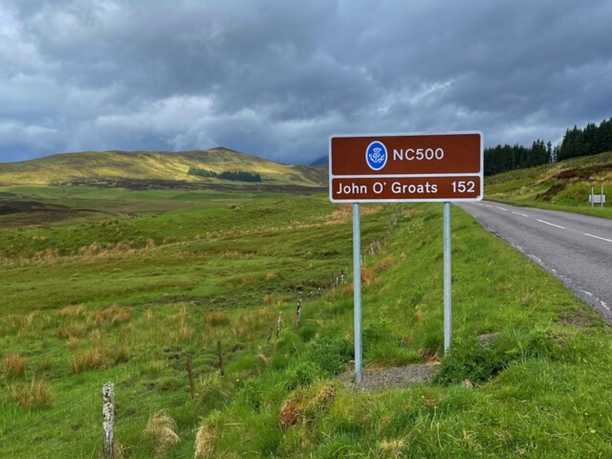
*NC500 公路蜿蜒于苏格兰北海岸*

## 自驾路线
- **因弗内斯 → NC500 东段 → 皮特洛赫里**：约 180 公里，车程 3.5～4 小时。
- **皮特洛赫里 → 爱丁堡**：约 110 公里，车程 1.5～2 小时。
- **总里程**：约 280～300 公里。

## 上午：NC500 公路精华段体验

NC500（North Coast 500）被称为「苏格兰的 66 号公路」，是一条环绕苏格兰最北端的 500 英里环线。由于时间限制，我们只能体验其中一小段。

- **推荐路段**：从因弗内斯出发，沿 A9 公路向北约 30 公里后转入 **A836 沿海公路**，经过 **Black Isle（黑岛，实际上是一个半岛）** 和 **Dornoch Firth**。这段路拥有开阔的海景、白色的沙滩和偶尔出现的海豚。
- **Dornoch 小镇**：可以短暂停留，参观 **Dornoch Cathedral**（麦当娜 2000 年在此举行婚礼）和小镇的主街。
- **Glenmorangie 酒厂**：位于 Tain，如果对威士忌感兴趣，可以预约参观这家以「长颈鹿蒸馏器」闻名的高地威士忌酒厂。

> **设计取舍**：完整的 NC500 需要 4-5 天才能充分体验。在 9 天的行程中，我们只能「浅尝辄止」。但如果你们将来重返苏格兰，NC500 是首选的补课内容。

## 下午：皮特洛赫里（Pitlochry）

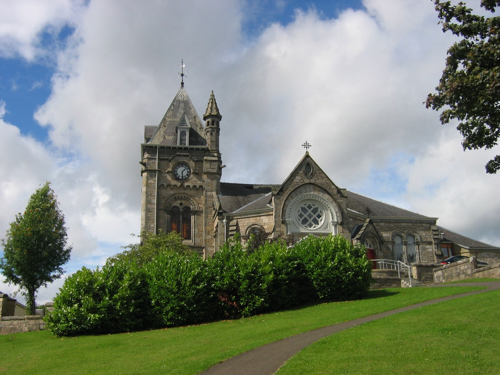
*维多利亚风格的高地小镇皮特洛赫里*

- **位置**：位于珀斯郡（Perthshire），被称为「通往高地的门户」。
- **看点**：
  - 这是一个典型的维多利亚风格小镇，主街两旁是石砌建筑、茶室、羊毛制品店和威士忌商店。
  - **Blair Athol 酒厂**：位于小镇中心，可以免费参观并品尝威士忌。
  - **Pitlochry Dam 与鲑鱼阶梯**：夏季可以看到鲑鱼洄游跳上人工阶梯的奇观。
- **购物**：这里是购买苏格兰特产的好地方——羊绒围巾、哈里斯粗花呢（Harris Tweed）、短饼（Shortbread）和威士忌。

## 傍晚：返回爱丁堡
- 从皮特洛赫里沿 A9 公路向南，约 1.5 小时即可抵达爱丁堡。
- **住宿**：建议住在机场附近（如 Holiday Inn Edinburgh Airport），方便第二天早班机。如果想再享受一晚城市氛围，可以回到市中心的酒店。

## 晚餐
如果回爱丁堡，推荐在 **Leith 区** 吃最后一顿晚餐。这里是爱丁堡的美食中心，有数家米其林餐厅和海鲜酒馆。

---

# D9｜爱丁堡/格拉斯哥 → 国内
**主题：归途**

- **航班**：建议预订 10:00～13:00 起飞的航班。爱丁堡机场（EDI）规模不大，提前 2 小时抵达即可。
- **还车**：如果在爱丁堡机场还车，请提前加满油，并检查是否有新的刮擦痕迹。
- **离境前**：在机场的 **WHSmith** 或 **World Duty Free** 购买最后一瓶苏格兰威士忌作为纪念。推荐 **Macallan、Glenfiddich 或 Lagavulin**。

带着 9 天的高地风、威士忌香和城堡记忆回家。

---

## 附录一：全程预算拆分（2 人总计）

| 项目 | 金额（人民币） | 说明 |
|:---|:---:|:---|
| **国际往返机票** | 18,000～28,000 | 暑假经伦敦/阿姆斯特丹转机经济舱，约 0.9～1.4 万/人 |
| **租车（7 天）** | 7,000～12,000 | 含自动挡车型（英国右舵建议租自动挡）、全险、油费约 1500～2500 元 |
| **轮渡/停车/过路费** | 800～1,500 | 马莱格 → 斯凯岛轮渡（约 40 英镑/车+2人）、少量停车费和过桥费 |
| **住宿（8 晚）** | 16,000～26,000 | 城市酒店/精品民宿 1200～2000 元/晚，高地 B&B 800～1500 元/晚 |
| **餐饮** | 10,000～15,000 | 外食人均 200～350 元/顿，自己做人均 80～150 元/顿 |
| **门票/体验** | 2,500～4,000 | 爱丁堡城堡、斯特灵城堡、厄克特城堡、威士忌体验中心、酒厂 tour |
| **签证/保险/杂费** | 2,500～3,500 | 英国签证约 1000 元/人，保险 200 元/人 |
| **总计** | **约 56,800～90,000 元** | **人均 2.84～4.5 万** |

> **省钱小贴士**：英国超市（Tesco、Sainsbury's、Co-op）物价合理，苏格兰的牛肉、三文鱼和奶酪质量极高。建议订带厨房的民宿，自己做早餐和几顿晚餐，可以省下近三分之一的餐饮预算。另外，苏格兰很多博物馆和自然景观（如格伦科峡谷、NC500 公路）完全免费。

---

## 附录二：行前准备清单

### 证件与签证
- [ ] **英国签证（Standard Visitor Visa）**：至少提前 **8～10 周** 申请。7～8 月是签证和旅游旺季，slot 非常紧张。
- [ ] 护照（有效期 6 个月以上）。
- [ ] 驾照原件 + **英文翻译件**（租租车 APP 可免费办理国际驾照翻译认证件，英国租车通常接受中国驾照+翻译件）。
- [ ] 旅行保险（保额建议 ≥ 30 万人民币）。

### 预订确认（按优先级）
1. [ ] **国际机票**
2. [ ] **斯凯岛住宿（波特里 Cuillin Hills Hotel 或 B&B）**——瓶颈项，夏季提前 2-3 个月预订
3. [ ] **爱丁堡住宿（老城或新城精品酒店）**
4. [ ] **租车预订**：爱丁堡取车，爱丁堡/格拉斯哥还车，**务必选择自动挡**
5. [ ] **马莱格 → 斯凯岛（Armadale）轮渡票**（CalMac 官网提前预订，夏季班次多但仍建议提前订）
6. [ ] **爱丁堡城堡、威士忌体验中心门票**（旺季建议提前官网购买）
7. [ ] **热门餐厅预订**（The Witchery by the Castle、The Cellar 等需提前数周预订）

### 衣物与装备
- [ ] **防水冲锋衣 + 软壳/抓绒内胆**：苏格兰高地夏季多雨多风，气温 10～20℃。
- [ ] **防水徒步鞋/登山鞋**：老人峰、格伦科徒步必备。
- [ ] **轻便雨衣/雨裤**：比雨伞实用（高地风大，雨伞会被吹翻）。
- [ ] **薄羽绒服或厚抓绒**：斯凯岛和格伦科傍晚可能只有 8-12℃。
- [ ] **防晒霜 + 墨镜**：长白昼下紫外线较强。
- [ ] **转换插头**：英国使用**英标三脚方型插头（G 型）**。
- [ ] **保温杯/便携烧水壶**：英国人喜欢喝冷水，中国人的胃可能需要热水。
- [ ] **少量零食/泡面**：高地小镇超市关门较早，夜间可能找不到餐厅。

### APP 下载
- **Google Maps**：离线地图必备（高地部分地区信号微弱）。
- **Trainline**：查询和购买英国火车票。
- **CalMac Ferries**：苏格兰西海岸轮渡时刻查询与购票。
- **Booking.com / Airbnb**：住宿管理。
- **OpenTable / Resy**：餐厅预订。

---

## 附录三：关键决策说明（FAQ）

### Q1：为什么不走完整的 NC500 环线？
完整的 NC500 约 500 英里（800 公里），沿途有很多值得深度停留的海岸小镇、白沙滩和威士忌酒厂。但完整走完至少需要 4-5 天，会严重压缩斯凯岛和爱丁堡的时间。我们把 NC500 当作「开胃酒」而非「主菜」，只体验其东段精华，把核心精力留给斯凯岛和格伦科。

### Q2：英国右舵左行会不会很难适应？
对于有经验的司机来说，**前 30 分钟需要集中注意力**，之后很快就能适应。关键注意点：
- 环岛（Roundabout）是顺时针方向行驶，进入环岛时让行右侧来车；
- 苏格兰高地有很多 **Single-track road**（单车道），遇到对向来车要倒车进入 **Passing place** 避让；
- **务必租自动挡**，右舵+手动挡对新手是地狱级难度；
- 英国车速单位是 **英里（mph）**，注意限速标志。

### Q3：斯凯岛真的值得待三天吗？
**绝对值得。** 斯凯岛是苏格兰高地的精华所在，地貌多样——黑色的库林山、碧蓝的仙女池、白色的珊瑚海滩、世界尽头的灯塔。而且岛上的节奏很慢，住宿以 B&B 和精品酒店为主，非常适合旅行「住进风景里」的度假感。如果压缩到两天，老人峰和仙女池的徒步都会很赶，失去了松弛感。

### Q4：为什么需要英国签证而不是申根签证？
英国（包括苏格兰、英格兰、威尔士、北爱尔兰）**从来不是申根区成员**。即使你们有有效的申根签证，进入英国仍然需要单独申请英国 Standard Visitor Visa。另外，从英国飞往申根国家（如法国、荷兰）也需要出示申根签证，行程中不涉及，但请记住这是两个独立的签证体系。

### Q5：苏格兰的威士忌该怎么选？作为新手从哪里开始？
苏格兰威士忌主要分为五大产区，风味差异极大：
- **低地（Lowland）**：清淡、花香、青草味，适合入门；
- **高地（Highland）**：果香、蜂蜜、微辛，种类最多；
- **斯佩塞（Speyside）**：甜美、果干、坚果味，受众最广；
- **艾雷岛（Islay）**：浓重的泥煤烟熏味，像消毒水+培根，爱的人极爱，厌的人极厌；
- **坎贝尔镇（Campbeltown）**：海洋、烟熏、油脂感，风格介于高地和艾雷之间。

**新手推荐**：从 **Glenfiddich 12 年**（斯佩塞，甜美果香）或 **Glenmorangie 10 年**（高地，花香蜂蜜）开始。如果想尝试泥煤，可以从 **Highland Park 12 年**（奥克尼岛，温和泥煤）过渡，不要一上来就喝 **Laphroaig**。

---

## 附录四：一句话总结

这 9 天，你们会在爱丁堡的石头巷弄里听风笛低回，在斯凯岛的晨雾中攀登老人峰，在格伦科的暴雨后等待一束「上帝的聚光灯」，最后在尼斯湖畔的城堡废墟旁，开一瓶泥煤味的威士忌，聊到窗外天依然亮着。

**苏格兰不会给你完美的天气，但会给你完美的故事——这才是旅行最值得收藏的记忆。**

---

*文档生成时间：2026 年 4 月*  
*祝你们旅途愉快，新婚快乐！*
