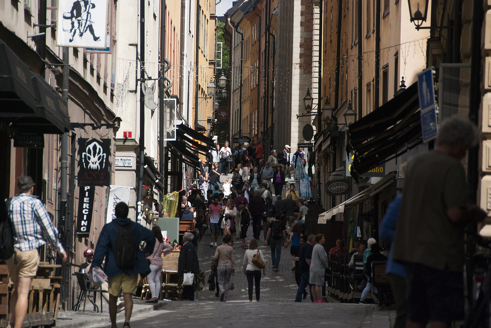
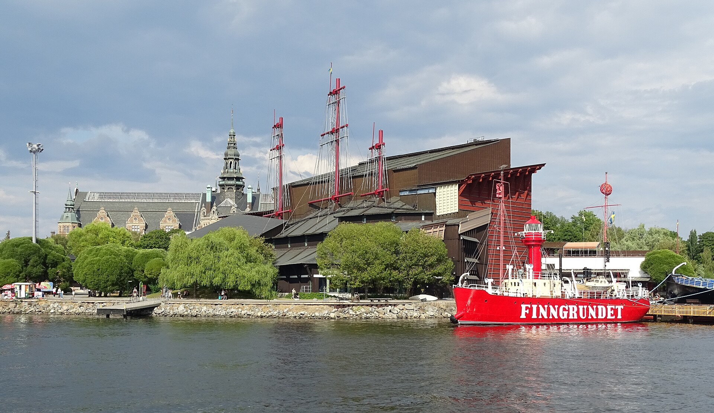
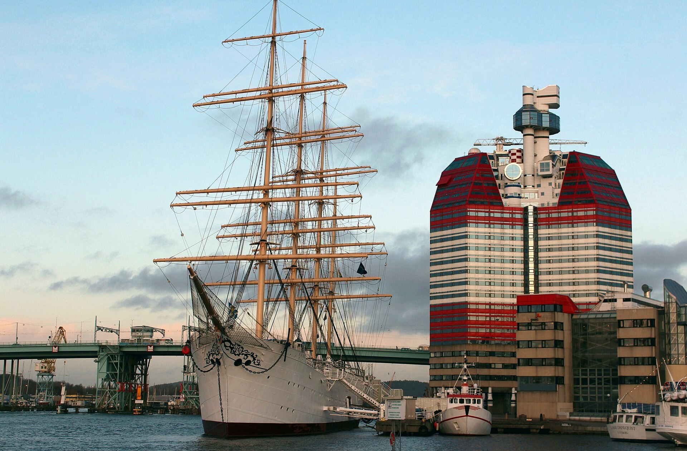
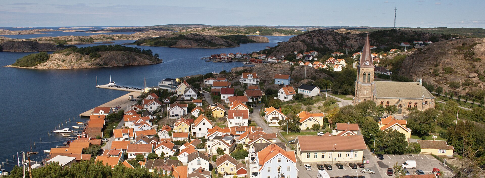
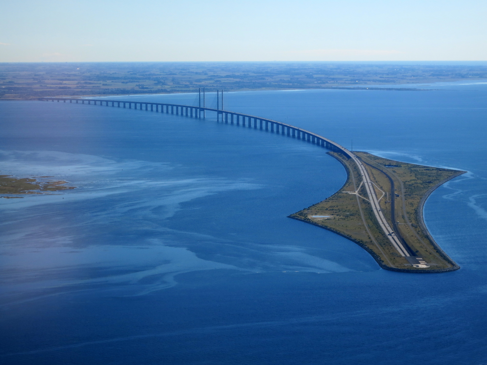
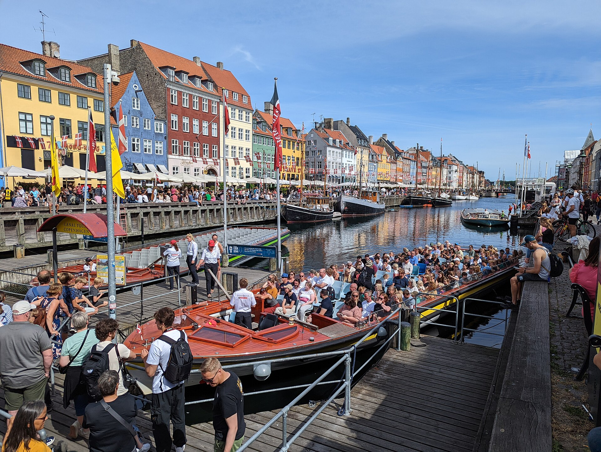
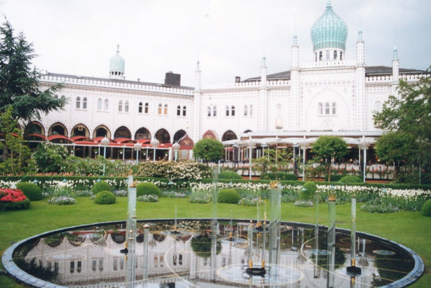
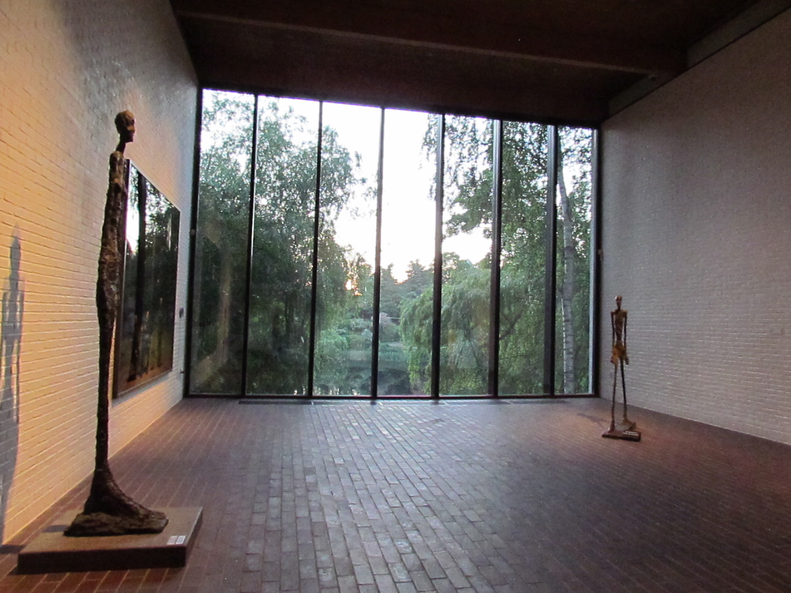

# 瑞典 + 丹麦｜群岛、生蚝与童话｜9 天执行手册

> **旅行时间**：6～8 月（夏季/白夜窗口）  
> **旅行人数**：2 人  
> **总天数**：9 天 8 晚  
> **核心目的地**：斯德哥尔摩 → 哥德堡 → 瑞典西海岸 → 马尔默 → 哥本哈根  
> **人均预算**：2.5～3.5 万元人民币（2 人总计约 5～7 万元）

---

## 为什么选瑞典 + 丹麦？

这是北欧**最轻松、最丰富、最无感跨国**的两国组合。

瑞典和丹麦通过一座桥相连——从马尔默坐火车到哥本哈根只要 35 分钟，窗外就是厄勒海峡的蔚蓝海水。你们甚至不需要提前去机场、不需要安检、不需要托运行李。这更像是"从一个城市去另一个城市"，而不是"从一个国家去另一个国家"。

- **瑞典**负责文艺与自然：斯德哥尔摩的地铁艺术、瓦萨沉船博物馆、西海岸的渔村与生蚝。
- **丹麦**负责童话与美食：哥本哈根的新港彩色房子、米其林餐厅、北西兰岛的城堡与现代美术馆。

这个组合是**"好吃、好逛、好看、不累"**的代名词。没有挪威峡湾的险峻山路，没有冰岛环岛的天气多变，只有铺装良好的公路、设计精美的城市和夏天 18 小时的白昼。

**如果你们想要的是一场"优雅且丰富"的蜜月，这就是最好的答案。**

---

## 行程总览

| 天数 | 星期 | 路线 | 住宿地 | 核心体验 | 开车距离 |
|:---:|:---:|:---|:---|:---|:---:|
| D1 | 六 | 国内 → 斯德哥尔摩 | 斯德哥尔摩 | 老城 Gamla Stan、王宫换岗、适应白夜 | — |
| D2 | 日 | 斯德哥尔摩 | 斯德哥尔摩 | 瓦萨博物馆、地铁艺术巡礼、群岛游船 | — |
| D3 | 一 | 斯德哥尔摩 → 哥德堡 | 哥德堡 | 高铁南下、鱼市教堂、Haga 区咖啡 | — |
| D4 | 二 | 哥德堡 → 西海岸 | 斯莫根/菲亚巴卡 | 自驾西海岸景观路、出海捕生蚝、悬崖酒店 | 约 150 km |
| D5 | 三 | 西海岸 → 马尔默 | 马尔默 | 厄勒海峡海滨、旋转大楼、西港漫步 | 约 200 km |
| D6 | 四 | 马尔默 → 哥本哈根 | 哥本哈根 | 坐火车过厄勒海峡大桥、新港、阿美琳堡宫 | — |
| D7 | 五 | 哥本哈根 | 哥本哈根 | 克里斯蒂安堡宫、Torvehallerne、趣伏里公园 | — |
| D8 | 六 | 北西兰岛 | 哥本哈根 | 克伦堡城堡、路易斯安那现代美术馆 | 约 100 km |
| D9 | 日 | 哥本哈根 → 国内 | — | 返程 | — |

> **设计逻辑**：斯德哥尔摩 2 天城市文艺；哥德堡 1 天+西海岸 1.5 天海鲜与自然；马尔默 0.5 天中转；哥本哈根 2.5 天童话与美食。全程只有一次跨国（火车 35 分钟），自驾集中在瑞典西海岸一段。

---

# D1｜国内 → 斯德哥尔摩（Stockholm）
**主题：北方威尼斯的初印象**

*斯德哥尔摩老城 Gamla Stan 的彩色房子与石板路*

## 交通
- **航班**：建议选择 **北欧航空 SAS**、**芬兰航空** 或 **中国国际航空** 的直飞/一次转机航班，**下午 14:00-17:00 抵达斯德哥尔摩阿兰达机场（ARN）** 最佳。
- **机场 → 市区**：
  - **机场快线（Arlanda Express）**：20 分钟直达中央车站（Stockholm C），最快但最贵（约 300 SEK/人）。
  - **通勤火车（Pendeltåg）**：约 40 分钟，价格便宜（约 150 SEK/人）。
- **市内交通**：斯德哥尔摩地铁和公交非常发达。建议购买 **72 小时交通卡（SL Access Card）**。

## 住宿
**推荐：Hotel Diplomat 或 Ett Hem**
- **Hotel Diplomat**：位于 Strandvägen 海滨大道，面对 Nybroviken 港湾，Art Nouveau 建筑风格，位置极佳。
- **Ett Hem**：位于 Östermalm 区，由一座 1910 年的私人宅邸改造而成的设计酒店，只有 12 间房，是斯德哥尔摩最浪漫的精品酒店之一（需提前数月预订）。
- 价格：约 2500～4500 SEK/晚。

## 活动
- **傍晚**：在老城 **Gamla Stan** 散步。这里是欧洲保存最完好的中世纪老城之一，鹅卵石街道、彩色木屋、狭窄的巷道和金色的街灯，让人仿佛穿越回 17 世纪。
- **晚餐**：
  - **Den Gyldene Freden**：位于老城内的传统瑞典餐厅，瑞典学院（评选诺贝尔文学奖的机构）自 1920 年代起每周四在此聚餐。推荐瑞典肉丸（Köttbullar）和腌鲱鱼（Sill）。
  - 或 **Oaxen Slip**：位于船岛上，米其林推荐，主打北欧海鲜，人均约 600 SEK。
- **小贴士**：6～8 月的斯德哥尔摩晚上 10 点才天黑。吃完晚饭后可以在海滨步道上散步，看白色的游艇停泊在港湾里。

---

# D2｜斯德哥尔摩（Stockholm）
**主题：世界最长画廊与沉船传奇**

*瓦萨博物馆内保存完好的 17 世纪战船*

## 上午：瓦萨沉船博物馆（Vasa Museum）
- 这是斯德哥尔摩**最受欢迎的博物馆**，也是世界上唯一一艘保存完好的 17 世纪战舰。
- **瓦萨号（Vasa）**：1628 年首航当天就在斯德哥尔摩港沉没，因为在建造时上层建筑过重、吃水线设计错误。它在海底沉睡了 333 年，直到 1961 年才被打捞上岸。
- **看点**：船体高约 52 米，船头和船尾雕刻着数百个神话人物和动物形象，极尽奢华。博物馆内还可以看到从沉船中打捞出的船员遗骸和随身物品。
- **参观时间**：约 1.5～2 小时。

## 下午：斯德哥尔摩地铁艺术巡礼

*斯德哥尔摩地铁站内的岩洞艺术*

斯德哥尔摩地铁被称为**"世界最长画廊"**，因为超过 90 个车站里都有艺术家的装置作品、壁画或雕塑。

- **推荐站点**：
  - **T-Centralen（蓝线）**：天花板和立柱上画着蓝色的藤蔓和花朵，像一座地下花园。
  - **Stadion（红线）**： station 内有一道巨大的彩虹，纪念 1912 年斯德哥尔摩奥运会。
  - **Rådhuset（蓝线）**：直接开凿在粉红色花岗岩中，像一座地下宫殿。
  - **Kungsträdgården（蓝线）**： station 内有绿色的古典雕塑、喷泉遗迹和巴洛克风格的装饰。
- **玩法**：买一张地铁票，沿着蓝线和红线打卡这几个站点。每个站停留 10～15 分钟拍照即可。

## 傍晚：群岛游船（Archipelago Cruise）
- 斯德哥尔摩被称为"群岛之城"，城外有**约 24,000 座岛屿和礁石**。
- 夏季有很多 2～3 小时的群岛游船，从市中心码头出发，穿梭于森林覆盖的小岛之间。
- 船上可以点一杯瑞典 cider，看夕阳把波罗的海染成金色。
- **推荐公司**：Stromma 的 Archipelago Cruise。

## 晚餐
- **Frantzén**（米其林三星，北欧料理巅峰，位于老城，需提前数月预订）
- 或 **Lilla Ego**（米其林一星，氛围轻松，性价比高，人均约 500 SEK）

---

# D3｜斯德哥尔摩 → 哥德堡（Göteborg）
**主题：从群岛到海港**

*哥德堡港口与天际线*

## 交通
- **高铁**：SJ 高速列车，斯德哥尔摩 C → 哥德堡 C，约 3 小时。
- **体验**：火车穿过瑞典南部平原和森林，车厢干净整洁，沿途风景像一幅田园油画。建议提前在 SJ 官网购票，夏季热门时段需提前预订。
- **市内交通**：哥德堡市区不大，步行+有轨电车即可。有轨电车是城市标志之一，复古的车型和叮叮当当的铃声很有味道。

## 住宿
**推荐：Hotel Pigalle 或 Avalon Hotel**
- **Hotel Pigalle**：位于市中心，法式复古风情，红色天鹅绒和水晶吊灯，像一家巴黎妓院改造的酒店（褒义），极为浪漫。
- **Avalon Hotel**：位于 Avenyn 大道旁，现代设计酒店，部分房间带私人露台和户外浴缸。

## 活动
- **下午**：
  - **鱼市教堂（Feskekôrka）**：一座建于 1874 年的室内鱼市场，外形像一座哥特式教堂。里面可以吃到最新鲜的烟熏三文鱼、生蚝和龙虾汤。
  - **Haga 区**：哥德堡最老牌的文艺街区，鹅卵石街道两旁是 19 世纪的木屋，有很多独立咖啡馆、古董店和面包房。
    - **必吃**：Haga 区咖啡店里的 **kanelbulle（肉桂卷）**，这是瑞典"菲卡（Fika）"文化的灵魂。
- **傍晚**：
  - **Avenyn 大道**：哥德堡的主干道，尽头是 **海神波塞冬雕塑（Poseidon）**。
  - 或在港口边散步，看日落把哥德堡歌剧院（Gothenburg Opera House）的玻璃幕墙染成红色。

## 晚餐
- **Sjömagasinet**（米其林一星，海鲜餐厅，位于港口边的一座旧仓库内，人均约 1000 SEK）
- 或 **Heaven 23**（位于 Gothia Towers 酒店 23 层，可以俯瞰全城，以"国王虾三明治"闻名）

---

# D4｜哥德堡 → 瑞典西海岸（West Coast）
**主题：生蚝与悬崖日落**

*瑞典西海岸的菲亚巴卡渔村*

瑞典西海岸是欧洲最好的生蚝产地之一，夏季（6～8 月）是**生蚝季**。这里的海岸线由无数花岗岩小岛和礁石组成，渔村的小屋漆成红色或白色，散落在岩石海岸上。

## 自驾路线
- **取车**：早上在哥德堡市中心取车。推荐 Europcar、Hertz。
- **路线**：哥德堡 → 菲亚巴卡（Fjällbacka，约 1.5 小时）→ 格雷贝斯塔（Grebbestad，约 30 分钟）→ 斯莫根（Smögen，约 1 小时）。
- **总里程**：约 150 公里。

## 途中亮点

### 菲亚巴卡（Fjällbacka）
- 瑞典犯罪小说女王 **Camilla Läckberg** 的故乡，她的小说都以这个渔村为背景。
- 村庄建在一座小山下，红顶白墙的渔民小屋沿着海岸排列。可以爬到山顶的**Vetteberget 观景台**，俯瞰整个村庄和周围的群岛。
- 村里的栈桥和渔船是很好的拍照背景。

### 格雷贝斯塔（Grebbestad）：出海捕生蚝
- **格雷贝斯塔是瑞典的生蚝之都**，这里的**flat oyster（扁平蚝）**被誉为欧洲最优质的生蚝之一。
- **夏季限定体验**：参加当地的 **生蚝捕捞之旅（Oyster Safari）**。船长会带你们出海到养殖区，教你们如何分辨生蚝品质，现场开蚝，直接蘸柠檬汁生吃。
  - 价格：约 800～1200 SEK/人，含 6～10 只生蚝和一杯白葡萄酒。
  - 推荐公司：Everts Sjöbod 或 Grebbestad Rökeri。
- **口感**：这里的生蚝体型不大，但海水味浓郁，带有淡淡的金属回甘和黄瓜清香。

### 斯莫根（Smögen）

*斯莫根渔村的悬崖栈道与红色小屋*

- 瑞典西海岸最著名也最热闹的渔村，有一条长长的**木栈道（Smögenbryggan）**沿着海边延伸，两侧是渔民小屋、海鲜餐厅和酒吧。
- **Hotel Smögens Havsbad**：这是当地的标志性悬崖酒店，拥有私家海滩和桑拿房。即使不住这里，也可以在酒店的露天酒吧喝杯酒，看日落。
- **免费桑拿**：斯莫根海边有一个公共的**木柴桑拿房（Bastu）**，夏季对游客免费开放。蒸完桑拿后可以直接跳进波罗的海里游泳——这是北欧人夏天的必修课。

## 住宿
**斯莫根（Smögen）**
- **Hotel Smögens Havsbad**：终极之选，海景房+悬崖餐厅，约 2500～4000 SEK/晚。
- **Grebbestad 民宿**：如果想安静一些，可以住在格雷贝斯塔的海边小屋，价格更实惠。

---

# D5｜西海岸 → 马尔默（Malmö）
**主题：从渔村到海峡之城**

*连接瑞典与丹麦的厄勒海峡大桥*

## 自驾路线
- **路线**：斯莫根 → 赫尔辛堡（Helsingborg，约 2.5 小时）→ 马尔默（Malmö，约 1 小时）。
- **总里程**：约 200 公里。
- **开车时间**：约 3.5 小时。

## 途中亮点

### 赫尔辛堡（Helsingborg）
- **Kärnan 城堡塔**：中世纪堡垒的遗迹，登顶后可以眺望海峡对岸的丹麦城市赫尔辛格（Helsingør），以及远处的克伦堡城堡。
- **索菲罗城堡花园（Sofiero）**：瑞典王室的夏宫，夏季花园里种植了超过 500 种不同的植物和花卉，被称为"北欧最美的花园"。
- **老城海滩（Strandvägen）**：在海边散步，看渡轮往返于瑞典和丹麦之间。

### 马尔默（Malmö）
- **旋转大楼（Turning Torso）**：高 190 米，从底部到顶部扭转了 90 度，2005-2022 年间是北欧最高建筑。最佳拍摄点在西港（Västra Hamnen）的海边步道上。
- **Lilla Torg 小广场**：马尔默最 charming 的广场，四周是 16 世纪的彩色木屋，摆满了露天咖啡座。
- **里伯斯堡浴场（Ribersborgs Kallbadhus）**：一座建于 1898 年的海边浴场，男女分开的露天桑拿房，蒸完后直接跳进波罗的海。夏天非常舒服。

## 住宿
**马尔默市中心**
- **推荐：MJ's Hotel**：位于 Lilla Torg 旁边，设计酒店，复古与现代的结合。
- 价格：约 1500～2500 SEK/晚。

## 晚餐
马尔默有很多创新的北欧餐厅。推荐 **Bloom in the Park**（米其林一星，位于一座老公园里，氛围轻松）或 **Saltholm**（海鲜餐厅，位于港口边）。

---

# D6｜马尔默 → 哥本哈根（Copenhagen）
**主题：35 分钟的跨国浪漫**

*哥本哈根新港的彩色房子与帆船*

## 交通
- **Öresundståg 火车**：从马尔默中央车站（Malmö C）乘坐通勤火车，约 **35 分钟**直达哥本哈根中央车站（København H）。
- **跨国体验**：火车会经过 **厄勒海峡大桥（Øresund Bridge）**——全长 16 公里，一半跨海、一半海底隧道。坐在靠窗的位置，可以看到蔚蓝的海水和远处的风车。
- **行李**：不需要提前到机场、不需要安检、不需要托运行李。比国内跨省还方便。
- **还车**：建议在马尔默或哥本哈根机场还掉瑞典租的车。哥本哈根市区不需要车。

## 住宿
**推荐：Hotel Sanders 或 Hotel Kong Arthur**
- 同 D1 推荐。建议选择新港（Nyhavn）或 Indre By 区的酒店，方便步行游览。

## 活动
- **下午**：
  - **新港（Nyhavn）**：再次或首次邂逅这片彩色房子。安徒生曾在这里的 18、20 和 67 号居住过。
  - **阿美琳堡宫（Amalienborg）**：中午 12:00 看皇家卫队换岗仪式。
- **晚餐**：
  - **Kadeau**（新北欧料理一星，位于 Nyhavn 尽头的老仓库里，人均约 1500 DKK）
  - 或 **Torvehallerne KBH**（食品市场，生蚝、开放三明治、新鲜海鲜）
- **小贴士**：哥本哈根是全球米其林密度最高的城市之一。如果预算允许，这一晚可以安排一顿正式的北欧 fine dining。

---

# D7｜哥本哈根（Copenhagen）
**主题：童话、设计与美食**

*趣伏里公园的夏季灯光与花园*

## 活动

### 上午：克里斯蒂安堡宫（Christiansborg Slot）
- 丹麦议会、最高法院和首相办公室所在地。登塔免费，可以 360 度俯瞰哥本哈根全城和远处的瑞典海岸。
- 地下还有罗马时期遗址博物馆，可以看到 1167 年城堡原址的地基。

### 下午：设计区与 Torvehallerne
- **设计区**：Strøget 步行街附近的 Hay House、Georg Jensen、Illums Bolighus。
- **救主堂（Vor Frelsers Kirke）**：螺旋塔登顶，俯瞰克里斯钦自由城（Christiania）的彩色涂鸦屋顶。
- **Torvehallerne KBH**：哥本哈根最美的室内食品市场，可以在这里买生蚝、奶酪、熏鱼和烘焙点心。

### 晚上：趣伏里公园（Tivoli Gardens）
- 世界上最古老的游乐园之一（1843 年开园），也是华特·迪士尼的灵感来源。
- 夏季夜晚有超过 10 万盏灯装饰，还有现场古典音乐会和烟花表演。
- 园内的 **Nimb** 餐厅是享用晚餐的浪漫之选。

## 晚餐
- **Noma**（三星，全球最佳餐厅之一，需提前数月预订）
- **Geranium**（三星，位于公园体育场顶层，人均约 4000 DKK）
- **Kadeau**（一星，性价比更高的新北欧料理）

---

# D8｜北西兰岛（Nordsjælland）
**主题：城堡与现代艺术的对话**

*克伦堡城堡——莎士比亚《哈姆雷特》的取景地*

## 自驾路线
- **租车**：早上在哥本哈根中央车站附近取车（仅租一天）。
- **路线**：哥本哈根 → 赫尔辛格（Helsingør，约 45 分钟）→ 路易斯安那美术馆（约 20 分钟）→ 返回哥本哈根。
- **总里程**：约 100 公里。

## 上午：克伦堡宫（Kronborg Slot）
- 莎士比亚《哈姆雷特》的故事发生地，每年夏天城堡里都会上演露天戏剧。
- 位于厄勒海峡最窄处，正对瑞典赫尔辛堡。
- **必看**：地下隧道（Kasematterne）——传说中丹麦英雄 Holger Danske 在这里沉睡。

## 下午：路易斯安那现代艺术博物馆（Louisiana Museum of Modern Art）

*路易斯安那美术馆的雕塑花园与厄勒海峡*

- **全球最美的海边现代美术馆**。白色混凝土建筑依山而建，落地窗将海景框成活的画作。
- **雕塑花园**：室外花园里摆放着亚历山大·考尔德的动态雕塑、亨利·摩尔的青铜人体。
- **咖啡厅**：拥有全馆最佳海景位，点一杯咖啡和一块丹麦酥，是北西兰岛最惬意的下午茶。

## 晚餐
返回哥本哈根市区，推荐 **Marv & Ben**（新派丹麦菜，人均 400 DKK）或 **108**（Noma 系平替）。

---

# D9｜哥本哈根 → 国内
**主题：从童话王国回家**

- **上午**：如果航班在下午，可以在新港或国王新广场（Kongens Nytorv）做最后的散步和购物。
- **购物推荐**：
  - **Georg Jensen**：丹麦银器和珠宝。
  - **Hay**：北欧家居设计。
  - **LEGO**：丹麦特产，机场免税店有很多限定款。
  - **Carlsberg**：丹麦啤酒（但注意行李限重和液体规定）。
- **机场快线**：从中央车站到凯斯楚普机场（CPH）约 20 分钟。
- 带着瑞典的群岛记忆、西海岸的生蚝滋味和丹麦的童话感回家。

---

## 附录一：全程预算拆分（2 人总计）

| 项目 | 金额（人民币） | 说明 |
|:---|:---:|:---|
| **国际往返机票** | 20,000～30,000 | 暑假直飞/一次转机经济舱，约 1.0～1.5 万/人 |
| **瑞典境内高铁** | 1,500～2,500 | 斯德哥尔摩 → 哥德堡，约 750～1200 元/人 |
| **跨国火车** | 0～200 | 马尔默 → 哥本哈根，约 100 SEK/人（约 70 元人民币） |
| **租车（2 天）** | 2,000～4,000 | 瑞典西海岸 2 天，紧凑型轿车即可 |
| **油费/停车费** | 1,000～1,500 | 瑞典西海岸自驾约 400 公里 |
| **住宿（8 晚）** | 16,000～24,000 | 北欧设计酒店约 1200～2000 元/晚 |
| **餐饮** | 12,000～18,000 | 外食人均 250～400 元/顿，米其林一星约 800～1200 元/人 |
| **门票/体验** | 2,000～3,500 | 瓦萨博物馆、地铁票、生蚝之旅、城堡门票 |
| **签证/保险/杂费** | 2,000～3,000 | 申根签证约 800 元/人，保险 200 元/人 |
| **总计** | **约 56,500～86,700 元** | **人均 2.8～4.3 万** |

> **省钱小贴士**：瑞典和丹麦的超市（ICA、Coop、Rema 1000）价格合理。建议早餐在酒店吃（通常含早），午餐在食品市场或面包店解决，晚餐再享用正式餐厅。

---

## 附录二：行前准备清单

### 证件与签证
- [ ] **申根签证**：瑞典或丹麦均可作为主要申请国。如果瑞典停留 4 天、丹麦停留 3.5 天，向**瑞典签证中心**申请；如果想以丹麦为主，可将北西兰岛和哥本哈根延长到 4 天。
- [ ] 护照（有效期 6 个月以上）。
- [ ] 旅行保险（申根强制要求，保额 ≥ 3 万欧元）。

### 预订确认（按优先级）
1. [ ] 国际机票
2. [ ] 斯德哥尔摩 → 哥德堡 SJ 火车票（sj.se）
3. [ ] 斯德哥尔摩、哥德堡、马尔默、哥本哈根酒店
4. [ ] 生蚝捕捞之旅（夏季热门，提前 2 周预订）
5. [ ] 哥德堡租车（西海岸 2 天）
6. [ ] 哥本哈根米其林餐厅（如需）

### 衣物与装备
- [ ] 轻便防风外套（夏季海边风大）
- [ ] 舒适的 walking shoes（老城石板路多）
- [ ] 防晒霜 + 墨镜（白夜期间日照长）
- [ ] 转换插头（瑞典和丹麦均使用欧标 C/F 型插头）
- [ ] 泳衣（如果想体验海边桑拿）
- [ ] 轻便背包（跨国火车方便携带）

### APP 下载
- **Google Maps**：离线地图必备。
- **SL**：斯德哥尔摩公共交通官方 APP。
- **SJ**：瑞典铁路购票 APP。
- **Rejseplanen**：丹麦公共交通查询。
- **TheFork**：餐厅预订。

---

## 附录三：关键决策说明（FAQ）

### Q1：为什么不全程自驾？
斯德哥尔摩和哥本哈根都是非常适合步行+公共交通的城市，市区停车极贵（哥本哈根市中心约 200～300 DKK/天）。只在西海岸租车 2 天，可以省去大笔停车费和找车位的麻烦。斯德哥尔摩 → 哥德堡的高铁本身就是很好的体验，而且比开车快。

### Q2：瑞典和丹麦的签证怎么处理？
瑞典和丹麦都是申根国。如果你们瑞典停留更长（4 天 vs 3.5 天），就向瑞典申请签证；如果想以丹麦为主，稍微调整一下行程即可。两国签证材料和流程几乎一样。

### Q3：生蚝之旅值得吗？
**非常值得。** 格雷贝斯塔的 flat oyster 是欧洲顶级生蚝，出海捕捞是夏季限定体验。而且瑞典西海岸的风景本身就非常美，这段路不会让你们失望。

### Q4：为什么不去斯德哥尔摩的群岛深度游？
斯德哥尔摩群岛有超过 3 万座岛屿，深度游需要至少 2～3 天。9 天的双国行程中，我们选择了半天游船作为"群岛初体验"，把更多时间留给哥德堡和西海岸的海鲜之旅。如果你们特别喜欢跳岛，可以从哥德堡的行程中抽出一天专门去群岛。

### Q5：如果预算充裕，有什么可以提升体验的？
- **斯德哥尔摩直升机观光**：从空中俯瞰群岛和城区。
- **Ett Hem 酒店**：斯德哥尔摩最浪漫的精品酒店。
- **Noma 或 Geranium**：哥本哈根的两家米其林三星。
- **私人游艇出海**：从斯莫根包一艘小游艇，在群岛间巡航。

---

## 附录四：一句话总结

这 9 天，你们会在斯德哥尔摩的地铁岩洞里看艺术，在瓦萨博物馆里看一艘沉睡 333 年的战舰，在瑞典西海岸的海上亲手开一只生蚝，坐火车穿过厄勒海峡大桥去丹麦，在哥本哈根的新港运河边看彩色房子，在北西兰岛的城堡和现代美术馆之间切换时空。

**这是瑞典的文艺与丹麦的童话，写给彼此最优雅的一封旅行情书。**

---

*文档生成时间：2026 年 4 月*  
*祝你们旅途愉快，新婚快乐！*
