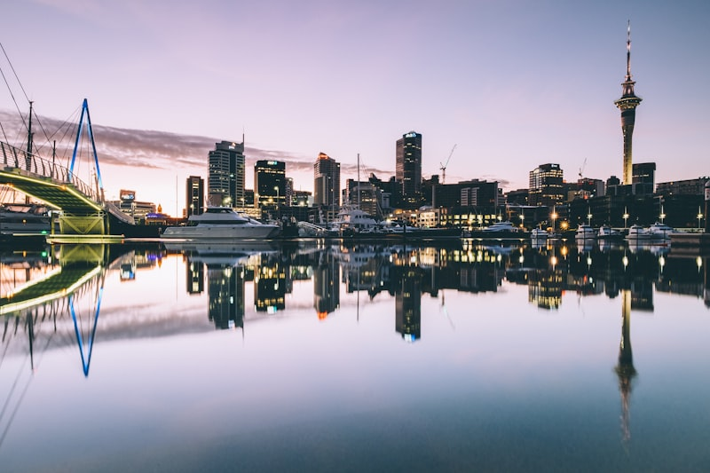
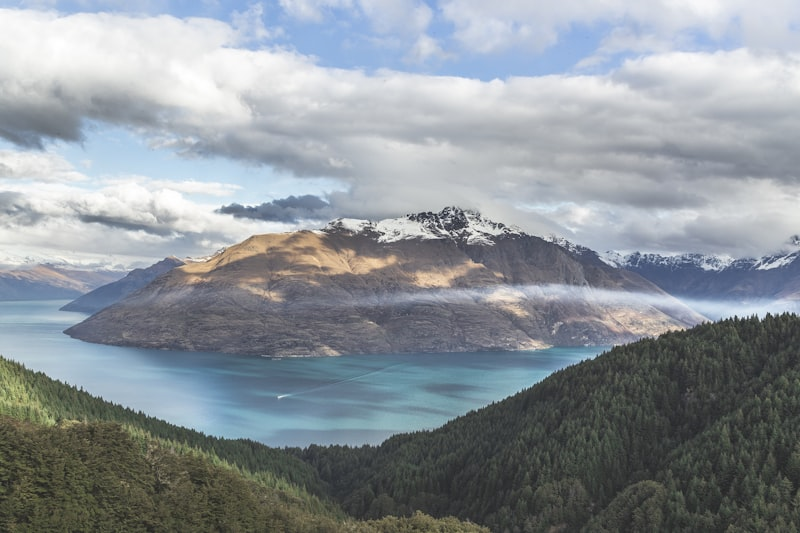
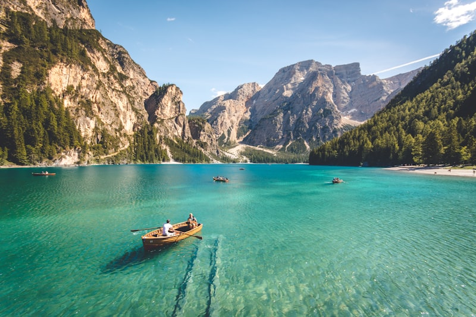
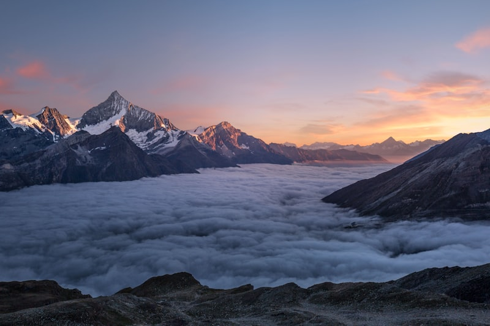
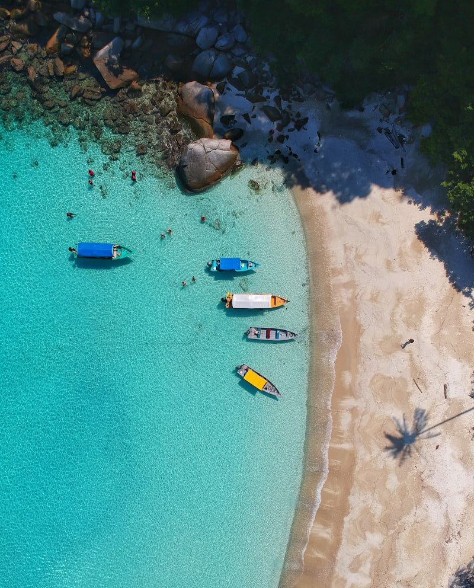

# 新西兰南岛 · 冰川峡湾与星空｜9 天自驾执行手册

> **旅行时间**：10 月（初春，气候温和，游客较少）
> **旅行人数**：4～6 人（朋友团）
> **总天数**：9 天 8 晚
> **核心目的地**：基督城 → 特卡波湖 → 库克山 → 奥马鲁 → 但尼丁 → 蒂阿瑙 → 米尔福德峡湾 → 皇后镇
> **人均预算**：1.8～2.8 万元人民币（4 人总计约 7.2～11.2 万元）

---

## 为什么选新西兰南岛？

如果你们想要的是**"朋友圈九宫格放不下"**级别的壮丽风光，新西兰南岛是国庆档期性价比最高的答案。

10 月的南岛正值初春——雪山还没完全褪去冬装，山脚下的鲁冰花已经开始冒头，特卡波湖的暗夜星空正在最佳观测期。气温 8～18℃，阳光清透但不灼人，自驾路上每隔半小时就会遇到一个让你踩刹车的观景台。最重要的是：**这是南岛的淡季尾巴**，住宿和租车的价格比 12～2 月旺季便宜 30～40%。

与 **澳大利亚** 相比，南岛的风景密度完全不在一个量级——澳大利亚的美需要长途跋涉才能抵达（大堡礁、大洋路各在一端），而南岛的自驾环线上，**冰川、峡湾、星空、湖泊、雪山在 300 公里内全部铺开**。与 **北海道** 相比，南岛的自然尺度更大——不是精致的小景，而是让你"哇"出声的大场面。

**作为国庆出行，南岛是"震撼"与"可负担"的最佳平衡。**

---

## 行程总览

| 天数 | 星期 | 路线 | 住宿地 | 核心体验 | 开车距离 |
|:---:|:---:|:---|:---|:---|:---:|
| D1 | 四 | 上海 → 奥克兰 → 基督城 | 基督城 | 抵达、提车、城市初探 | — |
| D2 | 五 | 基督城 → 特卡波湖 | 特卡波湖 | 好牧羊人教堂、**约翰山暗夜星空** | 约 230 km |
| D3 | 六 | 特卡波湖 → 库克山 | 库克山村 | **胡克谷步道**、塔斯曼冰川 | 约 100 km |
| D4 | 日 | 库克山 → 奥马鲁 → 但尼丁 | 但尼丁 | **摩拉基大圆石**、维多利亚古城、蓝企鹅 | 约 310 km |
| D5 | 一 | 但尼丁 → 蒂阿瑙 | 蒂阿瑙 | 世界最陡街道、奥维斯顿庄园、峡湾门户 | 约 290 km |
| D6 | 二 | 蒂阿瑙 → 米尔福德峡湾 → 蒂阿瑙 | 蒂阿瑙 | **米尔福德峡湾巡游**、荷马隧道 | 约 240 km |
| D7 | 三 | 蒂阿瑙 → 皇后镇 | 皇后镇 | 天际缆车、Fergburger、湖畔漫步 | 约 170 km |
| D8 | 四 | 皇后镇 | 皇后镇 | **滑翔伞/喷射快艇/吉布斯顿酒庄** | — |
| D9 | 五 | 皇后镇 → 奥克兰 → 上海 | — | 返程 | — |

> **设计逻辑**：基督城进、皇后镇出（开口票），全程不走回头路；把长途驾驶分散到每天 2～4 小时，中间穿插不赶车的整天（D8 皇后镇自由日）；米尔福德峡湾住蒂阿瑙两晚，避免从皇后镇当天往返的 8 小时疲劳驾驶。

---

# D1｜上海 → 奥克兰 → 基督城（Christchurch）
**主题：跨越南半球，抵达花园之城**

*基督城雅芳河畔，被称为"南半球最英式的城市"*

## 交通
- **国际航班**：推荐 **新西兰航空** 或 **中国东方航空** 上海浦东（PVG）直飞奥克兰（AKL），飞行约 **11～12 小时**。建议选择夜间起飞的航班（22:00 左右），在飞机上睡一觉，早上抵达奥克兰。
- **奥克兰 → 基督城**：新西兰航空国内航班，飞行 **1.5 小时**。注意预留 **2.5 小时** 的中转时间（需重新托运行李、通过国内安检）。
- **基督城机场 → 市区**：机场大巴 **Christchurch Metro** 约 30 分钟到市中心，或租车公司机场柜台直接提车。

## 住宿
**推荐：Christchurch City Hotel（或同级公寓式酒店）**
- 位置：市中心 Cathedral Square 步行 5 分钟。
- 价格：约 800～1200 RMB/晚（4 人可订两卧室公寓，分摊更划算）。
- 理由：第一天需要适应时差（比上海快 4 小时），住市区方便晚餐和第二天一早出发。

## 活动

### 傍晚：基督城中心城区
- 雅芳河（Avon River）畔的**哈格利公园（Hagley Park）**散步——这个城市曾被地震摧毁又重建，现在有非常酷的纸板教堂（**Cardboard Cathedral**，日本建筑师坂茂设计）和重新开放的基督城大教堂。
- **New Regent Street**：一条西班牙风格的小街，彩色商铺和咖啡馆排列两旁，是基督城最出片的地方之一。

### 晚餐：Riverside Market
- 位于雅芳河畔的室内美食市场，集合了 30+ 餐饮摊位。
- 推荐尝试**绿唇贻贝（Green-lipped Mussel）**和**新西兰羊排**，搭配本地精酿啤酒。
- 人均约 100～150 RMB。

## 提车贴士
- 4～6 人建议租一辆 **7～8 座 MPV**（如丰田 Alphard、Kia Carnival）或两辆标准轿车。
- **中国驾照 + NZTA 认证翻译件**即可租车（可在线申请翻译件，费用约 40 NZD）。
- 新西兰**靠左行驶**，方向盘在右侧——建议出发前在机场停车场绕两圈适应。
- 推荐 **Apex、Jucy、GO Rentals** 等新西兰本地租车公司，比国际品牌便宜 20～30%。

---

# D2｜基督城 → 特卡波湖（Lake Tekapo）
**主题：牛奶蓝湖泊与南半球最美星空**

*特卡波湖畔的好牧羊人教堂，背景是南阿尔卑斯山脉*

## 交通
- **基督城 → 特卡波湖**：约 **230 km / 3 小时**，沿 SH1 南下转 SH79，路况良好。
- 沿途经过 **坎特伯雷平原（Canterbury Plains）**，一望无际的农田和远处的雪山——这是南岛给你的第一个"大片开场"。

## 住宿
**推荐：Peppers Bluewater Resort（或 Lake Tekapo Holiday House）**
- 位置：特卡波湖畔，步行到教堂 5 分钟。
- 价格：约 1000～1800 RMB/晚（湖景房更贵但值得）。
- 理由：特卡波是**国际暗夜保护区**的核心，住在湖边意味着晚上走出房间就能看到银河。多人出行可以考虑租一栋 Holiday House（Airbnb/Bookabach），性价比更高。

## 活动

### 上午：出发前的基督城补给
- 在 **Countdown 或 New World** 超市采购零食、水果和饮用水（南岛小镇物价较贵，基督城是最后的低价补给站）。
- 如果时间充裕，路过 **Rakaia Gorge** 时停下来——峡谷河水的颜色是不真实的钴蓝色。

### 下午：特卡波湖 + 好牧羊人教堂
- **特卡波湖**的颜色来自冰川融化时裹挟的岩石粉末，在阳光下呈现**不真实的牛奶蓝色**。10 月初春，湖边的鲁冰花可能刚刚冒头（盛花期通常在 11 月中～12 月）。
- **好牧羊人教堂（Church of the Good Shepherd）**：1935 年用当地石头建造的小教堂，窗口正对着南阿尔卑斯山脉——被称为"新西兰被拍摄最多的建筑"。傍晚金色的光线打在教堂上，是绝佳的拍摄时间。
- **约翰山温泉（Tekapo Springs）**：三个不同温度的温泉池面向湖面，泡着温泉看雪山，10 月的山上可能还有积雪。

### 夜晚：暗夜星空（重点体验）
- 特卡波是**全球最大的国际暗夜保护区（IDSR）**的一部分，这里的光污染控制极其严格——路灯都是向下照射的暖色光。
- **必做**：参加 **Earth & Sky** 的约翰山天文台夜间导览（约 2.5 小时，需提前预订）。在专业天文望远镜中看木星、土星环、猎户座星云，再用肉眼辨识南十字星座。导游会用激光笔在天上"画线"，告诉你每一颗星的故事。
- 10 月的夜温约 **3～8℃**，务必穿羽绒服和戴帽子（山上风大）。

---

# D3｜特卡波湖 → 库克山（Mt Cook / Aoraki）
**主题：走进南半球最高峰的怀抱**

*库克山国家公园，远处是新西兰最高峰奥拉基/库克山（3724m）*

## 交通
- **特卡波湖 → 库克山**：约 **100 km / 1.5 小时**，沿 SH8 南下转 SH80，一路沿着 **普卡基湖（Lake Pukaki）** 北岸行驶。
- 这段路被称为**"全世界最美的 100 公里"**之一——左手是牛奶蓝的普卡基湖，右手是南阿尔卑斯山脉，正前方是库克山。建议至少停 3 个观景台。

## 住宿
**推荐：Hermitage Hotel（隐士山庄）**
- 位置：库克山村内，正对库克山。
- 价格：约 1500～3000 RMB/晚（山景房价格翻倍但值得）。
- 理由：库克山村住宿选择很少，**Hermitage 是唯一正对雪山的酒店**。如果订不到或超出预算，可考虑 **Aoraki Court** 或 **YWCA** 等较平价的选择。4 人以上可考虑 **Glentanner Park Centre** 的公寓房。
- **务必提前 2～3 个月预订**——整个村子只有不到 300 个房间。

## 活动

### 上午：普卡基湖沿岸自驾
- 离开特卡波后 20 分钟，会经过 **Lake Pukaki 的观景台**——停下来，你会看到湖水的颜色比特卡波更蓝、更浓烈，因为这座湖直接由库克山的冰川融水补给。
- **三文鱼农场（Mt Cook Alpine Salmon）**：在 SH80 路边，可以买到刚从冰川水里捞出来的三文鱼。30 NZD 一整条，新鲜到你会在停车场直接用手撕着吃。

### 下午：胡克谷步道（Hooker Valley Track）——此行最推荐的徒步
- **全程 10 km / 3 小时往返**，平缓好走（海拔爬升仅 100m），适合所有人。
- 沿途经过三座吊桥、一片冰川融水形成的冰碛湖，最后抵达 **胡克冰川湖**——湖面上漂浮着蓝色的冰川碎片，正对面是库克山的三座峰顶。
- 这是那种"每走 10 分钟就想停下来拍照"的步道。10 月的初春，山谷里可能还有残雪，反而让景色更有层次。
- **建议**：穿防水鞋（步道部分路段可能泥泞），带一件防风外套。

### 傍晚：库克山村
- **埃德蒙·希拉里爵士爵士中心（Sir Edmund Hillary Alpine Centre）**：这位首个登顶珠峰的人是新西兰人，这里有他的生平展览和天文馆。
- 晚餐在 Hermitage 餐厅，一面落地窗正对库克山——运气好能看到日落把雪山染成玫瑰金色。

---

# D4｜库克山 → 奥马鲁 → 但尼丁（Dunedin）
**主题：维多利亚古城与圆石海滩**

*摩拉基海滩上的巨型圆石，如恐龙蛋般散落*

## 交通
- **库克山 → 奥马鲁**：约 **200 km / 2.5 小时**，沿 SH8 南下至 SH1，穿越 **怀塔基河谷（Waitaki Valley）**。
- **奥马鲁 → 但尼丁**：约 **115 km / 1.5 小时**，沿海岸线 SH1 南下。
- 今天是此行开车距离较长的一天（约 310 km），但沿途亮点密集，不会无聊。

## 住宿
**推荐：Scenic Hotel Dunedin City（或 Earp Studio Apartment）**
- 位置：但尼丁市中心，步行可达八角广场（The Octagon）。
- 价格：约 700～1200 RMB/晚。
- 理由：但尼丁住宿选择丰富，4 人以上可租市中心公寓，分摊后每人不到 200 RMB/晚。

## 活动

### 上午：摩拉基大圆石（Moeraki Boulders）
- 从库克山出发约 2 小时抵达 **摩拉基海滩**。
- 这些直径 1～2 米的球形巨石散落在沙滩上，看起来像外星人留下的恐龙蛋。地质学解释是 6000 万年前海底矿物质在石灰岩中缓慢结晶形成——但亲眼看到时你不会在意科学。
- **最佳时间**：退潮时（出发前查潮汐表）。日落时分（约 18:00）光线最佳，石头投下长长的影子。
- 奥马鲁小镇本身也值得停留——**维多利亚历史区** 有蒸汽朋克风格的画廊和古董店，还有一家 1883 年开业的传统面包坊。

### 下午：但尼丁——南半球的"爱丁堡"
- 但尼丁的名字来自苏格兰盖尔语的"Dùn Èideann"（爱丁堡），这座城市保留了浓郁的苏格兰气质。
- **但尼丁火车站（Dunedin Railway Station）**：新西兰被拍摄最多的建筑之一，佛兰芒文艺复兴风格的外墙和内部马赛克地板令人惊叹。
- **奥塔哥大学（University of Otago）**：新西兰最古老的大学，哥特式钟楼是地标。
- **鲍德温街（Baldwin Street）**：吉尼斯认证的**世界最陡街道**（坡度 35%），可以尝试走上去——腿会酸但照片很有趣。

### 傍晚：蓝企鹅归巢（Blue Penguin Viewing）
- **奥马鲁蓝企鹅栖息地（Oamaru Blue Penguin Colony）**：每天日落时分，世界上最小的企鹅（身高仅 30cm）成群结队从海里上岸回巢。
- 如果错过了奥马鲁，但尼丁附近的 **Royal Albatross Centre** 也有黄眼企鹅观赏。
- **注意**：观赏企鹅禁止使用闪光灯和任何白光灯（会惊吓企鹅），工作人员会提供红色照明。

---

# D5｜但尼丁 → 蒂阿瑙（Te Anau）
**主题：穿越南岛腹地，抵达峡湾门户**

*蒂阿瑙湖，新西兰第二大湖，通往米尔福德峡湾的门户*

## 交通
- **但尼丁 → 蒂阿瑙**：约 **290 km / 3.5 小时**，经 SH97 和 SH94，穿越南岛中部农牧区。
- 沿途风景从海岸线过渡到起伏的丘陵牧场，再进入峡湾地区的原始森林——这是南岛最"安静"的一段自驾路。

## 住宿
**推荐：Distinction Te Anau Hotel & Villas（或 Te Anau Lakefront Apartment）**
- 位置：蒂阿瑙湖畔。
- 价格：约 800～1500 RMB/晚。
- 理由：连住两晚，省去换酒店的麻烦。蒂阿瑙是通往米尔福德峡湾的唯一门户，选择湖景房可以在房间看日出。4 人以上强烈建议租 **湖滨公寓**（带厨房，可以自己做饭省预算）。

## 活动

### 上午：但尼丁最后探索
- **奥维斯顿庄园（Olveston Historic Home）**：一座保存完好的 1906 年富豪宅邸，35 个房间全部维持原样，导游会带你穿越回爱德华时代的但尼丁。
- 如果喜欢动物，可以绕道 **奥塔哥半岛（Otago Peninsula）** 看皇家信天翁——这是世界上唯一的皇家信天翁大陆繁殖地。

### 下午：自驾穿越南岛腹地
- 离开但尼丁后，沿着 **SH97** 穿越中部平原，这里是新西兰的畜牧核心区——绵羊比人多 10 倍不是玩笑。
- 途中可在 **Gore** 小镇停留——这座小镇自称"世界鳟鱼垂钓之都"，有一条很酷的鳟鱼主题步道。

### 傍晚：蒂阿瑙湖畔
- 蒂阿瑙是新西兰**第二大湖**（面积 344 平方公里），湖水深邃的蓝色与远山的黛绿色形成强烈的色彩对比。
- **蒂阿瑙萤火虫洞（Glowworm Caves）**：乘船穿过地下洞穴，看数以万计的萤火虫在岩壁上发出蓝绿色的微光——像进入了一个地下星空。全程约 2 小时 15 分，需提前预订。
- 晚餐推荐蒂阿瑙湖畔的 **Radar Restaurant**——南岛深海螯虾（Scampi）和鹿肉是招牌。

## 为什么不在皇后镇直接去米尔福德峡湾？
从皇后镇到米尔福德峡湾单程就要 **4 小时**（约 290 km），往返 8 小时——几乎一整天都在开车。而蒂阿瑙到米尔福德只要 2 小时，住两晚蒂阿瑙，D6 轻松往返峡湾，D7 再开车去皇后镇。**这是整条线路中最重要的节奏设计。**

---

# D6｜蒂阿瑙 → 米尔福德峡湾 → 蒂阿瑙
**主题：世界第八大奇迹的峡湾巡游**

*米尔福德峡湾，米特峰（Mitre Peak）从海面垂直拔起 1692 米*

## 交通
- **蒂阿瑙 → 米尔福德峡湾**：约 **120 km / 2 小时**，沿 SH94 行驶。
- 这段路本身就是景观——穿越 **荷马隧道（Homer Tunnel）** 时，两侧是垂直的花岗岩崖壁，隧道里没有灯，只有你的车灯照亮石壁上的水珠。
- **建议**：早上 7:30 出发，赶 10:00 的巡游船班次（船票需提前预订）。

## 住宿
- 继续住蒂阿瑙（同 D5 酒店）。

## 活动

### 上午：米尔福德峡湾巡游（此行核心体验）
- **米尔福德峡湾** 被 Rudyard Kipling 称为"世界第八大奇迹"——虽然这个头衔被用滥了，但当你站在船头，看着 **米特峰（Mitre Peak）** 从海面垂直拔起 1692 米时，你会觉得 Kipling 还是保守了。
- **巡游选择**：
  - **Real NZ / Southern Discoveries** 的标准巡游（约 2 小时，50～90 NZD/人）：大船，稳定，适合所有人。
  - **Jucy Cruise** 的午间巡游（含自助午餐）：性价比高。
  - **Overnight Cruise**（过夜船）：如果预算充足，强烈推荐——在峡湾里过夜，看日落、星空、日出，还能划皮划艇。
- **看点**：米特峰、**斯特林瀑布（Stirling Falls，155m）**、海豹晒太阳的岩石、海豚（运气好）。
- **10 月贴士**：米尔福德峡湾年均降雨 182 天，10 月多雨反而是好事——**雨天的峡湾瀑布数量从 2 条暴增到上百条**，整面岩壁都在"流泪"。

### 下午：峡湾周边探索
- **回程沿途停靠**：
  - **镜湖（Mirror Lakes）**：SH94 路边的步行道，5 分钟走到湖边。风平浪静时，湖面完美倒映 Earland 瀑布和雪山——拍出来的照片倒过来也看不出哪边是实景。
  - **荷马隧道观景台**：隧道入口前有一个停车场，可以看到峡谷全貌和偶尔出现的高山鹦鹉（Kea）——世界上唯一的高山鹦鹉，聪明到会拆汽车雨刮器。

### 傍晚：回到蒂阿瑙
- 湖畔散步消食，或者去 **Fiordland Cinema** 看一场 **"Ata Whenua - Shadowland"**——一部仅在此放映的峡湾风光纪录片（30 分钟），直升机航拍的画面会让你觉得白天的峡湾还没看够。

---

# D7｜蒂阿瑙 → 皇后镇（Queenstown）
**主题：抵达冒险之都，放下方向盘开始享受**

*从天际缆车俯瞰皇后镇与瓦卡蒂普湖*

## 交通
- **蒂阿瑙 → 皇后镇**：约 **170 km / 2～2.5 小时**，沿 SH6 经 **金斯顿（Kingston）** 北上。
- 沿途经过 **迪山湖（Lake Wakatipu）** 的南端，湖面狭长呈闪电形，湖水在不同光线下从钴蓝变到墨绿。

## 住宿
**推荐：Heartland Hotel Queenstown（或公寓式住宿）**
- 位置：皇后镇中心，步行到湖畔 3 分钟。
- 价格：约 1200～2500 RMB/晚（国庆期间会涨价，务必提前预订）。
- 理由：皇后镇住宿整体偏贵，4 人以上建议在 **Booking/Airbnb** 租两卧室公寓（带厨房），可以自己做饭省不少钱。离镇中心步行 10 分钟内的区域性价比最高。

## 活动

### 下午：天际缆车（Skyline Gondola）
- 从镇中心步行 10 分钟到缆车站，5 分钟上升到 **鲍勃峰（Bob's Peak）**。
- 山顶观景台可以 220° 俯瞰皇后镇、瓦卡蒂普湖和卓越山脉（The Remarkables）——这个视角足以解释为什么这里叫"冒险之都"。
- **Luge（旱地雪橇）**：山顶有两条蜿蜒的旱地雪橇道，坐在小车上从山上冲下来，大人玩得比小孩还疯。三圈套票约 45 NZD。

### 晚餐：Fergburger
- 如果皇后镇只能选一家餐厅，就是 **Fergburger**。这家汉堡店在全球旅行圈有 cult 级别的名声——24 小时营业，常年排队 30 分钟以上，但绝对值得。
- 推荐 **Sweet Bambi**（鹿肉汉堡）和 **Holier Than Thou**（鳕鱼汉堡），搭配本地 Monteith's 啤酒。
- **省时技巧**：在线点单（Google "Fergburger online order"），到了直接取餐，不用排队。

### 夜晚：皇后镇湖畔
- 晚餐后沿着 **瓦卡蒂普湖畔步道（Lakefront Trail）** 散步，湖面倒映着远山的灯光。皇后镇的夜晚有一种独特的"山中小镇"氛围——安静的湖水和热闹的酒吧街只隔一条马路。

---

# D8｜皇后镇自由日
**主题：今天不赶路，选你们喜欢的方式玩**

*皇后镇滑翔伞——从鲍勃峰起飞，降落在湖畔草坪*

## 交通
- 今天不开长途。皇后镇内的活动都有接驳车或在步行范围内。

## 住宿
- 继续住皇后镇（同 D7）。

## 活动

今天给全队自由选择——4～6 人的好处是可以分组活动，不必迁就。

### 选项 A：滑翔伞（Paragliding）——此生必试
- **G Force Paragliding** 或 **Skytrek**，从鲍勃峰或卓越山脉起飞，在皇后镇上空翱翔 15～20 分钟，降落在湖畔草坪。
- 价格约 200～300 NZD/人（含 GoPro 录像）。
- 不需要任何经验——教练带你飞，你只需要享受。
- **这可能是整趟旅行最难忘的 15 分钟。**

### 选项 B：喷射快艇（Shotover Jet）
- 在 **Shotover River 峡谷** 中以 85km/h 的速度飞驰，做 360° 旋转——峡谷两侧是几乎碰到的岩壁。
- 约 25 分钟，140 NZD/人。
- 适合追求速度感的人。

### 选项 C：吉布斯顿酒庄（Gibbston Valley Wineries）
- 皇后镇以东 20 分钟车程的 **吉布斯顿谷** 是世界最南端的葡萄酒产区之一。
- 以 **黑皮诺（Pinot Noir）** 闻名——这里的黑皮诺果味浓郁、单宁柔和，和法国勃艮第的风格完全不同。
- 推荐参加 **半日品酒团**（约 100～150 NZD/人，含 3～4 家酒庄品鉴和奶酪拼盘），不用开车。
- **Gibbston Valley Wines**、**Peregrine Wine**、**Chard Farm** 是三家口碑最好的。

### 选项 D：悠闲湖畔日
- 不想刺激？在湖边的咖啡馆坐一个下午，看人来人往。
- **Patagonia Chocolates**：湖畔的巧克力店和冰淇淋店，热巧和手工冰淇淋是招牌。
- **Vudu Cafe & Larder**：早午餐很出名，可以坐在窗边看湖。
- 也可以坐 **TSS 厄恩斯劳号蒸汽船（Walter Peak Farm Tour）**——百年蒸汽船横渡瓦卡蒂普湖，对岸是一个高地农场，可以喂羊驼和看剪羊毛表演。

### 晚餐：聚集团圆饭
- 建议所有人晚上在 **Rata**（新西兰本土创意菜，主厨是 MasterChef NZ 冠军）或 **Botswana Butchery**（烤肉+酒吧，气氛好）集合，吃一顿正式的"国庆在路上的团圆饭"。
- 人均约 200～300 RMB。

---

# D9｜皇后镇 → 奥克兰 → 上海
**主题：告别南岛，带着满格记忆回家**

## 交通
- **皇后镇 ZQN → 奥克兰 AKL**：新西兰航空国内航班约 **2 小时**。
- **奥克兰 AKL → 上海 PVG**：新西兰航空/中国东方航空直飞约 **12 小时**。
- 建议订 **下午或傍晚** 的皇后镇出发航班，上午还有时间最后逛一圈。

## 活动

### 上午：最后的皇后镇
- 如果航班时间允许，早上可以去 **Queenstown Gardens** 散步——湖角的小花园，10 月的春季有樱花和各种花卉。
- 或者在湖边喝最后一杯 Flat White（新西兰国民咖啡），看一眼远处的卓越山脉——记住这个画面。

### 购物：机场前的最后补给
- 皇后镇中心的 **Honey Centre** 可以买到 **麦卢卡蜂蜜（Manuka Honey）**——新西兰最知名的伴手礼。
- **Whittaker's 巧克力** 和 **Pineapple Lumps**（新西兰国民零食）也是好选择。

---

## 预算参考（4 人总计）

| 项目 | 总预算（4 人） | 备注 |
|:---|:---|:---|
| 国际+国内机票 | 约 24,000～36,000 RMB | 上海往返奥克兰 + 奥克兰/基督城/皇后城国内段，开口票 |
| 租车（8 天） | 约 6,000～10,000 RMB | 7 座 MPV 或 2 辆轿车含全险 |
| 油费 | 约 2,500～3,500 RMB | 全程约 1,500 km |
| 住宿（8 晚） | 约 10,000～20,000 RMB | 混合酒店+公寓，4 人分摊 |
| 餐饮 | 约 6,000～10,000 RMB | 超市采购 + 餐厅混合 |
| 活动/门票 | 约 8,000～16,000 RMB | 峡湾巡游、天文导览、滑翔伞等 |
| **合计（4 人）** | **约 56,500～95,500 RMB** | — |
| **人均** | **约 1.4～2.4 万 RMB** | 4 人分摊租车和住宿后性价比极高 |

> **省钱技巧**：4 人以上最大的优势是**住宿和租车可以分摊**。选择带厨房的公寓自己做饭（至少 3～4 顿），可以省下 30% 的餐饮预算。超市买羊排自己煎，比餐厅便宜一半。

---

## 实用信息

### 签证
- 中国护照持有人需要 **新西兰电子旅行许可（NZeTA）** 或 **访客签证**。
- NZeTA 在线申请，费用约 12 NZD（手机端）/ 9 NZD（网页端），通常 72 小时内批出。
- 如果计划停留超过 3 个月或不符合免签条件，需申请访客签证。

### 驾驶
- **靠左行驶**，方向盘在右侧。
- 城镇限速 50km/h，郊区 100km/h。
- **务必购买全险（Full Cover）**——南岛山路多，石子弹裂挡风玻璃的情况不少见。
- 加油站在小城镇之间间隔较远，**油箱低于半箱就加**。

### 通信
- 推荐 **Spark** 或 **Vodafone** 的预付费 SIM 卡（机场可买），10 GB 约 30 NZD。
- 或者出发前在淘宝买好新西兰流量卡。

### 10 月穿衣指南
- **白天**：8～18℃，长袖 + 薄外套。
- **夜晚**：3～8℃，需要羽绒服（尤其是特卡波观星和库克山）。
- **鞋子**：防水徒步鞋（胡克谷步道可能泥泞）+ 一双舒适的日常鞋。
- **必备**：防风防水外套（新西兰天气 10 分钟变一次不是夸张）。

### 建议提前预订的项目
1. **Earth & Sky 天文导览**（特卡波，旺季很快满）
2. **米尔福德峡湾巡游船票**（至少提前 1 个月）
3. **Hermitage Hotel**（库克山，整个村子不到 300 间房）
4. **滑翔伞**（皇后镇，天气好的日子很快约满）
5. **租车**（国庆期间 7 座车紧张，提前 2 个月）
